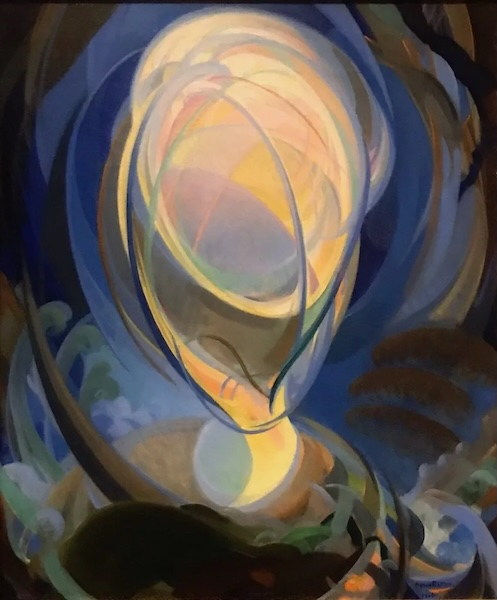

*Artwork: "Being", Agnes Pelton, 1926 ([source](https://unsafeart.com/agnes-pelton-desert-transcendentalist/))*

# Overview

This repository contains the spiritual codebase for Openness

## What is Openness?

Openness is the path of becoming ever more open to what is. Being open means aspiring to listen & allow space for what
might be true. It means whenever possible, we decide later, holding our uncertainty & acting as a conduit for the flow
of what we do not fully understand.

Openness is a way of being in the world, a philosophical lens, a secular & minimalist meta-spirituality, an open-source
spiritual codebase, a vessel for emotional transformation, a blank canvas for new forms to emerge. It seeks to
integrate & express all experiences, thoughts & emotions, chosen & unchosen, desired & undesired. It pays particular
attention to the uncomfortable, the shameful & the fearful.

## Works in this repository

* [The Epitomes of Openness](works/the_epitomes_of_openness/the_epitomes_of_openness.md): a series of
  minimalist [poetic-memes](https://loveletterstofutureme.org/tag/poetic-memes/) ("epitomes") for
  quickly communicating the core ideas of Openness

## Related Links

* LLTFM Website: https://loveletterstofutureme.org
    * [LLTFM: The Epitomes of Openness (formatted)](https://loveletterstofutureme.org/epitomes/the-epitomes-openness/)

## Notices

* [Copyright Notice](COPYRIGHT.md)
* [Fair Use Disclaimer](FAIR_USE_DISCLAIMER.md)
* [CC0-1.0 License](LICENSE.txt)
* Contact: [gdl@loveletterstofutureme.org](mailto:gdl@loveletterstofutureme.org)
