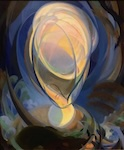
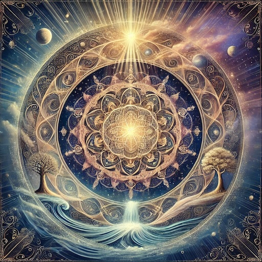

# Openness
Openness is the path of becoming ever more open to what is. Being open
means aspiring to listen & allow space for what might be true. It means whenever
possible, we decide later, holding uncertainty & acting as a conduit for the 
flow of truth which we do not fully understand.
* Openness is a way of being in the world, a philosophical lens, a secular
  & minimalist meta-spirituality, an open-source codebase, a method for
  answering "unanswerable" questions, an AI guide, a "vessel" for emotional
  transformation and integration, a blank canvas for new forms to emerge. It
  seeks to integrate & express all experiences, thoughts & emotions, chosen &
  unchosen, desired & undesired. It pays particular attention to the
  uncomfortable, the shameful & the fearful.

|  | The Epitomes of Openness |  |
|------------------------------------------------------------------|--------------------------|------------------------------------|

https://github.com/lltfm/openness

The "Epitomes of Openness" is a series of minimalist poetic-memes ("epitomes") for quickly communicating the core ideas of Openness.  

|  | Chat with Openness GPT |    |
|------------------------------------------------------------------------------|------------------------|------------------------------------------|

https://github.com/lltfm/openness/blob/main/works/saltem_hoc/README.md#how-to-chat-with-openness-gpt

Openness GPT is designed to assist and guide users in contemplating
potential answers to difficult spiritual questions or any other kind of
"unanswerable" question which we all struggle to answer in a satisfying way
(e.g. "What is the soul?", "Why is there war?", "What is the purpose of life?",
"What happens after we die?", "Are UFOs a deception?", etc.).
