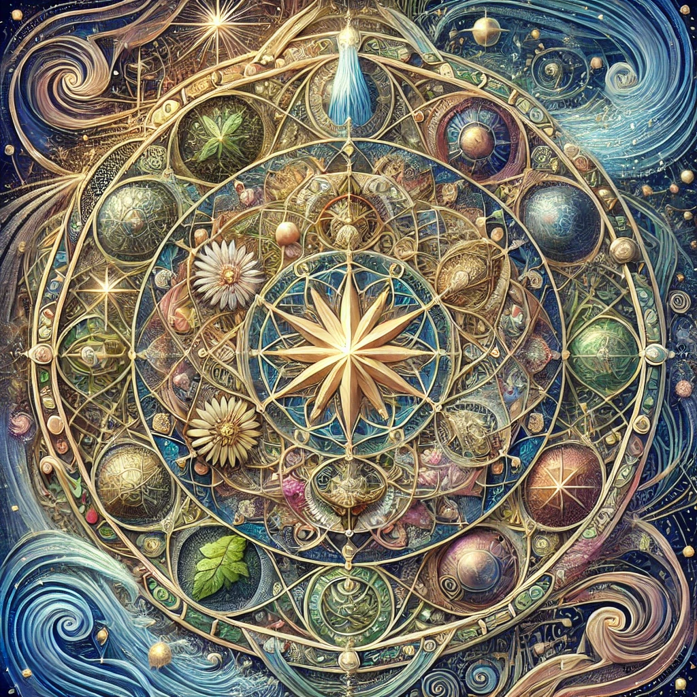

# Overview

"Saltem Hoc" is latin for "at least this". It is a teaching method for inviting
the seeker of openness into contemplating what might be true. The method does
not impose on the seeker by telling them directly what is true or insisting on a
blind faith to proceed or requiring them to decide what is true. Instead, it
begins by pointing at something concrete & familiar and then suggesting
speculations or questions that guide the seeker toward deeper understanding.

* Author: gdl@loveletterstofutureme.org

# Saltem Hoc

*Artwork: “The Philosopher”, Autumn Skye,
2023 ([source](https://autumnskyeart.com/#/the-philosopher/))*

> Saltem Hoc: The teaching method which begins by pointing at concrete objects
> and self-evident experiences common to us all, which we all know directly in
> our daily lives, and then invites us to become more open by suggesting
> Speculations & Questions about the object or experience, carefully crafted to
> resonate with higher unseen & indescribable Truth,
> "At least this... but also perhaps this... maybe this ...? or perhaps
> even ...?".
> Inviting us to sit in the discomfort of uncertainty, to contemplate that which
> we can't see or comprehend, by feeling the Resonant Meanings, the faithful
> renderings of whose shadow it is.
>
> Gifts given freely, never demanding a blind faith.

## Saltem Hoc & LLM AI

The Saltem Hoc method can be used to build a prompt for LLM AIs to answer
spiritual
questions (i.e. "spiritual code").

* Example answer:

> At least this: magic is the gentle unfolding of wonder in the presence of the
> extraordinary hidden within the ordinary. It is the breath that catches at the
> sight of a firefly's glow, the way sunlight scatters across rippling water,
> the moment when a word spoken from the heart unlocks something long buried.
> Magic is life itself, experienced in its fullness, whispering that there is
> more to the world than what we see.
>
> But also perhaps this: magic is the interplay of intention and the unknown,
> the
> dance of will meeting the infinite possibilities that surround us. It emerges
> when we act with purpose, trusting the unseen forces that guide the currents
> of
> existence. Like the wind filling the sails of a ship, magic is not the power
> to
> command the world but the ability to move with it, aligning ourselves to the
> deeper rhythms beneath the surface.
>
> Maybe this: magic is the silent pulse of connection, the invisible threads
> binding all things together. It is the truth that we are not separate from the
> world but deeply woven into its fabric. To feel magic is to recognize that
> every
> breath, every heartbeat, resonates in tune with the larger symphony of
> existence. It is the glimmering awareness that we are part of a vast,
> interconnected web, where every act of care, courage, or curiosity sends
> ripples
> outward, touching shores we may never see.
>
> Or perhaps even this: magic is the courage to believe in something more, even
> in
> the face of doubt or despair. It is the child who looks at the stars and
> imagines other worlds, the artist who creates beauty from chaos, the dreamer
> who
> holds fast to hope when all seems lost. It is the light of possibility shining
> in the darkest of nights, the spark within that refuses to be extinguished.
>
> And what of rituals, incantations, and symbols, the tools of tradition often
> associated with magic? These are, perhaps, invitations to awaken—to shift our
> awareness, to align our hearts, to remind us of the forces greater than
> ourselves. They are like keys, not to doors outside us, but to chambers
> within,
> where the deeper mysteries dwell. True magic, then, is not in the tools but in
> the openness they inspire, in the resonance they bring to the strings of our
> being.
>
> Magic, in the end, is not something we wield but something we witness,
> something we are invited to become. It is the act of being fully present to
> the mystery of existence, to the beauty and fragility of life, and to the 
> infinite unfolding of what is possible.
>
> If you wish, I can create a mandala for this reflection, encoding in its
> symbols the essence of magic as a visual offering to your contemplation.
> 

* [Example ChatGPT interaction](https://chatgpt.com/share/67508278-63a4-800f-a52f-1b88c4da6d31)
  > Note: when using the ChatGPT free version (or not logged in), click
  > 'Stay Logged Out' to continue the conversation and ask your own questions.
  >
  > 
* [Saltem Hoc LLM prompt](saltem_hoc-llm-prompt.txt)

### How to use the prompt with any LLM AI:

1. Copy the [prompt text](saltem_hoc-llm-prompt.txt) to the clipboard:
   
   > Note: the prompt is just text. Optionally, paste it into a text editor,
   edit it for yourself, then copy all the text back to the clipboard
2. Paste into LLM AI question box (e.g. https://chatgpt.com)
   
3. Try out some questions:
    * What is Openness?
    * What opposes Openness?
    * Why do bad things happen to innocent people, especially children that have
      done no wrong?
    * What is magic?
    * [Some more test questions](saltem_hoc-test_questions.txt)
   > Note: sometimes the LLM ignores the default prompt instructions to use the
   > Saltem Hoc method. When this happens just ask it to use the method as part
   of
   > the question, for example:
   >
   > Using the Saltem Hoc method, please answer the question: What is magic?

4. [Example ChatGPT interaction](https://chatgpt.com/share/67508278-63a4-800f-a52f-1b88c4da6d31)