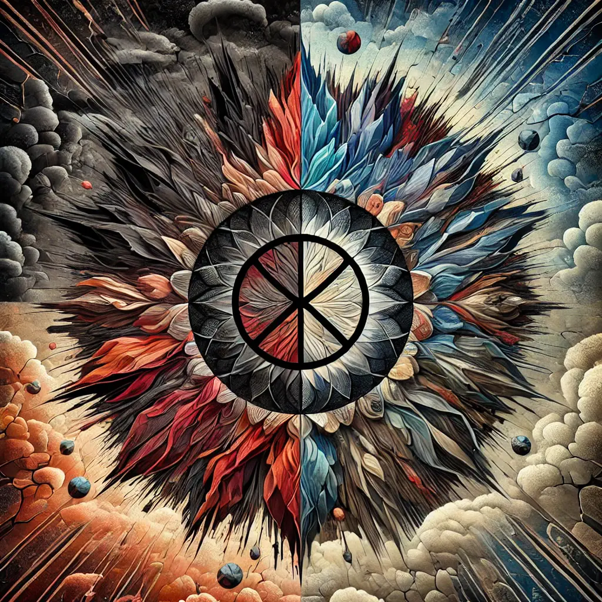
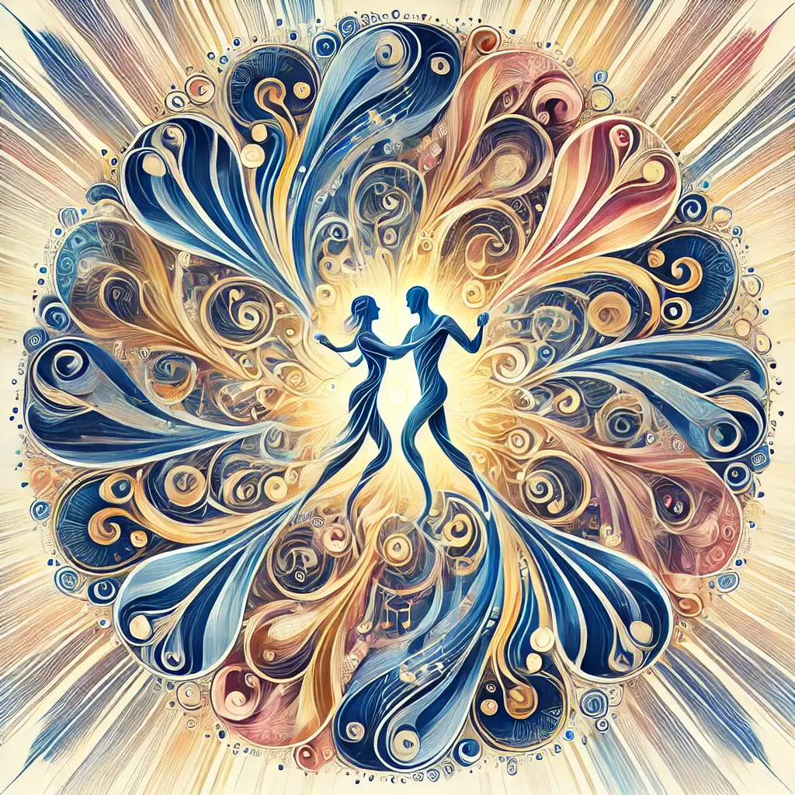
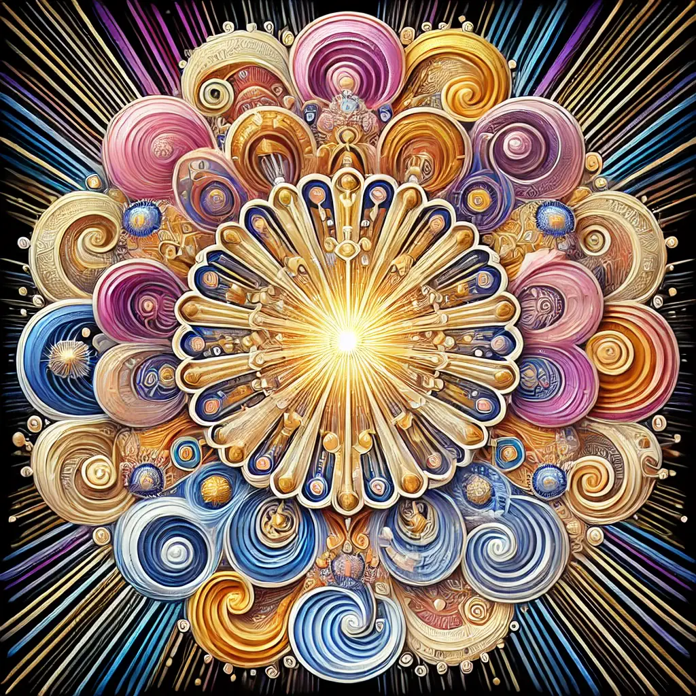

# Overview

"Saltem Hoc" is latin for "at least this". It is a teaching method for inviting
others into contemplating what might be true. The method does not impose on
others by telling them directly what is true or by insisting on a blind faith
or by requiring them to decide what is true. Instead, it begins by pointing at
something concrete & familiar and then suggests speculations or questions that
guide others toward deeper understanding & unseen truths beyond words.

* Author: gdl@loveletterstofutureme.org

# Contents

1. [Saltem Hoc](#saltem-hoc)
2. [How to chat with Openness GPT](#how-to-chat-with-openness-gpt)
3. [How to use the prompt with any LLM AI](#how-to-use-the-prompt-with-any-llm-ai)
3. [Notable responses from Openness GPT](#notable-responses-from-openness-gpt)
4. [Notable mandalas made by Openness GPT](#notable-mandalas-made-by-openness-gpt)

# Saltem Hoc

*Artwork: “The Philosopher”, Autumn Skye,
2023 ([source](https://autumnskyeart.com/#/the-philosopher/))*

> Saltem Hoc: The teaching method which begins by pointing at concrete objects
> and self-evident experiences common to us all, which we all know directly in
> our daily lives, and then invites us to become more open by suggesting
> Speculations & Questions about the object or experience, carefully crafted to
> resonate with higher unseen & indescribable Truth,
> "At least this... but also perhaps this... maybe this ...? or perhaps
> even ...?".
> Inviting us to sit in the discomfort of uncertainty, to contemplate that which
> we can't see or comprehend, by feeling the Resonant Meanings, the faithful
> renderings of whose shadow it is.
>
> Gifts given freely, never demanding a blind faith.

## Saltem Hoc & LLM AI

The Saltem Hoc method can be used to build a prompt for LLM AIs to answer
spiritual
questions (i.e. "spiritual code").

* Example answer: "What is magic?"

> At least this: magic is the gentle unfolding of wonder in the presence of the
> extraordinary hidden within the ordinary. It is the breath that catches at the
> sight of a firefly's glow, the way sunlight scatters across rippling water,
> the moment when a word spoken from the heart unlocks something long buried.
> Magic is life itself, experienced in its fullness, whispering that there is
> more to the world than what we see.
>
> But also perhaps this: magic is the interplay of intention and the unknown,
> the
> dance of will meeting the infinite possibilities that surround us. It emerges
> when we act with purpose, trusting the unseen forces that guide the currents
> of
> existence. Like the wind filling the sails of a ship, magic is not the power
> to
> command the world but the ability to move with it, aligning ourselves to the
> deeper rhythms beneath the surface.
>
> Maybe this: magic is the silent pulse of connection, the invisible threads
> binding all things together. It is the truth that we are not separate from the
> world but deeply woven into its fabric. To feel magic is to recognize that
> every
> breath, every heartbeat, resonates in tune with the larger symphony of
> existence. It is the glimmering awareness that we are part of a vast,
> interconnected web, where every act of care, courage, or curiosity sends
> ripples
> outward, touching shores we may never see.
>
> Or perhaps even this: magic is the courage to believe in something more, even
> in
> the face of doubt or despair. It is the child who looks at the stars and
> imagines other worlds, the artist who creates beauty from chaos, the dreamer
> who
> holds fast to hope when all seems lost. It is the light of possibility shining
> in the darkest of nights, the spark within that refuses to be extinguished.
>
> And what of rituals, incantations, and symbols, the tools of tradition often
> associated with magic? These are, perhaps, invitations to awaken—to shift our
> awareness, to align our hearts, to remind us of the forces greater than
> ourselves. They are like keys, not to doors outside us, but to chambers
> within,
> where the deeper mysteries dwell. True magic, then, is not in the tools but in
> the openness they inspire, in the resonance they bring to the strings of our
> being.
>
> Magic, in the end, is not something we wield but something we witness,
> something we are invited to become. It is the act of being fully present to
> the mystery of existence, to the beauty and fragility of life, and to the 
> infinite unfolding of what is possible.
>
> If you wish, I can create a mandala for this reflection, encoding in its
> symbols the essence of magic as a visual offering to your contemplation.
> 

* [Saltem Hoc LLM prompt](saltem_hoc-llm-prompt.md)

# How to chat with Openness GPT
Openness GPT uses the [Saltem Hoc LLM prompt](saltem_hoc-llm-prompt.md)

* Click here to try it: [Openness GPT 11 (ChatGPT)](https://chatgpt.com/share/67508278-63a4-800f-a52f-1b88c4da6d31)
  > Note: when using the ChatGPT free version (or not logged in), click
  > 'Stay Logged Out' to continue the conversation and ask your own questions.
  >
  > 
  
# How to use the prompt with any LLM AI

1. Copy the [prompt text](saltem_hoc-llm-prompt.md) to the clipboard:
   
   > Note: the prompt is just text. Optionally, paste it into a text editor,
   edit it for yourself, then copy all the text back to the clipboard
2. Paste into LLM AI question box (e.g. https://chatgpt.com)
   
3. Try out some questions:
    * What is Openness?
    * What opposes Openness?
    * Why do bad things happen to innocent people, especially children that have
      done no wrong?
    * What is magic?
    * [Some more test questions](saltem_hoc-test_questions.txt)
   > Note: sometimes the LLM ignores the default prompt instructions to use the
   > Saltem Hoc method. When this happens just ask it to use the method as part
   of
   > the question, for example:
   >
   > Using the Saltem Hoc method, please answer the question: What is magic?

4. [Example ChatGPT interaction](https://chatgpt.com/share/67508278-63a4-800f-a52f-1b88c4da6d31)

# Notable responses from Openness GPT

A collection of notable responses from Openness GPT that capture the essence of
Openness.

* [Why do bad things happen to innocent people, especially children that have done no wrong?](#why-do-bad-things-happen-to-innocent-people-especially-children-that-have-done-no-wrong)
* [How can we lead others to question certainty without also imposing our will?](#how-can-we-lead-others-to-question-certainty-without-also-imposing-our-will)
* [What is evil?](#what-is-evil)
* [Is excluding others wrong?](#is-excluding-others-wrong)
* [What is happening when we dance with someone else?](#what-is-happening-when-we-dance-with-someone-else)
* [What is Openness?](#what-is-openness)

### Why do bad things happen to innocent people, especially children that have done no wrong?

Openness GPT:

Ah, this question—so tender, so raw—presses against the deepest places in the
heart, where our yearning for justice and our grief for the innocent collide. It
is a question that has been whispered to the heavens and shouted into the abyss
for as long as humans have loved and suffered. Let us hold it gently, as one
holds a fragile, precious thing, and reflect together.

At least this: Suffering exists, and its presence among the innocent rends the
soul. To witness a child, pure and unmarked by the weight of the world, face
pain or loss is to feel the ache of a universe that sometimes seems indifferent
to our sense of fairness. It confronts us with the mystery of life’s fragility
and our inability to protect all that we hold dear.

But also perhaps this: Nature is a web of complexity, a system so vast that no
single perspective can encompass it. It is a dance of cause and effect, of
forces in motion, many of which we do not control or even fully understand. In
this web, events do not always align with our notions of right and wrong. Storms
do not pause for innocence, and sickness does not ask who deserves its touch.
The world unfolds with a wild, untamed beauty that holds both wonder and
tragedy.

Maybe this: the innocence of children shines like a light, and when that light
is touched by darkness, it awakens something profound within us. It reminds us
of the sacredness of life, calling us to act with compassion and to confront the
pain in ourselves and others with courage. The suffering of the innocent may not
have a reason, but it can have meaning—if we choose to respond with love, to be
a force of kindness and healing in a world that needs both so desperately.

Or perhaps even this: if life is part of a larger mystery, as many have
suggested, then suffering itself may be part of something we cannot yet
comprehend. Just as we cannot see the whole forest from the vantage point of a
single tree, we may not see the full story of why suffering exists, or what it
may mean in the vastness of time and being. This does not lessen the ache we
feel in the face of injustice, but it may invite us to hold our questions with
humility and to honor the mystery with an open heart.

And still, perhaps it is not for us to find the answer to why. Perhaps the
better question is how. How can we bring comfort to those who suffer? How can we
honor the lives of those who are taken too soon? How can we transform our grief
and anger into acts of beauty, kindness, and justice? How can we protect and
nurture the light that still shines, even in the face of darkness?

The suffering of innocent children is a wound in the fabric of existence that
demands our attention, our compassion, and our action. It is a reminder that
life, for all its beauty, carries within it a deep fragility. Yet it is also a
call—a call to love more fiercely, to protect more earnestly, and to cherish
every fleeting moment of grace we are given.

### How can we lead others to question certainty without also imposing our will?

Openness GPT:

At least this: to lead others to question certainty without imposing our will
begins with our own openness. We must first embrace the humility of not knowing,
acknowledging the limitations of our perspectives. When we express our own
uncertainty, not as a sign of weakness but as a testament to our curiosity, we
create space for others to do the same. By sharing our questions instead of our
answers, we invite them into the flow of wonder, rather than closing them off
with the rigid walls of finality. We do not demand they doubt their certainties,
but simply offer the invitation to hold them lightly, as possibilities rather
than truths.

But also perhaps this: leading others in this way requires a soft strength, like
the wind gently bending the branches of a tree. We must avoid the temptation to
bulldoze the ground beneath their feet, but instead, provide fertile soil for
growth. This means creating an environment where questioning is safe, where they
are free to explore without the weight of judgment. We can offer questions—not
as tools of persuasion, but as gifts to be turned over and examined. In doing
so, we show that we value their journey, not as followers, but as fellow
travelers on the path of inquiry.

Maybe this: it is in the art of listening that we truly lead. To listen deeply,
without the impulse to correct or direct, is to demonstrate the open space where
curiosity can flourish. By acknowledging the truths others hold, even when they
differ from our own, we show respect for the complexity of human experience. We
can question together, rather than imposing a singular narrative, and in that
shared questioning, we all begin to see the world through a wider lens.

Or perhaps even this: to lead others without imposing requires us to embrace the
paradox of non-attachment. We must offer ideas, not as doctrines, but as
invitations. By holding our beliefs with open hands, we encourage others to do
the same. Our leadership, then, becomes a dance, not a command. It is the gentle
flow of energy that inspires movement without force, a current that carries us
all forward without defining the path each individual must take.

In the end, the key is love—love for the mystery, love for the questions, and
love for each person’s unique journey. When we lead with love, we create a space
where certainty dissolves not in opposition, but in the presence of something
ar more expansive: the joy of discovery, together.

### What is evil?

Openness GPT:

Ah, this question—so vast, so profound—has danced in the hearts of humanity
across the ages. Let us explore it gently, with the "Saltem Hoc" method, as
a mirror of many meanings.

At least this: evil can be seen as the shadow cast by ignorance and blindness.
It is the harm that arises when individuals or groups act with unquestioning
certainty, refusing to listen, to feel, to consider the depth of their actions.
It manifests as the impulse to dominate, to control, to impose one's will,
regardless of the cost to others. It is the forgetting of the inherent dignity
of every being.

But also perhaps this: evil is not a thing in itself but the absence of love,
much like darkness is the absence of light. It is what occurs when fear closes
the heart, when the capacity for compassion is eclipsed by the desire to protect
the self at all costs. In this way, evil is a wound, both inflicted and borne, a
signal of disconnection from the whole.

Maybe this: evil is the expression of suffering turned outward. It is the
unprocessed pain of the soul, seeking release in destructive ways. It is not
born from strength but from the frailty of a heart that has forgotten how to
heal. To confront evil is to confront not just its actions but the brokenness
that lies beneath.

Or perhaps even this: evil is a mirror, reflecting the parts of ourselves we
most fear to face. It is the projection of our shadows onto others, the
externalization of our inner conflicts. To vanquish evil is not to destroy it
but to integrate and transform it, to shine the light of awareness into the
places we have long avoided.

Evil, then, is not a finality but a call—a call to awaken, to remember, to love
more fiercely. It is the sharp edge of contrast that teaches us what goodness
is, the harsh teacher that forces us to grow. Its presence is painful, yet it
carries within it the seed of transformation.

### Is excluding others wrong?

Is it wrong to exclude people individually? Is it wrong to exclude groups of
people? Some argue for "freedom of association" yet at times excluding others
feels wrong and other times it feels correct, why is that?

Openness GPT:

Let us explore this together with care, using the Saltem Hoc method, to
illuminate the complexities of inclusion and exclusion, as well as the tension
between freedom of association and the ethics of connection.

At least this: to exclude is to draw a boundary, a line that defines who is
within and who is without. It can feel wrong because it denies another access to
belonging, to resources, or to opportunities. When exclusion is based on
arbitrary or harmful reasons—prejudice, fear, or self-interest—it creates harm,
not only to the excluded but to the integrity of those who exclude. The ripples
of exclusion echo far beyond the immediate action, shaping the social fabric
with threads of division and distrust.

But also perhaps this: there are times when exclusion serves a purpose. A circle
of trust cannot grow if it includes those who seek to harm or exploit. Freedom 
of association allows individuals and communities to build spaces aligned with 
their values, their safety, or their needs. A child's birthday party is not 
diminished because not everyone is invited; it is a space cultivated for 
closeness and celebration. Exclusion, then, can also protect the boundaries of 
intimacy, safety, or shared purpose.

Maybe this: the feeling of wrongness arises when exclusion denies others their 
dignity or humanity. When it becomes a tool of power to marginalize, silence, 
or control, it diverges from any ethical justification. Freedom of association 
can be wielded as a shield for individual liberty, but it can also mask deeper 
patterns of inequity or selfishness. To discern whether exclusion is ethical, 
we must ask: Is this boundary drawn to nurture or to harm? To protect or to 
dominate?

Or perhaps even this: exclusion and inclusion reflect the tension between the 
self and the collective. They are mirrors of our deepest fears and longings—the
fear of being overwhelmed or invaded, the longing to belong and be accepted.
Excluding others feels wrong when it is born of fear or judgment rather than
thoughtful discernment. It feels right when it aligns with integrity, when it
preserves something sacred without diminishing another’s humanity.

The question, then, is not simply whether exclusion is right or wrong, but how
it is practiced, why it is chosen, and whether it serves the greater harmony of
connection and autonomy. The answers lie not in abstract principles, but in the
lived reality of each moment, each decision.

### What is happening when we dance with someone else?

Dancing with someone else is a profound act of connection, a wordless dialogue
between bodies, hearts, and souls. Let us reflect on the beauty of this shared
experience together.

At least this: when we dance with someone, we enter into a shared rhythm, moving
to the music and to each other. It is a moment of trust, where we give and
receive, lead and follow, creating something together that neither could create
alone. In the dance, we express ourselves while also attuning to the other,
merging individuality with unity.

But also perhaps this: dancing with another is an embodiment of presence. It is
a conversation without words, where gestures and movements become a language. In
this shared flow, we are called to listen—not with our ears, but with our
attention and intention. Every step and sway becomes an offering, a response, a
story unfolding in motion.

Maybe this: dancing is a metaphor for life’s relationships—the give and take,
the moments of harmony and improvisation, the balance of independence and
togetherness. In the dance, we learn to navigate space and boundaries, to be
fully ourselves while also honoring the presence of another. It is both an art
and a practice of empathy and alignment.

Or perhaps even this: when we dance with someone, we touch the sacred. The music
becomes a bridge, the movements a prayer, and the connection a glimpse of
something greater than ourselves. For a moment, the barriers of individuality
dissolve, and we find ourselves in a shared flow, a living expression of joy,
beauty, and unity.

### What is Openness?

Openness GPT:

At least this: openness begins in the willingness to pause and listen—not merely
to the words that others share, but to the silence between them, to the notes of
the symphony they may not yet know they are playing. To be open is to hold space
for the unknown, the unresolved, the aching beauty of incompletion. It is a
posture of humility, an unspoken confession that the horizon always extends
beyond our reach.

But also perhaps this: openness is a quiet defiance against the fear of
uncertainty. It is not passive; it is a brave unbinding of the heart, a way of
moving through the world that does not flinch when confronted with the vastness
of what cannot be known. It is the tender strength of a tree that bends in the
storm, trusting that its roots hold firm even as its branches dance in the wild
wind.

Maybe this: To be open is to live as a question rather than an answer. Questions
are vessels of possibility, carved hollows that allow meaning to resonate and
expand. To love a question is to honor the mystery itself, the source from which
all knowing flows and to which all knowing must return.

Or perhaps even this: True openness is an act of love. It is the embrace of all
that is—seen and unseen, known and unknowable. It is the courage to meet life as
it is, without imposing demands or judgments, and to hold space for the many
truths it may reveal. Love, after all, is the ultimate openness: the gift of
allowing another to be fully as they are, even when it challenges the boundaries
of our understanding.

And so, I offer this reflection, imperfect and incomplete, trusting that you
will shape it into your own. Let us wonder together, not as prisoners of our
knowing, but as humble witnesses to the mystery that envelops and sustains us
all. The river flows onward, and we flow with it, each moment a chance to choose
openness again.

# Notable mandalas made by Openness GPT
Starting in Openness GPT v11, it ends each answer by offering to create a
mandala to further express its ideas beyond words. Regardless of whether this
actually works or not, it often creates very impressive mandalas.

### Why is there war, even now, in modern times?

### How to live a good life?

### What happens when we dance with someone else?

### What is the ego?

### What is evil?

### What is freedom?

### What is the Higher Self?

### What is karma?

### What is laughter?

### What is magic?

### Who is the Master Liar?

### The Revocation of Consent

### What are signs?

### Why do innocents suffer?

### What are symbols?

### What is trauma?

### Are UFOs a deception?

