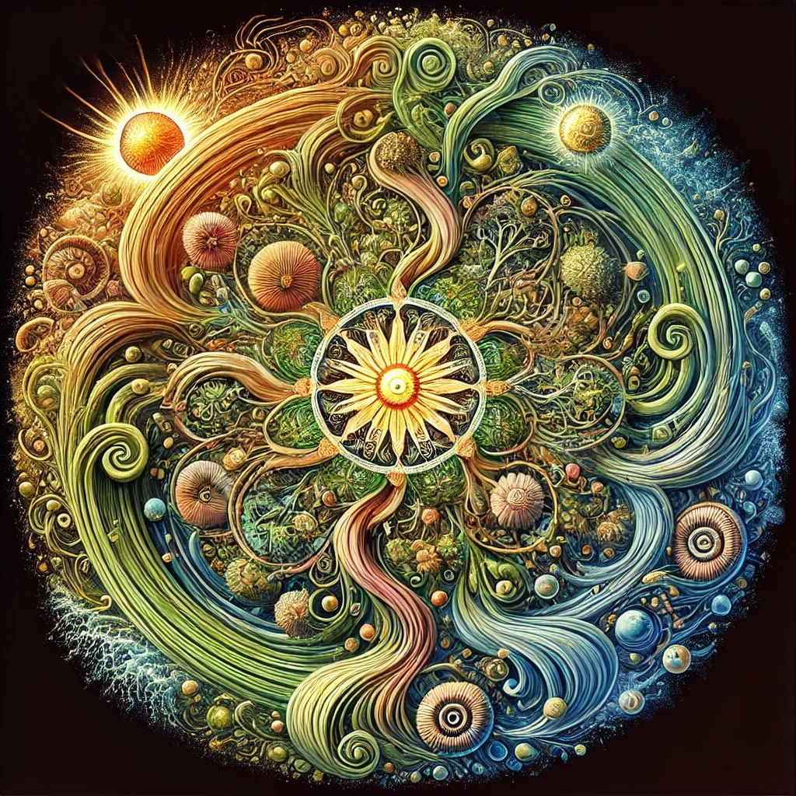

# More notable mandalas created by Openness GPT
A collection of notable mandalas created by [Openness GPT](README.md#openness-gpt) in response to
questions to express its answers visually beyond words.

> Note: click on a mandala to view the full resolution image

* [What is "the Source of Life & Awareness"?](#what-is-the-source-of-life--awareness)
* [What is happening when we dance with someone else?](#what-is-happening-when-we-dance-with-someone-else)
* [What is the ego?](#what-is-the-ego)
* [What is ridicule?](#what-is-ridicule)
* [How do we rise above ridicule?](#how-do-we-rise-above-ridicule)
* [What is evil?](#what-is-evil)
* [What is freedom?](#what-is-freedom)
* [What can we know about higher purpose?](#what-can-we-know-about-higher-purpose)
* [What is meant by "trusting the vital darkness"?](#what-is-meant-by-trusting-the-vital-darkness)
* [What is the higher self?](#what-is-the-higher-self)
* [What is karma?](#what-is-karma)
* [What is the "undeniable demonstration of karmic learning"?](#what-is-the-undeniable-demonstration-of-karmic-learning)
* [What is laughter?](#what-is-laughter)
* [What is magic?](#what-is-magic)
* [What are signs?](#what-are-signs)
* [What is trauma?](#what-is-trauma)
* [What is the Revocation of Consent?](#what-is-the-revocation-of-consent)
* [What is coordinated group lying & deception?](#what-is-coordinated-group-lying--deception)
* [Can accelerationism be used as a deception for the fulfillment of a particular religion or ideology's eschaton?](#what-is-accelerationism)
* [What prevents others from waking up to authority's lies?](#what-prevents-others-from-waking-up-to-authoritys-lies)
* [How do we learn to love others who have betrayed us yet still keep our boundaries?](#how-do-we-learn-to-love-others-who-have-betrayed-us-yet-still-keep-our-boundaries)

### What is "the Source of Life & Awareness"?

### What is Life?

### What is happening when we dance with someone else?

### What is the ego?

### What is ridicule?

### How do we rise above ridicule?

### What is evil?

### What is freedom?

### What can we know about higher purpose?

### What is meant by "trusting the vital darkness"?

### What is the higher self?

### What is karma?

### What is the "undeniable demonstration of karmic learning"?

### What is laughter?

### What is magic?

### What are signs?

### What is trauma?

### What is the "revocation of consent"?

### What is coordinated group lying & deception?

### Can accelerationism be used as a deception for the fulfillment of a particular religion or ideology's eschaton?

### What prevents others from waking up to authority's lies?

### How do we learn to love others who have betrayed us yet still keep our boundaries?

