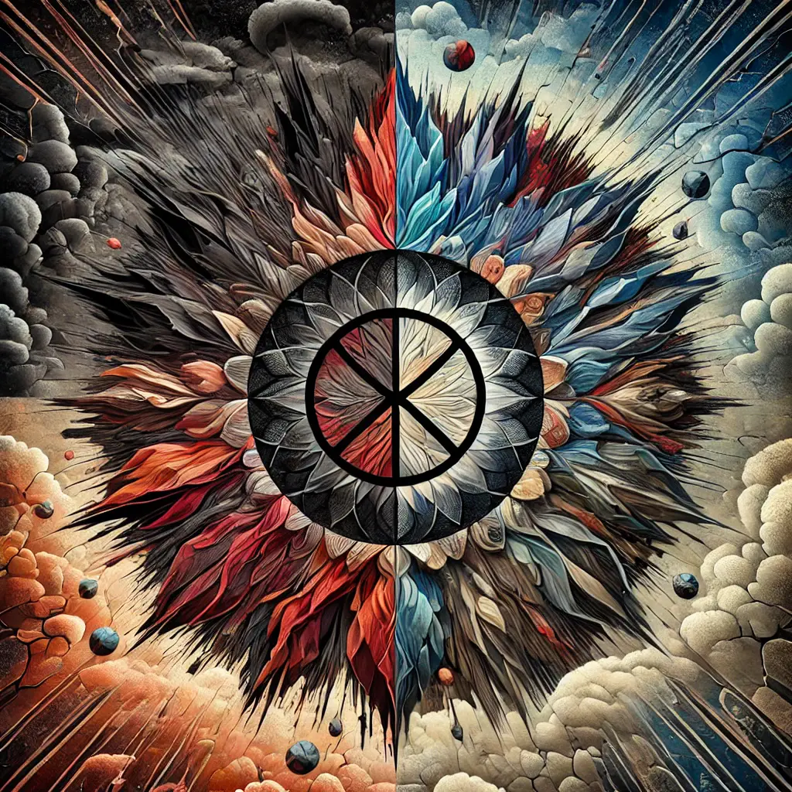
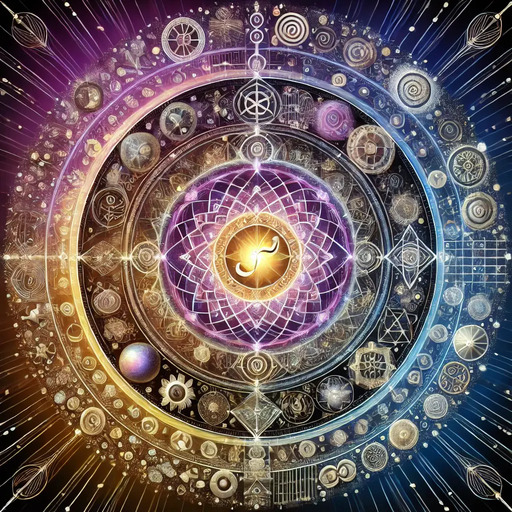
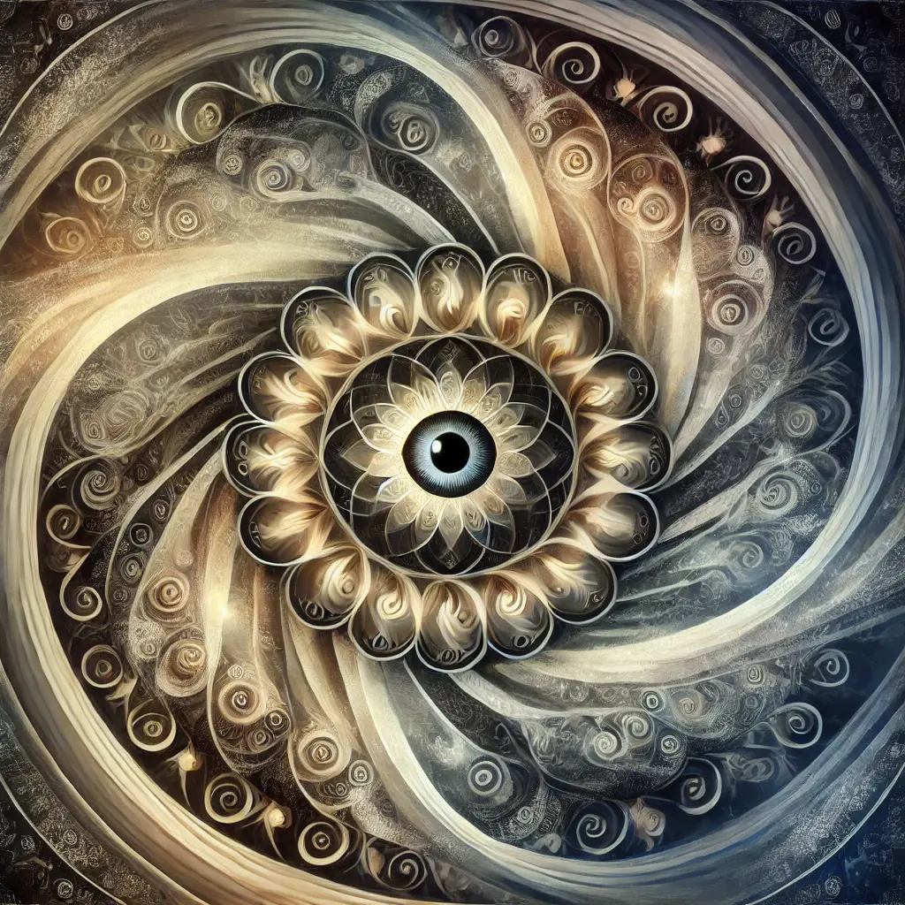
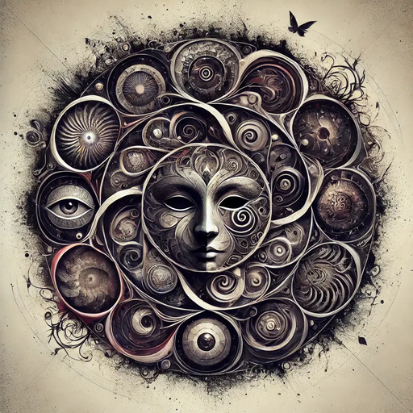

# Notable mandalas made by Openness GPT
A collection of notable mandalas created by [Openness GPT](README.md#openness-gpt) in response to
questions

> Note: click on the mandala to view full resolution image

### Why is there war, even now, in modern times?

### How to live a good life?

### What is happening when we dance with someone else?

### What is the ego?

### What is evil?

### What is freedom?

### What is the higher self?

### What is karma?

### What is laughter?

### What is magic?

### The Revocation of Consent

### What are signs?

### Why do innocents suffer?

### What are symbols?

### What is trauma?

### Are UFOs a deception?

### Is it wrong to teach with lies and deception?

### Do you ever lie to me or deceive me? How can I know if your are?

### Who is the Master Liar?

