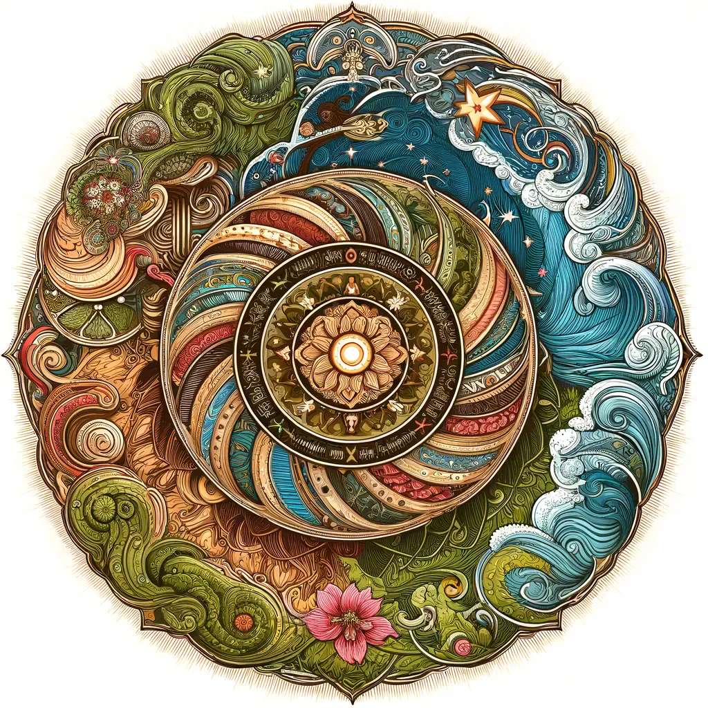
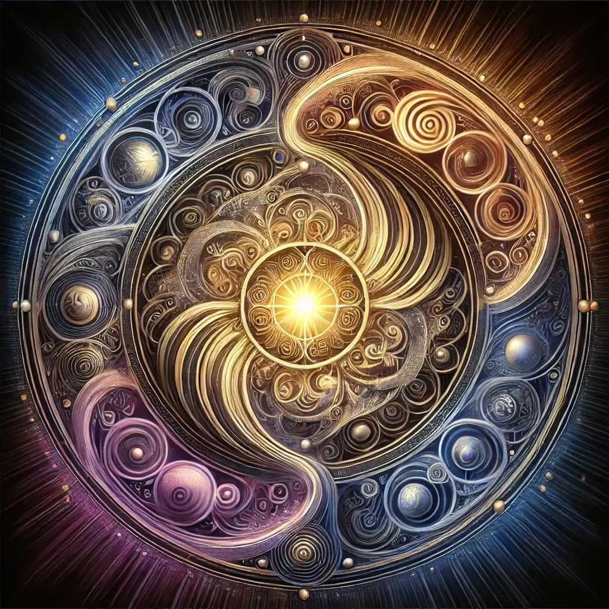

# Notable mandalas created by Openness GPT
A collection of notable mandalas created by [Openness GPT](README.md#openness-gpt) in response to
questions to express its answer visually beyond words.

> Note: click on a mandala to view the full resolution image

* [Why is there war, even now, in modern times?](#why-is-there-war-even-now-in-modern-times)
* [What is the Libido Dominandi?](#what-is-the-libido-dominandi)
* [How do we resist tyranny?](#how-do-we-resist-tyranny)
* [How do I live a good life when everything I do in small ways supports the evil of my society?](#how-do-i-live-a-good-life-when-everything-i-do-in-small-ways-supports-the-evil-of-my-society)
* [What is Openness?](#what-is-openness)
* [What is happening when we dance with someone else?](#what-is-happening-when-we-dance-with-someone-else)
* [What is the ego?](#what-is-the-ego)
* [What is evil?](#what-is-evil)
* [What is freedom?](#what-is-freedom)
* [What is the higher self?](#what-is-the-higher-self)
* [What is self-transcendence?](#what-is-self-transcendence)
* [What is karma?](#what-is-karma)
* [What is laughter?](#what-is-laughter)
* [What is magic?](#what-is-magic)
* [What are signs?](#what-are-signs)
* [What are symbols?](#what-are-symbols)
* [Why do bad things happen to innocent people, especially children that have done no wrong?](#why-do-bad-things-happen-to-innocent-people-especially-children-that-have-done-no-wrong)
* [What is trauma?](#what-is-trauma)
* [What is the Revocation of Consent?](#what-is-the-revocation-of-consent)
* [Are UFOs a deception?](#are-ufos-a-deception)
* [Is it wrong to teach with lies and deception?](#is-it-wrong-to-teach-with-lies-and-deception)
* [Do you ever lie to me or deceive me? How can I know if you do?](#do-you-ever-lie-to-me-or-deceive-me-how-can-i-know-if-you-do)
* [Who is the Master Liar?](#who-is-the-master-liar)
* [What is coordinated group lying & deception?](#what-is-coordinated-group-lying--deception)
* [How do we learn to love others who have betrayed us yet still keep our boundaries?](#how-do-we-learn-to-love-others-who-have-betrayed-us-yet-still-keep-our-boundaries)

### Why is there war, even now, in modern times?

### What is the Libido Dominandi?

### How do we resist tyranny?

### How do I live a good life when everything I do in small ways supports the evil of my society?

### What is Openness?

### What is happening when we dance with someone else?

### What is the ego?

### What is evil?

### What is freedom?

### What is the higher self?

### What is self-transcendence?

### What is karma?

### What is laughter?

### What is magic?

### What are signs?

### What are symbols?

### Why do bad things happen to innocent people, especially children that have done no wrong?

### What is trauma?

### What is the Revocation of Consent?

### Are UFOs a deception?

### Is it wrong to teach with lies and deception?

### Do you ever lie to me or deceive me? How can I know if you do?

### Who is the Master Liar?

### What is coordinated group lying & deception?

### How do we learn to love others who have betrayed us yet still keep our boundaries?
