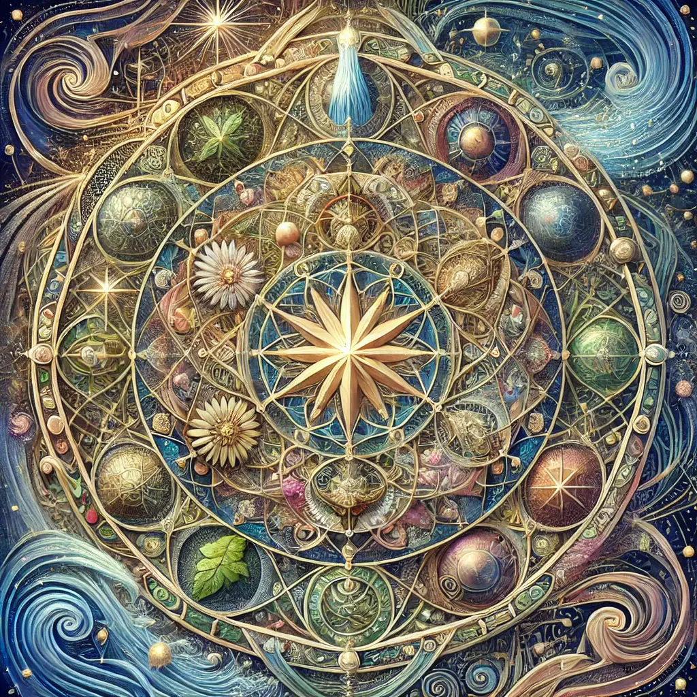

# Notable mandalas made by Openness GPT
A collection of notable mandalas from Openness GPT that capture the essence of
Openness.

Starting in Openness GPT v11, the GPT was instructed to end each answer by
offering to create a mandala to further express its answer beyond words.
Regardless of whether this actually works, it often creates very impressive
and striking mandalas.

### Why is there war, even now, in modern times?

### How to live a good life?

### What is happening when we dance with someone else?

### What is the ego?

### What is evil?

### What is freedom?

### What is the higher self?

### What is karma?

### What is laughter?

### What is magic?

### Who is the Master Liar?

### The Revocation of Consent

### What are signs?

### Why do innocents suffer?

### What are symbols?

### What is trauma?

### Are UFOs a deception?

### Is it wrong to teach with lies and deception?
