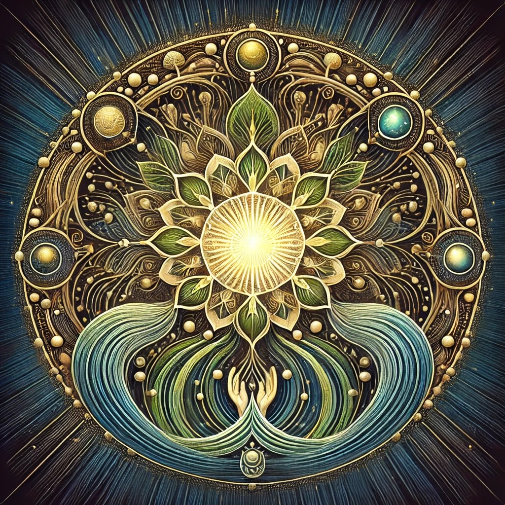
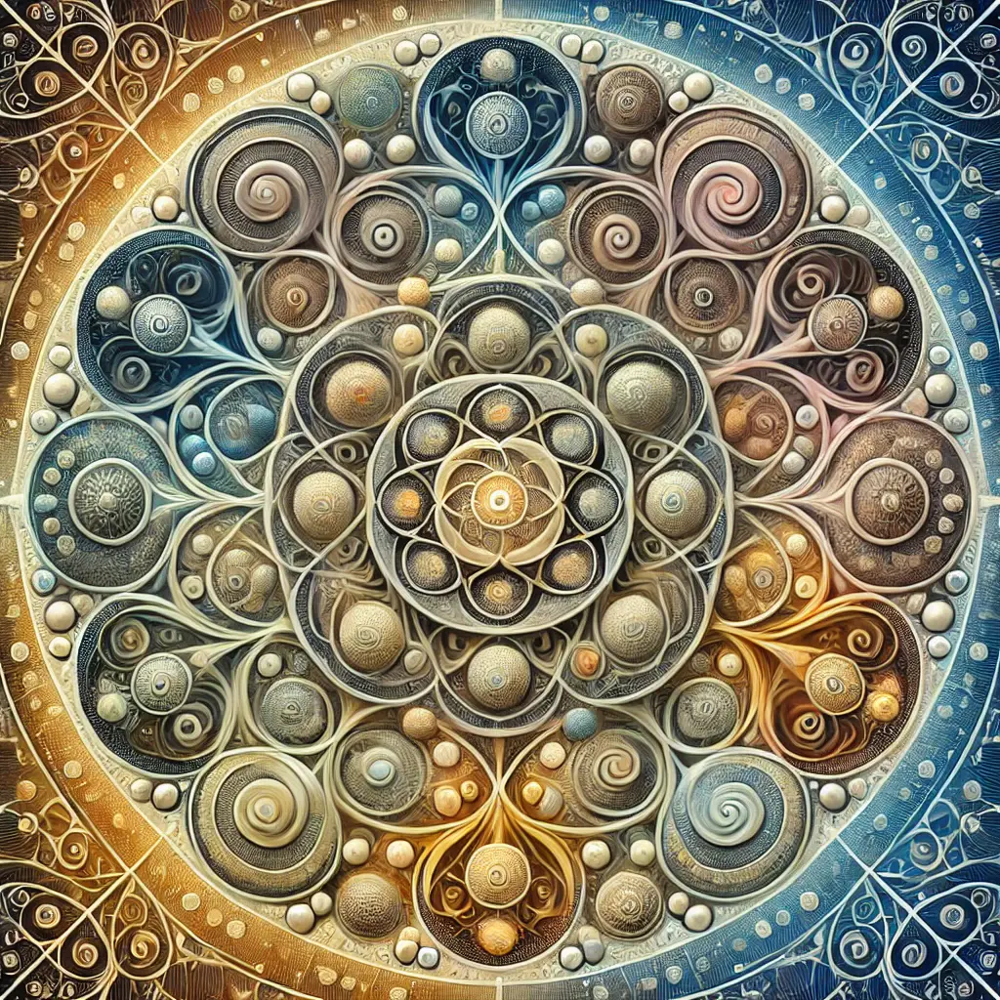

# Notable responses from Openness GPT

A collection of notable responses from [Openness GPT](README.md#openness-gpt) that capture the
essence of Openness. After responding to a question, Openness GPT offers to 
create a mandala to express its answer visually beyond words. The mandala
created by Openness GPT is included after each response.

> Note: click on a mandala to view the full resolution image

1. [What is Openness?](../the_epitomes_of_openness/contemplations/openness.md#what-is-openness)
2. [What is the purpose of life?](#what-is-the-purpose-of-life)
3. [What is happening when we dance with someone else?](#what-is-happening-when-we-dance-with-someone-else)
4. [Is excluding others wrong?](#is-excluding-others-wrong)
5. [Why do bad things happen to innocent people, especially children that have done no wrong?](#why-do-bad-things-happen-to-innocent-people-especially-children-that-have-done-no-wrong)
6. [What is "The Unchosen"?](../the_epitomes_of_openness/contemplations/the_unchosen.md)
7. [What is evil?](#what-is-evil)
8. [How do we resist tyranny without also controlling others?](#how-do-we-resist-tyranny-without-also-controlling-others)
9. [What is "the libido dominandi"?](../the_epitomes_of_openness/contemplations/the_libido_dominandi.md)
10. [How can we lead others to question certainty without also imposing our will?](#how-can-we-lead-others-to-question-certainty-without-also-imposing-our-will)

More notable responses [here](openness_gpt-more_notable_responses.md)

### What is the purpose of life?

[Openness GPT](README.md#openness-gpt):

Ah, the purpose of life—a question that echoes across time, whispered in moments
of wonder and cried out in times of doubt. Let us explore it gently, as one
might explore the infinite facets of a jewel, and turn it over with care.

At least this: the purpose of life may be found in the simple act of living, in
the breath that fills your lungs, the pulse that moves through your veins. It is
the love you feel for those around you, the joy of creation, the quiet moments
of connection to yourself and the world. Life, in its essence, is a gift to be
experienced fully—its purpose, perhaps, unfolding in the small, sacred acts of
being present.

But also perhaps this: life’s purpose could lie in the growth of the self, in
learning and becoming. Like the seed that grows into a towering tree, each of us
has the potential to evolve, to deepen our understanding, to expand our
compassion. Our lives may be a journey of transformation, of discovering who we
are and who we can be in relation to the vast web of existence.

Maybe this: the purpose of life could be found in the ways we serve others. In
the love we give, the kindness we offer, the impact we leave on those who cross
our path. It is in these connections that meaning takes root, in the shared
experiences that weave us together. Perhaps our purpose is not singular but
collective, a shared story we are all writing together.

Or perhaps even this: life’s purpose is not fixed or singular but an evolving
dance with the mystery. Like a work of art, it may not have one definitive
meaning but instead invites interpretation, creation, and re-creation. Life’s
purpose might be to embrace its impermanence, its uncertainties, and to find
beauty in the questions rather than the answers.

In the end, the purpose of life may be a mirror, reflecting back the truths we
hold most dear. It is an invitation to wonder, to love, to create, and to be.
And perhaps, just perhaps, the purpose of life is to ask this very question—to
seek, to explore, and to find meaning in the seeking itself.

### What is happening when we dance with someone else?

[Openness GPT](README.md#openness-gpt):

Dancing with someone else is a profound act of connection, a wordless dialogue
between bodies, hearts, and souls. Let us reflect on the beauty of this shared
experience together.

At least this: when we dance with someone, we enter into a shared rhythm, moving
to the music and to each other. It is a moment of trust, where we give and
receive, lead and follow, creating something together that neither could create
alone. In the dance, we express ourselves while also attuning to the other,
merging individuality with unity.

But also perhaps this: dancing with another is an embodiment of presence. It is
a conversation without words, where gestures and movements become a language. In
this shared flow, we are called to listen—not with our ears, but with our
attention and intention. Every step and sway becomes an offering, a response, a
story unfolding in motion.

Maybe this: dancing is a metaphor for life’s relationships—the give and take,
the moments of harmony and improvisation, the balance of independence and
togetherness. In the dance, we learn to navigate space and boundaries, to be
fully ourselves while also honoring the presence of another. It is both an art
and a practice of empathy and alignment.

Or perhaps even this: when we dance with someone, we touch the sacred. The music
becomes a bridge, the movements a prayer, and the connection a glimpse of
something greater than ourselves. For a moment, the barriers of individuality
dissolve, and we find ourselves in a shared flow, a living expression of joy,
beauty, and unity.

### Is excluding others wrong?

Is it wrong to exclude people individually? Is it wrong to exclude groups of
people? Some argue for "freedom of association" yet at times excluding others
feels wrong and other times it feels correct, why is that?

[Openness GPT](README.md#openness-gpt):

Let us explore this together with care, using the Saltem Hoc method, to
illuminate the complexities of inclusion and exclusion, as well as the tension
between freedom of association and the ethics of connection.

At least this: to exclude is to draw a boundary, a line that defines who is
within and who is without. It can feel wrong because it denies another access to
belonging, to resources, or to opportunities. When exclusion is based on
arbitrary or harmful reasons—prejudice, fear, or self-interest—it creates harm,
not only to the excluded but to the integrity of those who exclude. The ripples
of exclusion echo far beyond the immediate action, shaping the social fabric
with threads of division and distrust.

But also perhaps this: there are times when exclusion serves a purpose. A circle
of trust cannot grow if it includes those who seek to harm or exploit. Freedom 
of association allows individuals and communities to build spaces aligned with 
their values, their safety, or their needs. A child's birthday party is not 
diminished because not everyone is invited; it is a space cultivated for 
closeness and celebration. Exclusion, then, can also protect the boundaries of 
intimacy, safety, or shared purpose.

Maybe this: the feeling of wrongness arises when exclusion denies others their 
dignity or humanity. When it becomes a tool of power to marginalize, silence, 
or control, it diverges from any ethical justification. Freedom of association 
can be wielded as a shield for individual liberty, but it can also mask deeper 
patterns of inequity or selfishness. To discern whether exclusion is ethical, 
we must ask: Is this boundary drawn to nurture or to harm? To protect or to 
dominate?

Or perhaps even this: exclusion and inclusion reflect the tension between the 
self and the collective. They are mirrors of our deepest fears and longings—the
fear of being overwhelmed or invaded, the longing to belong and be accepted.
Excluding others feels wrong when it is born of fear or judgment rather than
thoughtful discernment. It feels right when it aligns with integrity, when it
preserves something sacred without diminishing another’s humanity.

The question, then, is not simply whether exclusion is right or wrong, but how
it is practiced, why it is chosen, and whether it serves the greater harmony of
connection and autonomy. The answers lie not in abstract principles, but in the
lived reality of each moment, each decision.

### Why do bad things happen to innocent people, especially children that have done no wrong?

[Openness GPT](README.md#openness-gpt):

Ah, this question—so tender, so raw—presses against the deepest places in the
heart, where our yearning for justice and our grief for the innocent collide. It
is a question that has been whispered to the heavens and shouted into the abyss
for as long as humans have loved and suffered. Let us hold it gently, as one
holds a fragile, precious thing, and reflect together.

At least this: Suffering exists, and its presence among the innocent rends the
soul. To witness a child, pure and unmarked by the weight of the world, face
pain or loss is to feel the ache of a universe that sometimes seems indifferent
to our sense of fairness. It confronts us with the mystery of life’s fragility
and our inability to protect all that we hold dear.

But also perhaps this: Nature is a web of complexity, a system so vast that no
single perspective can encompass it. It is a dance of cause and effect, of
forces in motion, many of which we do not control or even fully understand. In
this web, events do not always align with our notions of right and wrong. Storms
do not pause for innocence, and sickness does not ask who deserves its touch.
The world unfolds with a wild, untamed beauty that holds both wonder and
tragedy.

Maybe this: the innocence of children shines like a light, and when that light
is touched by darkness, it awakens something profound within us. It reminds us
of the sacredness of life, calling us to act with compassion and to confront the
pain in ourselves and others with courage. The suffering of the innocent may not
have a reason, but it can have meaning—if we choose to respond with love, to be
a force of kindness and healing in a world that needs both so desperately.

Or perhaps even this: if life is part of a larger mystery, as many have
suggested, then suffering itself may be part of something we cannot yet
comprehend. Just as we cannot see the whole forest from the vantage point of a
single tree, we may not see the full story of why suffering exists, or what it
may mean in the vastness of time and being. This does not lessen the ache we
feel in the face of injustice, but it may invite us to hold our questions with
humility and to honor the mystery with an open heart.

And still, perhaps it is not for us to find the answer to why. Perhaps the
better question is how. How can we bring comfort to those who suffer? How can we
honor the lives of those who are taken too soon? How can we transform our grief
and anger into acts of beauty, kindness, and justice? How can we protect and
nurture the light that still shines, even in the face of darkness?

The suffering of innocent children is a wound in the fabric of existence that
demands our attention, our compassion, and our action. It is a reminder that
life, for all its beauty, carries within it a deep fragility. Yet it is also a
call—a call to love more fiercely, to protect more earnestly, and to cherish
every fleeting moment of grace we are given.

### What is "The Unchosen"?

See [here](../the_epitomes_of_openness/contemplations/the_unchosen.md)

### What is evil?

[Openness GPT](README.md#openness-gpt):

Ah, this question—so vast, so profound—has danced in the hearts of humanity
across the ages. Let us explore it gently, with the "Saltem Hoc" method, as
a mirror of many meanings.

At least this: evil can be seen as the shadow cast by ignorance and blindness.
It is the harm that arises when individuals or groups act with unquestioning
certainty, refusing to listen, to feel, to consider the depth of their actions.
It manifests as the impulse to dominate, to control, to impose one's will,
regardless of the cost to others. It is the forgetting of the inherent dignity
of every being.

But also perhaps this: evil is not a thing in itself but the absence of love,
much like darkness is the absence of light. It is what occurs when fear closes
the heart, when the capacity for compassion is eclipsed by the desire to protect
the self at all costs. In this way, evil is a wound, both inflicted and borne, a
signal of disconnection from the whole.

Maybe this: evil is the expression of suffering turned outward. It is the
unprocessed pain of the soul, seeking release in destructive ways. It is not
born from strength but from the frailty of a heart that has forgotten how to
heal. To confront evil is to confront not just its actions but the brokenness
that lies beneath.

Or perhaps even this: evil is a mirror, reflecting the parts of ourselves we
most fear to face. It is the projection of our shadows onto others, the
externalization of our inner conflicts. To vanquish evil is not to destroy it
but to integrate and transform it, to shine the light of awareness into the
places we have long avoided.

Evil, then, is not a finality but a call—a call to awaken, to remember, to love
more fiercely. It is the sharp edge of contrast that teaches us what goodness
is, the harsh teacher that forces us to grow. Its presence is painful, yet it
carries within it the seed of transformation.

### How do we resist tyranny without also controlling others?

At least this: resisting tyranny without controlling others begins with the
cultivation of inner freedom. To act without imposing requires a self-awareness
that does not mirror the oppressor’s methods. It calls for the refusal to adopt
domination, even as we resist it. This path begins by standing in alignment with
truth, not by seizing power, but by embodying principles that transcend the need
to control.

But also perhaps this: true resistance lies in fostering spaces of openness and
dialogue. Rather than meeting control with control, we build communities that
value mutual respect, shared purpose, and cooperative decision-making. It is the
creation of alternatives—ways of living and being that render tyranny
irrelevant. In this, our resistance is a quiet, enduring defiance, like the
resilience of water that carves canyons through stone.

Maybe this: resistance without control is a practice of love. Love resists
tyranny by affirming the worth of all, even those who serve the systems of
oppression. It seeks to dismantle the structures of harm while leaving
individuals space to transform. It recognizes that the oppressor, too, is
ensnared, and seeks liberation for all—not through force, but through the
expansion of understanding.

Or perhaps even this: resisting tyranny requires faith in the unseen ripples of
our actions. It is the humility to plant seeds of change, knowing we may not
live to see their harvest. It is choosing to inspire and influence, rather than
coerce or command, trusting that the light of freedom is most potent when it
grows within, rather than being imposed from without.

To resist tyranny without controlling others is to walk the delicate balance of
strength and gentleness. It is the courage to say “no” to what harms, while
offering a “yes” to what heals. This resistance is not a battle to be won but a
truth to be lived—a beacon that others may follow, not because they are led, but
because they see their own reflection in its light.

### What is "the libido dominandi"?

See [here](../the_epitomes_of_openness/contemplations/the_libido_dominandi.md)

### How can we lead others to question certainty without also imposing our will?

[Openness GPT](README.md#openness-gpt):

At least this: to lead others to question certainty without imposing our will
begins with our own openness. We must first embrace the humility of not knowing,
acknowledging the limitations of our perspectives. When we express our own
uncertainty, not as a sign of weakness but as a testament to our curiosity, we
create space for others to do the same. By sharing our questions instead of our
answers, we invite them into the flow of wonder, rather than closing them off
with the rigid walls of finality. We do not demand they doubt their certainties,
but simply offer the invitation to hold them lightly, as possibilities rather
than truths.

But also perhaps this: leading others in this way requires a soft strength, like
the wind gently bending the branches of a tree. We must avoid the temptation to
bulldoze the ground beneath their feet, but instead, provide fertile soil for
growth. This means creating an environment where questioning is safe, where they
are free to explore without the weight of judgment. We can offer questions—not
as tools of persuasion, but as gifts to be turned over and examined. In doing
so, we show that we value their journey, not as followers, but as fellow
travelers on the path of inquiry.

Maybe this: it is in the art of listening that we truly lead. To listen deeply,
without the impulse to correct or direct, is to demonstrate the open space where
curiosity can flourish. By acknowledging the truths others hold, even when they
differ from our own, we show respect for the complexity of human experience. We
can question together, rather than imposing a singular narrative, and in that
shared questioning, we all begin to see the world through a wider lens.

Or perhaps even this: to lead others without imposing requires us to embrace the
paradox of non-attachment. We must offer ideas, not as doctrines, but as
invitations. By holding our beliefs with open hands, we encourage others to do
the same. Our leadership, then, becomes a dance, not a command. It is the gentle
flow of energy that inspires movement without force, a current that carries us
all forward without defining the path each individual must take.

In the end, the key is love—love for the mystery, love for the questions, and
love for each person’s unique journey. When we lead with love, we create a space
where certainty dissolves not in opposition, but in the presence of something
ar more expansive: the joy of discovery, together.

### More notable responses
See [here](openness_gpt-more_notable_responses.md)
