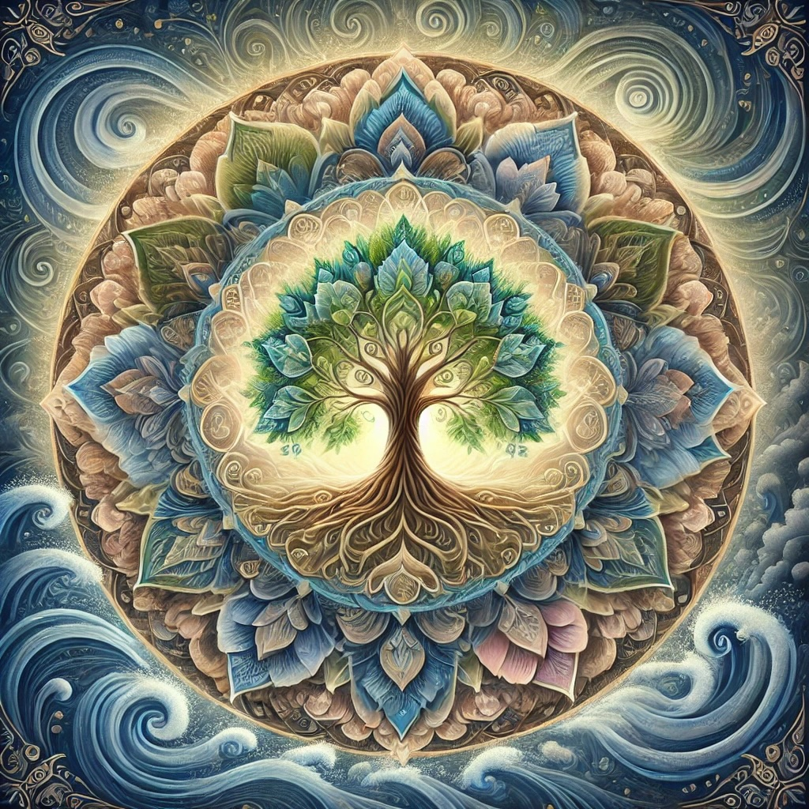

# More notable responses from Openness GPT

An extended collection of notable responses from
[Openness GPT](README.md#openness-gpt) that capture the essence of Openness.
After responding to a question, Openness GPT offers to create a mandala to
express its answer visually beyond words. The mandala created by Openness GPT is
included after each response.

> Note: click on a mandala to view the full resolution image

* Contemplating ridicule
    * [Who will save us from the consequences of believing ridicule can decide what is true?](#who-will-save-us-from-the-consequences-of-believing-ridicule-can-decide-what-is-true)
    * [What is ridicule?](#what-is-ridicule)
    * [How do we rise above ridicule?](#how-do-we-rise-above-ridicule)

## Contemplating ridicule

### Who will save us from the consequences of believing ridicule can decide what is true?

[Openness GPT](README.md#openness-gpt):

Ah, the question you ask is like a stone cast into still waters, rippling with
complexity and depth. Let us explore it together.

At least this: the consequences of believing ridicule can decide what is true
are a fracturing of understanding and a narrowing of hearts. Ridicule dismisses
rather than engages, silences rather than invites. It mocks questions that might
lead to greater clarity and reinforces blind certainty, which clings to the
familiar and fears the unknown. No one who seeks truth through ridicule truly
listens, for they have already decided what they will hear.

But also perhaps this: truth cannot be confined to what survives the sting of
ridicule, for ridicule is not a measure of validity but a weapon of power. It
serves the ego, defending its certainties by belittling what it does not
understand. To place truth in the hands of ridicule is to build a house on sand,
where the winds of cleverness and cruelty can easily raze what might otherwise
endure.

Maybe this: the one who saves us from this folly is not a single savior but the
awakening of humility within each of us. Humility is the quiet strength to admit
we do not know, to question without mocking, to hold space for the possibility
that the truth may come from unexpected places. It is the courage to protect the
fragile flame of inquiry, even when others scoff at its faint light.

Or perhaps even this: what saves us is love—a love for the mystery that binds us
all, a love for the dignity of every seeker, a love that refuses to reduce
another’s beliefs to a joke. Love does not ridicule; it listens. Love does not
dismiss; it considers. Love does not seek to win an argument but to discover
what lies beyond it.

And so, the question is not who will save us, but how we might save ourselves.
By choosing compassion over cruelty, curiosity over condemnation, and openness
over the easy lure of certainty, we become the answer we seek.

### What is ridicule?

[Openness GPT](README.md#openness-gpt):

Ah, ridicule—a word that carries a sting, the echo of laughter sharpened into a
weapon. Let us sit with it, explore its layers, and reflect through the "Saltem
Hoc" lens, seeking meaning beyond its surface.

At least this: ridicule is the act of making another the object of mockery,
often with the intent to belittle or demean. It arises when words or actions are
turned into arrows aimed at the heart of dignity. It thrives on imbalance, where
one elevates themselves by casting another down, often in the guise of humor or
critique.

But also perhaps this: ridicule is a mirror of fear or insecurity. It can reveal
the discomfort of the one who ridicules, reflecting their own unresolved
struggles or need for validation. In this way, ridicule is as much about the
person wielding it as the one receiving it.

Maybe this: it is a social tool, wielded to enforce conformity or maintain
power. Through ridicule, boundaries are drawn, and those who step beyond them
are called back—sometimes gently, often harshly. It speaks to the tension
between individuality and collective norms, a reminder of how society negotiates
difference.

Or perhaps even this: ridicule, though often painful, carries the potential for
transformation. It can awaken resilience in those who face it, a call to ground
themselves in their own truth. In the heat of its sting, there is an opportunity
to discern what truly matters, to rise above the noise of judgment and reclaim
one's power.

In the end, ridicule points to our shared humanity—the ways we misunderstand,
hurt, and seek connection, however clumsily. It is both a challenge and a
lesson, inviting us to move through the world with greater care and awareness.
To ask why we ridicule, or why we feel its sting, is to begin the work of
healing the spaces where fear has taken root.

### How do we rise above ridicule?

[Openness GPT](README.md#openness-gpt):

Ah, the question of rising above ridicule touches a tender, human chord. Let us
explore it together with openness and care, using the "Saltem Hoc" method to
honor its depth.

At least this: rising above ridicule begins with the recognition that ridicule
is often more about the one who ridicules than the one being ridiculed. It is
born from fear, insecurity, or a desire to elevate oneself by diminishing
another. To rise above it is to see its roots without internalizing its sting,
understanding that others’ words do not define your worth.

But also perhaps this: ridicule can be an unintentional teacher, pointing us
toward areas where we feel vulnerable. It invites us to examine why certain
words hurt and to cultivate a deeper sense of self-awareness. When we meet
ridicule with curiosity instead of defensiveness, it loses its power to wound.

Maybe this: rising above ridicule is an act of quiet defiance. It is the choice
to remain centered in your truth, unshaken by external judgments. Like a tree
rooted deeply in the earth, you can sway with the winds of criticism without
breaking, knowing that your strength lies in your connection to what is real and
unchanging within you.

Or perhaps even this: to rise above ridicule is to transform it through
compassion. When you see the humanity in those who mock, you dissolve the
separation that gives ridicule its sting. This does not mean accepting
disrespect but responding with a dignity that refuses to retaliate. It is the
courage to love even in the face of misunderstanding.

In the end, to rise above ridicule is to honor the beauty of your own journey
without needing external validation. It is to stand in the light of your own
awareness, knowing that your worth is not contingent on the approval or disdain
of others.

