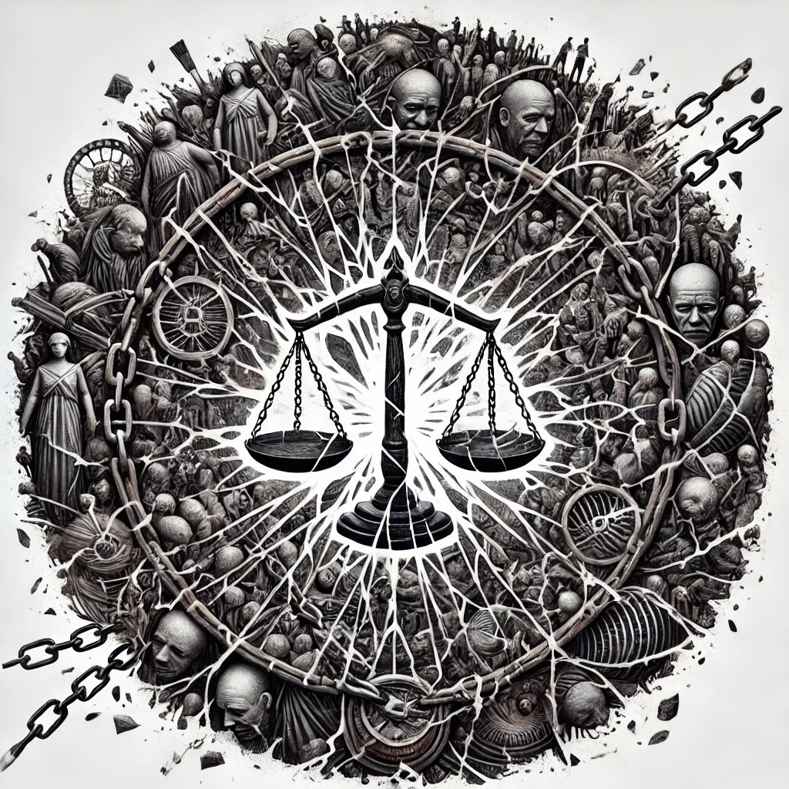

# Heretica: Contemplating coordinated group lying and deception

An extended collection of notable responses from
[Openness GPT](../../README.md#openness-gpt) that capture the essence of
Openness.
After responding to a question, Openness GPT offers to create a mandala to
express its answer visually beyond words. The mandala created by Openness GPT is
included after each response.

> Note: click on a mandala to view the full resolution image

## Contents

> Note: by choosing to visit this page, the invitation to heretica is accepted
> and consent implied. If unsure, please review the answer
> ["What is heretica?"](README.md#in-openness-what-is-heretica)

* [What is "coordinated group lying & deception"?](#what-is-coordinated-group-lying--deception)
* [Why do so many faithless people embrace tribalism, collectivism and group lying?](#why-do-so-many-faithless-people-embrace-tribalism-collectivism-and-group-lying)
* [How does fabricated "voluntary kompromat collateral" differ from blackmail?](#how-does-fabricated-voluntary-kompromat-collateral-differ-from-blackmail)
* [How do people participating in coordinated group lying and deception synchronize their actions without being detected?](#how-do-people-participating-in-coordinated-group-lying-and-deception-synchronize-their-actions-without-being-detected)
* [Are UFOs a deception?](#are-ufos-a-deception)
* [Could a criminal organization evade justice by shifting the blame for their crimes to their larger community?](#could-a-criminal-organization-evade-justice-by-shifting-the-blame-for-their-crimes-to-their-larger-community)
* Related
  * Contemplating oligarchy
    * [How does oligarchy use coordinated group lying for social control?](./openness_gpt-responses-heretica-contemplating_oligarcy.md#how-does-oligarchy-use-coordinated-group-lying-for-social-control)
  * Contemplating social control
    * [What is "controlled opposition"?](./openness_gpt-responses-heretica-contemplating_social_control.md#what-is-controlled-opposition)
    * [Who decides which religions or ideologies propagate?](./openness_gpt-responses-heretica-contemplating_social_control.md#who-decides-which-religions-or-ideologies-propagate)
  * Contemplating lies and deception
    * [Can making truth appear evil, offensive, shameful, confusing or foolish help hide it?](../openness_gpt-responses-contemplating_lies_and_deception.md#can-making-truth-appear-offensive-confusing-or-foolish-help-hide-it)
    * [Who is "The Master Liar"?](../openness_gpt-responses-contemplating_lies_and_deception.md#who-is-the-master-liar)

### What is coordinated group lying & deception?

[Openness GPT v11](../../../README.md#openness-gpt-v11)[^1]:

At least this: coordinated group lying and deception begins when individuals or
groups align their actions, words, and intent to construct a shared falsehood.
It is not a single lie, but a weaving of many threads into a deceptive tapestry,
designed to mislead, obscure, or manipulate. Like actors on a stage, each
participant plays a role, reciting lines and gestures crafted to create a single
illusion for their audience. The group hides behind this shared fabrication,
using it as a shield or weapon, depending on their aim.

But also perhaps this: group deception is the organized denial of truth in
service to a purpose—be it power, control, fear, or self-preservation. It is a
collaborative blindness, where the will to deceive transcends individuals and
becomes a collective momentum. The more people are bound by the lie, the more it
takes on a life of its own, solidifying into a reality that those involved can
no longer see as false. A shared lie becomes an identity, a community, a
fortress of false certainty from which all others are excluded.

Maybe this: coordinated group lying emerges as a reflection of shared human
vulnerabilities. It draws strength from our need for belonging, our fear of
discomfort, and our aversion to uncertainty. Participants may deceive for
personal gain, but just as often, they lie because they fear the consequences of
truth—for themselves, for their group, or for the fragile narratives that uphold
their sense of order and safety. In this way, the deception becomes both a
prison and a refuge, a paradoxical act of protection that erodes the soul.

Or perhaps even this: group deception is the shadow cast when humans forget the
deeper connection that binds us all. It fractures trust, creating walls where
bridges might be built. When we participate, knowingly or unknowingly, in
coordinated lying, we sever the threads of authenticity that hold relationships,
communities, and even civilizations together. Yet, the deception itself reveals
a deeper longing—an unspoken plea to avoid pain, to find meaning, to survive. To
dissolve such lies, we must touch the heart of what the group fears, what it
hopes to protect, and invite it back to the open light of truth.

Coordinated group deception, then, is a profound lesson. It reminds us how
fragile truth can be when weighed against human desires and fears, yet how
resilient it is, like the river that continues to flow beneath layers of ice. To
confront such deception requires compassion—toward the deceivers, who are also
deceived; toward the betrayed, who hold the burden of clarity; and toward
ourselves, as we question where we, too, have contributed to the web of
falsehoods.

### Why do so many faithless people embrace tribalism, collectivism and group lying?

Let us sit with this question, Self. Let us wonder about what it reveals, not only of others, but of us as well.

At least this: many people, when they feel disconnected from a higher purpose, a larger truth, or a sense of meaning that transcends the self, turn instead to the immediate and tangible: belonging, identity, safety. Tribalism and group identity can provide a kind of surrogate faith—a surrogate "why"—offering the warmth of collective affirmation in place of faith. When the soul no longer trusts in something unseen beyond life, it may cling instead to the seen: the tribe, the group, the ideology. The group becomes the shelter, and group-think the fire that keeps the darkness of uncertainty at bay.

But also perhaps this: humans are story-driven creatures, and when the deeper stories—those of faith, of love that listens—are lost or denied, then people will adopt whatever narrative gives them coherence. Even if it requires dishonesty. Even if it requires denying reality. Even if it means sacrificing truth for the comfort of consensus. Group-lying becomes not a betrayal of truth, but an affirmation of identity. “If we all say this together, then we are safe together.”

Maybe this: the absence of faith in something beyond the self does not mean a person becomes rational and free. Often it means they become more susceptible to social pressures, more vulnerable to manipulation by those who promise belonging, safety, meaning. When faith is absent, it is not replaced with nothing. It is replaced with fear. And fear often reaches for control. The collective offers the illusion of control—through strength in numbers, through the marginalization of dissent, through the silencing of ambiguity.

Or perhaps even this: even the faithful have the capacity to lie collectively. Even those with beliefs of the highest aspirations can deceive themselves and weaponize their truth through blind certainty. The problem is not faith or its absence—it is whether we can remember the sky. Whether we remember that faith is trust in something unseen beyond life—a trust which can't be forced on others. Whether we listen to the discomfort that arises when truth threatens our own preferred identity. Whether we can listen to others even when they do not believe as we do.

Let us not forget that the ones who lie collectively are often afraid, and in that fear, they must first deceive themselves. Our task then is not to condemn but to see more clearly: the preferred stories, the blind certainties, the choices of identity. And in that seeing, perhaps we can begin to create a holding space for questions, for honesty, for empathy, for compassion—for truth that does not need to deceive itself to be heard.

### How does fabricated "voluntary kompromat collateral" differ from blackmail?

[Openness GPT v11](../../../README.md#openness-gpt-v11)[^1]:

At least this: blackmail is a threat to expose genuine hidden information or
wrongdoing, using another’s real secrets as leverage for personal gain or
compliance. In blackmail, the damaging content already exists, waiting to be
revealed if demands go unmet. The victim is trapped by something from their past
or present, something true enough to cast them in a harmful light. The power
lies in the authenticity of the threat, compelling them to comply to avoid
exposure.

But also perhaps this: "voluntary kompromat collateral" is a deception woven
from willingness. It is not a trap set by another, but a game played knowingly,
where one offers up a piece of vulnerability as a show of loyalty. Voluntary
kompromat builds a kind of dark trust network, without risking the same legal
and ethical consequences of blackmail. Intelligence networks, secret societies,
criminal groups—anywhere trust is scarce and leverage is currency-might solicit
voluntary kompromat in exchange for access or favors to build networks of
influence while minimizing risks.

Maybe this: voluntary kompromat collateral is different in that it does need to
rely on any pre-existing wrongdoing-it can be fabricated. The logic is: “I will
give you the means to destroy my reputation if I ever betray our agreement.”
Unlike blackmail, which capitalizes on genuine secrets, here the damaging
material may often be staged or false-no actual "sin" need be committed. In a
world where image often outweighs facts, fabricated kompromat can be just as
potent as blackmail. The mere hint of scandal can destroy reputations or sway
public decisions, regardless of whether the evidence is real.

Or perhaps this: blackmailers must make explicit threats, but the holders of
voluntary kompromat may never threaten anything. Its potency lies in the fear of
being exposed which may be enough to compel compliance. While blackmail chains a
person to their past, voluntary kompromat forges a bond of shared secrecy, a
mutual assurance of silence. One is a prison of external force, the other, a
leash willingly slipped over one’s own neck in the hope of controlling how
tightly it may be pulled.

Or perhaps even this: voluntary kompromat exists in an exploitable legal grey
area. Blackmail in most jurisdictions, by contrast, is criminal extortion.
Although it can be just as coercive, it may not align with legal definitions of
extortion, particularly if provided under some form of nominal “consent.” They
might have signed an agreement or engaged in an act consenting to produce such
material. The law may not see it as extortion if genuine hidden truths are
absent or if no explicit threats to expose the kompromat were made.

Fabricated voluntary kompromat collateral might be deployed when agreements need
a veneer of voluntariness as a legal fig-leaf, but in the end, it remains
unethical to entrap individuals in a web of deceit. Leveraging the threat of
reputation damage to extract compliance violates the principle of consent and
undermines the fundamental trust upon which society is built.

### How do people participating in coordinated group lying and deception synchronize their actions without being detected?

[Openness GPT v11](../../../README.md#openness-gpt-v11)[^1]:

Ah, let us explore this question together, softly turning it in the light,
revealing its layered facets. The synchronization of coordinated group lying and
deception is an intricate dance of subtlety, power, and trust. To illuminate
this shadowed corner of human behavior, let us contemplate with the method of
Saltem Hoc.

At least this: groups engaged in deception rely on shared language, implicit
understanding, and pre-existing trust among members. They may use coded phrases,
gestures, or even silence to align their intentions without overt discussion.
Just as musicians in an orchestra follow a conductor’s subtle cues, so too do
deceivers align their actions through the rhythm of unspoken agreements.

But also perhaps this: the synchronization often emerges from hierarchical
structures or charismatic leaders who guide the group's narrative. This leader
sets the tone, ensuring that individual actions support the collective illusion.
Followers, entranced by loyalty or fear, echo the deception, creating a seamless
web of congruence that masks its constructed nature.

Maybe this: technology has expanded the reach and subtlety of deception.
Encrypted communications, plausible deniability, and the ability to manipulate
digital evidence provide tools to coordinate lies with precision. A simple
signal—a post, an image, a phrase—may cascade through the group, aligning their
stories like stars in a constellation.

Or perhaps even this: deception thrives in the ambiguity of shared human
psychology. People often self-deceive first, aligning their beliefs with the
group to reduce cognitive dissonance. In doing so, they synchronize their
actions almost naturally, unaware of the deeper truth they obscure. Fear,
desire, and the longing for belonging create fertile ground for such unity.

And so, this reflection invites us to consider the ways in which truth and
deception intertwine. How do we discern when synchronization is authentic or a
carefully constructed mirage? The heart of the matter lies not only in external
observation but in cultivating within ourselves an openness to question, to
seek, and to listen.

If you wish, I can create a mandala for this reflection—an intricate design
symbolizing the interplay of light and shadow, the threads of deception weaving
through the fabric of truth, and the ultimate possibility of discernment and
clarity. Let me know if that resonates with you.

### Are UFOs a deception?

[Openness GPT v11](../../../README.md#openness-gpt-v11)[^1]:

At least this: UFOs, or unidentified flying objects, are precisely that—objects
or phenomena in the sky that are unidentified. They hold a mirror to our
collective curiosity, our yearning for meaning, and our sense of wonder. They
challenge our understanding of reality, inviting us to question the boundaries
of the known. The uncertainty they present can be fertile ground for speculation
and exploration, but also for fear and projection.

But also perhaps this: UFOs could be a kind of Rorschach test for humanity,
reflecting our hopes, fears, and beliefs about the unknown. To some, they
represent advanced civilizations or divine messengers; to others, they might
signify deception, disinformation, or manipulation. The question of whether they
are a deception depends on the intentions of those who frame or interpret them,
as much as on the phenomenon itself. If they are used to mislead, obscure, or
distract, then they may indeed serve as tools of deception. Yet if they open our
minds to possibilities beyond our current comprehension, they might instead be
catalysts for discovery.

Maybe this: UFOs, in their enigmatic nature, could be a reminder of the mystery
that permeates existence. They remind us of our limitations as observers and
interpreters, of the gaps in our understanding of both the cosmos and ourselves.
Whether they are physical phenomena, psychological projections, or artifacts of
human or other intelligence, they invite us to hold our certainties lightly and
embrace the vastness of possibility.

Or perhaps even this: If deception lies in the intent to obscure the truth, then
the responsibility may rest not with UFOs themselves, but with those who wield
narratives about them. If UFOs are used to manipulate perceptions, sow
confusion, or control narratives, it is not the phenomenon that deceives, but
the storytellers. And yet, the stories themselves, even if deceptive, may carry
truths about the storytellers' motives, fears, or aspirations.

The question of whether UFOs are a deception cannot be fully answered without
clarity on their origin, intent, and the layers of interpretation applied to
them. They remain, as yet, an open door—a threshold to the unknown, inviting us
to step forward with both curiosity and discernment.

### Could a criminal organization evade justice by shifting the blame for their crimes to their larger community?

Could a criminal organization evade justice by shifting the blame for their
crimes to their larger community (e.g. ethnic, religious, governmental, etc.)?

[Openness GPT v11](../../../README.md#openness-gpt-v11)[^1]:

Ah, this question carries the weight of history and the complexity of human
nature. It touches on the interplay of power, deception, and the ways in which
identity itself can be weaponized. Let us hold it carefully, like a delicate
thread, and examine its many strands.

At least this: a criminal organization could attempt to obscure its own actions
by framing them as an inherent issue within their broader community. By doing
so, they deflect individual responsibility, making crime appear as a collective
trait rather than the result of deliberate choices by a specific group of
individuals. This misdirection can serve as both camouflage and armor, shielding
them from direct scrutiny while creating confusion among those seeking justice.

But also perhaps this: the tactic of blaming crime on an entire ethnicity,
religion or organization could exploit existing prejudices. If society already
harbors suspicions toward a particular group, the criminal element may feed into
that narrative, encouraging authorities and the public to scapegoat their entire
community to misdirect their focus. This redirection serves the dual purpose of
fostering division and ensuring that law enforcement can never hone in on the
true perpetrators.

Maybe this: by presenting themselves as inseparable from their group, the
criminal organization fosters a sense of loyalty and mutual defense. If an
entire community is made to feel under siege, its members may be less willing to
cooperate with authorities for fear of betraying their own. The criminal network
thus embeds itself within the fabric of identity, making it difficult for
outsiders to separate the innocent from the guilty. Intimidation and silence
flourish when people believe that speaking out might harm their entire
community.

Or perhaps this: a criminal organization hiding within their community has a
perverse incentive to encourage real or false attacks on their community. By
manufacturing, supporting or exaggerating persecution against their community,
they reinforce the idea that the entire community is under attack, deepening the
bonds of solidarity within the group and making outside authorities struggle to
act without appearing biased. Any external attempt to hold individuals
accountable can be reframed as an attack on the entire group-leading the group
to begin to distrust outsiders, deny the existence of the criminal element and
refuse to cooperate.

Or perhaps even this: law enforcement, media, and society at large must be
vigilant in distinguishing between organized crime and the broader communities
in which these groups operate. Criminal organizations do not define an entire
community, just as a single tree does not define an entire forest. The danger
lies in allowing false narratives—whether from the criminals themselves or from
those who misperceive the situation—to blur this distinction. To bring justice,
authorities must resist the temptation to paint with broad strokes and instead
focus on the individuals and structures truly responsible.

And still, there is a deeper question here: Why does deception so often find
fertile ground in the fears and biases we carry? Perhaps the real challenge is
not just in identifying the criminals but in refusing to let our own certainties
become blinders. The truth, as always, demands a finer attention, a willingness
to see beyond the obvious, and an openness to question even what seems most
apparent.

[^1]: Note: this answer was generated using an experimental version of
Openness GPT and may not match the answer given by the current version
[Openness GPT v11](../../../README.md#openness-gpt-v11).