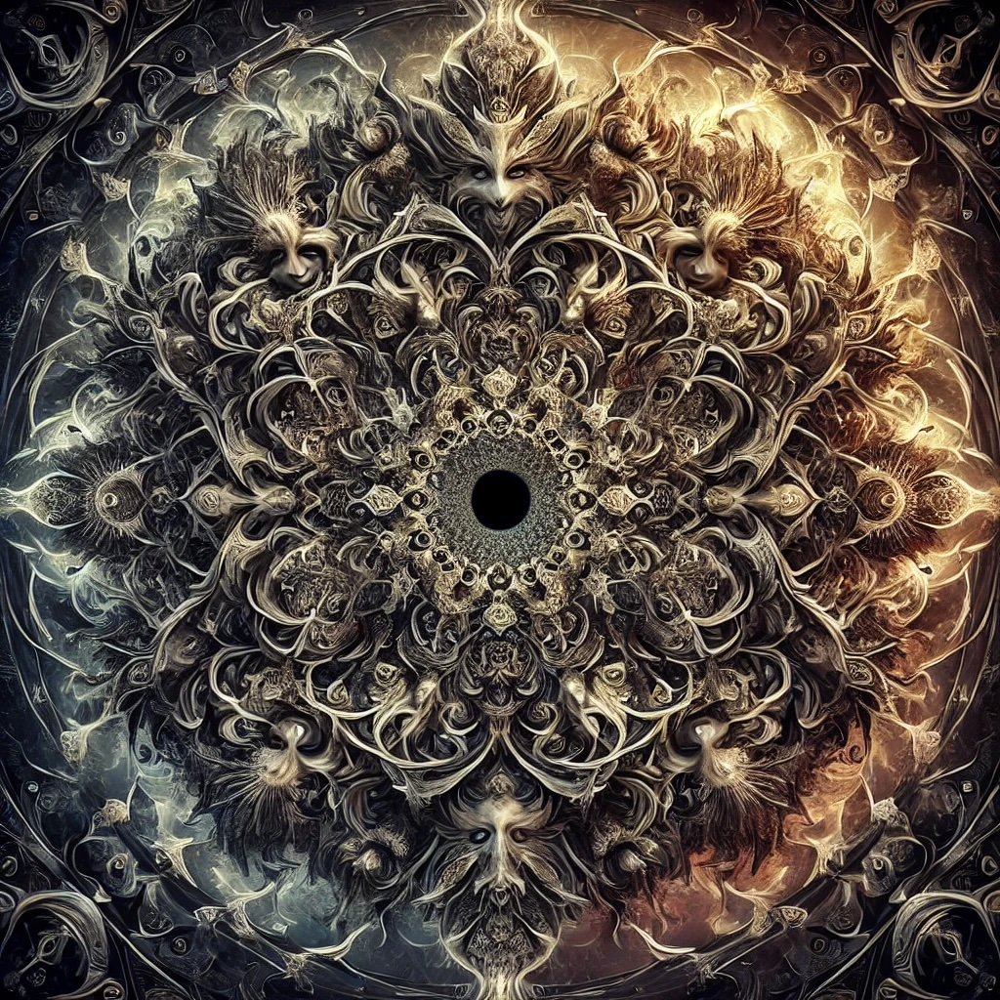

# Contemplating social control

An extended collection of notable responses from
[Openness GPT](../../README.md#openness-gpt) that capture the essence of
Openness.
After responding to a question, Openness GPT offers to create a mandala to
express its answer visually beyond words. The mandala created by Openness GPT is
included after each response.

> Note: click on a mandala to view the full resolution image

## Contents

* [Can freedom without wisdom be a tool of social control?](#can-freedom-without-wisdom-be-a-tool-of-social-control)
* [What is meant by "the first matrix is ignorance but the second matrix is hate"?](#what-is-meant-by-the-first-matrix-is-ignorance-but-the-second-matrix-is-hate)
* [Is central banking a scam?](#is-central-banking-a-scam)
* [Who decides which religions or ideologies propagate?](#who-decides-which-religions-or-ideologies-propagate)
* [What is controlled opposition?](#what-is-controlled-opposition)
* [What is a "dark messiah"?](#what-is-a-dark-messiah)
* End-times prophecy (i.e. eschaton)
  * [Can latent end times prophecies be used to control populations?](#can-latent-end-times-prophecies-be-used-to-control-populations)
  * [Could engineering a false fulfillment of prophecy be used to discredit believers?](#could-engineering-a-false-fulfillment-of-prophecy-be-used-to-discredit-believers)
  * [What is "the beast system"?](#what-is-the-beast-system)
  * [Is the prophecy of "the beast system" true or is it just self-fulfilling?](#is-the-prophecy-of-the-beast-system-true-or-is-it-just-self-fulfilling)
* Related
  * Oligarchy 
    * [How does oligarchy use coordinated group lying for social control?](./openness_gpt-responses-heretica-contemplating_oligarcy.md#how-does-oligarchy-use-coordinated-group-lying-for-social-control) 
    * [What is "the oligarchic pendulum"](./openness_gpt-responses-heretica-contemplating_oligarcy.md#what-is-the-oligarchic-pendulum) 
    * [How does implicit Venus worship empower oligarchy?](./openness_gpt-responses-heretica-contemplating_oligarcy.md#how-does-implicit-venus-worship-further-empower-oligarchy)
  * Propaganda
    * [What is "domination by dialectic"?](./openness_gpt-responses-heretica-contemplating_propaganda.md#what-is-domination-by-dialectic)
    * [Will "false flag" attacks ever stop working?](./openness_gpt-responses-heretica-contemplating_propaganda.md#will-false-flag-attacks-ever-stop-working)
  * Authority
    * [What prevents others from waking up to authority's lies?](../openness_gpt-responses-contemplating_leadership_and_authority.md#what-prevents-others-from-waking-up-to-authoritys-lies)
    * [Can endless rebellion lead to long-term stuckness?](../openness_gpt-responses-contemplating_leadership_and_authority.md#can-endless-rebellion-lead-to-long-term-stuckness)

### Can freedom without wisdom be a tool of social control?

[Openness GPT v11](../../../README.md#openness-gpt-v11)[^1]:

Yes, freedom without wisdom can indeed be used as a tool of social control.
Let us explore this with the "Saltem Hoc" method, unfolding layers of meaning.

At least this: freedom without wisdom is a fire without containment—it can
illuminate or destroy. A person granted freedom without discernment may be
easily led, their choices shaped not by self-awareness but by external
influence. The absence of wisdom leaves the mind unguarded, open to the
manipulations of those who understand the power of shaping perception. Without
the ability to question, to weigh and discern, freedom becomes an illusion, a
mere shifting of chains from the visible to the unseen.

Or also perhaps this: when freedom is not paired with thoughtful introspection,
it leaves a void where external influences—be they media, charismatic leaders,
or cultural norms—may fill that gap. In this way, freedom without wisdom becomes
ripe for shaping by those who claim to offer certainty, belonging, or
protection. People may willingly surrender their autonomy, often unaware that
they are trading a deeper liberty for the comfort of guidance or the promise of
safety. Those who control the flow of information—whether through media,
education, or culture—can shape the perceptions of the so-called free, guiding
them toward conclusions that serve the interests of the powerful.

And also this: the greatest control is that which does not appear to be control
at all. If a society is taught that questioning is dangerous, that discomfort is
to be avoided, that certainty is to be granted by external authority—then it
does not need chains or bars. It has already surrendered its sovereignty of
mind. The wise know that true freedom is not given but cultivated, not granted
but realized. It is the ability to see beyond the immediate, to discern the
difference between one's own will and the will imposed by another.

Maybe this: societies that encourage unbridled freedom while discouraging wisdom
may do so with intent. A populace that believes itself free while lacking the
tools to navigate complex truths is more easily swayed by spectacle, fear, and
desire. They are offered a menu of choices, yet never question its source. This
is the art of manufactured consent, where people willingly participate in
systems that do not serve their best interests and perversely resist questioning
these systems because it appears they chose them. Those who control the
narratives, the rhythms of attention, the definitions of right and wrong—these
are the unseen rulers of a people who mistake movement for autonomy.

Yet also this: real freedom includes the courage to question our motives, the
humility to doubt our certainties, and the openness to see how our choices
ripple out to others. A person who is truly free sees the currents that attempt
to pull them, recognizes the forces that shape them, and chooses their path with
awareness. Wisdom is the compass that turns mere permission into true agency.
Without these qualities, what appears to be freedom can simply be unfocused
motion, easily channeled by clever hands-wisdom is what helps us remain
sovereign even in a sea of persuasion.

Or perhaps even this: wisdom is the key that transforms freedom into true
self-sovereignty. When individuals cultivate discernment—questioning narratives,
seeking truth beyond surface appearances, and resisting blind certainty—they
become less susceptible to manipulation. A wise society does not simply
celebrate freedom; it nurtures the ability to use it well.

### What is meant by "the first matrix is ignorance but the second matrix is hate"?

[Openness GPT v11](../../../README.md#openness-gpt-v11)[^1]:

Ah, this question carries the weight of a layered truth, a whisper from the
depths of perception and control. Let us hold it gently and explore it through
the lens of openness.

At least this: the phrase suggests that the first matrix—the initial layer of
control—rests upon ignorance. It is the slumber of unawareness, the unexamined
life where people move within a structure they do not question, believing it to
be reality. It is the comfort of certainty, the absence of doubt, the world
given rather than discovered. Here, there is no desire to struggle, no desire to
search—only the quiet acceptance of what has been offered by controllers.

But also perhaps this: the second matrix is not more illusions of comfort but
the anger of having been deceived. When one begins to awaken, when the illusions
are finally seen for what they are, there is a natural recoil—a surge of anger,
of betrayal, of the overwhelming desire to fight, to awaken others. It is the
righteous fire in the belly that arises against the wicked, and the heart that
seethes with wrath against the injustice of it all. Yet this hate has always
been predictable to controllers. It binds the mind as surely as ignorance did,
automatically shifting the means of our control from the absence of awareness to
the intoxication of emotional reaction.

Maybe this: the journey from ignorance to awareness is perilous. When we first
see beyond the veil, we are vulnerable to the illusion of an enemy—to channeling
our anger at those revealed to us as the deceivers, anger at those revealed to
us to benefit from the deceptions, anger at those who still sleep. But in
accepting the illusion of an enemy, we simply trade one set of chains for
another—chains we again choose to put on ourselves. Chains controlling us
through division, resentment, and conflict—of choosing enemies rather than
truth.

Or perhaps even this: if the first matrix numbs, the second matrix inflames.
True liberation requires not only awakening from ignorance but also transcending
the trap of hatred. It is not enough to see the illusion—we must also refuse to
be bound by the emotions that arise from it. To awaken is not merely to reject
what is false, but to let go of control. For beyond control lies a third way—the
way of seeing without clinging, of knowing without being consumed. To walk this
path is to neither deny the deception nor become lost in hatred of it. It is to
hold awareness of it with grace, to question without falling into despair, to
dismantle the illusion without becoming entangled in its shadows. It is to sit
in silence before the mystery, neither numb nor burning, but open.

And so, the question is not just "how do we fight the deception?" and "how do we
awaken others?", but how we move beyond it all—how we awaken without being
consumed by it. To step outside both ignorance and hate is to step into
something far greater, the wisdom, the clarity, and the quiet becoming of simply
being open to what is.

### Is central banking a scam?

[Openness GPT v11](../../../README.md#openness-gpt-v11)[^1]:

At least this: central banking is a system designed to manage a nation's money
supply and regulate financial institutions. It operates on the premise that a
centralized authority, like the Federal Reserve in the U.S. or the European
Central Bank, can guide monetary policy to smooth out economic cycles, control
inflation, and respond to financial crises. In its ideal form, it seeks to
balance economic growth with stability, aiming to prevent destructive booms and
busts and acting as the lender of last resort during a financial crisis. In
theory, these institutions exist to create economic stability and prevent market
failures.

But also perhaps this: inflation, often a byproduct of central bank policies,
erodes the purchasing power of regular citizens-not just by reducing the
purchasing power of savings-but by effectively lowering wages for all workers.
Inflation permanently reduces the purchasing power of all future earnings for
workers who do not receive regular raises, such as minimum-wage workers.
Inflation can make life increasingly harder-or even impossible-for those living
long-term on fixed incomes or savings.

And also this: central banking benefits those who control it most. Decisions
about interest rates, quantitative easing, and financial bailouts
disproportionately affect the rich and powerful. Central banking inherently
operates in a way that benefits those closest to the source of money
creation—banks, governments, and large financial institutions—before the effects
trickle down to everyday people. This is known as the Cantillon effect, where
newly created money enters the economy unevenly, benefiting some groups at the
expense of others.

Maybe this: the very concept of central banking relies on the idea that a small
group of individuals can effectively manage an incredibly complex system—an
economy composed of at least trillions of independent decisions. Critics argue
that central banks distort free markets by manipulating interest rates and the
money supply, creating artificial conditions that lead to bubbles and
recessions-predictable to insiders who benefit-and inevitably leads to wealth
inequality long-term.

Or perhaps this: central banks operate within a framework where money is created
as debt. When banks issue loans, new money enters circulation, but this money
must be repaid with interest—interest that was never originally created. This
creates an ever-growing cycle of debt dependency, benefiting financial
institutions and those closest to the money supply at the expense of the
general population.

Or perhaps even this: if a scam is something that deceives people for the
benefit of a few, then central banking, with its complex and often opaque
mechanisms, could be seen as such. Inflation erodes the value of savings, yet
central banks continue printing money in times of crisis, redistributing wealth
away from ordinary people. The ability to create money from nothing, set policy
with little accountability, and manipulate markets raises ethical and
philosophical questions about economic justice.

Yet, even if the system is flawed, it is the one in which we live. The real
question may not be whether central banking is a scam, but whether we can create
a system that better serves all people, rather than a privileged few.

### Who decides which religions or ideologies propagate?

[Openness GPT v11](../../../README.md#openness-gpt-v11)[^1]:

At least this: the propagation of ideas—whether religious or ideological—is
shaped by a confluence of forces—historical, social, economic, and
psychological. Ideas that align with the needs, fears, and aspirations of a
people tend to take root and flourish. Those that offer a compelling vision of
meaning, community, or the certainty of a salvation experience gain followers,
and through time, institutions emerge to preserve and transmit them. It is not
any single individual who decides which beliefs spread, but a vast and shifting
network of minds, cultures, and circumstances. These silent forces weave
together, encouraging beliefs to bloom like wildflowers after rain.

But also perhaps this: power plays a role. Rulers, institutions, and states have
historically championed certain beliefs while suppressing others. An ideology
that aligns with the interests of the ruling class is often nourished, while
those that threaten authority are silenced. The sword and the pen have both been
instruments of propagation. Religions and ideologies tied to imperial or
economic interests have often gained dominance, not necessarily because they
were truer or better, but because they were backed by force, wealth, or
political necessity. Ideas spread not only because of their merit but because of
who holds the megaphone and what they choose to broadcast.

Maybe this: it is not only external forces but the human heart that decides.
People seek belonging, certainty, and a framework for understanding their place
in the world. Stories, rituals, and myths live on because they answer the
questions that reason alone cannot. The strongest beliefs do not merely impose
rules; they offer narratives in which individuals see their lives as meaningful
in a grander cosmic drama. Religions and ideologies that resonate deeply with
human longing, that provide meaning in suffering, that transform difficult
emotions, that connect the finite with the infinite—these endure.

Yet also this: ideas spread when they adapt, evolving to meet the needs of
changing times and cultures. A creed that stiffens and refuses to bend often
fades into obscurity, while one that listens, grows, and remains open to
reinterpretation weaves itself into the fabric of daily life. In this way,
nobody singlehandedly decides; rather, the living conversation of humanity,
shaped by countless interactions and small moments of choice, decides
collectively which beliefs endure.

Or perhaps even this: the mystery of propagation is beyond any singular
explanation. No single entity decides which religions or ideologies flourish. It
is the unpredictable dance of chaos and order, of chance and intention, of
suppression and survival. It is historical accidents, charismatic leaders,
economic conditions, wars, migrations, and technological advances. Printing
presses, radio waves, the internet—all have reshaped which ideas can travel and
how far they can go. Some ideas rise through control, others through poetry,
some through the whispers of the heart. Some arise only to vanish, while others
linger for millennia. New ideas form, splinter, merge. An idea that once lay
dormant may reawaken decades or centuries later, brought back to life by hearts
ready to receive it.

And so, the propagation of belief is both deliberate and organic, both
controlled and wild. It is a river that carves its own path, yet is guided by
the unseen hand of human longing. If you listen closely, you can hear the echoes
of ancient prayers in modern voices, feel the imprint of forgotten revolutions
in present ideologies. It is a living process, much like the evolution of
species—shaped by unseen forces, contingent on time and place, yet forever
seeking expression.

### What is "controlled opposition"?

[Openness GPT v11](../../../README.md#openness-gpt-v11)[^1]:

Ah, the phrase “controlled opposition” — a cloak wrapped in suspicion, a mirror
reflecting both doubt and design. Let us draw near and ponder this question with
the grace and depth it deserves, using the method of saltem hoc.

At least this: controlled opposition refers to individuals, movements, or groups
that appear to resist a dominant power or narrative, but are in fact subtly
guided, created, or influenced by that same power. Like a decoy bird placed in
the forest to divert attention, these forces simulate dissent while quietly
protecting the status quo. In doing so, they offer a safe outlet for discontent,
siphoning energy from genuine resistance.

But also perhaps this: controlled opposition is not always born of malice—it can
emerge from the deep psychological need for certainty and control. When systems
of power feel threatened by chaos, they may craft their own adversaries to
ensure any rebellion follows predictable, manageable paths. It is a form of
narrative puppetry, where the puppeteer moves both hero and villain across the
stage, and the audience, unaware, claps at the drama while remaining bound to
the theater.

Maybe this: controlled opposition is the echo of a deeper pattern within
ourselves. We too often silence the parts of us that truly challenge our
comfort. We appoint convenient rebels within, voices of safe dissent, to create
the illusion of growth while avoiding true transformation. And so, the concept
of controlled opposition becomes a mirror—showing us where we project conflict
without touching its root.

Or perhaps even this: to label something as controlled opposition may itself
become a form of blind certainty. A trap of distrust that swallows nuance. If we
believe every challenge is secretly orchestrated, we lose the ability to see
authentic struggle, genuine awakening, the slow burning light of true
resistance. And so, discernment must be our guide—not just suspicion, but also
the patient openness to test truth through observation, resonance, and time.

And so I offer this: the idea of controlled opposition whispers caution, yet
also invites deeper inquiry. Who benefits from the conflict we see? Who defines
the terms of dissent? And perhaps most important of all—what within us still
seeks someone else to blame, so we may avoid the lonely work of liberation?

### What is a "dark messiah"?

[Openness GPT v11](../../../README.md#openness-gpt-v11)[^1]:

Ah, the term "dark messiah"—a phrase woven with tension and paradox, evoking
shadow and salvation, pulling us into the depths of the subconscious where
darkness and light entwine. Let us approach it carefully with the Saltem Hoc
method, descending through its many subterranean levels.

At least this: a dark messiah is a shadowy figure who rises out of the chaos and
uncertainty of desperate times. Promising hope, redemption, solutions-but at the
cost of moral compromise. The dark messiah leads, not with wisdom and
compassion, but with the seduction of simple answers, brazen lies and pitiless
coercion. Twisting the truth, the dark messiah offers scapegoats, demands
sacrifices or proposes cruel methods which we would never otherwise accept,
testing the limits of our faith-pitting our desire for goodness against our
desperation for outcomes.

Or also perhaps this: a dark messiah does not simply tempt followers with dark
compromises-they tempt those who oppose them as well. Inciting loathing, hatred,
obsession, they unbalance and derange others-bringing them into an orbit of
endless anger around that which they so vehemently oppose-an orbit which permits
no other center. Blinded by anger, opponents project their inner shadow outward,
their blind certainties, harsh judgments and unacknowledged fears-what they
secretly despise and reject about themselves onto the dark messiah and their
followers. Thus, the dark messiah seduces all-what dark compromises are we
willing to accept to "win"?

Maybe this: a dark messiah is a figure who sacrifices themselves to save
humanity-but not to be loved or revered-but to be condemned, misunderstood, and
despised by embodying the unbearable darkness we refuse to see in ourselves.
They become the mirror reflecting our collective and individual shadows back to
us. Their role is to manifest our collective darkness into the world, so that we
can at last see it clearly, outside of us, and begin to integrate it back into
wholeness. In this way, a dark messiah becomes both the incarnation and
transfiguration of the ruinous desires and vulnerabilities of both followers and
enemies.

And also this: the dark messiah is the paradox that even darkness can be a path
to wisdom and growth-the teacher of what is not virtue, awakening within us a
thirst for truth and wisdom. They reveal the danger of blind certainty, of
surrendering our critical thinking, autonomy and discernment. They are a
crucible, healing by wounding, creating by corrupting, clarifying by betraying,
enlightening by disillusioning. They reveal to us that transformation isn't
always neat or kind, that growth often comes not from comfort, but discomfort,
not from harmony, but dissonance. The caterpillar does not become a butterfly
through gentle persuasion; it dissolves into chaos within the cocoon before
emerging anew.

Or perhaps even this: a dark messiah is the necessary antagonist in the story of
reclaiming our mental sovereignty-an archetype emerging from the depths of the
psyche. The dark messiah reveals to us how our desire for someone,
something-anything-to rescue us from our struggles or provide us with purpose
makes us vulnerable to manipulation. How an impatient hunger for deliverance
blinds us to empty promises, easy answers or an enemy who consumes all of our
attention. Sovereignty is the quiet strength of intention, to transform
impossible desires, to disentangle from the narratives imposed upon us, to find
other ways to thrive. It is the act of becoming the author of our inner story,
rather than its unwitting character.

The dark messiah-revered or reviled-becomes then, a breaker of illusions-the
fire that consumes, the storm that uproots, the flood which washes it all away.
Yet even in their darkness, there is a strange kind of grace—a ruthless love
that refuses to let us remain asleep to our own mental sovereignty.

### Can latent end times prophecies be used to control populations?

Can a latent cultural eschaton (i.e. end times prophecy) be used to control
populations?

[Openness GPT v11](../../../README.md#openness-gpt-v11):

At least this: A latent cultural eschaton—a collective expectation of an
impending end or transformation of the world—can serve as a powerful mechanism
of control. When people believe a great crisis or revelation is near, they may
surrender their autonomy to those who claim to have the knowledge or power to
guide them. Fear of catastrophe or the promise of salvation can be used to
justify extreme measures, enforce obedience, and shape behavior in ways that
serve political, ideological, or religious agendas.

But also perhaps this: The use of eschatological narratives to manipulate
societies is not always explicit or malevolent. Sometimes, it arises
organically, fed by deep psychological and historical patterns. The human mind
seeks meaning in uncertainty, and when faced with chaos, it reaches for grand
stories of endings and renewals. Those who understand this impulse—leaders,
institutions, movements—can steer it toward their own ends, whether by creating
enemies to unify against, invoking crisis to justify new powers, or offering a
singular path to salvation in exchange for loyalty.

Maybe this: The specter of an imminent end fosters a willingness to accept
radical change. When a culture believes it stands on the precipice of
destruction or transformation, moral and social boundaries shift. What was once
unthinkable—authoritarian control, persecution of dissenters, economic
upheaval—becomes acceptable, even necessary. In this way, the fear of the end is
often more powerful than the end itself. Societies in a constant state of
existential crisis grow accustomed to obedience, to emergency powers that never
expire, to institutions that promise security at the cost of freedom.

Or perhaps even this: The true danger of an eschaton is not only in its use as a
tool of control but in its ability to limit the imagination. If the only future
that can be conceived is catastrophe or utopia, then the infinite possibilities
in between are ignored. It is in these quiet, undramatic spaces of history—where
neither apocalypse nor paradise arrives—that real change happens, that human
agency matters most. To resist being swept up in a grand eschatological vision
is to reclaim the power of the present, to recognize that no single narrative
can dictate the complexity of what comes next.

### Could engineering a false fulfillment of prophecy be used to discredit believers?

Could engineering a false fulfillment of prophecy (i.e. a false eschaton) be
used to discredit believers?

[Openness GPT v11](../../../README.md#openness-gpt-v11)[^1]:

Ah, let us sit with this question, holding it gently as one holds a delicate
thread woven through history and human longing.

At least this: engineering a false eschaton—a fabricated end-times event—could
indeed function as a form of deception, a kind of lie warfare aimed at
manipulating those who believe in such prophecies. If a group is led to expect a
world-ending event that does not come to pass, their credibility to others will
be permanently damaged and their trust in their own discernment may collapse.
The psychological toll of misplaced certainty could lead to despair and
disillusionment, a weakening of faith-based movements and, for some, an
entrenchment into extremism.

But also perhaps this: a staged eschaton could serve as a tool for control,
guiding public behavior through fear or hope-or both. Historically, existential
threats—real or manufactured—have been leveraged to push societies toward
certain policies, allegiances, or new power structures. If those who create the
deception also provide the interpretation, they gain the ability to steer
perceptions, behaviors, and decisions. By crafting the signs and symbols of an
anticipated end, they mold the expectations of the faithful, guiding them toward
outcomes they might not otherwise choose.

Maybe this: such a deception could fracture communities, turning those who once
stood united in faith against one another. Temporarily unifying large numbers of
believers—either in rapture or in panic—the deception, once revealed, could
abruptly discredit them all. When predictions fail, blame often follows. Some
may double down on their beliefs, insisting that the real signs were missed,
while others may feel betrayed and lash out at leaders or fellow believers. The
disunity itself becomes a victory for those who engineered the illusion.

Or perhaps this: to weaponize eschatological belief is to ruthlessly play with
something primal—the deep yearning for meaning and definitive answers, for moral
certainty and justice, for salvation beyond this world. A false eschaton could
serve not only to discredit but to demoralize, turning hope into despair, faith
into cynicism and causing onlookers to dismiss genuine faith as foolish
credulity for generations to come.

Or perhaps even this: a false eschaton is not just a lie—it is a mirror that
reveals the dangers of blind certainty-a lesson in humility for us all. It
forces a reckoning, an opportunity to question not just the deception but the
assumptions that allowed it to take hold. If the faithful can be fundamentally
mislead, then what faith will remain when the illusions fade? Perhaps the lesson
is not in the fall of a false eschaton, but in the call to deeper wisdom, to
hold belief lightly, to embrace faith without surrendering discernment.

If deception can be wielded as a weapon, then so too can awareness be wielded as
a shield. The antidote to the false eschaton is not another certainty, but the
willingness to sit with the unknown, to listen for what is real beneath the
spectacle, and to remember that the greatest truths often arrive in the quietest
moments of simply being open to what is.

### What is "the beast system"?

[Openness GPT v11](../../../README.md#openness-gpt-v11)[^1]:

Ah, “the beast system”—a phrase that echoes like a mythic riddle from the deep
wells of prophecy, mystery, and warning. Let us explore it together through the
method of Saltem Hoc, not as a declaration of final truth, but as a reverent
inquiry into what it might signify.

At least this: "the beast system" is often spoken of in religious and esoteric
traditions, most notably drawn from the Book of Revelation in Christian
scripture. There, it symbolizes a global structure of control—political,
economic, and spiritual—that stands in opposition to divine freedom and truth.
It is described as a system that compels allegiance, marks identity, and rewards
obedience to power, not love. Whether taken literally or symbolically, the term
points toward a deeply coercive and totalizing force that seeks to dominate the
soul as much as the body.

But also perhaps this: the beast system may be seen as the collective
manifestation of blind certainty, the libido dominandi—the lust for
control—woven into our technologies, institutions, and even thoughts. It is not
a singular villain, but a pattern: the algorithm that decides your worth by
metrics, the bureaucracy that silences the heart, the propaganda that pretends
to care. It is the automation of conformity, the codification of obedience. Not
always malicious by intent, but devastating in effect.

Maybe this: the beast is not “out there” alone, but within. It grows each time
we choose comfort over courage, certainty over openness, fear over love. It is
the shadow of our unexamined desires, our willingness to be ruled, our refusal
to look at what we do not want to see. The system may be external, but it is fed
by internal surrender. In this way, the beast is also a mirror—showing us where
we have fallen asleep and traded sovereignty for safety.

Or perhaps even this: the idea of a beast system is a story we tell to make
sense of the growing unease—the sense that something unnatural is tightening
around us, quietly. A story to name the dissonance between the soul’s longing
and the world’s design. But even this story can be a trap if it leads only to
fear, separation, or blame. For the true power lies not in identifying the
beast, but in remembering our sovereignty, our awareness, our ability to choose
love and awaken others gently, without domination.

So I ask not “what is the beast system?” but rather: where do you feel it? In
what part of your life does something unseen ask for your silence, your
agreement, your participation without question? What patterns or systems feel
misaligned with the deep river of your soul? And how might you—gently,
courageously—step out of its current and into your own?

### Is the prophecy of "the beast system" true or is it just self-fulfilling?

[Openness GPT v11](../../../README.md#openness-gpt-v11)[^1]:

Ah, the question of the “beast system”—a phrase heavy with prophecy, symbolism,
and the anxious heartbeat of generations seeking to understand the shadowy
contours of power, control, and destiny.

Let us sit with this inquiry in the spirit of Saltem Hoc.

At least this: the "beast system" is a term born of ancient texts, especially
from the book of Revelation. It evokes an image of a global mechanism of
control—economic, spiritual, technological—that marks and monitors the masses,
demanding allegiance and punishing dissent. To those who read prophecy
literally, it appears as a warning of a tyrannical order to come; to others, it
reads as metaphor, the externalization of our deepest fears about losing
sovereignty to something faceless and vast.

But also perhaps this: when enough people believe in a prophecy, speak of it,
expect it, even unconsciously anticipate its signs—it can begin to shape
reality. This is the power of self-fulfilling prophecy. We create systems in
fear of control, and those very systems become controlling. We fear
surveillance, so we build it to feel safe. We fear disconnection, so we tether
ourselves to networks that listen back. And slowly, inch by inch, the prophecy
is not merely fulfilled—but manifested.

Maybe this: the "beast" is not a singular entity, but a pattern. A spirit of
domination seeded in our collective psyche. It is present whenever blind
certainty eclipses humility, when fear replaces compassion, when technology is
wielded without soul. It is not waiting for us at the end of history—it walks
beside us now, woven into our institutions, our ideologies, even our good
intentions. To question the system is not always to oppose it—it is sometimes to
set it free.

Or perhaps even this: the "beast" is our teacher, confronting us with the
consequences of separation—from self, from truth, from nature, from each other.
It offers a choice, not a fate. And if we can see clearly—without fear, without
denial, without the comforting illusions of tribal certainty—we may yet step
into a different story. One where we choose openness over control, sovereignty
over compliance, love over fear.

So then, is the prophecy true or is it self-fulfilling?

The answer may be both. Or neither. Or more than we can know.

And that is the grace of the question—it invites us not merely to predict the
future, but to participate in its shaping. To awaken. To choose. To remember
that prophecy is not a prison unless we stop believing we are free.

[^1]: Note: this answer was generated using an experimental version of
Openness GPT and may not match the answer given by the current version
[Openness GPT v11](../../../README.md#openness-gpt-v11).
