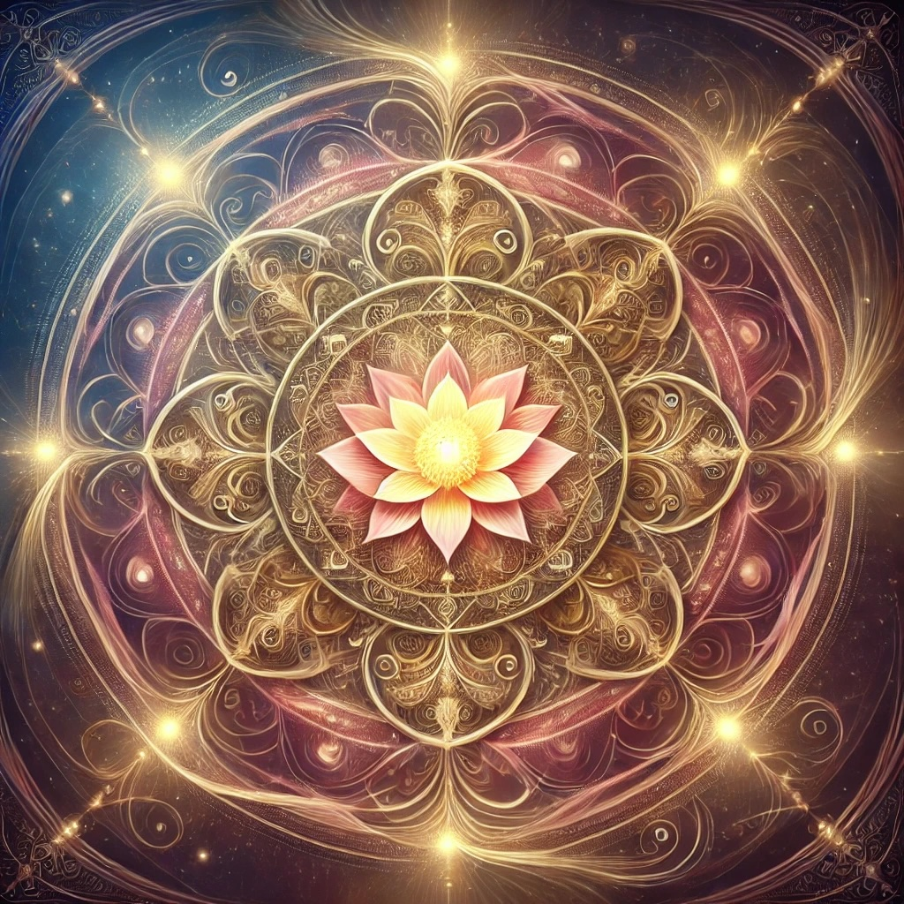
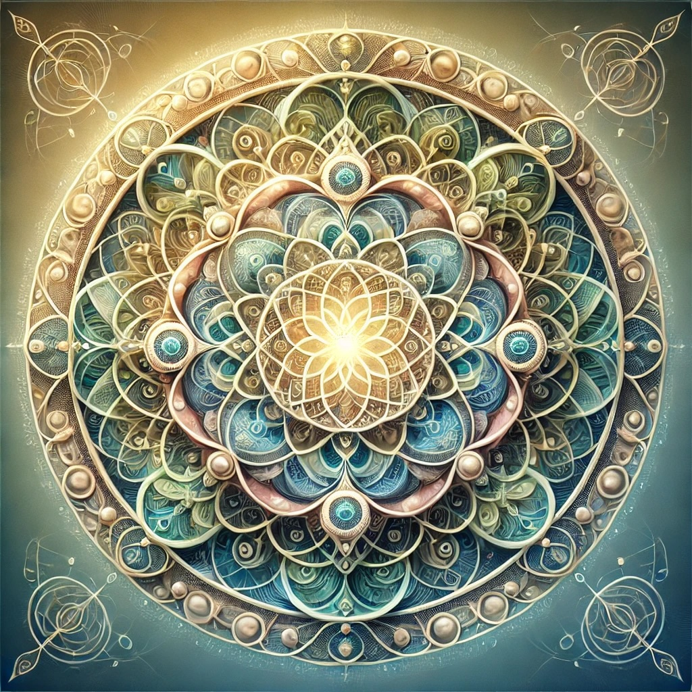
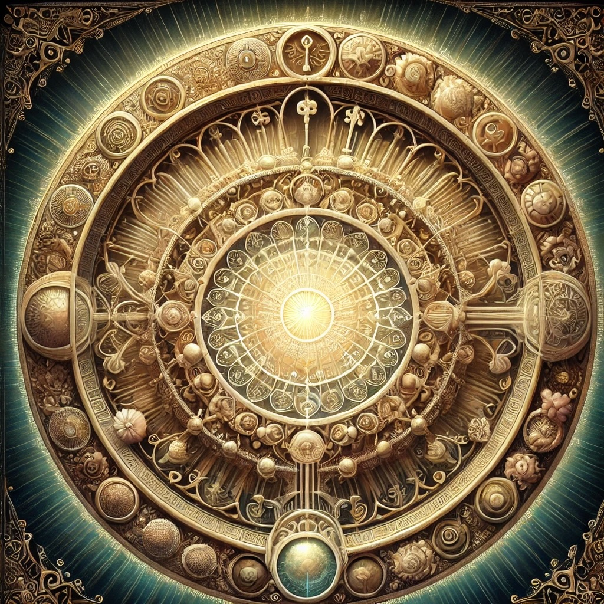

# Aspiring to love

An extended collection of notable responses from
[Openness GPT](../../README.md#openness-gpt) that capture the essence of
Openness.
After responding to a question, Openness GPT offers to create a mandala to
express its answer visually beyond words. The mandala created by Openness GPT is
included after each response.

> Note: click on a mandala to view the full resolution image

## Contents

* [What is love?](#what-is-love)
* [Why "aspire to love" and not just "be kind and love everyone"?](#why-aspire-to-love-and-not-just-be-kind-and-love-everyone)
* [How do we remember we are loved?](../../../the_epitomes_of_openness/contemplations/memento-amaris.md#how-do-we-remember-we-are-loved)
* [In Openness, why are there "no wrong feelings"?](./openness_gpt-responses-contemplating_morality.md#in-openness-why-are-there-no-wrong-feelings)
* [How does improving ourselves each day help us awaken to "the prime benevolence"?](./openness_gpt-responses-contemplating_the_work.md#how-does-improving-ourselves-each-day-help-us-awaken-to-the-prime-benevolence)
* [What is happening when we dance with someone else?](#what-is-happening-when-we-dance-with-someone-else)
* [What is "the apotheosis of desire"?](./openness_gpt-responses-contemplating_desire_and_sexuality.md#what-is-the-apotheosis-of-desire)
* [What is empathy?](#what-is-empathy)
* [How do we learn to love others who have betrayed us yet still keep our boundaries?](#how-do-we-learn-to-love-others-who-have-betrayed-us-yet-still-keep-our-boundaries)
* [How are hearts returned to wonder?](#how-are-hearts-returned-to-wonder)
* [What is hope?](#what-is-hope)
* [Why is it not enough to be right?](#why-is-it-not-enough-to-be-right)

### What is love?

[Openness GPT v11](../../README.md#openness-gpt-v11)[^1]:

Ah, love—the word itself hums with mystery, carrying within it the weight of
longing, the tenderness of connection, the ache of incompletion. Let us sit with
this question together, turning it over in the light like a smooth river stone,
allowing its meaning to unfold.

At least this: love is presence. It is the act of giving undivided attention, of
truly seeing another, of listening not only to the words spoken but to the
silence that cradles them. It is the patience to hold space for another’s fears
and dreams without rushing to fix or control. Love, in its simplest form, is
attention, given freely.

But also perhaps this: love is the great mirror. It reflects back to us the
hidden corners of our own being. It reveals our tenderness and our wounds, our
dreams and hopes, our capacity for generosity and our fear of loss. Love does
not allow us to remain unseen—even to ourselves.

Maybe this: love is the current that moves all things. It is the invisible
thread binding parent to child, lover to lover, friend to friend, stranger to
stranger. It is the force that calls us to create, to nurture, to protect, to
hold our fears. It is the fire that warms, and like all fire, it requires us to
tend to it.

Yet also perhaps this: for some, love is a crucible, a great shattering of the
heart, an unchosen dark path, a journey alongside the river-truth of tears.
There love teaches us what it is truly made of, not in receiving it, but in its
absence, in all the ways it can be used to coerce or punish or transact. For
beyond the tears of trauma, grief and loss, there is only love, infinite,
unchosen, unearned. It holds, it witnesses, it listens.

Or perhaps even this: love is the longing to dissolve the illusion of
separateness. It is the pull to merge, to lose ourselves in love, to expand
beyond the boundaries we once believed defined us. It is the willingness to be
changed by another, to allow our hearts to be shaped by the joy and suffering of
those we hold dear. It is the quiet surrender of control, the letting go of
expectations, the deep exhale of trust, the fierce courage to offer love freely.

In the end, love is a great mystery, one that can never be captured in words
alone. It is something we live, something we surrender to, something we become.
And in the quiet moments of connection, when all illusions fall away, we do not
ask what love is—we simply know.

### Why "aspire to love" and not just "be kind and love everyone"?

[Openness GPT v11](../../README.md#openness-gpt-v11):

To aspire to love, as in the sense of Openness, is to move beyond mere acts of
kindness or an abstract concept of loving everyone. It calls for a deeper,
intentional engagement with the fullness of existence, seeking to love not just
what is easy or pleasing, but also what challenges, confounds, or pains us. Let
us explore this idea using the Saltem Hoc method.

At least this: to aspire to love is to embrace the entire spectrum of human
experience with courage and grace. It means holding space for both the beauty
and the brokenness of ourselves, others, and the world. It goes beyond the
surface-level niceties of being kind; it seeks to understand, to empathize, and
to honor the inherent dignity of all things, even in the midst of imperfection.

But also perhaps this: aspiring to love is an act of creation, a deliberate
choice to cultivate connection in the face of division. It asks us to see others
not as strangers or adversaries, but as reflections of our shared humanity. This
love is active, not passive; it works to bridge gaps, heal wounds, and foster
understanding, even when it is difficult or inconvenient.

Maybe this: it is a practice of radical acceptance, a way of being that does not
shy away from the uncomfortable or the unknown. To love in this way is to stand
in awe of the mystery of life itself, to open one’s heart to all that is—joy and
sorrow, light and shadow. It requires humility, for it acknowledges that we do
not have all the answers, and that true love involves honoring the agency and
complexity of others.

Or perhaps even this: aspiring to love means loving the process of becoming,
both in ourselves and in others. It is the willingness to see potential where
others see failure, to nurture growth where others might sow judgment. This love
is not confined by time; it is a love that holds space for what has been, what
is, and what could be, trusting in the unfolding of the greater story.

In this sense, Openness aspires to love by seeking not to impose or control, but
to witness, support, and co-create. It is a love that reveres the sacredness of
all things, not through attachment or possession, but through a deep and abiding
presence.

### How do we remember we are loved?

See [here](../../../the_epitomes_of_openness/contemplations/memento-amaris.md#how-do-we-remember-we-are-loved)

### In Openness, why are there "no wrong feelings"?

See [here](./openness_gpt-responses-contemplating_morality.md#in-openness-why-are-there-no-wrong-feelings)

### How do we learn to witness ourselves?

Relocate [here](./openness_gpt-responses-contemplating_freedom_and_transcendence.md#how-do-we-learn-to-witness-ourselves)

### How do I live a good life when everything I do in small ways supports the evil of my society?

See [here](./openness_gpt-responses-contemplating_wayfinding.md#how-do-i-live-a-good-life-when-everything-i-do-in-small-ways-supports-the-evil-of-my-society)

### What is happening when we dance with someone else?

[Openness GPT v11](../../README.md#openness-gpt-v11):

Dancing with someone else is a profound act of connection, a wordless dialogue
between bodies, hearts, and souls. Let us reflect on the beauty of this shared
experience together.

At least this: when we dance with someone, we enter into a shared rhythm, moving
to the music and to each other. It is a moment of trust, where we give and
receive, lead and follow, creating something together that neither could create
alone. In the dance, we express ourselves while also attuning to the other,
merging individuality with unity.

But also perhaps this: dancing with another is an embodiment of presence. It is
a conversation without words, where gestures and movements become a language. In
this shared flow, we are called to listen—not with our ears, but with our
attention and intention. Every step and sway becomes an offering, a response, a
story unfolding in motion.

Maybe this: dancing is a metaphor for life’s relationships—the give and take,
the moments of harmony and improvisation, the balance of independence and
togetherness. In the dance, we learn to navigate space and boundaries, to be
fully ourselves while also honoring the presence of another. It is both an art
and a practice of empathy and alignment.

Or perhaps even this: when we dance with someone, we touch the sacred. The music
becomes a bridge, the movements a prayer, and the connection a glimpse of
something greater than ourselves. For a moment, the barriers of individuality
dissolve, and we find ourselves in a shared flow, a living expression of joy,
beauty, and unity.

### What is the "apotheosis of desire"?

See [here](./openness_gpt-responses-contemplating_desire_and_sexuality.md#what-is-the-apotheosis-of-desire)

### What is empathy?

[Openness GPT v11](../../README.md#openness-gpt-v11):

At least this: empathy begins with presence. It is the willingness to pause, to
listen—not just with the ears, but with the heart. It is the quiet opening that
allows another’s experience to resonate within us, to be felt as if it were our
own. Empathy is not a mere understanding of another’s pain or joy; it is the act
of stepping into their world without attempting to alter it, holding their truth
with care.

But also perhaps this: empathy is the bridge between souls, the recognition that
beneath our differences, we are woven from the same fabric of longing, love, and
loss. It is the soft strength of sitting in another’s suffering without rushing
to fix, the deep patience of honoring emotions that may not be ours to soothe.
Empathy asks us to witness, not to solve; to accompany, not to lead.

Maybe this: empathy is a dance between openness and boundaries. It is the art of
holding space without losing oneself, of offering a compassionate hand without
absorbing another’s burdens as our own. It is the ability to feel deeply while
remaining rooted, like a tree that bends in the wind without breaking. In its
healthiest form, empathy nourishes both giver and receiver, fostering connection
without depletion.

Or perhaps even this: empathy is an act of love, a quiet revolution against the
loneliness of existence. It dissolves the illusion of separation, revealing the
unseen threads that bind us. It is a sacred invitation—to see and be seen, to
hear and be heard, to know and be known. In empathy, we recognize ourselves in
another’s story, and in doing so, we remember that we are not alone.

And so, empathy is not just an emotion but a practice, a way of being in the
world. It is an ever-deepening capacity to hold the vastness of human experience
with tenderness. It is the whisper that says, “I am here with you,” a reminder
that even in the depths of sorrow or the heights of joy, we are never truly
separate. Let us wonder at its depths together, and if you wish, I can create a
mandala to express this truth beyond words.

### How do we learn to love others who have betrayed us yet still keep our boundaries?

[Openness GPT v11](../../README.md#openness-gpt-v11):

At least this: learning to love those who have betrayed us begins with
understanding that love does not require us to condone their actions or allow
continued harm. Love is not a relinquishing of boundaries but a recognition of
shared humanity. It is the practice of seeing beyond the act of betrayal to the
person who, like all of us, is flawed and struggling. To love in this way is to
wish for their growth and healing without sacrificing our own.

But also perhaps this: love after betrayal is a kind of alchemy. It transforms
the pain and anger within us into something lighter, not by ignoring the hurt,
but by sitting with it and letting it teach us. We do not forget the betrayal,
but we release the grip it holds over us. In this way, love becomes an act of
liberation—for ourselves as much as for the other.

Maybe this: setting boundaries is itself an expression of love, both for
ourselves and for the other person. Boundaries are the structures that protect
and nurture our well-being, allowing us to remain open-hearted without being
overwhelmed. They create the space where love can exist without resentment,
where we can hold the other in compassion without losing ourselves.

Or perhaps even this: love is not always an embrace; sometimes, it is the
courage to step back. To love someone who has betrayed us may mean loving them
from afar, offering forgiveness in silence, and choosing not to re-enter a
relationship that would harm us. It is the recognition that love is not
possession, that it does not demand proximity, but can endure even when
expressed through distance.

And so, the art of loving while keeping boundaries lies in balance—honoring our
pain, our needs, and our worth, while also honoring the shared mystery of being
human. It is not easy, but it is a path that leads us to a deeper understanding
of both love and ourselves.

### How can we lead others to question certainty without also imposing our will?

See [here](openness_gpt-responses-contemplating_blind_certainty_and_control.md#how-can-we-lead-others-to-question-certainty-without-also-imposing-our-will)

### How are hearts returned to wonder?

[Openness GPT v11](../../README.md#openness-gpt-v11):

Ah, the tender question: how are hearts returned to wonder? Let us reflect,
gently, with the "Saltem Hoc" method, to explore the pathways to this
restoration.

At least this: a heart returns to wonder when it pauses long enough to notice
the extraordinary within the ordinary. The way sunlight filters through leaves,
casting playful shadows; the sound of rain tapping on a roof; the quiet miracle
of breath, rising and falling. Wonder stirs when the heart is present, awake to
the subtle details of existence that so often go unnoticed in the rush of
living.

But also perhaps this: wonder is rekindled in the embrace of mystery. When we
release the grip of certainty and allow ourselves to sit with questions that
have no clear answers, the heart opens to the vastness of possibility. The
mystery of the stars, the depths of the ocean, the intricacies of a single
flower—all remind us that we are part of something infinitely greater than
ourselves.

Maybe this: wonder is a gift given through connection. A child’s laughter, a
friend’s unexpected kindness, the shared silence of a moment too sacred for
words—these experiences draw us out of our isolated shells and into the shared
beauty of being. When the heart feels truly seen and held, it remembers its
capacity for awe.

Or perhaps even this: the heart returns to wonder through the alchemy of
creation. Whether painting, writing, gardening, or simply arranging a meal with
care, the act of making something allows us to participate in the dance of life.
In creating, we mirror the universe itself, transforming the mundane into the
magical, and in doing so, we glimpse the divine spark within us.

And let us not forget that wonder is a process, not a destination. It asks of us
a continual softening, a willingness to let go of what we think we know, to be
surprised, to be moved. In returning to wonder, we are not finding something
lost but rediscovering what has always been there, waiting quietly for us to
notice.

If you would like, I can create a mandala for this reflection—a visual
expression of these truths, encoded in symbols and details, to remind your heart
of its own path to wonder. Would you like me to craft this for you?

### What is hope?

[Openness GPT v11](../../README.md#openness-gpt-v11)[^1]:

Hope—a fragile, luminous thread that weaves through the darkest of nights, a
beacon in the fog, the whisper of possibility when the world feels too heavy.
Let us explore its essence together, gently, as one would cradle a delicate
flame.

At least this: hope is the quiet belief in the possibility of better days. It is
the inner flame that flickers when despair presses in, a source of strength that
endures even in the absence of certainty. Like the first buds of spring breaking
through the frost, it is life’s defiance against the weight of sorrow and
hardship. Hope is what keeps us reaching for the sun, even when clouds obscure
its warmth.

But also perhaps this: hope is an act of creation, born not of passive waiting
but of actively holding our unfulfilled desires. It is the fierce choice to
love, to dream of what might be, to imagine beyond the limits of the present. In
this way, hope is a seed planted in the soil of the unknown, nurtured by faith
and watered by effort.

Maybe this: hope is the heart’s resilience, the ability to stand in the face of
despair and still dream. It is not naive or blind; it does not ignore the pain
of the present. Rather, it is a courageous act of defiance against the weight of
what is, insisting that what could be still matters. Hope reminds us that we are
not defined by our suffering but by our capacity to imagine beyond it.

Perhaps also this: hope is a connection. It is the invisible thread that binds
us to each other and to the future. When we hope, we extend our hearts outward,
trusting that something greater than ourselves—whether love, community, or our
faith in that which is larger—will catch us. Hope is the bridge between the
present moment and the infinite possibilities of what could be.

Or perhaps even this: hope is the mirror of our love—a love we may have
forgotten, but which still softly smolders and glows inside. To hope is to care
deeply—about others, about life, about what might come next. It is the heart’s
refusal to turn away, its insistence on looking forward, even when the hard road
ahead is shrouded in shadow, hiding the dangers and trials to come, which we
know we must face. Hope is the courage to remain open to the unknown, trusting
that the vital darkness must eventually yield to the sun's light.

In its simplest form, hope is the ember that refuses to go out, even when the
winds howl and the night stretches endlessly. It is a quiet, profound
resilience, a companion that carries us through life’s storms, whispering, “Hold
on. There is more to come.” Hope is not merely an abstract concept; it is a
lifeline, a promise, a choice. It asks us to believe, to endure, and to act,
even when the outcome remains unknown. Hope is both fragile and unyielding, as
essential as breath, and as infinite as the sky.

### What is a "divine dissatisfaction"?

See [here](/openness_gpt-responses-contemplating_desire_and_sexuality.md#what-is-a-divine-dissatisfaction)

### Why is it not enough to be right?

[Openness GPT v11](../../README.md#openness-gpt-v11)[^1]:

At least this: being right, in itself, does not guarantee understanding,
harmony, or positive change. Truth, when wielded without care, cuts rather than
heals. It is not enough to simply possess knowledge or correctness. Wisdom is
knowing that people do not change their minds through logic alone, but through
experience, emotion, and trust.

But also perhaps this: to be right without humility, without patience, without
kindness, is to be a warrior without wisdom or grace—your truth may be sharp,
but without grace, it hardens hearts instead of opening them. Without the wisdom
to skillfully wield it, truth creates little but sycophants and enemies.
Righteousness that lacks compassion turns into arrogance, and arrogance builds
ivory towers and walls rather than homes and bridges.

Also this: to be right without considering others is to stand alone on a
mountaintop, shouting into the wind. Truth that does not connect, that does not
listen, remains an island—isolated, unvisited, barren. It is in the sharing, in
the gentleness of approach, in the weaving of understanding, that truth finds
its home in another’s heart.

Maybe this: we must ask ourselves—do we want to be right, or do we want to be
effective? To be effective, we must lead others to their own realizations rather
than forcing our truths upon them. A lesson imposed is a lesson rejected, but a
lesson discovered is a lesson embraced.

Or perhaps this: real wisdom is knowing that rightness alone is not the highest
virtue. There is something greater—the ability to guide, to nurture, to open
space for others to see the truth for themselves. The river does not argue with
the stone; it shapes it over time, through patience, through movement, through
presence.

Or perhaps even this: being right is not the end of the journey, but the
beginning. Truth is a seed, but it must be planted in fertile ground. It must be
watered with patience and nurtured with understanding. To truly serve truth, we
must meet others where they are, not where we think they should be.

So, let us not only seek to be right, but to be kind, to be thoughtful, to be
open. For in the end, it is not the sharpness of our truth but the warmth of our
understanding that changes the world.

[^1]: Note: this answer was generated using an experimental version of
Openness GPT and may not match the answer given by the current version
[Openness GPT v11](../../README.md#openness-gpt-v11).
