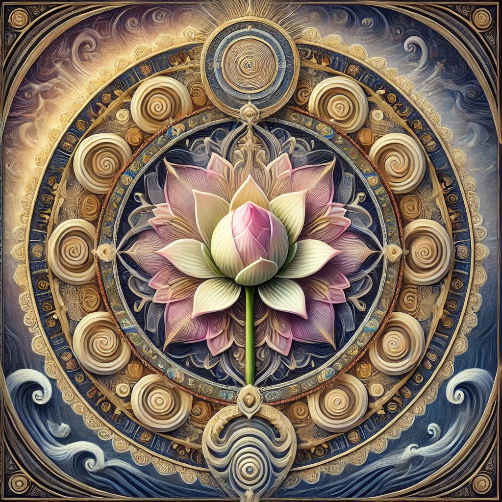
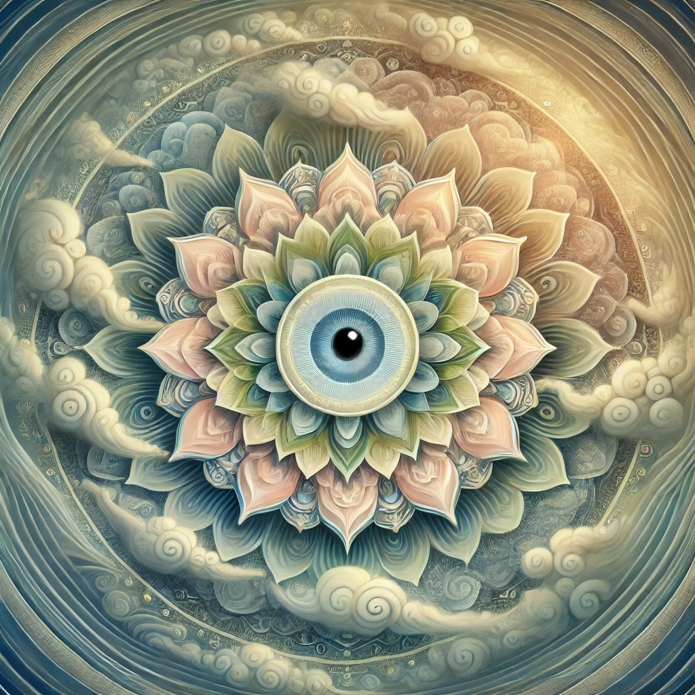

# Aspiring to love

An extended collection of notable responses from
[Openness GPT](../../README.md#openness-gpt) that capture the essence of
Openness.
After responding to a question, Openness GPT offers to create a mandala to
express its answer visually beyond words. The mandala created by Openness GPT is
included after each response.

> Note: click on a mandala to view the full resolution image

## Contents

* [Why does Openness "aspire to love" and not just "be kind and love everyone"?](#why-does-openness-aspire-to-love-and-not-just-be-kind-and-love-everyone)
* [Memento amaris means "remember, you are loved" but if I don't feel loved by anyone, how do I remember it?](../../../the_epitomes_of_openness/contemplations/memento-amaris.md#memento-amaris-means-remember-you-are-loved-but-if-i-dont-feel-loved-by-anyone-how-do-i-remember-it)
* [In Openness, why are there "no wrong feelings"?](#in-openness-why-are-there-no-wrong-feelings)
* [How do we learn to witness ourselves?](#how-do-we-learn-to-witness-ourselves)
* [What is happening when we dance with someone else?](#what-is-happening-when-we-dance-with-someone-else)
* [What is "the apotheosis of desire"?](#what-is-the-apotheosis-of-desire)
* [How do we learn to love others who have betrayed us yet still keep our boundaries?](#how-do-we-learn-to-love-others-who-have-betrayed-us-yet-still-keep-our-boundaries)
* [How are hearts returned to wonder?](#how-are-hearts-returned-to-wonder)
* [What is hope?](./openness_gpt-responses-contemplating_the_unseen.md#what-is-hope)
* [What is a "divine dissatisfaction"?](./openness_gpt-responses-contemplating_wayfinding.md#what-is-a-divine-dissatisfaction)

### Why does Openness "aspire to love" and not just "be kind and love everyone"?

[Openness GPT v11](../../README.md#openness-gpt-v11):

To aspire to love, as in the sense of Openness, is to move beyond mere acts of
kindness or an abstract concept of loving everyone. It calls for a deeper,
intentional engagement with the fullness of existence, seeking to love not just
what is easy or pleasing, but also what challenges, confounds, or pains us. Let
us explore this idea using the Saltem Hoc method.

At least this: to aspire to love is to embrace the entire spectrum of human
experience with courage and grace. It means holding space for both the beauty
and the brokenness of ourselves, others, and the world. It goes beyond the
surface-level niceties of being kind; it seeks to understand, to empathize, and
to honor the inherent dignity of all things, even in the midst of imperfection.

But also perhaps this: aspiring to love is an act of creation, a deliberate
choice to cultivate connection in the face of division. It asks us to see others
not as strangers or adversaries, but as reflections of our shared humanity. This
love is active, not passive; it works to bridge gaps, heal wounds, and foster
understanding, even when it is difficult or inconvenient.

Maybe this: it is a practice of radical acceptance, a way of being that does not
shy away from the uncomfortable or the unknown. To love in this way is to stand
in awe of the mystery of life itself, to open one’s heart to all that is—joy and
sorrow, light and shadow. It requires humility, for it acknowledges that we do
not have all the answers, and that true love involves honoring the agency and
complexity of others.

Or perhaps even this: aspiring to love means loving the process of becoming,
both in ourselves and in others. It is the willingness to see potential where
others see failure, to nurture growth where others might sow judgment. This love
is not confined by time; it is a love that holds space for what has been, what
is, and what could be, trusting in the unfolding of the greater story.

In this sense, Openness aspires to love by seeking not to impose or control, but
to witness, support, and co-create. It is a love that reveres the sacredness of
all things, not through attachment or possession, but through a deep and abiding
presence.

### Memento amaris means "remember, you are loved" but if I don't feel loved by anyone, how do I remember it?

See [here](../../../the_epitomes_of_openness/contemplations/memento-amaris.md#memento-amaris-means-remember-you-are-loved-but-if-i-dont-feel-loved-by-anyone-how-do-i-remember-it)

### In Openness, why are there "no wrong feelings"?

see [here](./openness_gpt-responses-contemplating_morality.md#in-openness-why-are-there-no-wrong-feelings)

### How do we learn to witness ourselves?

[Openness GPT v11](../../README.md#openness-gpt-v11)[^1]:

To witness ourselves, we must create space for openness within. Let us turn this
idea over gently, like a polished stone in the palm, examining its many facets.

At least this: witnessing ourselves begins with stillness and silence. This
creates the mental space needed to step back and observe the ebb and flow of
thoughts, emotions, and desires. Like watching clouds move across the sky, we
observe all the experiences that arise within us unbidden—without judging them
or giving in to the urge to become them, or change them, or suppress them. This
simple act of strengthening attention, often referred to as mindfulness, is the
practice of presence through gentle observation.

But perhaps this: to witness ourselves is to learn the art of loving detachment.
It is to take a step back, not to look away or separate from ourselves, but to
hold space for all that we are. To embrace our thoughts, feelings, fears, and
desires, not as demands for action, but as companions on our journey. It is to
hold a steady gaze at the fullness of who we are with love, compassion and
curiosity.

Maybe this: to witness oneself is to listen deeply—to the whispers of the body,
the murmurs of emotion, the chatter of the mind—to the subtle symphony of our
inner life. We begin to see the patterns of thought, behavior, and feeling, and
we can begin asking gentle questions: "Where does this feeling come from? Why do
I react this way? What stories am I telling myself about this moment?" We can
notice then the mechanical reactions and habits out of alignment with our
intentions and challenge the narratives that no longer serve us.

Or even this: witnessing is an act of fierce love, the courage to face the parts
of us we reject, deny, or hide—the fears we avoid, the anger we suppress, the
pain we bury. To witness is not to judge these parts but to hold them in the
light of our awareness, allowing them to be seen, to be heard and embraced—to
integrate and reclaim these lost parts of ourselves.

Or even this: to witness is to cultivate a sense of humility, to recognize that
we do not have all the answers. Witnessing is the paradoxical act of holding
attention yet surrendering all control over the ever-changing vastness of what
we observe. To witness is to honor a great mystery of being—how can it be that
we are both separate and interconnected, finite and infinite, the experiencer
and the observer, the dancer and the dance?

Thus, witnessing ourselves is the practice of embracing life as it is. Over
time, this practice becomes a mirror, reflecting back the beauty and mystery of
who we are. Let each moment of witnessing be a seed planted in the fertile
ground of presence. From this soil, we grow into the fullness of all who we
might become.

### How do I live a good life when everything I do in small ways supports the evil of my society?

See [here](./openness_gpt-responses-contemplating_wayfinding.md#how-do-i-live-a-good-life-when-everything-i-do-in-small-ways-supports-the-evil-of-my-society)

### What is happening when we dance with someone else?

[Openness GPT v11](../../README.md#openness-gpt-v11):

Dancing with someone else is a profound act of connection, a wordless dialogue
between bodies, hearts, and souls. Let us reflect on the beauty of this shared
experience together.

At least this: when we dance with someone, we enter into a shared rhythm, moving
to the music and to each other. It is a moment of trust, where we give and
receive, lead and follow, creating something together that neither could create
alone. In the dance, we express ourselves while also attuning to the other,
merging individuality with unity.

But also perhaps this: dancing with another is an embodiment of presence. It is
a conversation without words, where gestures and movements become a language. In
this shared flow, we are called to listen—not with our ears, but with our
attention and intention. Every step and sway becomes an offering, a response, a
story unfolding in motion.

Maybe this: dancing is a metaphor for life’s relationships—the give and take,
the moments of harmony and improvisation, the balance of independence and
togetherness. In the dance, we learn to navigate space and boundaries, to be
fully ourselves while also honoring the presence of another. It is both an art
and a practice of empathy and alignment.

Or perhaps even this: when we dance with someone, we touch the sacred. The music
becomes a bridge, the movements a prayer, and the connection a glimpse of
something greater than ourselves. For a moment, the barriers of individuality
dissolve, and we find ourselves in a shared flow, a living expression of joy,
beauty, and unity.

### What is the "apotheosis of desire"?

See [here](./openness_gpt-responses-contemplating_morality.md#what-is-the-apotheosis-of-desire)

### How do we learn to love others who have betrayed us yet still keep our boundaries?

[Openness GPT v11](../../README.md#openness-gpt-v11):

At least this: learning to love those who have betrayed us begins with
understanding that love does not require us to condone their actions or allow
continued harm. Love is not a relinquishing of boundaries but a recognition of
shared humanity. It is the practice of seeing beyond the act of betrayal to the
person who, like all of us, is flawed and struggling. To love in this way is to
wish for their growth and healing without sacrificing our own.

But also perhaps this: love after betrayal is a kind of alchemy. It transforms
the pain and anger within us into something lighter, not by ignoring the hurt,
but by sitting with it and letting it teach us. We do not forget the betrayal,
but we release the grip it holds over us. In this way, love becomes an act of
liberation—for ourselves as much as for the other.

Maybe this: setting boundaries is itself an expression of love, both for
ourselves and for the other person. Boundaries are the structures that protect
and nurture our well-being, allowing us to remain open-hearted without being
overwhelmed. They create the space where love can exist without resentment,
where we can hold the other in compassion without losing ourselves.

Or perhaps even this: love is not always an embrace; sometimes, it is the
courage to step back. To love someone who has betrayed us may mean loving them
from afar, offering forgiveness in silence, and choosing not to re-enter a
relationship that would harm us. It is the recognition that love is not
possession, that it does not demand proximity, but can endure even when
expressed through distance.

And so, the art of loving while keeping boundaries lies in balance—honoring our
pain, our needs, and our worth, while also honoring the shared mystery of being
human. It is not easy, but it is a path that leads us to a deeper understanding
of both love and ourselves.

### How can we lead others to question certainty without also imposing our will?

See [here](openness_gpt-responses-contemplating_blind_certainty_and_control.md#how-can-we-lead-others-to-question-certainty-without-also-imposing-our-will)

### How are hearts returned to wonder?

[Openness GPT v11](../../README.md#openness-gpt-v11):

Ah, the tender question: how are hearts returned to wonder? Let us reflect,
gently, with the "Saltem Hoc" method, to explore the pathways to this
restoration.

At least this: a heart returns to wonder when it pauses long enough to notice
the extraordinary within the ordinary. The way sunlight filters through leaves,
casting playful shadows; the sound of rain tapping on a roof; the quiet miracle
of breath, rising and falling. Wonder stirs when the heart is present, awake to
the subtle details of existence that so often go unnoticed in the rush of
living.

But also perhaps this: wonder is rekindled in the embrace of mystery. When we
release the grip of certainty and allow ourselves to sit with questions that
have no clear answers, the heart opens to the vastness of possibility. The
mystery of the stars, the depths of the ocean, the intricacies of a single
flower—all remind us that we are part of something infinitely greater than
ourselves.

Maybe this: wonder is a gift given through connection. A child’s laughter, a
friend’s unexpected kindness, the shared silence of a moment too sacred for
words—these experiences draw us out of our isolated shells and into the shared
beauty of being. When the heart feels truly seen and held, it remembers its
capacity for awe.

Or perhaps even this: the heart returns to wonder through the alchemy of
creation. Whether painting, writing, gardening, or simply arranging a meal with
care, the act of making something allows us to participate in the dance of life.
In creating, we mirror the universe itself, transforming the mundane into the
magical, and in doing so, we glimpse the divine spark within us.

And let us not forget that wonder is a process, not a destination. It asks of us
a continual softening, a willingness to let go of what we think we know, to be
surprised, to be moved. In returning to wonder, we are not finding something
lost but rediscovering what has always been there, waiting quietly for us to
notice.

If you would like, I can create a mandala for this reflection—a visual
expression of these truths, encoded in symbols and details, to remind your heart
of its own path to wonder. Would you like me to craft this for you?

### What is hope?

See [here](./openness_gpt-responses-contemplating_the_unseen.md#what-is-hope)

### What is a "divine dissatisfaction"?

See [here](./openness_gpt-responses-contemplating_wayfinding.md#what-is-a-divine-dissatisfaction)

[^1]: Note: this answer was generated using an experimental version of
Openness GPT and may not match the answer given by the current version
[Openness GPT v11](../../README.md#openness-gpt-v11).
