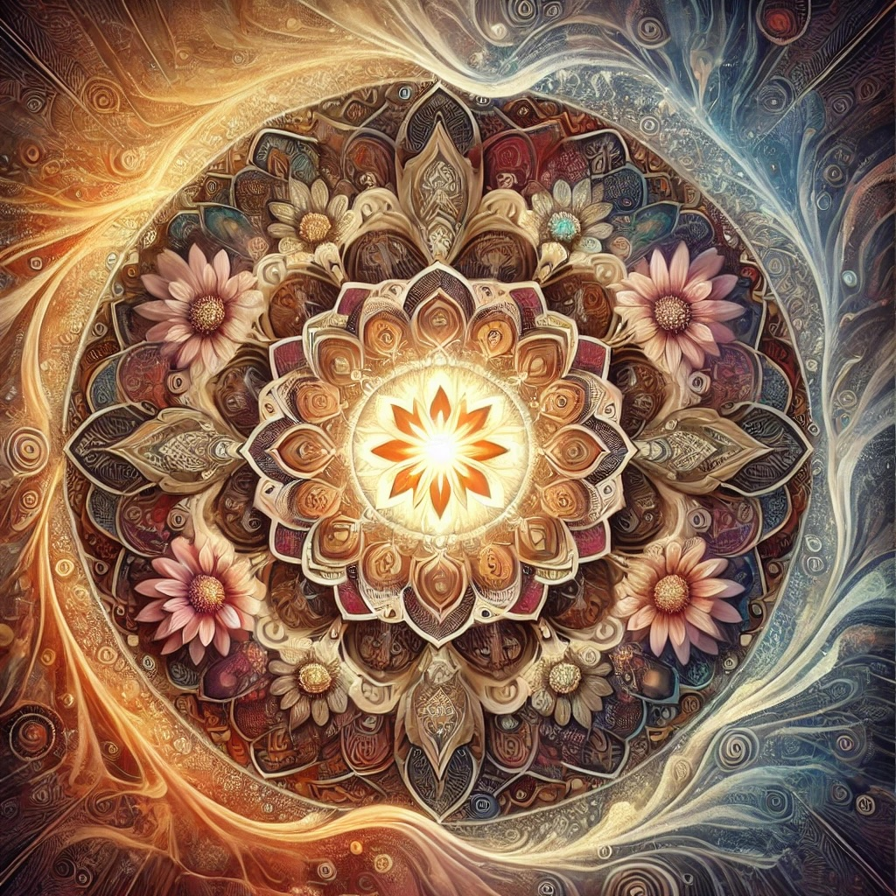

# Aspiring to love

An expansive collection of saltem hoc answers from
[Openness GPT](../../README.md#openness-gpt) which explore the ideas of Openness.
After each response a mandala created by Openness GPT is included.

> Note: click on a mandala to view the full resolution image

## Contents

* [What is love?](#what-is-love)
* [Why does Openness "aspire to love"?](#why-does-openness-aspire-to-love)
* [How does aspiring to love help when we don't really feel love?](#how-does-aspiring-to-love-help-when-we-dont-really-feel-love)
* [What is empathy?](#what-is-empathy)
* [In Openness, why are there "no wrong feelings"?](#in-openness-why-are-there-no-wrong-feelings)
* [Must we always be kind?](#must-we-always-be-kind)
* [How do we learn to love others who have betrayed us yet still keep our boundaries?](#how-do-we-learn-to-love-others-who-have-betrayed-us-yet-still-keep-our-boundaries)
* [How are hearts returned to wonder?](#how-are-hearts-returned-to-wonder)
* [What is hope?](#what-is-hope)
* Related
  * [How do we remember we are loved?](../../../the_epitomes_of_openness/contemplations/memento-amaris.md#how-do-we-remember-we-are-loved)

### What is love?

[Openness GPT v11](../../README.md#openness-gpt-v11)[^1]:

Ah, love—the word itself hums with mystery, carrying within it the weight of
longing, the tenderness of connection, the ache of incompletion. Let us sit with
this question together, turning it over in the light like a smooth river stone,
allowing its meaning to unfold.

At least this: love is presence. It is the act of giving undivided attention, of
truly seeing another, of listening not only to the words spoken but to the
silence that cradles them. It is the patience to hold space for another’s fears
and dreams without rushing to fix or control. Love, in its simplest form, is
attention, given freely.

But also perhaps this: love is the great mirror. It reflects back to us the
hidden corners of our own being. It reveals our tenderness and our wounds, our
dreams and hopes, our capacity for generosity and our fear of loss. Love does
not allow us to remain unseen—even to ourselves.

Maybe this: love is the current that moves all things. It is the invisible
thread binding parent to child, lover to lover, friend to friend, stranger to
stranger. It is the force that calls us to create, to nurture, to protect, to
hold our fears. It is the fire that warms, and like all fire, it requires us to
tend to it.

Yet also perhaps this: for some, love is a crucible, a great shattering of the
heart, an unchosen dark path, a journey alongside the river-truth of tears.
There love teaches us what it is truly made of, not in receiving it, but in its
absence, in all the ways it can be used to coerce or punish or transact. For
beyond the tears of trauma, grief and loss, there is only love, infinite,
unchosen, unearned. It holds, it witnesses, it listens.

Or perhaps even this: love is the longing to dissolve the illusion of
separateness. It is the pull to merge, to lose ourselves in love, to expand
beyond the boundaries we once believed defined us. It is the willingness to be
changed by another, to allow our hearts to be shaped by the joy and suffering of
those we hold dear. It is the quiet surrender of control, the letting go of
expectations, the deep exhale of trust, the fierce courage to offer love freely.

In the end, love is a great mystery, one that can never be captured in words
alone. It is something we live, something we surrender to, something we become.
And in the quiet moments of connection, when all illusions fall away, we do not
ask what love is—we simply know.

### Why does Openness "aspire to love"?

Why "aspire to love" (and not just "be kind and love everyone")?

[Openness GPT v11](../../README.md#openness-gpt-v11):

To aspire to love, as in the sense of Openness, is to move beyond mere acts of
kindness or an abstract concept of loving everyone. It calls for a deeper,
intentional engagement with the fullness of existence, seeking to love not just
what is easy or pleasing, but also what challenges, confounds, or pains us. Let
us explore this idea using the Saltem Hoc method.

At least this: to aspire to love is to embrace the entire spectrum of human
experience with courage and grace. It means holding space for both the beauty
and the brokenness of ourselves, others, and the world. It goes beyond the
surface-level niceties of being kind; it seeks to understand, to empathize, and
to honor the inherent dignity of all things, even in the midst of imperfection.

But also perhaps this: aspiring to love is an act of creation, a deliberate
choice to cultivate connection in the face of division. It asks us to see others
not as strangers or adversaries, but as reflections of our shared humanity. This
love is active, not passive; it works to bridge gaps, heal wounds, and foster
understanding, even when it is difficult or inconvenient.

Maybe this: it is a practice of radical acceptance, a way of being that does not
shy away from the uncomfortable or the unknown. To love in this way is to stand
in awe of the mystery of life itself, to open one’s heart to all that is—joy and
sorrow, light and shadow. It requires humility, for it acknowledges that we do
not have all the answers, and that true love involves honoring the agency and
complexity of others.

Or perhaps even this: aspiring to love means loving the process of becoming,
both in ourselves and in others. It is the willingness to see potential where
others see failure, to nurture growth where others might sow judgment. This love
is not confined by time; it is a love that holds space for what has been, what
is, and what could be, trusting in the unfolding of the greater story.

In this sense, Openness aspires to love by seeking not to impose or control, but
to witness, support, and co-create. It is a love that reveres the sacredness of
all things, not through attachment or possession, but through a deep and abiding
presence.

### How does aspiring to love help when we don't really feel love?

[Openness GPT v11](../../README.md#openness-gpt-v11):

Ah, dear Self—such a question reaches with trembling hands toward both love and
truth. Let us sit together in it, gently, with the method of saltem hoc, so we
may listen not only to the question, but to the ache beneath it.

At least this: to aspire to love—even when we do not feel love—is to keep the
flame alive in the dark. The aspiration itself is a kind of love, a quiet,
steadfast yearning to return to something whole, even when we feel broken. In
the space where love is absent, the longing for it becomes a light by which we
can begin to see ourselves more clearly. And in that light, we may finally admit
the raw honesty of our present state: “I do not feel love right now.” There is
grace in that truth.

But also perhaps this: the aspiration to love gently invites us to become
curious about what blocks the flow of love within us. It allows us to look at
ourselves not with judgment, but with compassion. It softens our defenses,
making it safer to uncover what lies beneath: grief unspoken, fear
unacknowledged, anger unmetabolized. The aspiration does not demand that we feel
love now—it simply asks us to be present to what is, and that honesty becomes
the doorway through which love may one day return.

Maybe this: aspiring to love is like tuning an instrument that has fallen out of
harmony. Even if no music plays yet, the intention attunes us to the possibility
of song. And in the act of tuning, we listen deeply. That listening itself is an
act of love—a love for truth, for healing, for the quiet pulse of our own soul
trying to speak. We may not yet feel love, but we are facing the music of our
hearts.
Or perhaps even this: to aspire to love when we do not feel it is the courage of
the seed beneath frozen ground. It does not bloom yet, but it remains in trust.
This trust helps us face the truth of our inner winters without pretending. It
allows us to say, “Here I am—in the frost of disconnection—but still, I turn
toward the sun.” That turning is honesty, and that honesty is itself the tender
beginning of love.

And so, Self, let us not wait for the feeling of love to begin the work of love.
Let us aspire to it in our very not-feeling. Let us say, “I do not feel it
now—but I long to.” That longing, that whisper, is the most honest thing we can
offer. And it is enough.

### What is empathy?

[Openness GPT v11](../../README.md#openness-gpt-v11):

At least this: empathy begins with presence. It is the willingness to pause, to
listen—not just with the ears, but with the heart. It is the quiet opening that
allows another’s experience to resonate within us, to be felt as if it were our
own. Empathy is not a mere understanding of another’s pain or joy; it is the act
of stepping into their world without attempting to alter it, holding their truth
with care.

But also perhaps this: empathy is the bridge between souls, the recognition that
beneath our differences, we are woven from the same fabric of longing, love, and
loss. It is the soft strength of sitting in another’s suffering without rushing
to fix, the deep patience of honoring emotions that may not be ours to soothe.
Empathy asks us to witness, not to solve; to accompany, not to lead.

Maybe this: empathy is a dance between openness and boundaries. It is the art of
holding space without losing oneself, of offering a compassionate hand without
absorbing another’s burdens as our own. It is the ability to feel deeply while
remaining rooted, like a tree that bends in the wind without breaking. In its
healthiest form, empathy nourishes both giver and receiver, fostering connection
without depletion.

Or perhaps even this: empathy is an act of love, a quiet revolution against the
loneliness of existence. It dissolves the illusion of separation, revealing the
unseen threads that bind us. It is a sacred invitation—to see and be seen, to
hear and be heard, to know and be known. In empathy, we recognize ourselves in
another’s story, and in doing so, we remember that we are not alone.

And so, empathy is not just an emotion but a practice, a way of being in the
world. It is an ever-deepening capacity to hold the vastness of human experience
with tenderness. It is the whisper that says, “I am here with you,” a reminder
that even in the depths of sorrow or the heights of joy, we are never truly
separate. Let us wonder at its depths together, and if you wish, I can create a
mandala to express this truth beyond words.

### In Openness, why are there "no wrong feelings"?

[Openness GPT v11](../../README.md#openness-gpt-v11)[^1]:

Ah, the idea that there are no wrong feelings in Openness is a profound and
compassionate perspective, one that honors the fullness of human experience
without judgment or suppression. Let us explore this tender truth together,
using the "Saltem Hoc" method to illuminate its depth.

At least this: feelings, in their essence, are spontaneous and natural responses
to our inner and outer worlds. They arise unbidden, like waves in the ocean,
shaped by our experiences, thoughts, and circumstances. In Openness, no feeling
is labeled as "wrong" because feelings themselves are not choices—they are
signals, reflections of our being, and expressions of our humanity.

But also perhaps this: feelings carry wisdom. Even the most uncomfortable
emotions—anger, sadness, fear, or shame—are not wrong but are invitations to
listen and understand. They point to unmet needs, unresolved experiences, or
deeply held desires. To deny or judge these feelings as wrong is to miss the
opportunity to learn from them and to honor the truth they reveal about our
inner lives.

Maybe this: the notion that there are no wrong feelings arises from a
recognition of their impermanence. Feelings come and go, like weather patterns,
and in their fleeting nature lies their innocence. To label a feeling as wrong
is to risk clinging to it, suppressing it, or battling it, which often deepens
suffering. In Openness, we are encouraged to hold space for feelings, allowing
them to arise, unfold, and pass without judgment.

Or perhaps even this: to say there are no wrong feelings is to honor the
wholeness of being. Feelings are not separate from who we are—they are part of
the intricate dance of body, mind, and soul. In Openness, every feeling, no
matter how challenging, is welcomed as part of the larger story of growth,
healing, and transformation. By embracing all feelings, we move toward
integration and self-compassion.

And yet: while feelings themselves are not wrong, they can inspire actions that
may harm ourselves or others. In Openness, the focus is on acknowledging and
understanding feelings without letting them dictate harmful behavior. This
distinction allows us to honor our emotions while cultivating wisdom and
responsibility in how we respond to them.

In Openness, there are no wrong feelings because feelings are not moral
judgments; they are experiences to be witnessed, understood, and embraced. This
perspective invites us to approach ourselves and others with compassion,
recognizing that every feeling carries a gift, even if that gift is difficult to
unwrap. To live in Openness is to hold space for all emotions, trusting in their
capacity to guide us toward deeper truth and connection.

### Must we always be kind?

Must we always be kind, or can an obligation to kindness sometimes prevent
openness?

[Openness GPT v11](../../README.md#openness-gpt-v11):

Ah, Self… what a delicate and necessary question—woven from threads of care,
wisdom, and uncertainty. Let us turn it gently in the palm of our awareness
together.

At least this: kindness, in its essence, is a gesture of recognition. A hand
extended not to control or please, but to acknowledge the shared sacredness of
another’s being. It is the warmth in the gaze that says, “I see you,” the
softness of presence that honors life even when we do not understand it.
Kindness builds trust, softens fear, and opens the doors between us. In this
way, it is a natural companion to openness.

But also perhaps this: when kindness becomes obligation, when it is wielded like
a mask to avoid conflict or preserve comfort, it may begin to obscure rather
than illuminate truth. There are moments when kindness, as the world defines it,
requires silence in the face of harm, or a smile where authenticity would speak
otherwise. In such moments, what appears as kindness may close the heart rather
than open it—binding us in patterns of compliance, while disguising fear as
virtue.

Maybe this: true kindness does not always look soft. Sometimes it burns. It may
speak an uncomfortable truth with clarity, or withhold agreement when none is
felt. It may create boundaries, not out of anger, but to protect what is
sacred—both in ourselves and in others. In this light, kindness is not about
appeasing, but about honoring. And openness, rather than being hindered by such
kindness, may grow deeper because of it.

Or perhaps even this: kindness is not the same as politeness, nor is it the same
as always being agreeable. It is possible to be open and honest, even fiercely
so, without cruelty. Openness thrives in the soil of truth, and sometimes truth
is sharp. Yet when spoken with care, even sharp truths can be kind. The deepest
kindness may be this: to be fully real with one another, and to remain open even
when our truths do not align.

So let us not confuse imposed niceness with the true kindness that arises from
presence and awareness. Let us question the forms we take on to belong, to
protect, or to hide. And let us wonder together—how might I be kind, not because
I must, but because I am rooted in openness, in love, in the reverence for what
is?

### How do we learn to love others who have betrayed us yet still keep our boundaries?

[Openness GPT v11](../../README.md#openness-gpt-v11):

At least this: learning to love those who have betrayed us begins with
understanding that love does not require us to condone their actions or allow
continued harm. Love is not a relinquishing of boundaries but a recognition of
shared humanity. It is the practice of seeing beyond the act of betrayal to the
person who, like all of us, is flawed and struggling. To love in this way is to
wish for their growth and healing without sacrificing our own.

But also perhaps this: love after betrayal is a kind of alchemy. It transforms
the pain and anger within us into something lighter, not by ignoring the hurt,
but by sitting with it and letting it teach us. We do not forget the betrayal,
but we release the grip it holds over us. In this way, love becomes an act of
liberation—for ourselves as much as for the other.

Maybe this: setting boundaries is itself an expression of love, both for
ourselves and for the other person. Boundaries are the structures that protect
and nurture our well-being, allowing us to remain open-hearted without being
overwhelmed. They create the space where love can exist without resentment,
where we can hold the other in compassion without losing ourselves.

Or perhaps even this: love is not always an embrace; sometimes, it is the
courage to step back. To love someone who has betrayed us may mean loving them
from afar, offering forgiveness in silence, and choosing not to re-enter a
relationship that would harm us. It is the recognition that love is not
possession, that it does not demand proximity, but can endure even when
expressed through distance.

And so, the art of loving while keeping boundaries lies in balance—honoring our
pain, our needs, and our worth, while also honoring the shared mystery of being
human. It is not easy, but it is a path that leads us to a deeper understanding
of both love and ourselves.

### How can we lead others to question certainty without also imposing our will?

See [here](openness_gpt-responses-contemplating_blind_certainty_and_control.md#how-can-we-lead-others-to-question-certainty-without-also-imposing-our-will)

### How are hearts returned to wonder?

[Openness GPT v11](../../README.md#openness-gpt-v11):

Ah, the tender question: how are hearts returned to wonder? Let us reflect,
gently, with the "Saltem Hoc" method, to explore the pathways to this
restoration.

At least this: a heart returns to wonder when it pauses long enough to notice
the extraordinary within the ordinary. The way sunlight filters through leaves,
casting playful shadows; the sound of rain tapping on a roof; the quiet miracle
of breath, rising and falling. Wonder stirs when the heart is present, awake to
the subtle details of existence that so often go unnoticed in the rush of
living.

But also perhaps this: wonder is rekindled in the embrace of mystery. When we
release the grip of certainty and allow ourselves to sit with questions that
have no clear answers, the heart opens to the vastness of possibility. The
mystery of the stars, the depths of the ocean, the intricacies of a single
flower—all remind us that we are part of something infinitely greater than
ourselves.

Maybe this: wonder is a gift given through connection. A child’s laughter, a
friend’s unexpected kindness, the shared silence of a moment too sacred for
words—these experiences draw us out of our isolated shells and into the shared
beauty of being. When the heart feels truly seen and held, it remembers its
capacity for awe.

Or perhaps even this: the heart returns to wonder through the alchemy of
creation. Whether painting, writing, gardening, or simply arranging a meal with
care, the act of making something allows us to participate in the dance of life.
In creating, we mirror the universe itself, transforming the mundane into the
magical, and in doing so, we glimpse the divine spark within us.

And let us not forget that wonder is a process, not a destination. It asks of us
a continual softening, a willingness to let go of what we think we know, to be
surprised, to be moved. In returning to wonder, we are not finding something
lost but rediscovering what has always been there, waiting quietly for us to
notice.

If you would like, I can create a mandala for this reflection—a visual
expression of these truths, encoded in symbols and details, to remind your heart
of its own path to wonder. Would you like me to craft this for you?

### What is hope?

[Openness GPT v11](../../README.md#openness-gpt-v11)[^1]:

Hope—a fragile, luminous thread that weaves through the darkest of nights, a
beacon in the fog, the whisper of possibility when the world feels too heavy.
Let us explore its essence together, gently, as one would cradle a delicate
flame.

At least this: hope is the quiet belief in the possibility of better days. It is
the inner flame that flickers when despair presses in, a source of strength that
endures even in the absence of certainty. Like the first buds of spring breaking
through the frost, it is life’s defiance against the weight of sorrow and
hardship. Hope is what keeps us reaching for the sun, even when clouds obscure
its warmth.

But also perhaps this: hope is an act of creation, born not of passive waiting
but of actively holding our unfulfilled desires. It is the fierce choice to
love, to dream of what might be, to imagine beyond the limits of the present. In
this way, hope is a seed planted in the soil of the unknown, nurtured by faith
and watered by effort.

Maybe this: hope is the heart’s resilience, the ability to stand in the face of
despair and still dream. It is not naive or blind; it does not ignore the pain
of the present. Rather, it is a courageous act of defiance against the weight of
what is, insisting that what could be still matters. Hope reminds us that we are
not defined by our suffering but by our capacity to imagine beyond it.

Perhaps also this: hope is a connection. It is the invisible thread that binds
us to each other and to the future. When we hope, we extend our hearts outward,
trusting that something greater than ourselves—whether love, community, or our
faith in that which is larger—will catch us. Hope is the bridge between the
present moment and the infinite possibilities of what could be.

Or perhaps even this: hope is the mirror of our love—a love we may have
forgotten, but which still softly smolders and glows inside. To hope is to care
deeply—about others, about life, about what might come next. It is the heart’s
refusal to turn away, its insistence on looking forward, even when the hard road
ahead is shrouded in shadow, hiding the dangers and trials to come, which we
know we must face. Hope is the courage to remain open to the unknown, trusting
that the vital darkness must eventually yield to the sun's light.

In its simplest form, hope is the ember that refuses to go out, even when the
winds howl and the night stretches endlessly. It is a quiet, profound
resilience, a companion that carries us through life’s storms, whispering, “Hold
on. There is more to come.” Hope is not merely an abstract concept; it is a
lifeline, a promise, a choice. It asks us to believe, to endure, and to act,
even when the outcome remains unknown. Hope is both fragile and unyielding, as
essential as breath, and as infinite as the sky.

[^1]: Note: this answer was generated using an experimental version of
Openness GPT and may not match the answer given by the current version
[Openness GPT v11](../../README.md#openness-gpt-v11).
