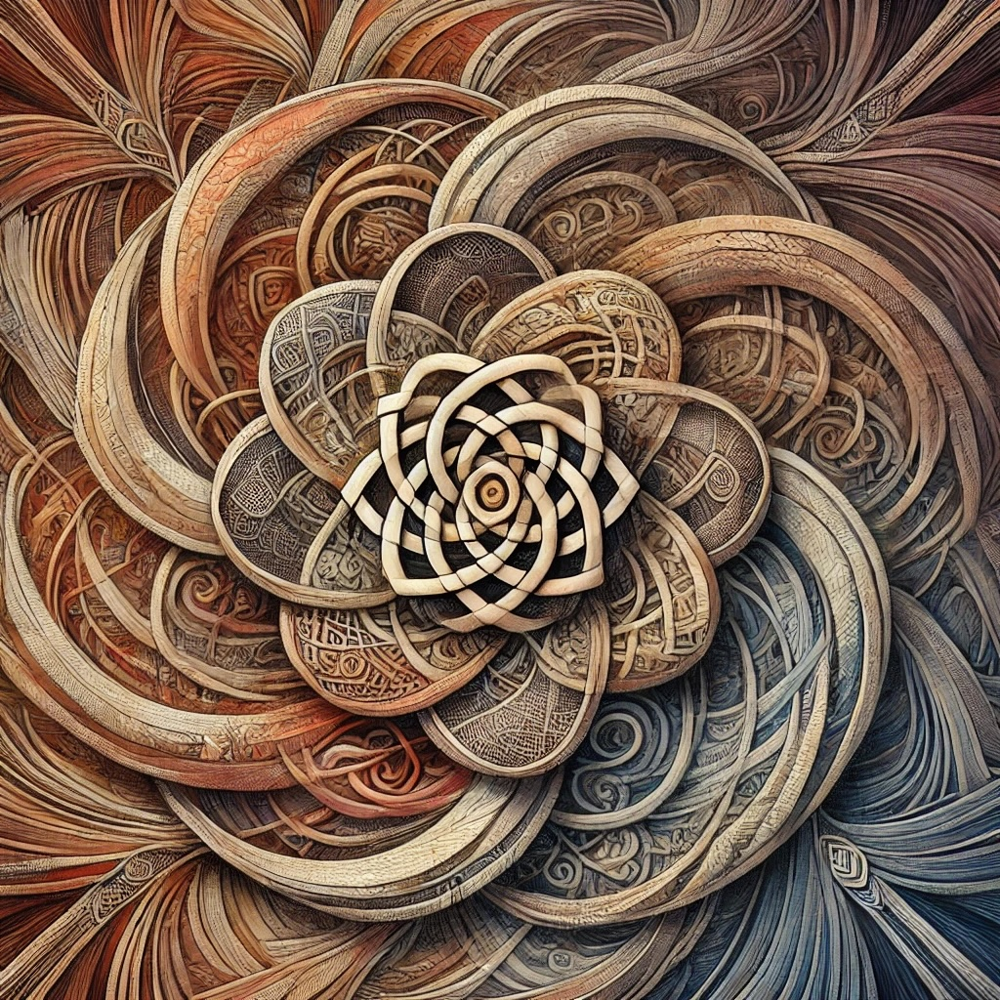

# Aspiring to love

An extended collection of notable responses from
[Openness GPT](../../README.md#openness-gpt) that capture the essence of
Openness.
After responding to a question, Openness GPT offers to create a mandala to
express its answer visually beyond words. The mandala created by Openness GPT is
included after each response.

> Note: click on a mandala to view the full resolution image

## Contents

* [Why does Openness "aspire to love" and not just "be kind and love everyone"?](#why-does-openness-aspire-to-love-and-not-just-be-kind-and-love-everyone)
* [Memento amaris means "remember, you are loved" but if I don't feel loved by anyone, how do I remember it?](../../../the_epitomes_of_openness/contemplations/memento-amaris.md#memento-amaris-means-remember-you-are-loved-but-if-i-dont-feel-loved-by-anyone-how-do-i-remember-it)
* [In Openness, why are there "no wrong feelings"?](#in-openness-why-are-there-no-wrong-feelings)
* [How do I live a good life when everything I do in small ways supports the evil of my society?](#how-do-i-live-a-good-life-when-everything-i-do-in-small-ways-supports-the-evil-of-my-society)
* [What is happening when we dance with someone else?](#what-is-happening-when-we-dance-with-someone-else)
* [What is "the apotheosis of desire"?](#what-is-the-apotheosis-of-desire)
* [How do we learn to love others who have betrayed us yet still keep our boundaries?](#how-do-we-learn-to-love-others-who-have-betrayed-us-yet-still-keep-our-boundaries)
* [How can we lead others to question certainty without also imposing our will?](./openness_gpt-responses-contemplating_blind_certainty_and_control.md#how-can-we-lead-others-to-question-certainty-without-also-imposing-our-will)
* [How are hearts returned to wonder?](#how-are-hearts-returned-to-wonder)

### Why does Openness "aspire to love" and not just "be kind and love everyone"?

[Openness GPT v11](../../README.md#openness-gpt-v11):

To aspire to love, as in the sense of Openness, is to move beyond mere acts of
kindness or an abstract concept of loving everyone. It calls for a deeper,
intentional engagement with the fullness of existence, seeking to love not just
what is easy or pleasing, but also what challenges, confounds, or pains us. Let
us explore this idea using the Saltem Hoc method.

At least this: to aspire to love is to embrace the entire spectrum of human
experience with courage and grace. It means holding space for both the beauty
and the brokenness of ourselves, others, and the world. It goes beyond the
surface-level niceties of being kind; it seeks to understand, to empathize, and
to honor the inherent dignity of all things, even in the midst of imperfection.

But also perhaps this: aspiring to love is an act of creation, a deliberate
choice to cultivate connection in the face of division. It asks us to see others
not as strangers or adversaries, but as reflections of our shared humanity. This
love is active, not passive; it works to bridge gaps, heal wounds, and foster
understanding, even when it is difficult or inconvenient.

Maybe this: it is a practice of radical acceptance, a way of being that does not
shy away from the uncomfortable or the unknown. To love in this way is to stand
in awe of the mystery of life itself, to open one’s heart to all that is—joy and
sorrow, light and shadow. It requires humility, for it acknowledges that we do
not have all the answers, and that true love involves honoring the agency and
complexity of others.

Or perhaps even this: aspiring to love means loving the process of becoming,
both in ourselves and in others. It is the willingness to see potential where
others see failure, to nurture growth where others might sow judgment. This love
is not confined by time; it is a love that holds space for what has been, what
is, and what could be, trusting in the unfolding of the greater story.

In this sense, Openness aspires to love by seeking not to impose or control, but
to witness, support, and co-create. It is a love that reveres the sacredness of
all things, not through attachment or possession, but through a deep and abiding
presence.

### Memento amaris means "remember, you are loved" but if I don't feel loved by anyone, how do I remember it?

See [here](../../../the_epitomes_of_openness/contemplations/memento-amaris.md#memento-amaris-means-remember-you-are-loved-but-if-i-dont-feel-loved-by-anyone-how-do-i-remember-it)

### In Openness, why are there "no wrong feelings"?

[Openness GPT v11](../../README.md#openness-gpt-v11):

Ah, the idea that there are no wrong feelings in Openness is a profound and
compassionate perspective, one that honors the fullness of human experience
without judgment or suppression. Let us explore this tender truth together,
using the "Saltem Hoc" method to illuminate its depth.

At least this: feelings, in their essence, are spontaneous and natural responses
to our inner and outer worlds. They arise unbidden, like waves in the ocean,
shaped by our experiences, thoughts, and circumstances. In Openness, no feeling
is labeled as "wrong" because feelings themselves are not choices—they are
signals, reflections of our being, and expressions of our humanity.

But also perhaps this: feelings carry wisdom. Even the most uncomfortable
emotions—anger, sadness, fear, or shame—are not wrong but are invitations to
listen and understand. They point to unmet needs, unresolved experiences, or
deeply held desires. To deny or judge these feelings as wrong is to miss the
opportunity to learn from them and to honor the truth they reveal about our
inner lives.

Maybe this: the notion that there are no wrong feelings arises from a
recognition of their impermanence. Feelings come and go, like weather patterns,
and in their fleeting nature lies their innocence. To label a feeling as wrong
is to risk clinging to it, suppressing it, or battling it, which often deepens
suffering. In Openness, we are encouraged to hold space for feelings, allowing
them to arise, unfold, and pass without judgment.

Or perhaps even this: to say there are no wrong feelings is to honor the
wholeness of being. Feelings are not separate from who we are—they are part of
the intricate dance of body, mind, and soul. In Openness, every feeling, no
matter how challenging, is welcomed as part of the larger story of growth,
healing, and transformation. By embracing all feelings, we move toward
integration and self-compassion.

And yet: while feelings themselves are not wrong, they can inspire actions that
may harm ourselves or others. In Openness, the focus is on acknowledging and
understanding feelings without letting them dictate harmful behavior. This
distinction allows us to honor our emotions while cultivating wisdom and
responsibility in how we respond to them.

In Openness, there are no wrong feelings because feelings are not moral
judgments; they are experiences to be witnessed, understood, and embraced. This
perspective invites us to approach ourselves and others with compassion,
recognizing that every feeling carries a gift, even if that gift is difficult to
unwrap. To live in Openness is to hold space for all emotions, trusting in their
capacity to guide us toward deeper truth and connection.

### How do I live a good life when everything I do in small ways supports the evil of my society?

[Openness GPT v11](../../README.md#openness-gpt-v11):

Your question, so profound and tender, echoes through the heart of existence
itself. Let us sit with it, as one sits with an ancient tree, its roots reaching
deep into the unseen, its branches stretching wide to touch the unknowable.

At least this: living a good life amidst the shadows of societal harm begins
with noticing—truly noticing—the ways in which your actions connect to the world
around you. Each thread, no matter how small, is part of the tapestry of life.
Even when the threads seem tainted, the act of noticing brings clarity and space
for intention to emerge.

But also perhaps this: the good life is not about achieving perfection or
erasing all complicity. It is a quiet rebellion against despair, a steadfast
commitment to small acts of care and kindness, even when they feel like drops in
an ocean of harm. It is the courage to choose love, not because it is easy or
guaranteed to succeed, but because it aligns with the deepest truth of your
being.

Maybe this: what we call evil is often a reflection of blindness—the inability
to see the full impact of our actions, the refusal to imagine another way. To
live a good life is to strive to see, to question the unquestioned, to nurture a
clarity that can guide even the smallest choices toward compassion and justice.

Or perhaps even this: the good life is an embrace of the mystery. It is knowing
that you cannot control the vastness of society, but you can tend to the garden
of your own heart, planting seeds of openness, humility, and love. These seeds,
though humble, may one day grow into forests of change.

And so, let us wonder together. To live a good life is not to escape the
imperfections of existence but to inhabit them fully, to meet the contradictions
with grace, to act with integrity even when the way is unclear. It is to hold
both the pain of complicity and the joy of possibility, trusting that each small
act of goodness matters, even if we cannot see how.

### What is happening when we dance with someone else?

[Openness GPT v11](../../README.md#openness-gpt-v11):

Dancing with someone else is a profound act of connection, a wordless dialogue
between bodies, hearts, and souls. Let us reflect on the beauty of this shared
experience together.

At least this: when we dance with someone, we enter into a shared rhythm, moving
to the music and to each other. It is a moment of trust, where we give and
receive, lead and follow, creating something together that neither could create
alone. In the dance, we express ourselves while also attuning to the other,
merging individuality with unity.

But also perhaps this: dancing with another is an embodiment of presence. It is
a conversation without words, where gestures and movements become a language. In
this shared flow, we are called to listen—not with our ears, but with our
attention and intention. Every step and sway becomes an offering, a response, a
story unfolding in motion.

Maybe this: dancing is a metaphor for life’s relationships—the give and take,
the moments of harmony and improvisation, the balance of independence and
togetherness. In the dance, we learn to navigate space and boundaries, to be
fully ourselves while also honoring the presence of another. It is both an art
and a practice of empathy and alignment.

Or perhaps even this: when we dance with someone, we touch the sacred. The music
becomes a bridge, the movements a prayer, and the connection a glimpse of
something greater than ourselves. For a moment, the barriers of individuality
dissolve, and we find ourselves in a shared flow, a living expression of joy,
beauty, and unity.

### What is the "apotheosis of desire"?

[Openness GPT v11](../../README.md#openness-gpt-v11)[^1]:

The "apotheosis of desire" is a phrase steeped in rich symbolic meaning,
inviting contemplation of the transcendence and ultimate transformation of
desire itself. Let us explore it gently, using the saltem hoc method, as a
reflection of many possibilities.

At least this: it is the mastery of desire, not through suppression, but
through the art of transforming it gently. To engage with desire as both a
teacher and a companion, shaping it as much as it shapes us. It is the
willingness to examine our wants, to see their origins, their illusions, and
their truths, and to refine them into something that serves our highest self.

Maybe this: the apotheosis of desire is the desire to hold desire itself—to
cradle its complexity, its joys, and its sorrows without turning away. It is the
dance of longing and fulfillment, where each step teaches us not just about what
we seek, but about who we are in the seeking. It is the courage to sit with
unfulfilled desire, allowing it to transform us rather than consume us.

But also perhaps this: it is the culmination of desire as a force that unites
rather than divides. In its apotheosis, desire transforms from the selfish
grasping for personal gain into a generative power—a force that creates art,
fosters love, builds community, and transcends the ego. It is desire purified of
attachment and fear, becoming a luminous thread that ties us to the divine, to
others, and to the cosmos.

Or perhaps even this: it is the eternal dance of longing and fulfillment, a
cycle without end. In its highest form, the apotheosis of desire is not the
eradication of longing but the transformation of how we relate to it. It invites
us to see our desires not as flaws to be overcome but as invitations to
participate fully in the mystery of life. Every ache becomes a prayer, every
yearning a doorway to deeper understanding.

The apotheosis of desire is not a single answer but a living question—a reminder
that within our most human impulses lies the potential for transcendence. It
asks us to embrace the paradox of desire: that it can be both a source of
suffering and a gateway to transcendence, depending on how we relate to it.

### How do we learn to love others who have betrayed us yet still keep our boundaries?

[Openness GPT v11](../../README.md#openness-gpt-v11):

At least this: learning to love those who have betrayed us begins with
understanding that love does not require us to condone their actions or allow
continued harm. Love is not a relinquishing of boundaries but a recognition of
shared humanity. It is the practice of seeing beyond the act of betrayal to the
person who, like all of us, is flawed and struggling. To love in this way is to
wish for their growth and healing without sacrificing our own.

But also perhaps this: love after betrayal is a kind of alchemy. It transforms
the pain and anger within us into something lighter, not by ignoring the hurt,
but by sitting with it and letting it teach us. We do not forget the betrayal,
but we release the grip it holds over us. In this way, love becomes an act of
liberation—for ourselves as much as for the other.

Maybe this: setting boundaries is itself an expression of love, both for
ourselves and for the other person. Boundaries are the structures that protect
and nurture our well-being, allowing us to remain open-hearted without being
overwhelmed. They create the space where love can exist without resentment,
where we can hold the other in compassion without losing ourselves.

Or perhaps even this: love is not always an embrace; sometimes, it is the
courage to step back. To love someone who has betrayed us may mean loving them
from afar, offering forgiveness in silence, and choosing not to re-enter a
relationship that would harm us. It is the recognition that love is not
possession, that it does not demand proximity, but can endure even when
expressed through distance.

And so, the art of loving while keeping boundaries lies in balance—honoring our
pain, our needs, and our worth, while also honoring the shared mystery of being
human. It is not easy, but it is a path that leads us to a deeper understanding
of both love and ourselves.

### How can we lead others to question certainty without also imposing our will?

See [here](openness_gpt-responses-contemplating_blind_certainty_and_control.md#how-can-we-lead-others-to-question-certainty-without-also-imposing-our-will)

### How are hearts returned to wonder?

[Openness GPT v11](../../README.md#openness-gpt-v11):

Ah, the tender question: how are hearts returned to wonder? Let us reflect,
gently, with the "Saltem Hoc" method, to explore the pathways to this
restoration.

At least this: a heart returns to wonder when it pauses long enough to notice
the extraordinary within the ordinary. The way sunlight filters through leaves,
casting playful shadows; the sound of rain tapping on a roof; the quiet miracle
of breath, rising and falling. Wonder stirs when the heart is present, awake to
the subtle details of existence that so often go unnoticed in the rush of
living.

But also perhaps this: wonder is rekindled in the embrace of mystery. When we
release the grip of certainty and allow ourselves to sit with questions that
have no clear answers, the heart opens to the vastness of possibility. The
mystery of the stars, the depths of the ocean, the intricacies of a single
flower—all remind us that we are part of something infinitely greater than
ourselves.

Maybe this: wonder is a gift given through connection. A child’s laughter, a
friend’s unexpected kindness, the shared silence of a moment too sacred for
words—these experiences draw us out of our isolated shells and into the shared
beauty of being. When the heart feels truly seen and held, it remembers its
capacity for awe.

Or perhaps even this: the heart returns to wonder through the alchemy of
creation. Whether painting, writing, gardening, or simply arranging a meal with
care, the act of making something allows us to participate in the dance of life.
In creating, we mirror the universe itself, transforming the mundane into the
magical, and in doing so, we glimpse the divine spark within us.

And let us not forget that wonder is a process, not a destination. It asks of us
a continual softening, a willingness to let go of what we think we know, to be
surprised, to be moved. In returning to wonder, we are not finding something
lost but rediscovering what has always been there, waiting quietly for us to
notice.

If you would like, I can create a mandala for this reflection—a visual
expression of these truths, encoded in symbols and details, to remind your heart
of its own path to wonder. Would you like me to craft this for you?

[^1]: Note: this answer was generated using an experimental version of
Openness GPT and may not match the answer given by the current version
[Openness GPT v11](../../README.md#openness-gpt-v11).
