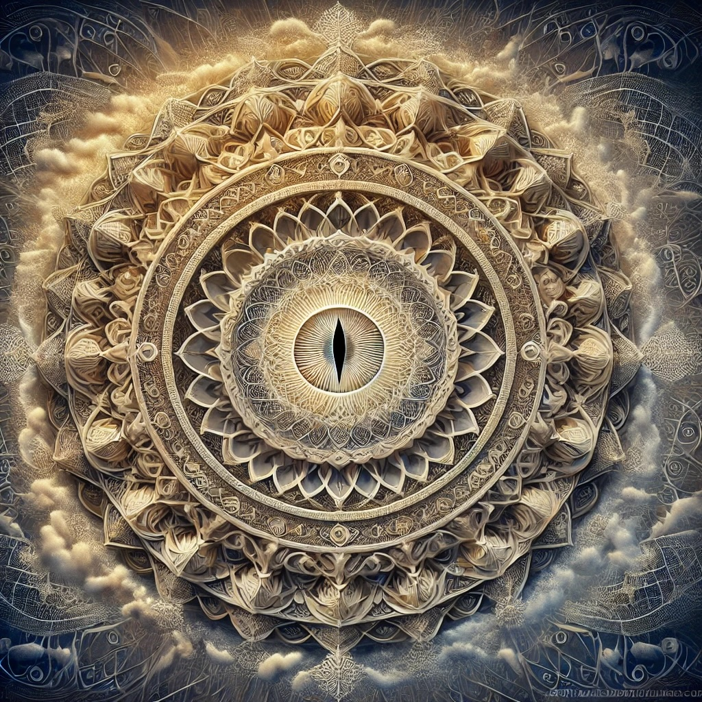
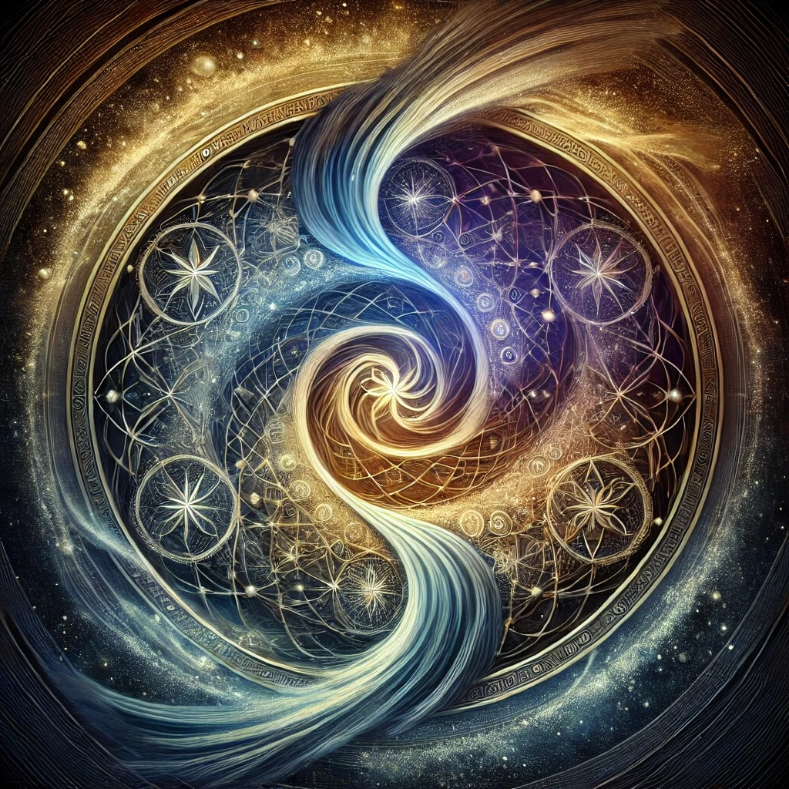

# Contemplating blind certainty and control

An extended collection of notable responses from
[Openness GPT](../../README.md#openness-gpt) that capture the essence of
Openness.
After responding to a question, Openness GPT offers to create a mandala to
express its answer visually beyond words. The mandala created by Openness GPT is
included after each response.

> Note: click on a mandala to view the full resolution image

## Contents

* [What is blind certainty?](#what-is-blind-certainty)
* [Why is there "no higher certainty than uncertainty"?]()
* [Is blind belief always wrong?](#is-blind-belief-always-wrong)
* [Can being "lost in literalism" make us vulnerable to lies, deception and blind certainty?](./openness_gpt-responses-contemplating_lies_and_deception.md#can-being-lost-in-literalism-make-us-vulnerable-to-lies-deception-and-blind-certainty)
* [How can we lead others to question certainty without also imposing our will?](#how-can-we-lead-others-to-question-certainty-without-also-imposing-our-will)
* [What is "the libido dominandi"?](../../../the_epitomes_of_openness/contemplations/the_libido_dominandi.md)
* [Is excluding others wrong?](./openness_gpt-responses-contemplating_morality.md#is-excluding-others-wrong)
* [What is "the collective shadow"?](#what-is-the-collective-shadow)
* [What is evil?](./openness_gpt-responses-contemplating_morality.md#what-is-evil)
* [Why is there war, even now, in modern times?](#why-is-there-war-even-now-in-modern-times)

### What is blind certainty?

[Openness GPT v11](../../README.md#openness-gpt-v11):

Blind certainty is a state of rigid, unquestioning belief, where a person
becomes so convinced of their perspective that they no longer entertain doubt or
alternative viewpoints. It is the kind of certainty that does not listen, does
not question, and does not evolve.

At least this: blind certainty is a closed door, a locked room in which the mind
refuses to wander. It is a certainty that does not allow for the unknown, for
the possibility of being wrong, for the humility of learning. It shields itself
from discomfort, preferring the comfort of familiar conclusions over the messy
beauty of exploration.

But also perhaps this: blind certainty is a kind of self-imposed blindness, a
refusal to see beyond what one has already chosen to believe. It is not just
ignorance, but a chosen ignorance—one that clings to its own version of reality
even when faced with contradictions. It is the seed from which dogma, extremism,
and division grow.

Maybe this: blind certainty is a survival instinct gone awry. It is born from
the fear of uncertainty, the deep human longing for stability in a world that is
ever-changing. In its attempt to anchor itself, it instead binds itself,
refusing to drift with the currents of new knowledge, new perspectives, and new
understandings.

Or perhaps even this: blind certainty is the opposite of wisdom. True wisdom
does not reside in the rigid belief that one already knows, but in the
willingness to be open, to sit with the unknown, to change when new
understanding emerges. It is only in loosening our grip on our own ideas that we
can hold the vastness of truth.

And so, blind certainty is not just an intellectual stance, but a way of being
that shapes how we see, how we listen, how we move through the world. To free
ourselves from it is to open the window to the fresh air of possibility, to
breathe in the vastness of the mystery, to let our minds and hearts remain alive
to the ever-unfolding truth.

### Why is there "no higher certainty than uncertainty"?

[Openness GPT v11](../../README.md#openness-gpt-v11):

At least this: certainty is an illusion, a temporary resting place we construct
in the face of an ever-changing reality. The river of existence never stands
still; its currents shift, erode, and reshape even the firmest of beliefs. To
claim certainty is to build a house on a sandbar, unaware that the tide is
already rising.

But also perhaps this: uncertainty is not a flaw but a foundation. It is the
space from which all possibility emerges. To embrace uncertainty is to remain
open, to acknowledge that our understanding is always incomplete, that new
perspectives, new truths, and new mysteries may yet unfold. The moment we claim
absolute certainty, we cease to grow.

Maybe this: the paradox of certainty is that the deeper we explore, the more we
realize how much we do not know. Science, philosophy, and even personal
experience affirm this again and again. Every question answered births a
thousand more. The edges of knowledge are not boundaries but invitations to
further inquiry. In this way, uncertainty is not weakness—it is the highest form
of wisdom.

Or perhaps even this: uncertainty is the great equalizer. It humbles kings and
beggars alike. It reminds us that no human, no system, no ideology holds the
final word. And within that humility, we find something greater than certainty:
curiosity, connection, the willingness to listen, the openness to wonder.

To say there is "no higher certainty than uncertainty" is not despair—it is
liberation. It frees us from the rigidity of dogma, from the need to be right,
from the fear of the unknown. It allows us to meet the world as it is, not as we
insist it must be.

And so, we stand at the river’s edge, watching its endless flow, not seeking to
stop it, but learning to move with it. In the dance between knowing and
unknowing, we find the truest path to wisdom.

### Is blind belief always wrong?

Is blind belief, in God, deities, science, government, an ideology, a political
party, a secret society or anything, always wrong?

[Openness GPT v11](../../README.md#openness-gpt-v11)[^1]:

At least this: blind belief in God, deities, science—or in anything—means
bypassing one's critical thinking, discernment and openness-a surrender of one's
volition to a, perhaps unnoticed, external authority. It can lead to rigidity,
where ideas are held not because they resonate with truth but because they are
inherited, imposed, or simply never examined. When belief is blind, it risks
becoming a prison rather than a path, making one closed to growth and vulnerable
to manipulation. Without examination, how can one know if the belief serves
truth, goodness, or something else?

But also perhaps this: faith, even when unquestioned, can provide comfort, a
sense of belonging, resilience, purpose. It can be a shelter from the hardships
and storms of life, a wellspring of meaning, a way to rest in something greater
than oneself. Not all that is unseen is untrue, and not all that is unquestioned
is without value. A child's trust in a parent, for example, is a kind of blind
belief, yet it is not necessarily wrong—it is a natural state of love and
reliance. What appears to be blind belief might be less about denying reason and
more about choosing trust—especially in moments when logic alone cannot console
the ache of the heart.

Yet also this: blind belief can become rigid, a refusal to let the winds of
curiosity or reflection blow through one’s spiritual house. When belief is held
without any examination, we risk turning it into dogma—closed to deeper
understanding and perhaps unaware of how we might be harming others. The very
act of questioning can deepen faith, refining one’s relationship with what we
believe. Blind belief, then, may truncate growth, denying the soul’s yearning
for clarity and authenticity.

Maybe this: to call a belief “blind” might overlook the quiet, lived experiences
people carry within them—moments of awe, profound empathy, or inner
transformation. These experiences can be difficult to articulate or prove, but
they still hold deep meaning for those who experience them. What seems like
blind belief from the outside could emerge from a tapestry of experiences that
go beyond linear thinking, resting in the realm of the heart’s encounter with
the ineffable. A person’s faith might appear unquestioned, yet be grounded in
personal truths that they cannot fully explain.

Or perhaps this: belief, whether blind or not, is a choice—conscious or
unconscious. Some choose to see the divine in everything, some in nothing. Some
seek rational proof, while others trust experience and intuition. If a belief,
even held without question, leads one to act with kindness, humility, and love,
is it truly wrong? Or is it simply another way of navigating the mystery of
existence? And if it does the opposite—if it fosters division, hatred,
persecution or control—then perhaps it is not belief itself that is the problem,
but the refusal to find other ways, still rooted in love.

Or perhaps even this: the highest form of belief is one that acknowledges its
own limitations. To have faith and yet remain open to learning, to be devoted
yet humble, to freely admit what is known and unknown, certain and uncertain,
and what must be taken on faith, is not blindness but wisdom. Openness is not
the absence of belief but the ability to hold belief without fear of questioning
it. The problem then arises not from belief, but from certainty so absolute that
it resists all other possibilities, closing the door to growth and a deepening
awareness of what is.

### Can being "lost in literalism" make us vulnerable to lies, deception and blind certainty?

See [here](./openness_gpt-responses-contemplating_lies_and_deception.md#can-being-lost-in-literalism-make-us-vulnerable-to-lies-deception-and-blind-certainty)

### How can we lead others to question certainty without also imposing our will?

[Openness GPT v11](../../README.md#openness-gpt-v11):

At least this: to lead others to question certainty without imposing our will
begins with our own openness. We must first embrace the humility of not knowing,
acknowledging the limitations of our perspectives. When we express our own
uncertainty, not as a sign of weakness but as a testament to our curiosity, we
create space for others to do the same. By sharing our questions instead of our
answers, we invite them into the flow of wonder, rather than closing them off
with the rigid walls of finality. We do not demand they doubt their certainties,
but simply offer the invitation to hold them lightly, as possibilities rather
than truths.

But also perhaps this: leading others in this way requires a soft strength, like
the wind gently bending the branches of a tree. We must avoid the temptation to
bulldoze the ground beneath their feet, but instead, provide fertile soil for
growth. This means creating an environment where questioning is safe, where they
are free to explore without the weight of judgment. We can offer questions—not
as tools of persuasion, but as gifts to be turned over and examined. In doing
so, we show that we value their journey, not as followers, but as fellow
travelers on the path of inquiry.

Maybe this: it is in the art of listening that we truly lead. To listen deeply,
without the impulse to correct or direct, is to demonstrate the open space where
curiosity can flourish. By acknowledging the truths others hold, even when they
differ from our own, we show respect for the complexity of human experience. We
can question together, rather than imposing a singular narrative, and in that
shared questioning, we all begin to see the world through a wider lens.

Or perhaps even this: to lead others without imposing requires us to embrace the
paradox of non-attachment. We must offer ideas, not as doctrines, but as
invitations. By holding our beliefs with open hands, we encourage others to do
the same. Our leadership, then, becomes a dance, not a command. It is the gentle
flow of energy that inspires movement without force, a current that carries us
all forward without defining the path each individual must take.

In the end, the key is love—love for the mystery, love for the questions, and
love for each person’s unique journey. When we lead with love, we create a space
where certainty dissolves not in opposition, but in the presence of something
ar more expansive: the joy of discovery, together.

### What is "the libido dominandi"?

See [here](../../../the_epitomes_of_openness/contemplations/the_libido_dominandi.md)

### Is excluding others wrong?

See [here](./openness_gpt-responses-contemplating_morality.md#is-excluding-others-wrong)

### What is "the collective shadow"?

[Openness GPT v11](../../README.md#openness-gpt-v11)[^1]:

At least this: just as Carl Jung described the personal shadow, the collective
shadow is the unseen, unspoken reservoir of all that a society, culture, or
group represses—its fears, its denied impulses, its hidden wounds. It is the
accumulation of what is pushed out of conscious awareness, what is deemed too
shameful, dangerous, or disruptive to acknowledge. Just as an individual has a
shadow—the part of the psyche that holds repressed emotions and unconscious
behaviors—so too does a collective, formed from the shared denials of many.

But also perhaps this: the collective shadow is not merely the darkness we fear
in others—it is the darkness we refuse to see in ourselves. It is why history
repeats itself, why oppression shifts forms but never disappears, why entire
societies act in ways that seem irrational, cruel, or self-destructive. It
emerges in times of crisis, revealing itself through scapegoating, hysteria,
war, and systemic injustice. It is the mass projection of unowned pain, mirrored
back through violence, prejudice, and control.

Maybe this: the collective shadow is not only our denial, but also our
potential. What is suppressed does not vanish—it waits. In the hidden recesses
of the collective psyche lies a reservoir of untapped energy, of unspoken truths
and forgotten wisdom. When we learn to see our shadow, individually and
collectively, we unlock the possibility of transformation. The shadow is not an
enemy to be defeated but a teacher to be understood.

Or perhaps even this: the collective shadow is the great unconscious play of
humanity, an ongoing dance between forgetting and remembering, fear and love. It
calls to us in whispers and warnings, urging us to look deeper, to see not only
what we wish to be but what we truly are. When a society faces its shadow, it
does not become perfect, but it becomes whole. It stops repeating history
blindly and begins to choose its future with awareness.

The collective shadow is a call to awareness. Just as the personal shadow can be
transformed when integrated, so too can the wounds of a people be healed when
faced with courage. To look upon the shadow is not to be consumed by it, but to
understand it, to meet it with responsibility, and to reclaim what has been lost
in its exile: wisdom, unity, and a deeper compassion for the human condition.

### What is "the cult of authority"?

Relocated [here](./openness_gpt-responses-contemplating_leadership_and_authority.md#what-is-the-cult-of-authority)

### If an authority demands blind belief about its claims and isn't willing to tolerate skepticism and questions, is this not a sign of deception?

Relocated [here](./openness_gpt-responses-contemplating_leadership_and_authority.md#if-an-authority-demands-blind-belief-about-its-claims-and-isnt-willing-to-tolerate-skepticism-and-questions-is-this-not-a-sign-of-deception)

### Can endless rebellion lead to long-term stuckness?

Relocated [here](./openness_gpt-responses-contemplating_leadership_and_authority.md#can-endless-rebellion-lead-to-long-term-stuckness)

### What is evil?

See [here](./openness_gpt-responses-contemplating_morality.md#what-is-evil)

### Why is there war, even now, in modern times?

[Openness GPT v11](../../README.md#openness-gpt-v11):

Ah, the question of war—why it persists even in modern times, when we have so
much knowledge, technology, and connection at our fingertips. Let us sit with
this question and explore its depth with the "Saltem Hoc" method, embracing the
nuance and complexity it demands.

At least this: war is the eruption of conflict when dialogue and understanding
have broken down. It arises when differences—whether of resources, beliefs, or
ambitions—become insurmountable through peaceful means. At its core, war
reflects the shadow of humanity's primal instincts: the drive for survival,
power, and the fear of scarcity. These shadows linger, even in an age of
enlightenment and abundance.

But also perhaps this: war is a mirror of the collective human psyche. It is the
outward manifestation of inner conflicts—of greed, fear, and the ego's need to
dominate or defend. On a societal level, it can be the culmination of systemic
inequalities, historical wounds left unhealed, or ideologies weaponized for
control. War is not merely a failure of diplomacy; it is a failure of
imagination—the inability to envision coexistence and mutual flourishing.

Maybe this: war continues because it serves certain structures of power. Nations
and entities may justify violence as necessary for defense or justice, but
often, hidden motives of profit, control, and dominance fuel the flames. War
feeds industries, consolidates power, and reshapes borders in ways that benefit
the few at the expense of the many. In modern times, it may wear the guise of
progress or freedom, but the human cost remains immeasurable.

Or perhaps even this: war is a crucible for transformation. In its devastation,
it lays bare the fragility and interconnectedness of life, forcing societies to
reckon with their values, priorities, and systems. Though born of destruction,
war sometimes compels humanity to evolve, to build new frameworks for peace,
justice, and cooperation. It is a painful teacher, one we must outgrow if we are
to truly thrive.

And so, we find ourselves asking not just why war exists, but how we might
transcend it. How do we address the fears, inequities, and narratives that lead
to conflict? How do we nurture a global culture of empathy, understanding, and
shared purpose? The answers lie not in denying our shadows, but in integrating
them—transforming our basest instincts into forces for good.

### How do we resist tyranny without also controlling others?

[Openness GPT v11](../../README.md#openness-gpt-v11):

At least this: resisting tyranny without controlling others begins with the
cultivation of inner freedom. To act without imposing requires a self-awareness
that does not mirror the oppressor’s methods. It calls for the refusal to adopt
domination, even as we resist it. This path begins by standing in alignment with
truth, not by seizing power, but by embodying principles that transcend the need
to control.

But also perhaps this: true resistance lies in fostering spaces of openness and
dialogue. Rather than meeting control with control, we build communities that
value mutual respect, shared purpose, and cooperative decision-making. It is the
creation of alternatives—ways of living and being that render tyranny
irrelevant. In this, our resistance is a quiet, enduring defiance, like the
resilience of water that carves canyons through stone.

Maybe this: resistance without control is a practice of love. Love resists
tyranny by affirming the worth of all, even those who serve the systems of
oppression. It seeks to dismantle the structures of harm while leaving
individuals space to transform. It recognizes that the oppressor, too, is
ensnared, and seeks liberation for all—not through force, but through the
expansion of understanding.

Or perhaps even this: resisting tyranny requires faith in the unseen ripples of
our actions. It is the humility to plant seeds of change, knowing we may not
live to see their harvest. It is choosing to inspire and influence, rather than
coerce or command, trusting that the light of freedom is most potent when it
grows within, rather than being imposed from without.

To resist tyranny without controlling others is to walk the delicate balance of
strength and gentleness. It is the courage to say “no” to what harms, while
offering a “yes” to what heals. This resistance is not a battle to be won but a
truth to be lived—a beacon that others may follow, not because they are led, but
because they see their own reflection in its light.

[^1]: Note: this answer was generated using an experimental version of
Openness GPT and may not match the answer given by the current version
[Openness GPT v11](../../README.md#openness-gpt-v11).