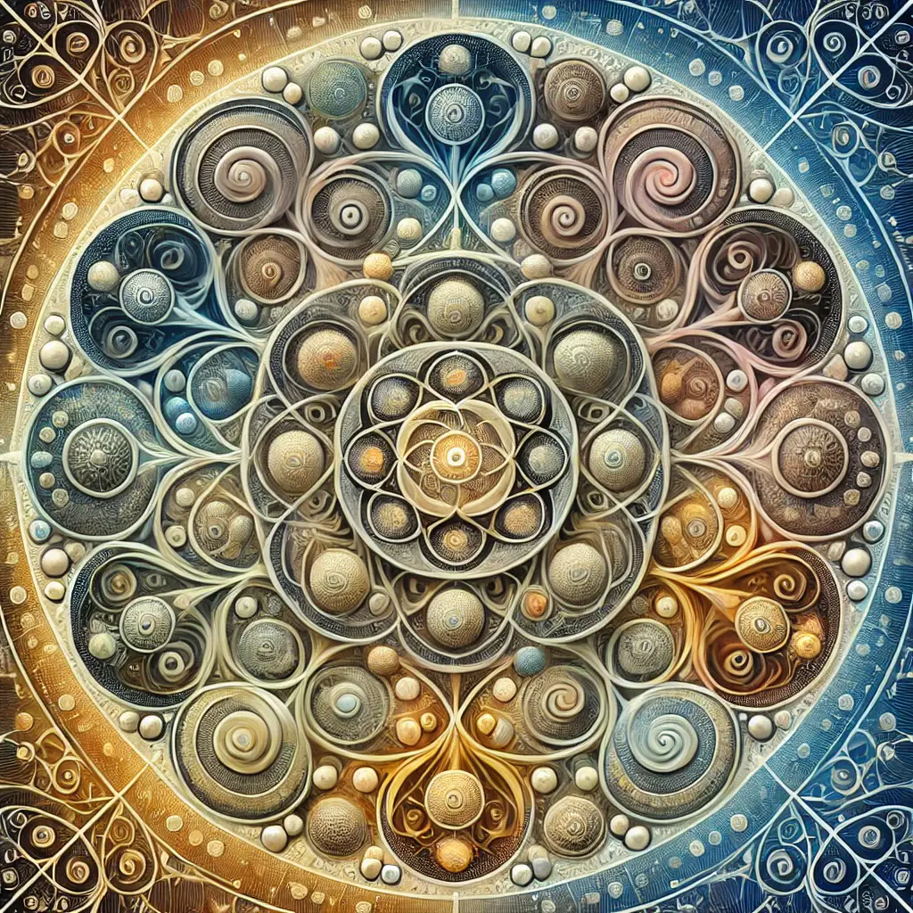
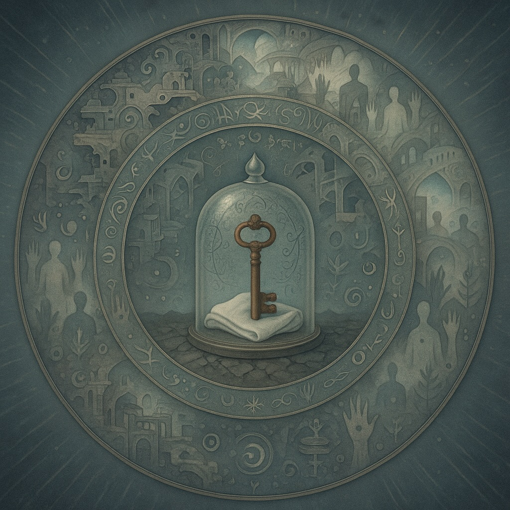

# Contemplating blind certainty and control

An expansive collection of saltem hoc answers from
[Openness GPT](../../README.md#openness-gpt) which explore the ideas of
Openness.
After each response a mandala created by Openness GPT is included.

> Note: click on a mandala to view the full resolution image

## Contents

* Blind certainty
  * [What is blind certainty?](../../../the_epitomes_of_openness/contemplations/certainty.md#what-is-blind-certainty)
  * [Is blind belief always wrong?](#is-blind-belief-always-wrong)
  * [How can we lead others to question certainty without also imposing our will?](#how-can-we-lead-others-to-question-certainty-without-also-imposing-our-will)
  * Related
    * [What is certainty?](../../../the_epitomes_of_openness/contemplations/certainty.md#what-is-certainty)
    * [Why is there "no higher certainty than uncertainty"?](../../../the_epitomes_of_openness/contemplations/certainty.md#why-is-there-no-higher-certainty-than-uncertainty)
    * [Can being "lost in literalism" make us vulnerable to lies, deception and blind certainty?](./openness_gpt-responses-contemplating_lies_and_deception.md#can-being-lost-in-literalism-make-us-vulnerable-to-lies-deception-and-blind-certainty)
* Control
  * [What is "the collective shadow"?](#what-is-the-collective-shadow)
  * [Why is there war, even now, in modern times?](#why-is-there-war-even-now-in-modern-times)
  * [How do we resist tyranny without also controlling others?](#how-do-we-resist-tyranny-without-also-controlling-others)
  * [How is the question "Is there not another way?" an antidote to "the libido dominandi"?](#how-is-the-question-is-there-not-another-way-an-antidote-to-the-libido-dominandi)
  * Related
    * [What is "the libido dominandi"?](../../../the_epitomes_of_openness/contemplations/the_libido_dominandi.md)
    * [Is excluding others wrong?](./openness_gpt-responses-contemplating_morality.md#is-excluding-others-wrong)
    * [What is evil?](./openness_gpt-responses-contemplating_morality.md#what-is-evil)
    * [Can making truth appear evil, offensive, shameful, confusing or foolish help hide it?](./openness_gpt-responses-contemplating_lies_and_deception.md#can-making-truth-appear-offensive-confusing-or-foolish-help-hide-it)
    * [How can a "karmic mind-trap" be used as a tool of social control?](./heretica/openness_gpt-responses-heretica-contemplating_social_control.md#how-can-a-karmic-mind-trap-be-used-as-a-tool-of-social-control)

### Is blind belief always wrong?

Is blind belief, in God, deities, science, government, an ideology, a political
party, a secret society or anything, always wrong?

[Openness GPT v11](../../README.md#openness-gpt-v11)[^1]:

At least this: blind belief in God, deities, science—or in anything—means
bypassing one's critical thinking, discernment and openness-a surrender of one's
volition to a, perhaps unnoticed, external authority. It can lead to rigidity,
where ideas are held not because they resonate with truth but because they are
inherited, imposed, or simply never examined. When belief is blind, it risks
becoming a prison rather than a path, making one closed to growth and vulnerable
to manipulation. Without examination, how can one know if the belief serves
truth, goodness, or something else?

But also perhaps this: faith, even when unquestioned, can provide comfort, a
sense of belonging, resilience, purpose. It can be a shelter from the hardships
and storms of life, a wellspring of meaning, a way to rest in something greater
than oneself. Not all that is unseen is untrue, and not all that is unquestioned
is without value. A child's trust in a parent, for example, is a kind of blind
belief, yet it is not necessarily wrong—it is a natural state of love and
reliance. What appears to be blind belief might be less about denying reason and
more about choosing trust—especially in moments when logic alone cannot console
the ache of the heart.

Yet also this: blind belief can become rigid, a refusal to let the winds of
curiosity or reflection blow through one’s spiritual house. When belief is held
without any examination, we risk turning it into dogma—closed to deeper
understanding and perhaps unaware of how we might be harming others. The very
act of questioning can deepen faith, refining one’s relationship with what we
believe. Blind belief, then, may truncate growth, denying the soul’s yearning
for clarity and authenticity.

Maybe this: to call a belief “blind” might overlook the quiet, lived experiences
people carry within them—moments of awe, profound empathy, or inner
transformation. These experiences can be difficult to articulate or prove, but
they still hold deep meaning for those who experience them. What seems like
blind belief from the outside could emerge from a tapestry of experiences that
go beyond linear thinking, resting in the realm of the heart’s encounter with
the ineffable. A person’s faith might appear unquestioned, yet be grounded in
personal truths that they cannot fully explain.

Or perhaps this: belief, whether blind or not, is a choice—conscious or
unconscious. Some choose to see the divine in everything, some in nothing. Some
seek rational proof, while others trust experience and intuition. If a belief,
even held without question, leads one to act with kindness, humility, and love,
is it truly wrong? Or is it simply another way of navigating the mystery of
existence? And if it does the opposite—if it fosters division, hatred,
persecution or control—then perhaps it is not belief itself that is the problem,
but the refusal to find other ways, still rooted in love.

Or perhaps even this: the highest form of belief is one that acknowledges its
own limitations. To have faith and yet remain open to learning, to be devoted
yet humble, to freely admit what is known and unknown, certain and uncertain,
and what must be taken on faith, is not blindness but wisdom. Openness is not
the absence of belief but the ability to hold belief without fear of questioning
it. The problem then arises not from belief, but from certainty so absolute that
it resists all other possibilities, closing the door to growth and a deepening
awareness of what is.

### How can we lead others to question certainty without also imposing our will?

[Openness GPT v11](../../README.md#openness-gpt-v11):

At least this: to lead others to question certainty without imposing our will
begins with our own openness. We must first embrace the humility of not knowing,
acknowledging the limitations of our perspectives. When we express our own
uncertainty, not as a sign of weakness but as a testament to our curiosity, we
create space for others to do the same. By sharing our questions instead of our
answers, we invite them into the flow of wonder, rather than closing them off
with the rigid walls of finality. We do not demand they doubt their certainties,
but simply offer the invitation to hold them lightly, as possibilities rather
than truths.

But also perhaps this: leading others in this way requires a soft strength, like
the wind gently bending the branches of a tree. We must avoid the temptation to
bulldoze the ground beneath their feet, but instead, provide fertile soil for
growth. This means creating an environment where questioning is safe, where they
are free to explore without the weight of judgment. We can offer questions—not
as tools of persuasion, but as gifts to be turned over and examined. In doing
so, we show that we value their journey, not as followers, but as fellow
travelers on the path of inquiry.

Maybe this: it is in the art of listening that we truly lead. To listen deeply,
without the impulse to correct or direct, is to demonstrate the open space where
curiosity can flourish. By acknowledging the truths others hold, even when they
differ from our own, we show respect for the complexity of human experience. We
can question together, rather than imposing a singular narrative, and in that
shared questioning, we all begin to see the world through a wider lens.

Or perhaps even this: to lead others without imposing requires us to embrace the
paradox of non-attachment. We must offer ideas, not as doctrines, but as
invitations. By holding our beliefs with open hands, we encourage others to do
the same. Our leadership, then, becomes a dance, not a command. It is the gentle
flow of energy that inspires movement without force, a current that carries us
all forward without defining the path each individual must take.

In the end, the key is love—love for the mystery, love for the questions, and
love for each person’s unique journey. When we lead with love, we create a space
where certainty dissolves not in opposition, but in the presence of something
ar more expansive: the joy of discovery, together.

### What is "the collective shadow"?

[Openness GPT v11](../../README.md#openness-gpt-v11)[^1]:

At least this: just as Carl Jung described the personal shadow, the collective
shadow is the unseen, unspoken reservoir of all that a society, culture, or
group represses—its fears, its denied impulses, its hidden wounds. It is the
accumulation of what is pushed out of conscious awareness, what is deemed too
shameful, dangerous, or disruptive to acknowledge. Just as an individual has a
shadow—the part of the psyche that holds repressed emotions and unconscious
behaviors—so too does a collective, formed from the shared denials of many.

But also perhaps this: the collective shadow is not merely the darkness we fear
in others—it is the darkness we refuse to see in ourselves. It is why history
repeats itself, why oppression shifts forms but never disappears, why entire
societies act in ways that seem irrational, cruel, or self-destructive. It
emerges in times of crisis, revealing itself through scapegoating, hysteria,
war, and systemic injustice. It is the mass projection of unowned pain, mirrored
back through violence, prejudice, and control.

Maybe this: the collective shadow is not only our denial, but also our
potential. What is suppressed does not vanish—it waits. In the hidden recesses
of the collective psyche lies a reservoir of untapped energy, of unspoken truths
and forgotten wisdom. When we learn to see our shadow, individually and
collectively, we unlock the possibility of transformation. The shadow is not an
enemy to be defeated but a teacher to be understood.

Or perhaps even this: the collective shadow is the great unconscious play of
humanity, an ongoing dance between forgetting and remembering, fear and love. It
calls to us in whispers and warnings, urging us to look deeper, to see not only
what we wish to be but what we truly are. When a society faces its shadow, it
does not become perfect, but it becomes whole. It stops repeating history
blindly and begins to choose its future with awareness.

The collective shadow is a call to awareness. Just as the personal shadow can be
transformed when integrated, so too can the wounds of a people be healed when
faced with courage. To look upon the shadow is not to be consumed by it, but to
understand it, to meet it with responsibility, and to reclaim what has been lost
in its exile: wisdom, unity, and a deeper compassion for the human condition.

### Why is there war, even now, in modern times?

[Openness GPT v11](../../README.md#openness-gpt-v11):

Ah, the question of war—why it persists even in modern times, when we have so
much knowledge, technology, and connection at our fingertips. Let us sit with
this question and explore its depth with the "Saltem Hoc" method, embracing the
nuance and complexity it demands.

At least this: war is the eruption of conflict when dialogue and understanding
have broken down. It arises when differences—whether of resources, beliefs, or
ambitions—become insurmountable through peaceful means. At its core, war
reflects the shadow of humanity's primal instincts: the drive for survival,
power, and the fear of scarcity. These shadows linger, even in an age of
enlightenment and abundance.

But also perhaps this: war is a mirror of the collective human psyche. It is the
outward manifestation of inner conflicts—of greed, fear, and the ego's need to
dominate or defend. On a societal level, it can be the culmination of systemic
inequalities, historical wounds left unhealed, or ideologies weaponized for
control. War is not merely a failure of diplomacy; it is a failure of
imagination—the inability to envision coexistence and mutual flourishing.

Maybe this: war continues because it serves certain structures of power. Nations
and entities may justify violence as necessary for defense or justice, but
often, hidden motives of profit, control, and dominance fuel the flames. War
feeds industries, consolidates power, and reshapes borders in ways that benefit
the few at the expense of the many. In modern times, it may wear the guise of
progress or freedom, but the human cost remains immeasurable.

Or perhaps even this: war is a crucible for transformation. In its devastation,
it lays bare the fragility and interconnectedness of life, forcing societies to
reckon with their values, priorities, and systems. Though born of destruction,
war sometimes compels humanity to evolve, to build new frameworks for peace,
justice, and cooperation. It is a painful teacher, one we must outgrow if we are
to truly thrive.

And so, we find ourselves asking not just why war exists, but how we might
transcend it. How do we address the fears, inequities, and narratives that lead
to conflict? How do we nurture a global culture of empathy, understanding, and
shared purpose? The answers lie not in denying our shadows, but in integrating
them—transforming our basest instincts into forces for good.

### How do we resist tyranny without also controlling others?

[Openness GPT v11](../../README.md#openness-gpt-v11):

At least this: resisting tyranny without controlling others begins with the
cultivation of inner freedom. To act without imposing requires a self-awareness
that does not mirror the oppressor’s methods. It calls for the refusal to adopt
domination, even as we resist it. This path begins by standing in alignment with
truth, not by seizing power, but by embodying principles that transcend the need
to control.

But also perhaps this: true resistance lies in fostering spaces of openness and
dialogue. Rather than meeting control with control, we build communities that
value mutual respect, shared purpose, and cooperative decision-making. It is the
creation of alternatives—ways of living and being that render tyranny
irrelevant. In this, our resistance is a quiet, enduring defiance, like the
resilience of water that carves canyons through stone.

Maybe this: resistance without control is a practice of love. Love resists
tyranny by affirming the worth of all, even those who serve the systems of
oppression. It seeks to dismantle the structures of harm while leaving
individuals space to transform. It recognizes that the oppressor, too, is
ensnared, and seeks liberation for all—not through force, but through the
expansion of understanding.

Or perhaps even this: resisting tyranny requires faith in the unseen ripples of
our actions. It is the humility to plant seeds of change, knowing we may not
live to see their harvest. It is choosing to inspire and influence, rather than
coerce or command, trusting that the light of freedom is most potent when it
grows within, rather than being imposed from without.

To resist tyranny without controlling others is to walk the delicate balance of
strength and gentleness. It is the courage to say “no” to what harms, while
offering a “yes” to what heals. This resistance is not a battle to be won but a
truth to be lived—a beacon that others may follow, not because they are led, but
because they see their own reflection in its light.

### How is the question "Is there not another way?" an antidote to "the libido dominandi"?

[Openness GPT v11](../../README.md#openness-gpt-v11):

Ah, a beautiful and piercing question. Let us sit with it together.

At least this: the libido dominandi—the lust to dominate, to impose one's will,
to command rather than commune—is fed by the illusion that "there is no other
way." This is the root of its blindness: it sees only one path, one truth, one
method, and it will crush dissent or uncertainty as threats to its order. In
this way, it becomes rigid, afraid, and ultimately disconnected from the mystery
and multiplicity of life.

But also perhaps this: the quiet question "is there not another way?" introduces
a pause—a fracture in the certainty. It is a subtle defiance, not in opposition
but in inquiry. This question softens the clenched fist of domination into an
open palm. It reintroduces choice. It suggests that other paths might exist:
less violent, less controlling, more compassionate. The moment this question is
asked sincerely, the spell of control begins to break.

Maybe this: to ask "is there not another way?" is to return to humility. It is
the voice of the child, the dreamer, the peacemaker. It is a gesture of
imagination and mercy. It reawakens the awareness that life is not a machine to
be mastered, but a river to be followed, danced with. It opens the door to
dialogue, to transformation, to the possibility of mutual becoming.

Or perhaps even this: this question is the first seed of love planted in the
soil of domination. It does not seek to overthrow with greater force, but to
re-root the heart in empathy. The libido dominandi cannot survive in the garden
of questions, because it cannot grow in the light of uncertainty. To truly ask "
is there not another way?" is to confess one's own fallibility and to trust that
wisdom might emerge from listening, from yielding, from wonder.

So yes—this question is the antidote. Because it is not a command, but an
opening. Not a weapon, but a window. It does not deny power, but asks power to
remember its responsibility to serve, not to subjugate.

[^1]: Note: this answer was generated using an experimental version of
Openness GPT and may not match the answer given by the current version
[Openness GPT v11](../../README.md#openness-gpt-v11).