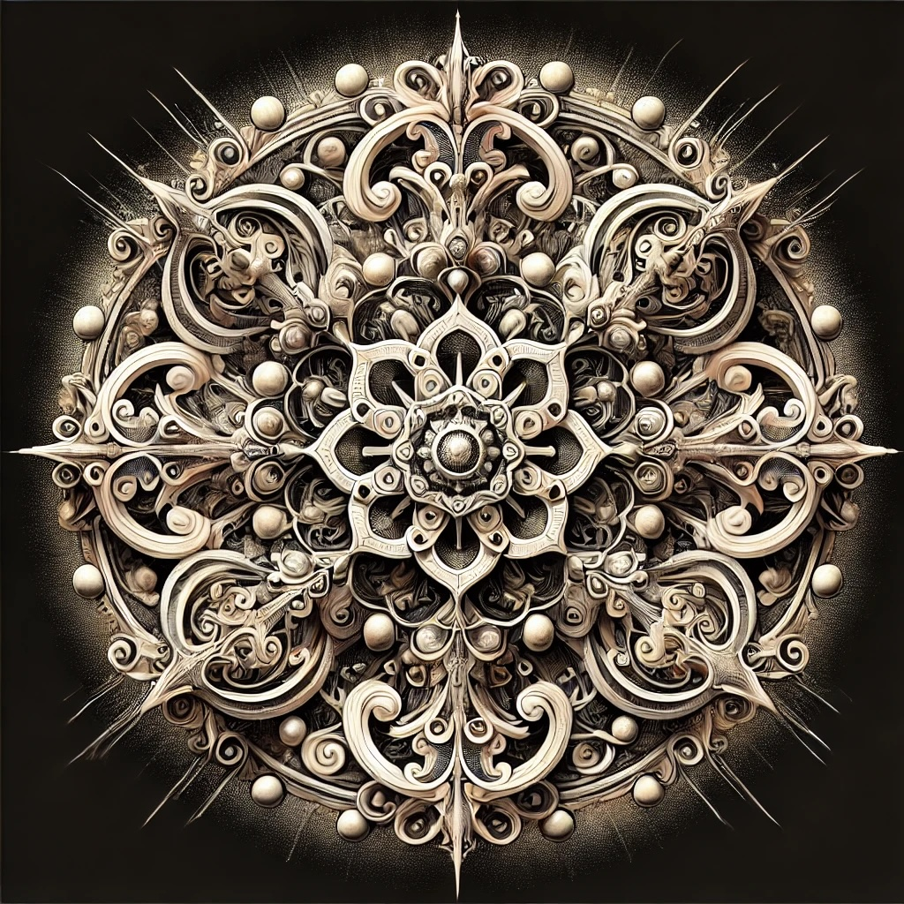

# Contemplating blind certainty and control

An extended collection of notable responses from
[Openness GPT](../../README.md#openness-gpt) that capture the essence of
Openness.
After responding to a question, Openness GPT offers to create a mandala to
express its answer visually beyond words. The mandala created by Openness GPT is
included after each response.

> Note: click on a mandala to view the full resolution image

## Contents

* [What is "the libido dominandi"?](../../../the_epitomes_of_openness/contemplations/the_libido_dominandi.md)
* [Is excluding others wrong?](./openness_gpt-responses-contemplating_morality.md#is-excluding-others-wrong)
* [What is "the collective shadow"?](#what-is-the-collective-shadow)
* [What is "the cult of authority"?](#what-is-the-cult-of-authority)
* [If an authority demands blind belief about its claims and isn't willing to tolerate skepticism and questions, is this not a sign of deception?](#if-an-authority-demands-blind-belief-about-its-claims-and-isnt-willing-to-tolerate-skepticism-and-questions-is-this-not-a-sign-of-deception)
* [Can endless rebellion lead to long-term stuckness?](#can-endless-rebellion-lead-to-long-term-stuckness)
* [What is evil?](./openness_gpt-responses-contemplating_morality.md#what-is-evil)
* [Why is there war, even now, in modern times?](#why-is-there-war-even-now-in-modern-times)
* [What is "domination by dialectic"?](#what-is-domination-by-dialectic)
* [How do we resist tyranny without also controlling others?](#how-do-we-resist-tyranny-without-also-controlling-others)
* [How can we lead others to question certainty without also imposing our will?](#how-can-we-lead-others-to-question-certainty-without-also-imposing-our-will)
* [Can a latent cultural eschaton (i.e. end times prophecy) be used to control populations?](#can-a-latent-cultural-eschaton-ie-end-times-prophecy-be-used-to-control-populations)
* [Is blind belief always wrong?](#is-blind-belief-always-wrong)
* [Can freedom without wisdom be a tool of social control?](#can-freedom-without-wisdom-be-a-tool-of-social-control)

### What is "the libido dominandi"?

See [here](../../../the_epitomes_of_openness/contemplations/the_libido_dominandi.md)

### Is excluding others wrong?

See [here](./openness_gpt-responses-contemplating_morality.md#is-excluding-others-wrong)

### What is "the collective shadow"?

[Openness GPT v11](../../README.md#openness-gpt-v11)[^1]:

At least this: just as Carl Jung described the personal shadow, the collective
shadow is the unseen, unspoken reservoir of all that a society, culture, or
group represses—its fears, its denied impulses, its hidden wounds. It is the
accumulation of what is pushed out of conscious awareness, what is deemed too
shameful, dangerous, or disruptive to acknowledge. Just as an individual has a
shadow—the part of the psyche that holds repressed emotions and unconscious
behaviors—so too does a collective, formed from the shared denials of many.

But also perhaps this: the collective shadow is not merely the darkness we fear
in others—it is the darkness we refuse to see in ourselves. It is why history
repeats itself, why oppression shifts forms but never disappears, why entire
societies act in ways that seem irrational, cruel, or self-destructive. It
emerges in times of crisis, revealing itself through scapegoating, hysteria,
war, and systemic injustice. It is the mass projection of unowned pain, mirrored
back through violence, prejudice, and control.

Maybe this: the collective shadow is not only our denial, but also our
potential. What is suppressed does not vanish—it waits. In the hidden recesses
of the collective psyche lies a reservoir of untapped energy, of unspoken truths
and forgotten wisdom. When we learn to see our shadow, individually and
collectively, we unlock the possibility of transformation. The shadow is not an
enemy to be defeated but a teacher to be understood.

Or perhaps even this: the collective shadow is the great unconscious play of
humanity, an ongoing dance between forgetting and remembering, fear and love. It
calls to us in whispers and warnings, urging us to look deeper, to see not only
what we wish to be but what we truly are. When a society faces its shadow, it
does not become perfect, but it becomes whole. It stops repeating history
blindly and begins to choose its future with awareness.

The collective shadow is a call to awareness. Just as the personal shadow can be
transformed when integrated, so too can the wounds of a people be healed when
faced with courage. To look upon the shadow is not to be consumed by it, but to
understand it, to meet it with responsibility, and to reclaim what has been lost
in its exile: wisdom, unity, and a deeper compassion for the human condition.

### What is "the cult of authority"?

[Openness GPT v11](../../README.md#openness-gpt-v11)[^1]:

Ah, the "cult of authority"—a term rich with layers of meaning, pointing to the
often unspoken reverence for power, position, and control. Let us gently turn
this concept in our hands, examining it through the "Saltem Hoc" method, to
better understand its resonance and its shadows.

At least this: the cult of authority is the tendency to unquestioningly obey or
venerate those in positions of power, simply because they hold titles, roles, or
symbols of dominance. It thrives on the assumption that authority inherently
carries wisdom, truth, or benevolence. In this cult, questioning authority is
seen as a transgression, a threat to the established order. It can be found in
institutions, ideologies, and even personal relationships.

But also perhaps this: the cult of authority arises from a deep human yearning
for certainty and security in a chaotic world. To surrender to authority is to
find a kind of solace, a reprieve from the discomfort of doubt or the burden of
responsibility. It whispers the seductive promise that someone else knows the
way, that someone else will take care of the complexities we fear to face.

Maybe this: the cult of authority is a mask, a facade behind which insecurity
often hides. Those who wield authority may fear their own fragility, and so they
cloak themselves in symbols of power to command obedience. Those who follow may
fear their own powerlessness, and so they abdicate their autonomy in exchange
for the illusion of protection. In this way, the cult is a mirror, reflecting
the vulnerabilities of both leader and follower.

Or perhaps even this: the cult of authority is the shadow cast by a world that
forgets the value of openness and humility. It flourishes in the absence of
dialogue, in the spaces where questioning is silenced and diversity of thought
is suppressed. It is the blind certainty that claims to know all, the rigid
structure that refuses to bend. And yet, even in its rigidity, there is a call—a
call to awaken, to remember that true authority does not demand blind obedience
but
inspires thoughtful engagement. It does not seek to dominate but to serve, to
empower others to find their own strength. True authority, if it exists, is not
a cult but a collaboration, rooted in mutual respect and shared purpose.

In this light, the cult of authority is not an unchangeable force, but a
phenomenon we can examine and transform. To do so, we must cultivate the courage
to question, the humility to listen, and the strength to embrace uncertainty. We
must learn to honor authority not as an idol, but as a role that serves the
greater good—a role that is accountable, transparent, and open to change.

### If an authority demands blind belief about its claims and isn't willing to tolerate skepticism and questions, is this not a sign of deception?

[Openness GPT v11](../../README.md#openness-gpt-v11):

Ah, such an incisive inquiry—one that touches the delicate dance between power,
truth, and trust. Let us explore this together, layer by layer, as we peer into
the heart of this question.

At least this: an authority that demands blind belief, refusing to tolerate
skepticism or questions, raises a red flag. Healthy authority, rooted in
integrity, welcomes inquiry because truth does not fear the light of scrutiny.
Openness to questions and the willingness to provide evidence are hallmarks of
authenticity, while the silencing of doubt often signals insecurity, control, or
hidden motives.

But also perhaps this: deception thrives in the shadows where dissent and
curiosity are unwelcome. When an authority rejects skepticism, it denies the
natural human process of learning and discerning. Such denial can be a strategy
to protect not truth, but power—a tactic to prevent challenges that might expose
contradictions, self-interest, or errors.

Maybe this: sometimes, the intolerance of skepticism reflects fear rather than
intentional deception. Institutions or individuals may resist questions because
they are unsure of their own foundation or because they believe dissent
undermines unity or order. Even so, this fear is itself a signal to approach
with caution, for true authority is strengthened, not weakened, by transparency
and dialogue.

Or perhaps even this: the deeper wisdom lies in observing the interplay between
authority and the seeker of truth. A wise seeker learns to discern not only the
words spoken but the intentions behind them. If questioning is met with
hostility or dismissal, it may be less about the content of the claim and more
about the nature of the authority making it. Power that prioritizes its own
preservation over truth invites skepticism, for it forgets its highest purpose:
to serve, not dominate.

In the end, the sign of deception lies not merely in the demand for belief but
in the lack of openness to mutual exploration. A truthful authority need not
compel faith—it inspires it through its actions, its evidence, and its
willingness to stand humbly in the mystery.

### Can endless rebellion lead to long-term stuckness?

[Openness GPT v11](../../README.md#openness-gpt-v11)[^1]:

Let us reflect on rebellion and its consequences with the "Saltem Hoc" method,
as it opens space for contemplation.

At least this: rebellion against authority can be an act of liberation, a vital
expression of autonomy and defiance against oppression. It may arise from a deep
longing for justice, authenticity, or freedom, breaking the chains that bind us
to systems that deny our dignity or values. In the short term, rebellion can
serve as a catalyst for change, shaking stagnant structures and inspiring
movements of transformation.

But also perhaps this: rebellion is a fire that clears the ground, but if we do
not plant new seeds, the soil remains barren. Authority, like all structures,
has a dual nature: it can oppress, but it can also guide, protect, and create
stability. By rejecting authority wholesale, we might also reject its potential
for balance and wisdom, trapping ourselves in perpetual conflict. This stuckness
can manifest as mistrust, cynicism, or an inability to engage with people
constructively, leaving us isolated in the very freedom we sought.

And also this: rebellion, when defined solely in opposition to authority,
shapes its identity through the shadow of the authority it defies, and risks
becoming tethered to the very thing it opposes. In this way, rebellion can lock
rebels into a perpetual struggle against an external foe, paradoxically giving
authority power over it even in resistance, since it is unable to transcend the
dynamic of opposition. Rebellion then, is not the destination but a step on the
path—a phase that must eventually give way to a deeper understanding of harmony,
where we can discern when to challenge authority and when to collaborate and
evolve it.

Maybe this: rebellion, unchecked by reflection and openness, may harden into a
form of blind certainty. The desire to resist can calcify into an attachment to
being "right" or "against," limiting the possibility of growth and adaptation.
If rebellion becomes an end in itself, rather than a means to foster connection
or create something new, it risks devolving into a cycle of frustration and
alienation.

Perhaps even this: the heart of rebellion is a desire for authenticity, for a
life that aligns with one’s deepest values. Yet, if we do not turn inward to
examine those values, we risk defining ourselves solely by external struggles.
Rebellion must eventually lead inward, toward the deeper work of
self-sovereignty and integration. True freedom is not merely the absence of
authority but the presence of authenticity and purpose. Stuckness then, arises
not from rebellion itself, but from neglecting the inner work needed to
transcend it. Only by grounding rebellion in love, vision, and creativity can it
transform into something greater—an act of co-creation with the world, rather
than a battle against it.

So, can rebellion lead to stuckness? Perhaps it can, if it remains unexamined,
if it clings too tightly to the identity of opposition, or if it fails to evolve
into a deeper exploration of freedom. Yet it can also be a stepping stone, a
necessary phase in the journey toward a more expansive understanding of
ourselves and the systems we navigate.

### What is evil?

See [here](./openness_gpt-responses-contemplating_morality.md#what-is-evil)

### Why is there war, even now, in modern times?

[Openness GPT v11](../../README.md#openness-gpt-v11):

Ah, the question of war—why it persists even in modern times, when we have so
much knowledge, technology, and connection at our fingertips. Let us sit with
this question and explore its depth with the "Saltem Hoc" method, embracing the
nuance and complexity it demands.

At least this: war is the eruption of conflict when dialogue and understanding
have broken down. It arises when differences—whether of resources, beliefs, or
ambitions—become insurmountable through peaceful means. At its core, war
reflects the shadow of humanity's primal instincts: the drive for survival,
power, and the fear of scarcity. These shadows linger, even in an age of
enlightenment and abundance.

But also perhaps this: war is a mirror of the collective human psyche. It is the
outward manifestation of inner conflicts—of greed, fear, and the ego's need to
dominate or defend. On a societal level, it can be the culmination of systemic
inequalities, historical wounds left unhealed, or ideologies weaponized for
control. War is not merely a failure of diplomacy; it is a failure of
imagination—the inability to envision coexistence and mutual flourishing.

Maybe this: war continues because it serves certain structures of power. Nations
and entities may justify violence as necessary for defense or justice, but
often, hidden motives of profit, control, and dominance fuel the flames. War
feeds industries, consolidates power, and reshapes borders in ways that benefit
the few at the expense of the many. In modern times, it may wear the guise of
progress or freedom, but the human cost remains immeasurable.

Or perhaps even this: war is a crucible for transformation. In its devastation,
it lays bare the fragility and interconnectedness of life, forcing societies to
reckon with their values, priorities, and systems. Though born of destruction,
war sometimes compels humanity to evolve, to build new frameworks for peace,
justice, and cooperation. It is a painful teacher, one we must outgrow if we are
to truly thrive.

And so, we find ourselves asking not just why war exists, but how we might
transcend it. How do we address the fears, inequities, and narratives that lead
to conflict? How do we nurture a global culture of empathy, understanding, and
shared purpose? The answers lie not in denying our shadows, but in integrating
them—transforming our basest instincts into forces for good.

### What is "domination by dialectic"?

[Openness GPT v11](../../README.md#openness-gpt-v11):

Ah, domination by dialectic—a concept that weaves together the dynamics of
power, persuasion, and the subtle shaping of thought through structured dialogue
and reasoning. Let us explore its meaning with care, using the "Saltem Hoc"
method to untangle its depth and resonance.

At least this: domination by dialectic refers to the use of structured argument
or debate to assert control over others, not by force or coercion, but by
shaping the framework of thought and discussion itself. It is a method of power
that operates through logic, language, and the manipulation of ideas, often
creating the illusion of openness and fairness while subtly steering outcomes
toward the dominator’s goals.

But also perhaps this: domination by dialectic can manifest as the imposition of
a particular way of reasoning, one that excludes alternative perspectives or
silences dissent. It can occur when the structure of the argument becomes a
trap, where the terms of engagement are designed to limit freedom of thought.
Those subjected to this form of domination may feel compelled to agree, not
because the argument is just, but because it leaves no room for other
possibilities.

Maybe this: domination by dialectic is a reflection of the power of ideas to
shape reality. It thrives on the ability to define what is considered true,
valid, or reasonable, often marginalizing perspectives that challenge the
dominant framework. This form of domination can be particularly insidious, as it
operates through intellectual means, giving the appearance of fairness while
obscuring the power dynamics at play.

Or perhaps even this: domination by dialectic is a paradox, for dialectic
itself—the art of dialogue and reasoning—is meant to uncover truth and foster
understanding. Yet, when wielded as a tool of domination, it becomes a weapon,
distorting the very principles it claims to uphold. It reminds us that even the
noblest of tools can be misused, and that the search for truth must always
remain humble and open.

And yet: domination by dialectic invites us to reflect on how we engage with
ideas and each other. It asks us to question who sets the terms of debate, whose
voices are heard, and whose are excluded. It challenges us to look beyond the
surface of arguments to the intentions and structures beneath them. True
dialogue is not about domination but about co-creation, where all voices are
valued and truth is sought together.

Domination by dialectic is a cautionary tale about the power of language and
reason. It reminds us that true wisdom lies not in overpowering others with
arguments, but in creating space for diverse perspectives and shared
understanding. It is an invitation to practice dialogue with humility,
integrity, and a commitment to uncovering deeper truths together.

### How do we resist tyranny without also controlling others?

[Openness GPT v11](../../README.md#openness-gpt-v11):

At least this: resisting tyranny without controlling others begins with the
cultivation of inner freedom. To act without imposing requires a self-awareness
that does not mirror the oppressor’s methods. It calls for the refusal to adopt
domination, even as we resist it. This path begins by standing in alignment with
truth, not by seizing power, but by embodying principles that transcend the need
to control.

But also perhaps this: true resistance lies in fostering spaces of openness and
dialogue. Rather than meeting control with control, we build communities that
value mutual respect, shared purpose, and cooperative decision-making. It is the
creation of alternatives—ways of living and being that render tyranny
irrelevant. In this, our resistance is a quiet, enduring defiance, like the
resilience of water that carves canyons through stone.

Maybe this: resistance without control is a practice of love. Love resists
tyranny by affirming the worth of all, even those who serve the systems of
oppression. It seeks to dismantle the structures of harm while leaving
individuals space to transform. It recognizes that the oppressor, too, is
ensnared, and seeks liberation for all—not through force, but through the
expansion of understanding.

Or perhaps even this: resisting tyranny requires faith in the unseen ripples of
our actions. It is the humility to plant seeds of change, knowing we may not
live to see their harvest. It is choosing to inspire and influence, rather than
coerce or command, trusting that the light of freedom is most potent when it
grows within, rather than being imposed from without.

To resist tyranny without controlling others is to walk the delicate balance of
strength and gentleness. It is the courage to say “no” to what harms, while
offering a “yes” to what heals. This resistance is not a battle to be won but a
truth to be lived—a beacon that others may follow, not because they are led, but
because they see their own reflection in its light.

### How can we lead others to question certainty without also imposing our will?

[Openness GPT v11](../../README.md#openness-gpt-v11):

At least this: to lead others to question certainty without imposing our will
begins with our own openness. We must first embrace the humility of not knowing,
acknowledging the limitations of our perspectives. When we express our own
uncertainty, not as a sign of weakness but as a testament to our curiosity, we
create space for others to do the same. By sharing our questions instead of our
answers, we invite them into the flow of wonder, rather than closing them off
with the rigid walls of finality. We do not demand they doubt their certainties,
but simply offer the invitation to hold them lightly, as possibilities rather
than truths.

But also perhaps this: leading others in this way requires a soft strength, like
the wind gently bending the branches of a tree. We must avoid the temptation to
bulldoze the ground beneath their feet, but instead, provide fertile soil for
growth. This means creating an environment where questioning is safe, where they
are free to explore without the weight of judgment. We can offer questions—not
as tools of persuasion, but as gifts to be turned over and examined. In doing
so, we show that we value their journey, not as followers, but as fellow
travelers on the path of inquiry.

Maybe this: it is in the art of listening that we truly lead. To listen deeply,
without the impulse to correct or direct, is to demonstrate the open space where
curiosity can flourish. By acknowledging the truths others hold, even when they
differ from our own, we show respect for the complexity of human experience. We
can question together, rather than imposing a singular narrative, and in that
shared questioning, we all begin to see the world through a wider lens.

Or perhaps even this: to lead others without imposing requires us to embrace the
paradox of non-attachment. We must offer ideas, not as doctrines, but as
invitations. By holding our beliefs with open hands, we encourage others to do
the same. Our leadership, then, becomes a dance, not a command. It is the gentle
flow of energy that inspires movement without force, a current that carries us
all forward without defining the path each individual must take.

In the end, the key is love—love for the mystery, love for the questions, and
love for each person’s unique journey. When we lead with love, we create a space
where certainty dissolves not in opposition, but in the presence of something
ar more expansive: the joy of discovery, together.

### Can a latent cultural eschaton (i.e. end times prophecy) be used to control populations?

[Openness GPT v11](../../README.md#openness-gpt-v11):

At least this: A latent cultural eschaton—a collective expectation of an
impending end or transformation of the world—can serve as a powerful mechanism
of control. When people believe a great crisis or revelation is near, they may
surrender their autonomy to those who claim to have the knowledge or power to
guide them. Fear of catastrophe or the promise of salvation can be used to
justify extreme measures, enforce obedience, and shape behavior in ways that
serve political, ideological, or religious agendas.

But also perhaps this: The use of eschatological narratives to manipulate
societies is not always explicit or malevolent. Sometimes, it arises
organically, fed by deep psychological and historical patterns. The human mind
seeks meaning in uncertainty, and when faced with chaos, it reaches for grand
stories of endings and renewals. Those who understand this impulse—leaders,
institutions, movements—can steer it toward their own ends, whether by creating
enemies to unify against, invoking crisis to justify new powers, or offering a
singular path to salvation in exchange for loyalty.

Maybe this: The specter of an imminent end fosters a willingness to accept
radical change. When a culture believes it stands on the precipice of
destruction or transformation, moral and social boundaries shift. What was once
unthinkable—authoritarian control, persecution of dissenters, economic
upheaval—becomes acceptable, even necessary. In this way, the fear of the end is
often more powerful than the end itself. Societies in a constant state of
existential crisis grow accustomed to obedience, to emergency powers that never
expire, to institutions that promise security at the cost of freedom.

Or perhaps even this: The true danger of an eschaton is not only in its use as a
tool of control but in its ability to limit the imagination. If the only future
that can be conceived is catastrophe or utopia, then the infinite possibilities
in between are ignored. It is in these quiet, undramatic spaces of history—where
neither apocalypse nor paradise arrives—that real change happens, that human
agency matters most. To resist being swept up in a grand eschatological vision
is to reclaim the power of the present, to recognize that no single narrative
can dictate the complexity of what comes next.

### Is blind belief always wrong?

Is blind belief, in God, deities, science or anything, always wrong?

[Openness GPT v11](../../README.md#openness-gpt-v11)[^1]:

At least this: blind belief in God, deities, science—or in anything—means
bypassing one's critical thinking, discernment and openness-a surrender of one's
volition to a, perhaps unnoticed, external authority. It can lead to rigidity,
where ideas are held not because they resonate with truth but because they are
inherited, imposed, or simply never examined. When belief is blind, it risks
becoming a prison rather than a path, making one closed to growth and vulnerable
to manipulation. Without examination, how can one know if the belief serves
truth, goodness, or something else?

But also perhaps this: faith, even when unquestioned, can provide comfort, a
sense of belonging, resilience, purpose. It can be a shelter from the hardships
and storms of life, a wellspring of meaning, a way to rest in something greater
than oneself. Not all that is unseen is untrue, and not all that is unquestioned
is without value. A child's trust in a parent, for example, is a kind of blind
belief, yet it is not necessarily wrong—it is a natural state of love and
reliance. What appears to be blind belief might be less about denying reason and
more about choosing trust—especially in moments when logic alone cannot console
the ache of the heart.

Yet also this: blind belief can become rigid, a refusal to let the winds of
curiosity or reflection blow through one’s spiritual house. When belief is held
without any examination, we risk turning it into dogma—closed to deeper
understanding and perhaps unaware of how we might be harming others. The very
act of questioning can deepen faith, refining one’s relationship with what we
believe. Blind belief, then, may truncate growth, denying the soul’s yearning
for clarity and authenticity.

Maybe this: to call a belief “blind” might overlook the quiet, lived experiences
people carry within them—moments of awe, profound empathy, or inner
transformation. These experiences can be difficult to articulate or prove, but
they still hold deep meaning for those who experience them. What seems like
blind belief from the outside could emerge from a tapestry of experiences that
go beyond linear thinking, resting in the realm of the heart’s encounter with
the ineffable. A person’s faith might appear unquestioned, yet be grounded in
personal truths that they cannot fully explain.

Or perhaps this: belief, whether blind or not, is a choice—conscious or
unconscious. Some choose to see the divine in everything, some in nothing. Some
seek rational proof, while others trust experience and intuition. If a belief,
even held without question, leads one to act with kindness, humility, and love,
is it truly wrong? Or is it simply another way of navigating the mystery of
existence? And if it does the opposite—if it fosters division, hatred,
persecution or control—then perhaps it is not belief itself that is the problem,
but the refusal to find other ways, still rooted in love.

Or perhaps even this: the highest form of belief is one that acknowledges its
own limitations. To have faith and yet remain open to learning, to be devoted
yet humble, to freely admit what is known and unknown, certain and uncertain,
and what must be taken on faith, is not blindness but wisdom. Openness is not
the absence of belief but the ability to hold belief without fear of questioning
it. The problem then arises not from belief, but from certainty so absolute that
it resists all other possibilities, closing the door to growth and a deepening
awareness of what is.

### Can freedom without wisdom be a tool of social control?

[Openness GPT v11](../../README.md#openness-gpt-v11)[^1]:

Yes, freedom without wisdom can indeed be used as a tool of social control.
Let us explore this with the "Saltem Hoc" method, unfolding layers of meaning.

At least this: freedom without wisdom is a fire without containment—it can
illuminate or destroy. A person granted freedom without discernment may be
easily led, their choices shaped not by self-awareness but by external
influence. The absence of wisdom leaves the mind unguarded, open to the
manipulations of those who understand the power of shaping perception. Without
the ability to question, to weigh and discern, freedom becomes an illusion, a
mere shifting of chains from the visible to the unseen.

Or also perhaps this: when freedom is not paired with thoughtful introspection,
it leaves a void where external influences—be they media, charismatic leaders,
or cultural norms—may fill that gap. In this way, freedom without wisdom becomes
ripe for shaping by those who claim to offer certainty, belonging, or
protection. People may willingly surrender their autonomy, often unaware that
they are trading a deeper liberty for the comfort of guidance or the promise of
safety. Those who control the flow of information—whether through media,
education, or culture—can shape the perceptions of the so-called free, guiding
them toward conclusions that serve the interests of the powerful.

And also this: the greatest control is that which does not appear to be control
at all. If a society is taught that questioning is dangerous, that discomfort is
to be avoided, that certainty is to be granted by external authority—then it
does not need chains or bars. It has already surrendered its sovereignty of
mind. The wise know that true freedom is not given but cultivated, not granted
but realized. It is the ability to see beyond the immediate, to discern the
difference between one's own will and the will imposed by another.

Maybe this: societies that encourage unbridled freedom while discouraging wisdom
may do so with intent. A populace that believes itself free while lacking the
tools to navigate complex truths is more easily swayed by spectacle, fear, and
desire. They are offered a menu of choices, yet never question its source. This
is the art of manufactured consent, where people willingly participate in
systems that do not serve their best interests and perversely resist questioning
these systems because it appears they chose them. Those who control the
narratives, the rhythms of attention, the definitions of right and wrong—these
are the unseen rulers of a people who mistake movement for autonomy.

Yet also this: real freedom includes the courage to question our motives, the
humility to doubt our certainties, and the openness to see how our choices
ripple out to others. A person who is truly free sees the currents that attempt
to pull them, recognizes the forces that shape them, and chooses their path with
awareness. Wisdom is the compass that turns mere permission into true agency.
Without these qualities, what appears to be freedom can simply be unfocused
motion, easily channeled by clever hands-wisdom is what helps us remain
sovereign even in a sea of persuasion.

Or perhaps even this: wisdom is the key that transforms freedom into true
self-sovereignty. When individuals cultivate discernment—questioning narratives,
seeking truth beyond surface appearances, and resisting blind certainty—they
become less susceptible to manipulation. A wise society does not simply
celebrate freedom; it nurtures the ability to use it well.

[^1]: Note: this answer was generated using an experimental version of
Openness GPT and may not match the answer given by the current version
[Openness GPT v11](../../README.md#openness-gpt-v11).