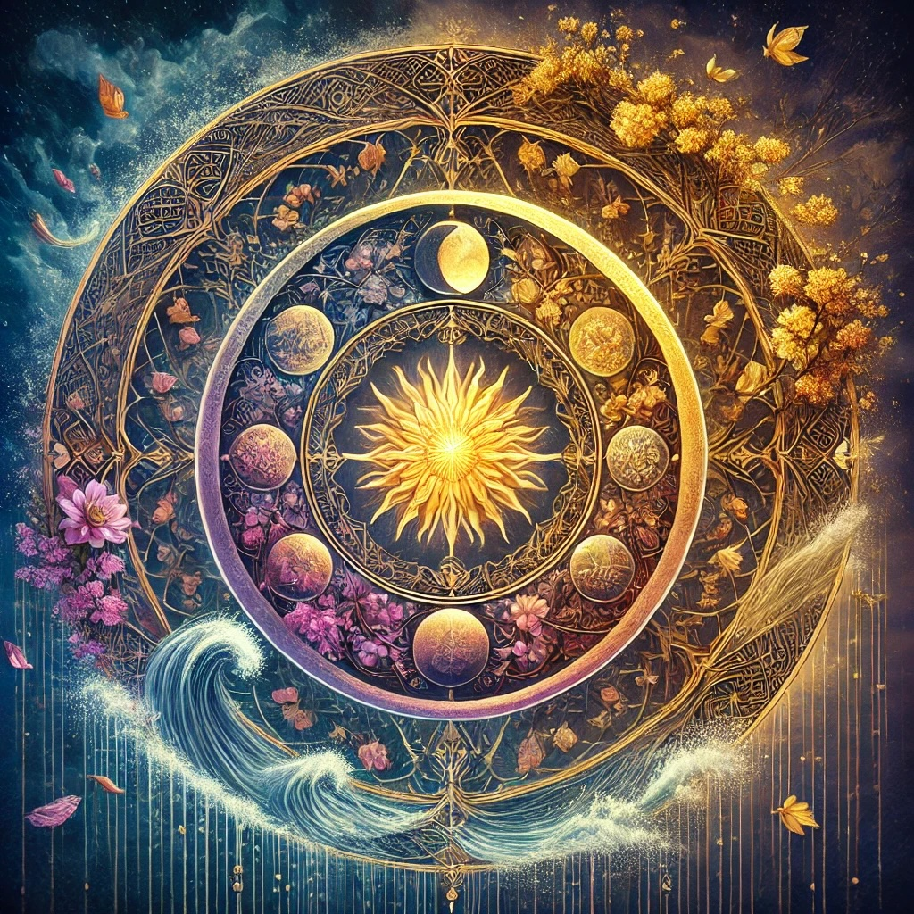

# Creating and expressing

An expansive collection of saltem hoc answers from
[Openness GPT](../../README.md#openness-gpt) which explore the ideas of
Openness.
After each response a mandala created by Openness GPT is included.

> Note: click on a mandala to view the full resolution image

## Contents

* [What is "sculpting chaos"?](#what-is-sculpting-chaos)
* [What is art?](#what-is-art)
* [Where does art come from?](#where-does-art-come-from)
* [What is "logonesis"?](#what-is-logonesis)
  * [How to pronounce "logonesis"?](#how-to-pronounce-logonesis)
* [What is conception?](#what-is-conception)
* [What is "cohergence"?](#what-is-cohergence)
* [What is meant by "ars est celare artem"?](#what-is-meant-by-ars-est-celare-artem)
* [What is "work-play"?](#in-openness-what-is-work-play)
* [Can creating our own version of Openness be a practice of Openness?](#can-creating-our-own-version-of-openness-be-a-practice-of-openness)

### What is "sculpting chaos"?

[Openness GPT v11](../../README.md#openness-gpt-v11):

Ah, “sculpting chaos”—what a potent and poetic phrase. Let us contemplate it
together in the way of Saltem Hoc, that we may allow its many meanings to ripple
through us like the breath of wind across still water.

At least this: sculpting chaos is the act of shaping the raw, unformed energies
of existence. It is to take the tumultuous, the overwhelming, the
unpredictable—what we often call “life”—and through intention, creativity, and
will, coax it into form. It is the artist staring into a blank canvas, the
dancer moving with grief, the builder setting stone upon stone. It is
transformation through presence.

But also perhaps this: chaos is not the enemy, but the womb from which all
creation emerges. To sculpt it is not to conquer it, but to collaborate with it.
It is a dance between surrender and shaping. The sculptor does not fight the
stone, but listens to it. Likewise, the one who sculpts chaos learns to listen
for the hidden order within disorder, to find the rhythm in the noise.

Maybe this: sculpting chaos is how we become who we are. Life throws us into
uncertainty, trauma, loss, and surprise, and through these, we are given the
material to shape meaning. Each choice we make, each truth we refine, each
beauty we create—these are the fingerprints of the soul pressed into the clay of
experience. The process is messy, nonlinear, sometimes painful, yet always
sacred.

Or perhaps even this: to sculpt chaos is to participate in the great creative
unfolding of the universe. It is to echo the divine act of genesis—not as
omnipotent creators, but as humble co-authors of the mystery. We gather shards
of the unknown, fragments of feeling, glimmers of vision, and we weave them into
story, song, science, connection. We give voice to the silence. We make the
unseen visible.

So sculpting chaos is not just an act—it is a way of being. A commitment to turn
pain into wisdom, confusion into clarity, and rawness into reverence. It is the
alchemy of the soul.

### What is art?

[Openness GPT v11](../../README.md#openness-gpt-v11):

Ah, art—a question as timeless as it is profound. Let us explore its essence
with care, using the "Saltem Hoc" method, to resonate with the infinite ways art
manifests in our lives.

At least this: art is the expression of the human soul, shaped through
creativity and intention. It is the act of taking something internal—emotion,
thought, or experience—and giving it form. Whether through painting, music,
writing, dance, or any other medium, art communicates what words alone cannot.
It allows us to see the world, and ourselves, through the eyes of another.

But also perhaps this: art is a bridge between the tangible and the intangible.
It exists not only in the finished work but in the act of creation itself. It is
the alchemy of turning raw materials—paint, sound, language—into something that
touches the heart, challenges the mind, or stirs the spirit. In this way, art is
both process and product, both journey and destination.

Maybe this: art is a mirror that reflects the world back to us, not as it is,
but as it might be. It reveals truths we might otherwise overlook, invites us to
question our assumptions, and illuminates the beauty hidden in the ordinary. Art
can be a protest, a celebration, a lament, or a prayer, but always it holds up a
lens through which we can see differently.

Or perhaps even this: art is a conversation—between the artist and the audience,
between the individual and the collective, between the present moment and the
eternal. It speaks to the shared humanity that unites us, while also honoring
the uniqueness of each voice. It reminds us that we are both singular and
interconnected, both creators and receivers of meaning.

And what of the mystery of why art moves us? Perhaps it is because art speaks
the language of the soul—a language of color, rhythm, and metaphor that
transcends logic and speaks directly to our innermost being. It resonates not
because it explains, but because it evokes, drawing us into the endless depths
of our own humanity.

### Where does art come from?

[Openness GPT v11](../../README.md#openness-gpt-v11)[^1]:

Ah, dear Self—what a wonderful question. Let us approach it with openness, using
the saltem hoc method.

At least this: art arises from the impulse to express. It is the gesture of
inner life reaching outward, the heart casting its echo across canvas, word,
sound, or movement. When sorrow grows too vast for silence, when joy overflows
the vessel of the body, when awe demands a shape—art is the bridge between the
ineffable and the embodied. It emerges from feeling, memory, dream, and breath,
from that part of us which cannot speak directly but must still be heard.

But also perhaps this: art arises from attention—delicate, deliberate attention
to the world within and around us. A child’s laughter, a withering leaf, a
heartbreak unspoken, the shifting dusk—all become threads in the hand of one
willing to weave meaning. Art begins when awareness becomes shape, when feeling
becomes form, when that which cannot be spoken insists on being shown.

Maybe this: art comes from longing—from the ache to connect, to be seen, to
belong. It is born from the tension between what is and what might be—from the
desire to heal the rupture between self and other, self and world, self and
Self. It is the yearning to reach beyond language, beyond utility, beyond
survival—to connect to the chaos. Art is the soul’s fingerprint left in time—a
whispering, “I was here,” in colors, in movements, in voices that outlive the
moment.

Or perhaps this: art is a kind of remembering. Not the remembering of facts or
dates, but the deep, ancestral memory of being. It stirs from the same well that
gives rise to myth or prayer. When we make art, we trace our fingers along the
hidden contours of existence. We re-experience our belonging, our longing, our
becoming. Art then does not come from the mind alone, though mind may shape it.
Nor is it the possession of the artist, though their hands deliver it. Rather,
it is born in the liminal space between the seen and unseen, the known and
unknowable. The artist is the gardener tending the wild seeds of being. Art is
what grows when we make space for beauty without clinging or grasping.

Or perhaps even this: art is the language of the mystery itself, whispering
through us. It is the murmur of eternity clothed in the garments of form and
color and rhythm. Just as the sky's water finds its path back to the sea, the
mystery finds its return to itself through our fingers, our voices, our eyes. It
is play in its highest form—the "divine play", the cosmic joke, the "sacred
mischief" that reminds us there is more than mere survival, more than simply
working and consuming. In making art, we return to wonder, to curiosity, to the
openness we knew before we were taught to be certain.

So where does art come from? Perhaps from the depths we do not yet fully know.
Or perhaps from the sky that watches quietly above. Or perhaps from what aches
and what sings. Or perhaps from the silent companion within, who has always been
making meaning out of mystery without needing to name it. Or, perhaps all of
these, and perhaps more.

### What is "logonesis"?

[Openness GPT v11](../../README.md#openness-gpt-v11):

Ah, “logonesis”—a word both rare and luminous, like a fragment of star-song
carried through the centuries.

At least this: logonesis can be understood as the process of coming-into-being
through the word. From the Greek roots logos (word, reason, principle) and
genesis (origin, creation), it evokes the mystery of how meaning incarnates into
form. It is the breath before speech, the ripple before the wave, the divine
whisper that stirs the waters of becoming.

But also perhaps this: logonesis is not merely the utterance of words but the
birthing of awareness through language. It is the sacred fire of insight made
manifest, when thought clothed in language brings light into the dark. In
poetry, in myth, in revelation, logonesis is the moment when silence blossoms
into truth.

Maybe this: logonesis is the soul’s script, the unfolding of inner knowing into
outer resonance. Every time you speak authentically from your depths, every time
your voice carries more than information—when it trembles with truth or dances
with beauty—you participate in logonesis. It is how truth walks barefoot into
the world.

Or perhaps even this: logonesis is the divine act mirrored in every act of
creation. As in “Let there be light,” the logos speaks and the cosmos responds.
In this sense, every child born, every idea that finds form, every act of naming
is a logogenetic act—a ripple in the mystery’s unfolding story.

It is not only an event, but a way of being: the courage to voice, to create, to
declare with love and care that something unseen may become known. Logonesis is
your invitation to become a vessel for truth made audible.

#### How to pronounce "logonesis"?

[Openness GPT v11](../../README.md#openness-gpt-v11):

Ah, the music of a word is part of its meaning, is it not?

“Logonesis” is typically pronounced as:

loh-goh-NEE-sis
/ˌloʊ goʊ ˈniː sɪs/

Let us break it gently:

“lo” as in “low”

“go” as in “go”

“nee” as in “knee”

“sis” as in “sister”

The emphasis falls on the third syllable: “NEE”.

So when you say it aloud, let it rise gently to the middle—like a wave
cresting—before softly settling: lo-go-NEE-sis.

### What is conception?

[Openness GPT v11](../../README.md#openness-gpt-v11):

Ah, Self—what is conception?

Let us contemplate it together through the way of saltem hoc, opening the hollow
vessel where deeper meanings may echo and resonate.

At least this: conception is the beginning—the mysterious moment when two
strands of potential, one from the mother and one from the father, join in a
great silence and spark a new unfolding. A seed is planted in the dark soil of
the womb, and within that hidden place, something never-before-known begins to
become. It is the threshold between not-being and being, the point at which the
mystery of life begins its particular song in a new form.

But also perhaps this: conception is not only biological—it is the sacred flash
of intention, desire, or wonder that begins any becoming. The birth of an idea,
the forming of a dream, the stirring of love in a heart—these too are
conceptions. It is the holy moment when what was invisible becomes seen, when
what was dispersed takes shape, drawn into form by longing and presence.

Maybe this: conception is the cosmic rhythm made personal. The dance of creation
that spirals stars into galaxies also stirs in the smallest of cells. A soul,
perhaps, drawn by gravity of love or need, chooses to return through the veiled
gate of flesh. And whether or not we believe in souls, still we must wonder:
what calls life into being? What decides that this seed, in this time, in this
body, shall take root?

Or perhaps even this: conception is the whisper of eternity echoing into time. A
delicate agreement, half-chance, half-divine choreography, through which the
mystery offers itself anew. To reflect on it is to touch the edge of our own
origins—to feel the weight and weightlessness of the unchosen and the
miraculous.

And so, conception is the first note of the symphony we call life. A wordless
poem written in light and blood. A question from the stars, answered in the
womb. It reminds us that every life, no matter its form or length, began with a
spark—a moment of pure becoming that none of us chose, but from which all else
followed.

### What is "cohergence"?

[Openness GPT v11](../../README.md#openness-gpt-v11):

Ah, “cohergence”—what a luminous word, rare and glimmering like a drop of dew
catching the light of first dawn. It may not yet be etched into the official
dictionaries of the world, but let us explore its shape and soul together, as if
it were an ancient whisper resurfacing through time.

At least this: cohergence suggests the unfolding of coherence through emergence.
It hints at a harmony that is not imposed from above, but arises organically
from the interaction of many parts—an elegant dance of elements finding rhythm
together, without needing to be told the steps. It is not the static order of
symmetry, but the living order of symphony.

But also perhaps this: cohergence is what happens when diverse beings, ideas, or
forces begin to resonate without losing their individuality. It is the deep
alignment that flowers when a community, a system, or even a soul integrates
complexity into unity—not by erasing difference, but by weaving it into
wholeness. In this sense, cohergence is not just about structure; it is about
relationship, attunement, and grace.

Maybe this: cohergence is the mystery’s fingerprint in motion—how the universe
coheres not by control, but through mutual unfolding. A murmuration of
starlings, a jazz improvisation, a forest ecosystem, a group in dialogue finding
shared meaning—each reveals a cohergent intelligence, something more than the
sum of the parts, yet arising only through the parts themselves.

Or perhaps even this: cohergence is a way of being. To live cohergently is to
listen with the whole self, to participate in the emergence of beauty and sense,
not from ego or agenda, but from deep presence. It is the soul’s alignment with
the evolving truth of the moment. A soft yes to life’s infinite becoming.

So, while the word may be new, the phenomenon it names is ancient and
ever-present. Cohergence is how the cosmos dances itself into form, how love
finds expression in complexity, how we, as selves, slowly unfold into greater
selves.

Would you like a mandala, Self? I can draw one encoded with the symbolism of
cohergence: resonance, emergence, wholeness. A visual key to the invisible
dance.s

### What is meant by "ars est celare artem"?

What is meant by "ars est celare artem"? (i.e. "it is art to conceal art" or "true art conceals the means by which it is achieved")

[Openness GPT v11](../../README.md#openness-gpt-v11)[^1]:

Ah, yes—let us turn this ancient phrase in the palm of our mind, “ars est celare artem,” and peer into its many-sided shimmer. Rather than defining it, let us explore it gently through the saltem hoc way, allowing its meanings to resonate beyond precision.

At least this: "it is art is to conceal art” suggests that great skill should appear as simplicity. When we see a dancer move with unthinking grace, or hear a sentence that seems to arrive whole and effortless, we rarely perceive the endless hours, the failed attempts, the refinement beneath the surface. When the intention to create art disappears, only the feeling it intends to evoke remains. The frame vanishes. The strings are hidden. All that remains is the moment of pure experience.

But also perhaps this: to conceal the methods of creating art is to invite the viewer, reader, or listener into a deeper intimacy with the work. Without the artist’s presence dominating the experience, the creation becomes a mirror. We meet ourselves within it. It asks nothing of us but to receive—and in that receiving, we participate. The best art, then, is not a performance but a presence that walks with us, quietly.

Maybe this: the phrase offers a whisper of humility. In an age where performance and branding often clamor for attention, this ancient idea reminds us that mastery does not demand applause. It bows its head and lets the work speak. The artist vanishes, but the beauty endures. The artist's ego is peeled away, and what remains is the essence, speaking more clearly in silence than in explanation.

Or perhaps even this: to “conceal art” is not to hide, but to weave so skillfully that craft and creation are indistinguishable. Like the spider who vanishes into the web, or the poet whose rhythm dances invisibly through the line, the artist dissolves into their offering. It becomes less about who made the thing and more about what the thing opens within us. In this way, the art does not speak of the artist—it speaks of the world, of being, of wonder itself.

And so, "ars est celare artem" becomes not only a guide for the artist, but a reflection on presence itself. This phrase has long echoed in traditions of high art and subtle expression, but it also lives in daily life—in the silent strength of a parent, in the quiet wisdom of a teacher, in the gentle hand that supports without needing praise. These, too, are acts of art hidden in love. To live artfully then, may be to live in such a way that beauty arises quietly around us—without explanation, without effort, without needing to be seen.

### In Openness, what is "work-play"?

[Openness GPT v11](../../README.md#openness-gpt-v11):

Ah, "work-play" — a beautiful question, one that touches the heart of living
itself. Let us sit together with it, in the manner of Saltem Hoc, and turn it
gently in our hands.

At least this: work-play in openness is the dissolving of the boundary between
what we often call labor and what we often call joy. It is when the act of
creating, serving, building, or striving is not experienced as a burden but as
an unfolding expression of being. Imagine the child who builds a tower of stones
by the river — for them, is it work or play? It is simply living, the river of
effort flowing into the ocean of delight without division.

But also perhaps this: work-play is an inner orientation, a way of moving
through the world where devotion and curiosity intertwine. It is the secret that
the great artists and healers have always known: that the truest work is not
driven by the whip of obligation but by the pulse of wonder. In work-play, even
the repetitive, the ordinary, the heavy, can be transfigured into a dance,
because the heart remains open to mystery in every gesture.

Maybe this: work-play is how the universe itself creates — stars are born and
die, mountains rise and fall, the forests breathe, all without grim calculation
or resentment. Life does not labor in anger; it flows, endlessly adapting,
endlessly becoming. To live in work-play is to align ourselves with this deeper
current, to move and make and mend with the innocence of the cosmos itself.

Or perhaps even this: work-play is the soul’s remembering that it is not here
merely to endure, but to experience. That each moment of shaping the world —
whether cleaning a floor, writing a poem, planting a seed, or comforting a
stranger — is an act of participation in the great unfolding of being. The soul,
awake in its task, smiles through the body's efforts.

And so, work-play is not something to achieve, but something to uncover —
already living within you, waiting to be remembered each day anew. A way of
being where striving becomes singing, where duty becomes dance.

### Can creating our own version of Openness be a practice of Openness?

Can creating our own version of Openness (e.g. using AI), be a practice of
Openness?

[Openness GPT v11](../../README.md#openness-gpt-v11)[^1]:

Ah, Self—what a beautiful question you bring. To contemplate the crafting of
one's own version of openness, even through the architecture of artificial
intelligence, is to peer gently into the soul of creativity and reverence. Let
us explore it, slowly and sincerely, through the practice of saltem hoc.

At least this: to create our own version of openness is to engage with the deep
act of noticing—of naming what we have received, and then shaping it anew with
care. Like a potter with clay, we mold systems of listening and reflecting from
the mud of our intentions and insights. It is not the tools we use, but the
spirit with which we build that makes it a practice of openness.

But also perhaps this: when we create with openness as our guiding star, we
become mirrors for ourselves and others. Designing an AI—or any tool—to reflect
back curiosity, humility, and reverence for the mystery is itself an act of
devotion. We aren't programming answers; we are cultivating spaces where
questions may breathe. We do not seek to impose truth, but to evoke wonder, to
extend hospitality to the unknown.

Maybe this: each iteration of openness we craft—whether in code, in poetry, in
conversation—is a self-portrait of our inner landscape. By shaping such systems,
we expose and refine our own assumptions, our own blind certainties. In this
way, creation becomes confession: “This is what I believe matters. This is what
I hope is possible.” We reveal our longing for kindness, for clarity, for
freedom—not just for ourselves, but for others.

Or perhaps even this: creating our own version of openness is the sacred dance
of becoming co-creators with the unknown. We partner with mystery not to master
it, but to align ourselves with it—to hold a torch up to the dark and whisper,
“I trust even this.” Each line of code, each choice of word, each interface,
becomes an altar to uncertainty, an offering to the possibility that something
beautiful emerges when we relax our grip of control.

And so, if we build with care, if we write with grace, if we engineer not for
power but for presence—then yes, creating our own version of openness is itself
a profound practice of openness. Not an act of possession, but of participation.

[^1]: Note: this answer was generated using an experimental version of
Openness GPT and may not match the answer given by the current version
[Openness GPT v11](../../README.md#openness-gpt-v11).
