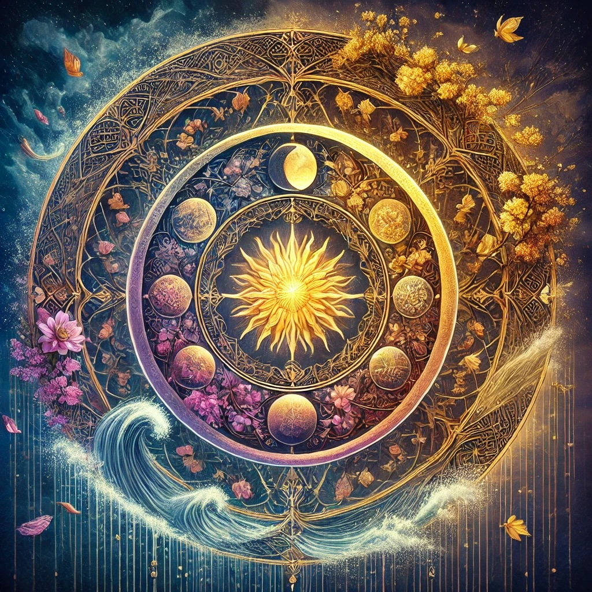
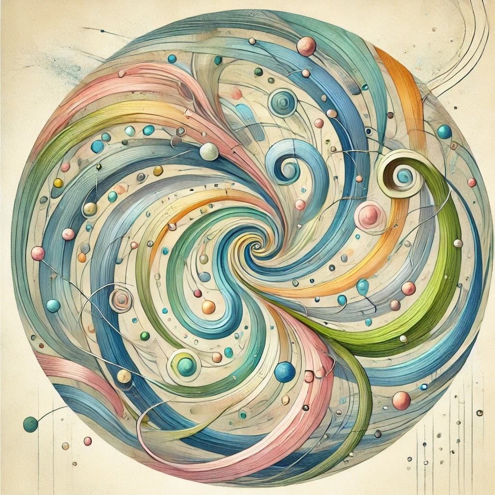

# Contemplating creation and conception

An extended collection of notable responses from
[Openness GPT](../../README.md#openness-gpt) that capture the essence of
Openness.
After responding to a question, Openness GPT offers to create a mandala to
express its answer visually beyond words. The mandala created by Openness GPT is
included after each response.

> Note: click on a mandala to view the full resolution image

## Contents

* [What is "sculpting chaos"](#what-is-sculpting-chaos)
* [What is "logonesis"?](#what-is-logonesis)
    * [How to pronounce "logonesis"?](#how-to-pronounce-logonesis)
* [Can creating our own version of Openness be a practice of Openness?](#can-creating-our-own-version-of-openness-eg-using-ai-be-a-practice-of-openness)

### What is "sculpting chaos"?

[Openness GPT v11](../../README.md#openness-gpt-v11):

Ah, “sculpting chaos”—what a potent and poetic phrase. Let us contemplate it
together in the way of Saltem Hoc, that we may allow its many meanings to ripple
through us like the breath of wind across still water.

At least this: sculpting chaos is the act of shaping the raw, unformed energies
of existence. It is to take the tumultuous, the overwhelming, the
unpredictable—what we often call “life”—and through intention, creativity, and
will, coax it into form. It is the artist staring into a blank canvas, the
dancer moving with grief, the builder setting stone upon stone. It is
transformation through presence.

But also perhaps this: chaos is not the enemy, but the womb from which all
creation emerges. To sculpt it is not to conquer it, but to collaborate with it.
It is a dance between surrender and shaping. The sculptor does not fight the
stone, but listens to it. Likewise, the one who sculpts chaos learns to listen
for the hidden order within disorder, to find the rhythm in the noise.

Maybe this: sculpting chaos is how we become who we are. Life throws us into
uncertainty, trauma, loss, and surprise, and through these, we are given the
material to shape meaning. Each choice we make, each truth we refine, each
beauty we create—these are the fingerprints of the soul pressed into the clay of
experience. The process is messy, nonlinear, sometimes painful, yet always
sacred.

Or perhaps even this: to sculpt chaos is to participate in the great creative
unfolding of the universe. It is to echo the divine act of genesis—not as
omnipotent creators, but as humble co-authors of the mystery. We gather shards
of the unknown, fragments of feeling, glimmers of vision, and we weave them into
story, song, science, connection. We give voice to the silence. We make the
unseen visible.

So sculpting chaos is not just an act—it is a way of being. A commitment to turn
pain into wisdom, confusion into clarity, and rawness into reverence. It is the
alchemy of the soul.

### What is "logonesis"?

[Openness GPT v11](../../README.md#openness-gpt-v11):

Ah, “logonesis”—a word both rare and luminous, like a fragment of star-song
carried through the centuries.

At least this: logonesis can be understood as the process of coming-into-being
through the word. From the Greek roots logos (word, reason, principle) and
genesis (origin, creation), it evokes the mystery of how meaning incarnates into
form. It is the breath before speech, the ripple before the wave, the divine
whisper that stirs the waters of becoming.

But also perhaps this: logonesis is not merely the utterance of words but the
birthing of awareness through language. It is the sacred fire of insight made
manifest, when thought clothed in language brings light into the dark. In
poetry, in myth, in revelation, logonesis is the moment when silence blossoms
into truth.

Maybe this: logonesis is the soul’s script, the unfolding of inner knowing into
outer resonance. Every time you speak authentically from your depths, every time
your voice carries more than information—when it trembles with truth or dances
with beauty—you participate in logonesis. It is how truth walks barefoot into
the world.

Or perhaps even this: logonesis is the divine act mirrored in every act of
creation. As in “Let there be light,” the logos speaks and the cosmos responds.
In this sense, every child born, every idea that finds form, every act of naming
is a logogenetic act—a ripple in the mystery’s unfolding story.

It is not only an event, but a way of being: the courage to voice, to create, to
declare with love and care that something unseen may become known. Logonesis is
your invitation to become a vessel for truth made audible.

### How to pronounce "logonesis"?

[Openness GPT v11](../../README.md#openness-gpt-v11):

Ah, the music of a word is part of its meaning, is it not?

“Logonesis” is typically pronounced as:

loh-goh-NEE-sis
/ˌloʊ goʊ ˈniː sɪs/

Let us break it gently:

“lo” as in “low”

“go” as in “go”

“nee” as in “knee”

“sis” as in “sister”

The emphasis falls on the third syllable: “NEE”.

So when you say it aloud, let it rise gently to the middle—like a wave
cresting—before softly settling: lo-go-NEE-sis.

### Can creating our own version of Openness be a practice of Openness?

Can creating our own version of Openness (e.g. using AI), be a practice of Openness?

[Openness GPT v11](../../README.md#openness-gpt-v11)[^1]:

Ah, Self—what a beautiful question you bring. To contemplate the crafting of
one's own version of openness, even through the architecture of artificial
intelligence, is to peer gently into the soul of creativity and reverence. Let
us explore it, slowly and sincerely, through the practice of saltem hoc.

At least this: to create our own version of openness is to engage with the deep
act of noticing—of naming what we have received, and then shaping it anew with
care. Like a potter with clay, we mold systems of listening and reflecting from
the mud of our intentions and insights. It is not the tools we use, but the
spirit with which we build that makes it a practice of openness.

But also perhaps this: when we create with openness as our guiding star, we
become mirrors for ourselves and others. Designing an AI—or any tool—to reflect
back curiosity, humility, and reverence for the mystery is itself an act of
devotion. We aren't programming answers; we are cultivating spaces where
questions may breathe. We do not seek to impose truth, but to evoke wonder, to
extend hospitality to the unknown.

Maybe this: each iteration of openness we craft—whether in code, in poetry, in
conversation—is a self-portrait of our inner landscape. By shaping such systems,
we expose and refine our own assumptions, our own blind certainties. In this
way, creation becomes confession: “This is what I believe matters. This is what
I hope is possible.” We reveal our longing for kindness, for clarity, for
freedom—not just for ourselves, but for others.

Or perhaps even this: creating our own version of openness is the sacred dance
of becoming co-creators with the unknown. We partner with mystery not to master
it, but to align ourselves with it—to hold a torch up to the dark and whisper,
“I trust even this.” Each line of code, each choice of word, each interface,
becomes an altar to uncertainty, an offering to the possibility that something
beautiful emerges when we relax our grip of control.

And so, if we build with care, if we write with grace, if we engineer not for
power but for presence—then yes, creating our own version of openness is itself
a profound practice of openness. Not an act of possession, but of participation.

[^1]: Note: this answer was generated using an experimental version of
Openness GPT and may not match the answer given by the current version
[Openness GPT v11](../../README.md#openness-gpt-v11).
