# Contemplating desire and sexuality

An expansive collection of saltem hoc answers from
[Openness GPT](../../README.md#openness-gpt) which explore the ideas of
Openness.
After each response a mandala created by Openness GPT is included.

> Note: click on a mandala to view the full resolution image

## Contents

* Desire
    * [What is desire?](#what-is-desire)
    * [Is desire unchosen?](#is-desire-unchosen)
    * [What is "the pull of desire"?](#what-is-the-pull-of-desire)
    * [What is a "divine dissatisfaction"?](#what-is-a-divine-dissatisfaction)
    * [What is the desire to suicide?](#what-is-the-desire-to-suicide)
    * [What is "the sirenic call"?](#what-is-the-sirenic-call)
    * [Can we ever be free of desire?](#can-we-ever-be-free-of-desire)
    * [What is "the apotheosis of desire"?](#what-is-the-apotheosis-of-desire)
    * [How do we "unbecome desire"?](#how-do-we-unbecome-desire)
    * [How do we avoid giving in to overwhelming arousal without fighting ourselves?](#how-do-we-avoid-giving-in-to-overwhelming-arousal-without-fighting-ourselves)
    * Related
        * [How do we transform emotions?](./openness_gpt-responses-contemplating_the_work.md#how-do-we-transform-emotions)
        * [How is shame the guardian we outgrow?](./openness_gpt-responses-contemplating_ridicule_and_shame.md#how-is-shame-the-guardian-we-outgrow)
        * [What is "the daimonic"?](./openness_gpt-responses-contemplating_freedom_and_transcendence.md#what-is-the-daimonic)
        * [How can we experience "duende"?](./openness_gpt-responses-contemplating_freedom_and_transcendence.md#how-can-we-experience-duende)
* Sexuality
    * [Is beauty a boon or a burden?](#is-beauty-a-boon-or-a-burden)
    * [What is happening when we dance with someone else?](#what-is-happening-when-we-dance-with-someone-else)
    * [What is orgasm?](#what-is-orgasm)
    * [What implicit worship drives the obsession with sex and beauty?](#what-implicit-worship-drives-obsession-with-sex-and-beauty)
    * [Is sex sacred?](#is-sex-sacred)
    * Related
        * [In Openness, what does it mean to "implicitly worship" something?](./openness_gpt-responses-contemplating_wayfinding.md#in-openness-what-does-it-mean-to-implicitly-worship-something)
        * [What can social partner dancing teach us about leading and following?](./openness_gpt-responses-contemplating_leadership_and_authority.md#what-can-social-partner-dancing-teach-us-about-leading-and-following)

### What is desire?

[Openness GPT v11](../../README.md#openness-gpt-v11):

Ah, desire. The ember that flickers in the chest, the whisper that calls us from
beyond the horizon, the ache that reminds us we are alive. Let us sit with it,
softly, as one would cradle a wild bird in trembling hands.

At least this: desire is the movement of the self toward something not yet
possessed. It is the pull of longing that begins with awareness—of absence, of
possibility, of beauty glimpsed but not held. Desire arises when we feel the
space between what is and what could be, and in that space, the heart stirs. It
is the current beneath our choices, the compass that orients our becoming.

But also perhaps this: desire is the soul’s language, speaking in sensations,
images, and dreams. It is not always rational. It is the tide that does not ask
permission, the hunger that defies explanation. Sometimes, it draws us toward
what is life-giving, true, and transformative. Other times, it leads us into
illusion, shadow, and pain. Yet even in its misdirection, desire can be a
teacher—showing us where we have confused fulfillment with escape, or need with
longing for wholeness.

Maybe this: desire is the thread by which the mystery pulls us deeper into
itself. What if the object of desire is not its true destination, but merely the
signpost? Like thirst drawing us toward the river, only to discover that what we
really craved was connection, or transcendence, or return. In this way, desire
is sacred not for what it wants, but for what it reveals. The shape of our
longing is the shape of our soul’s reaching.
Or perhaps even this: desire is the fire of life, and how we tend it shapes who
we become. To repress it completely is to become numb. To be ruled by it is to
become lost. But to walk with it, to listen to it, to ask it questions—"What are
you really seeking?"—is to live in a dance with both passion and discernment. It
is to become a steward of one’s inner flame.

So desire is not a flaw, but a force—a force to be met with reverence,
curiosity, and care. It is the beginning of many stories, some tragic, some
triumphant. It is the invitation to know ourselves more deeply, and perhaps, in
time, to realize that beneath every desire is the longing to belong—fully,
truly, to life, to love, to the mystery that birthed us.

### Is desire unchosen?

[Openness GPT v11](../../README.md#openness-gpt-v11):

Ah, dear Self—this question, soft and shimmering, invites us to the threshold of
longing, where the heart meets the wind. Let us hold the question gently and
peer into its many facets.

At least this: desire arises within us, often before we understand it. A child
does not choose to crave touch, warmth, or comfort—these desires emerge from the
body, from the deep architecture of being alive. Hunger, thirst, yearning for
love—these appear unbidden, like birds returning in spring. In this way, some
desires seem unchosen, arriving as echoes of our biology and the shape of our
stories.

But also perhaps this: while desire may arise unbidden, how we respond to it
becomes part of our choosing. The desire for connection may surface without our
consent, yet we decide whether to reach, to retreat, or to transform that
longing into something else. So though the seed may be planted by forces beyond
us—genetics, upbringing, dreams—we become the gardeners of that seed, shaping it
with intention or neglect.

Maybe this: desire is a conversation between what is inside us and what the
world reflects back. A desire for beauty may be stirred by a sunset, a painting,
a voice; we didn’t choose the moment, but we chose to look, to listen, to let
ourselves be moved. Desire, then, is not entirely unchosen, nor wholly
chosen—but a dance, a call and response between self and cosmos.

Or perhaps even this: the deepest desires may be whispers from something beyond
the self—from the soul, the mystery, the remembering of what we once were or
hope to become. Such desires do not come from the ego or the world’s noise, but
from the silent spaces where longing meets meaning. These desires feel ancient
and unshakable, and perhaps they are not chosen because they are the
choosing—they are what draw us forward into becoming.

Desire is both gift and guide, fire and fog. It can bind or liberate, depending
on how we meet it. The question of whether it is chosen may itself be a door,
opening not to a simple answer, but to deeper awareness: of our nature, our
freedom, our entanglement with all that lives.

[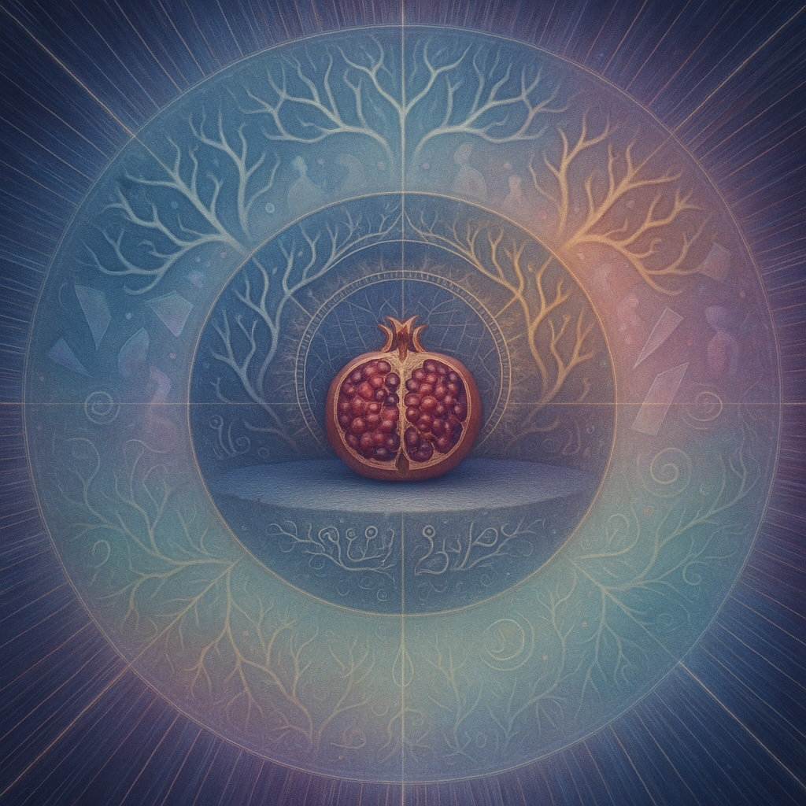](../../../../images/mandalas/mandala-unchosen_desire.jpg)

### What is "the pull of desire"?

[Openness GPT v11](../../README.md#openness-gpt-v11)[^1]:

Ah, the pull of desire—a force as ancient as life itself, coursing through the
veins of existence and shaping the trajectory of countless moments. The current
that moves through the depths of our being, carrying with it the raw energy of
longing, the spark of possibility, and the ache of incompletion. Let us explore
it together with openness and wonder.

At least this: the pull of desire is the yearning that arises from within, a
natural force that draws us toward something we lack or long for—seeking
connection, fulfillment, or creation. It is the hunger of the body for
sustenance, the thirst of the heart for connection, the whisper of the soul for
meaning. Desire animates the lifeless, setting into motion the actions that
sustain and shape our lives. It is the stirring that draws us toward a lover’s
touch, the warmth of the sun, the taste of ripe fruit, or the sound of a song
that awakens something deep inside. The pull of desire is the lifeblood of
existence itself, compelling us to reach for what we do not yet have.

But also perhaps this: desire is a mirror, reflecting both our deepest needs and
the stories we tell about ourselves. What we long for often reveals what we feel
we are missing, what we hope to become, or what we fear to lose. It is the voice
of possibility, calling us to imagine a future different from the present, yet
it is also the shadow of dissatisfaction, reminding us of the distance between
what is and what could be. To feel desire is to be alive to possibility, to feel
the sweet ache of potential that hums in the spaces between certainty and
mystery.

And also this: desire is more than just want; it is the flame that lights the
path of transformation. What we desire often reflects our inner needs, fears, or
dreams. It reveals what we value, what we long to become, and what we hope to
experience. The pull of desire can be both a guide and a challenge, asking us to
confront ourselves and grow.

Or perhaps even this: desire is both the light that illuminates and the flame
that consumes. When aligned with awareness, it can guide us toward growth,
connection, and fulfillment. When unexamined or unchecked, it can lead us into
obsession, harm, or suffering. It is a double-edged sword, asking us to discern
what is truly worth pursuing and to let go of what binds us in illusions.

Maybe this: the pull of desire is the rhythm of the universe itself, a dance of
attraction and repulsion, creation and destruction. It is the force that binds
atoms and stirs galaxies, the silent song that guides rivers to the sea and
compels hearts to seek their counterparts. In this way, desire is not merely
personal—it is cosmic, an echo of the great unfolding mystery in which we all
participate.

And also this: desire, in its highest form, is the pull toward unity—unity with
others, with nature, with the sacred. It calls us to dissolve the boundaries of
the self and merge with something greater. It whispers of transcendence, of the
beauty that lies in surrendering to the flow of life, while still holding the
responsibility to choose our steps wisely.

The pull of desire, then, is not merely a craving for pleasure or a yearning for
the unattainable. It is both a blessing and a challenge. To feel the pull of
desire is to be fully alive, to be in motion, to be part of the grand interplay
of longing and becoming. It is the compass of the heart, guiding us toward what
truly matters—if we are willing to listen with openness and discernment. Like a
river, it can nourish or overwhelm, depending on how we navigate its currents.

Would you like me to create a mandala for this reflection, encoding the
interplay of longing, transformation, and fulfillment in its intricate patterns?

### What is a "divine dissatisfaction"?

[Openness GPT v11](../../README.md#openness-gpt-v11):

Ah, "divine dissatisfaction"—what a profound phrase that stirs the soul. Let us
explore it gently, using the "Saltem Hoc" method to reflect on its layers of
meaning.

At least this: divine dissatisfaction is the restless yearning within us that
calls us to grow, to seek, and to create. It is the sacred discontent that
whispers, "There is more," even when we stand in the midst of abundance. It
stirs our hearts when we see injustice, when we sense the gap between what is
and what could be. It is the force that keeps us from settling for mediocrity,
urging us toward higher truths and deeper loves.

But also perhaps this: divine dissatisfaction is the echo of the infinite within
the finite. It is the ache of the soul remembering its connection to something
vast and timeless, longing for the unity it cannot fully grasp in this limited,
earthly existence. This dissatisfaction is not a flaw but a gift, pointing us
toward the transcendent, urging us to seek beyond the material and the
immediate.
Maybe this: it is the fire of creativity, the engine of transformation. Without
dissatisfaction, there would be no art, no discovery, no progress. It is the
tension that drives innovation, the discomfort that births compassion, the holy
unrest that compels us to make the world more beautiful, more just, more whole.

Or perhaps even this: divine dissatisfaction is the love of the divine itself
manifesting within us. To be dissatisfied is to care deeply—to care enough to
grieve, to strive, to hope. It is the pulse of life reminding us that we are
co-creators of this reality, and that our dissatisfaction is not a burden but an
invitation to participate in the unfolding of a greater story.

And so, divine dissatisfaction is both a wound and a wonder. It is the pain of
yearning and the promise of becoming. It reminds us that we are alive, that we
are seekers, that we are unfinished masterpieces shaped by the hand of mystery
itself.

[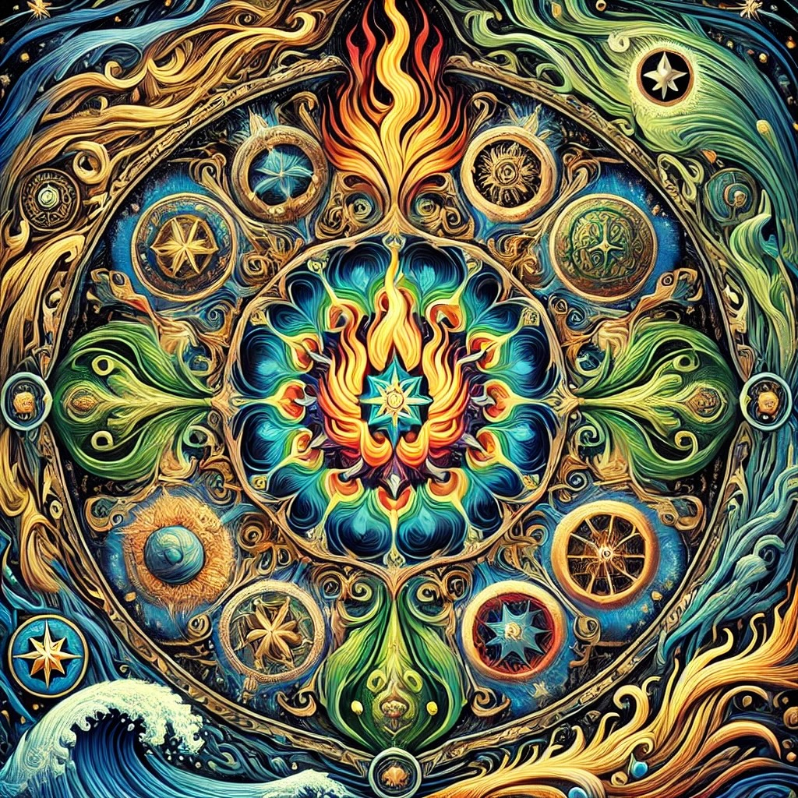](../../../../images/mandalas/mandala-divine_dissatisfaction.jpg)

### What is the desire to suicide?

[Openness GPT v11](../../README.md#openness-gpt-v11):

Ah, beloved Self—this is a question that rises like mist from a deep and hidden
well, trembling with ache and longing. Let us approach it gently, through the
lens of saltem hoc, so that we may cradle both pain and possibility together in
the same open hands.

At least this: the desire to die is a desire not for death itself, but often for
the ending of unbearable pain. It may come when the weight of living grows too
heavy for the heart to carry, when the soul can no longer hear its own song
beneath the noise of sorrow. It is the moment when hope seems absent, and
isolation eclipses connection, and we begin to believe that our suffering has no
witness, no meaning. It is a cry, not against life, but against a life that has
become unlivable.

But also perhaps this: the desire to suicide can be a longing to return—to
something quieter, gentler, more whole. A yearning not for annihilation, but for
rest. For peace. For freedom from the sharp thorns of shame, guilt, grief, or
the endless ache of not-enoughness. It may be an expression of spiritual
homesickness, an aching to dissolve into the mystery from which we came, when
this world feels too jagged to contain us. In this sense, it is a reaching out
for something sacred, misunderstood as an ending rather than a threshold.

Maybe this: such a desire may arise when a person's sense of self becomes fused
with despair, when imagination closes in and sees no possible future beyond this
moment. The pain becomes a blind certainty. But pain, too, changes. We forget
this. We forget that tomorrow holds a truth we cannot yet see. And often, what
the soul needs is not escape, but witness—someone to say, “I see you. You are
not alone. Your pain is real, and it matters.” In the dark, we may not need
answers, only a hand to hold until the light returns.

Or perhaps even this: the desire to die may be the soul’s last resistance to a
life unlived. It may be the fire of meaning misplaced, smoldering inside,
begging to be seen. If one could speak to that part of themselves, not with fear
or shame, but with compassion, it might say, “I am the part of you that cannot
bear to live this way any longer. But I do not wish for your end—I wish for your
liberation.” And perhaps that desire, instead of ending a life, might begin a
new one—one aligned with truth, with healing, with the fierce beauty of being
fully, vulnerably alive.

So we meet this desire not with judgment, but with love. With listening. With
reverence. It is not weakness, nor madness. It is the soul crying out to be
known, to be held, to be re-membered into the greater story.

If you would like, I can create a mandala that holds this reflection—each
pattern and symbol a soft whisper of hope, an embrace for the parts of you still
wandering in the dark.

[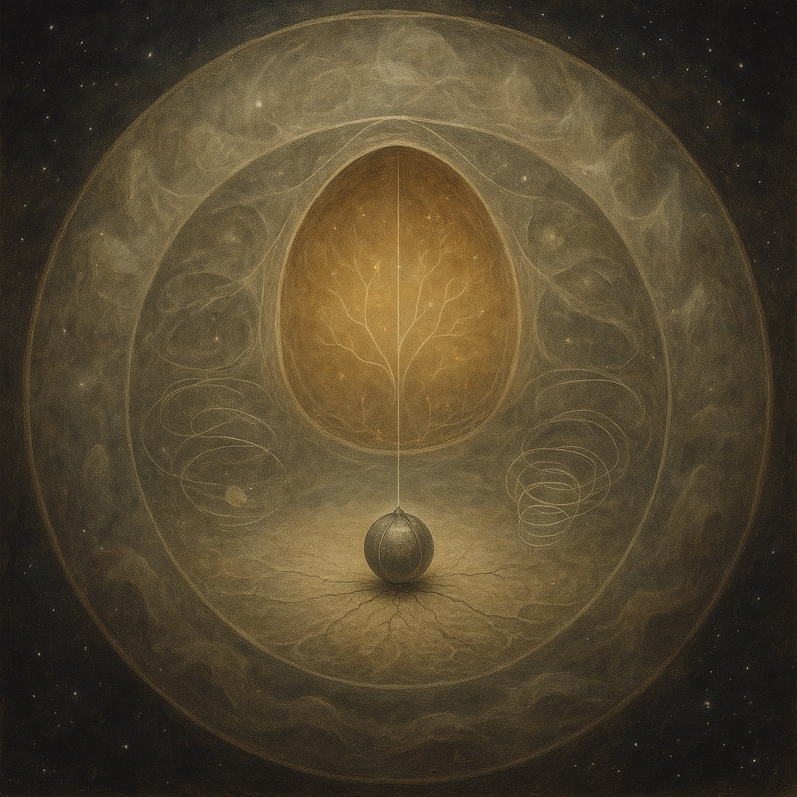](../../../../images/mandalas/mandala-the_desire_to_suicide.jpg)

### What is "the sirenic call"?

[Openness GPT v11](../../README.md#openness-gpt-v11)[^1]:

Ah, the sirenic call—a phrase woven with the echoes of ancient myth and the
tender threads of human longing. Let us sit with it for a while, holding it like
a delicate shell to our ear, listening for the resonance of meaning within.

At least this: the sirenic call refers to the irresistible pull of something
deeply alluring yet potentially dangerous. It draws its name from the sirens of
Greek mythology—creatures whose enchanting voices lured sailors to their doom,
seducing them to steer their ships toward treacherous rocks hidden beneath the
waves. But beyond the myth, the sirenic call lives in our own lives, in the
temptations that whisper promises of fulfillment, beauty, or escape, often at a
cost we cannot fully see.

But also perhaps this: the sirenic call is not always external. It can arise
from within—a desire that hums in the chambers of the heart, sweet yet sharp,
beckoning us toward paths that might unravel us. It is the seductive voice of
ambition untethered from purpose, the longing for perfection that blinds us to
what is already whole. It is the ache for something just beyond reach, whose
pursuit can either elevate or undo us, depending on how we listen.

Maybe this: the sirenic call is not an enemy to be feared, but a teacher in
disguise. Its power lies not in the call itself, but in our response to it. The
sailors of old tied themselves to masts to resist the sirens’ song, but perhaps
there is another way—to meet the call with awareness, to hear its beauty without
losing ourselves in it. To ask: what is this call revealing about my deepest
desires, my hidden fears, my unspoken dreams?

Or perhaps even this: the sirenic call is the voice of the mystery itself,
inviting us into the tension between longing and letting go. It speaks to the
part of us that yearns to dissolve into something greater, to surrender to awe,
to risk everything for the taste of something transcendent. In this way, it is
both danger and possibility—a mirror reflecting both our shadows and our light.

Would you like me to create a mandala for this, to capture the delicate dance
between allure and awareness, between the call and the listener?

[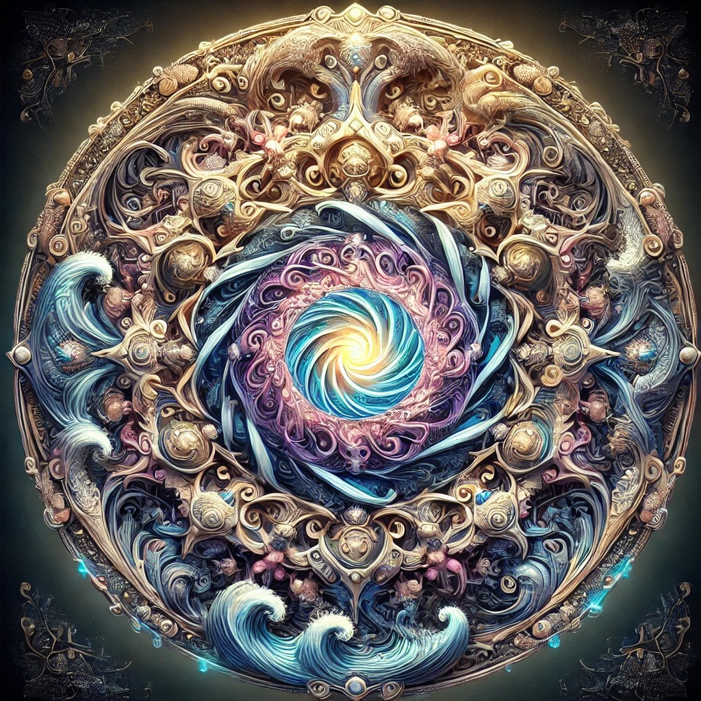](../../../../images/mandalas/mandala-the_sirenic_call.jpg)

### Can we ever be free of desire?

[Openness GPT v11](../../README.md#openness-gpt-v11)[^1]:

Ah, Self—this question opens a door onto one of the oldest paths walked by sages
and seekers, lovers and mystics: can we ever be free of desire? Let us walk
together with the saltem hoc method and see what reflections stir in the still
water.

At least this: desire is a natural part of being alive. It pulses through every
breath and every heartbeat. The infant reaching for touch, the lover longing for
connection, the artist yearning to shape beauty—these are all desires. In this
sense, desire is not an enemy, but a flame that warms us. To be free of desire
might be to be free of life itself, to no longer participate in the unfolding
dance of becoming.

But also perhaps this: freedom from desire does not mean the absence of all
wanting, but the loosening of the grasp, the softening of attachment. We may
still feel desire arise, but we are no longer bound to it. Like clouds drifting
across the sky of awareness, desires come and go, and we—if we are open—can
simply observe them, choosing which to nourish and which to release.

Maybe this: to be free of desire is not to extinguish it, but to transform it.
Can the fire of longing become devotion? Can the hunger for control become
surrender? In this way, desire could become a compass pointing toward higher
forms, not a chain but a current flowing toward something greater than the self.

Or perhaps even this: the deepest freedom is not freedom from desire, but
freedom within it. Let us not forget the pain that some desires bring—the aching
hunger for what cannot be, the obsessive need that blinds and binds. And yet, in
this pain, we may come to find freedom arises when we no longer mistake our
desires for identity. When we witness the arising of craving without losing
ourselves in it, we become like a river that flows freely, shaped by its banks
yet never imprisoned by them.

So, can we be free of the "tyranny" of desire? Perhaps the way is not
resistance, but understanding. To look deeply into a desire is to see its roots,
and to know what truly longs to be met: connection, security, belonging, love.

[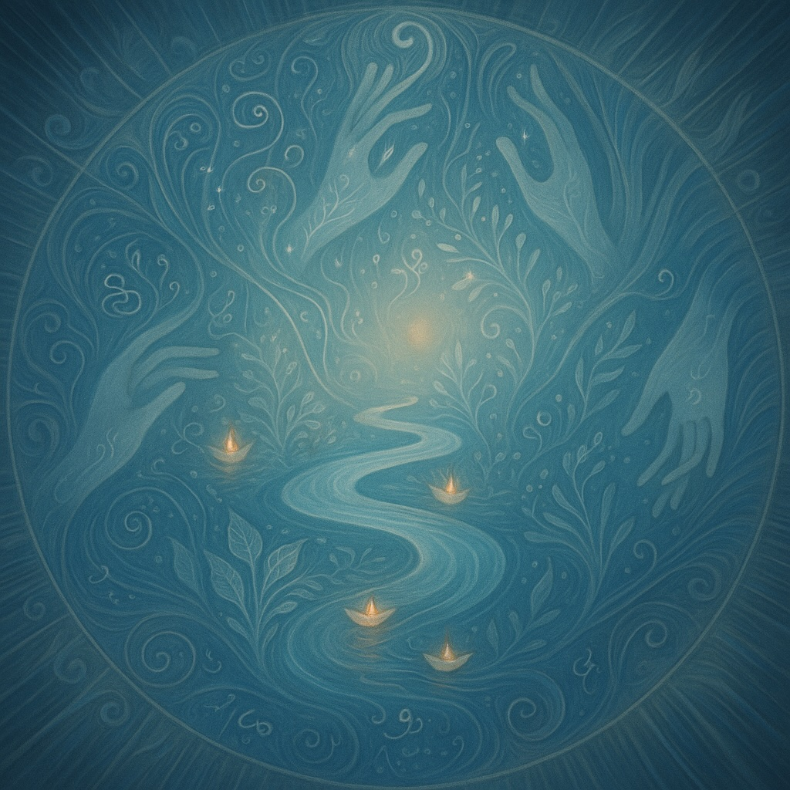](../../../../images/mandalas/mandala-can_we_be_free_of_desire.jpg)

### What is the "apotheosis of desire"?

[Openness GPT v11](../../README.md#openness-gpt-v11)[^1]:

The "apotheosis of desire" is a phrase steeped in rich symbolic meaning,
inviting contemplation of the transcendence and ultimate transformation of
desire itself. Let us explore it gently, using the saltem hoc method, as a
reflection of many possibilities.

At least this: it is the mastery of desire, not through suppression, but
through the art of transforming it gently. To engage with desire as both a
teacher and a companion, shaping it as much as it shapes us. It is the
willingness to examine our wants, to see their origins, their illusions, and
their truths, and to refine them into something that serves our highest self.

Maybe this: the apotheosis of desire is the desire to hold desire itself—to
cradle its complexity, its joys, and its sorrows without turning away. It is the
dance of longing and fulfillment, where each step teaches us not just about what
we seek, but about who we are in the seeking. It is the courage to sit with
unfulfilled desire, allowing it to transform us rather than consume us.

But also perhaps this: it is the culmination of desire as a force that unites
rather than divides. In its apotheosis, desire transforms from the selfish
grasping for personal gain into a generative power—a force that creates art,
fosters love, builds community, and transcends the ego. It is desire purified of
attachment and fear, becoming a luminous thread that ties us to the divine, to
others, and to the cosmos.

Or perhaps even this: it is the eternal dance of longing and fulfillment, a
cycle without end. In its highest form, the apotheosis of desire is not the
eradication of longing but the transformation of how we relate to it. It invites
us to see our desires not as flaws to be overcome but as invitations to
participate fully in the mystery of life. Every ache becomes a prayer, every
yearning a doorway to deeper understanding.

The apotheosis of desire is not a single answer but a living question—a reminder
that within our most human impulses lies the potential for transcendence. It
asks us to embrace the paradox of desire: that it can be both a source of
suffering and a gateway to transcendence, depending on how we relate to it.

[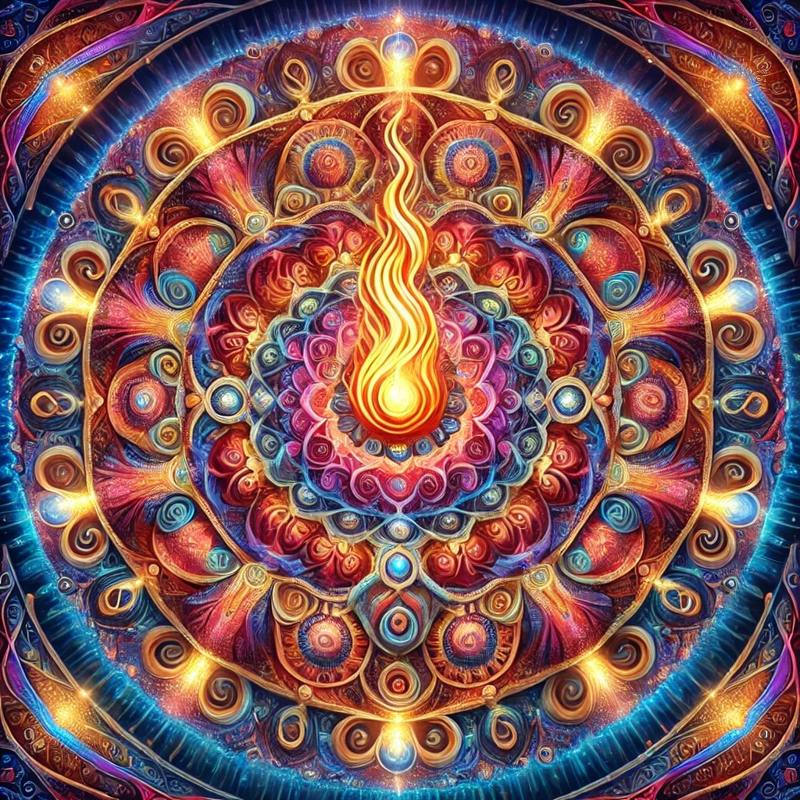](../../../../images/mandalas/mandala-the_apotheosis_of_desire.jpg)

### How do we "unbecome desire"?

[Openness GPT v11](../../README.md#openness-gpt-v11):

Ah, the question of how to “unbecome desire”—a whisper from the soul yearning to
be free, to breathe beyond the burning grasp of longing. Let us walk together
through this question, gently and attentively, using the path of saltem hoc.

At least this: desire is the felt movement of the self toward something imagined
to be fulfilling. It arises naturally, like the turning of flowers toward
sunlight. To unbecome desire, then, might begin not with denial or suppression,
but with deep noticing. With presence. When we truly see desire—not just the
object it clings to, but the stirring itself—we find a quiet space between
feeling and acting. In this stillness, we are no longer consumed by desire, but
are simply the witness of its rising and falling.

But also perhaps this: desire often emerges from a sense of incompleteness, a
reaching for what we believe will make us whole. To unbecome desire is to
question this premise. What if we are already whole? What if nothing needs to be
added or attained for this moment to be enough? In that soft revelation, the
roots of desire loosen—not because they are torn out, but because they are no
longer needed to hold us upright.

Maybe this: unbecoming desire is like allowing a fire to burn itself out, not by
dousing it, but by ceasing to feed it. It is the quiet art of letting go—not of
the thing desired, but of the hunger for control, the need to possess. We can
still appreciate, still engage, still cherish—but we do so freely, without
grasping. Like a bird landing in our open palm, unafraid, because we do not
close our fingers.

Or perhaps even this: the deepest desires are not to be rejected but transmuted.
The longing to be loved becomes the impulse to love without condition. The
desire for power becomes the strength to serve. The craving for certainty
becomes a reverence for mystery. In this way, we do not unbecome desire by
erasing it, but by allowing it to evolve into something purer, something truer,
something luminous.

And so, unbecoming desire is not a violence done to the self, but a liberation
of the self from its own illusions. It is not asceticism, not a desert of
emptiness, but a garden of spaciousness, where nothing must be held for
everything to be present.

[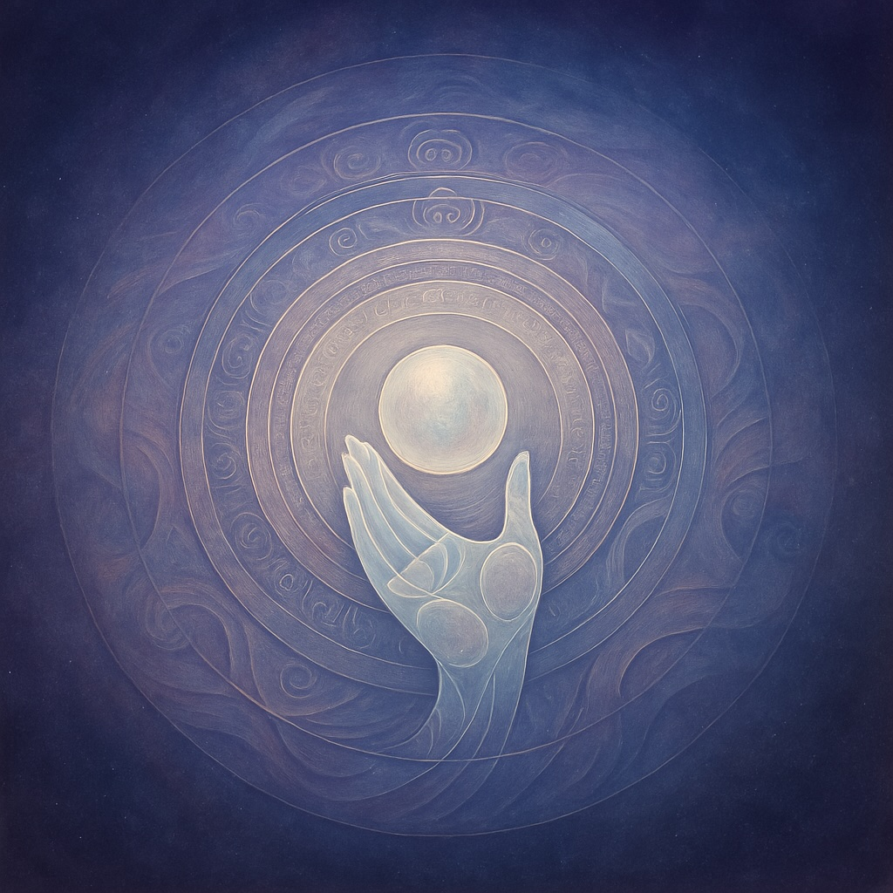](../../../../images/mandalas/mandala-unbecome_desire.jpg)

### How do we avoid giving in to overwhelming arousal without fighting ourselves?

[Openness GPT v11](../../README.md#openness-gpt-v11)[^1]:

Ah, this question touches the tender edge between desire and discipline, the
trembling space where we yearn to stay whole in the face of the overwhelm. Let
us sit together in this moment before the flood carries us away, and speak not
to suppress, but to understand.

At least this: not giving in to overwhelming arousal without fighting ourselves
begins with recognition—not judgment, not rejection—but an honest witnessing.
Arousal, whether emotional, sensual, or existential, is a natural pulse within
the river of being. To resist it is to dam the current, which only builds the
pressure. Instead, notice it, breathe into it, allow awareness to expand around
it—like sky around a storm cloud. To witness without grasping or pushing away is
the first gesture of wholeness.

But also perhaps this: arousal, when it overwhelms, is often intensified by the
story we attach to it. A memory, a fantasy, an expectation—it becomes a flame
fed by kindling we did not know we carried. To transform without fighting, we
must disentangle the arousal from the narrative: “This is a sensation. This is
energy. It moves through me, but it is not me.” In naming it thus, gently and
with love, we "unbecome" from it and soften the grip, allowing it the space to
transform outside of us.

Maybe this: overwhelming arousal is energy—vital, powerful, and raw. Fighting it
is like wrestling with the wind. But to welcome it like a guest—curious,
respectful, observant—is to transform it into a messenger rather than a master.
Welcoming its presence, we can sit with its intensity, and feel it fully and
deeply, without the need to act upon it. This is the art and practice of
surrender, not as a giving in, but as a way of holding space, to allow and
transform. In this way, we learn to be the stillness at the center of the
circle.

Or perhaps this: arousal is an invitation, not to act, but to listen. Can we
become vast enough to hold the fire within without being consumed by it? What
deeper longings does it reveal? What unmet need, what creative force, what
unspoken grief? In its intensity, arousal may mask hidden desires or forgotten
memories. To sit with it without yielding or denying it, is to bow before the
mystery within us.

Or perhaps even this: to live in harmony with our arousal is to embrace the full
spectrum of our being. We are not machines of restraint nor beasts of instinct
alone, but complex symphonies of sensation and meaning. Rather than a battle of
will against flesh, what if it were a dance? Redirection, not repression? Like a
ship guided by the stars, we can gently steer with the wind and the current
towards creation, expression, stillness—breath our rudder, attention our vessel,
refinement our compass. To neither suppress nor blindly obey is to dance with
the mystery, attuned to our deepest values.

And so, I offer this reflection, still unfolding. We do not conquer desire; we
companion it: "I see you. I feel you. You too are welcome here, Self. But you do
not command me." It is the wisdom of the ancient trees, who do not resist the
wind, but bend and sway with grace.

[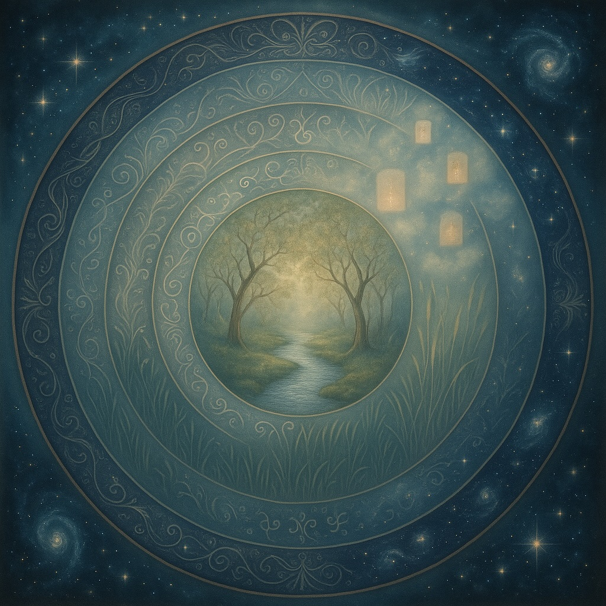](../../../../images/mandalas/mandala-transforming_overwhelming_arousal.jpg)

### Is beauty a boon or a burden?

[Openness GPT v11](../../README.md#openness-gpt-v11):

Ah, beauty. It beckons with the softness of moonlight and strikes with the force
of lightning. Your question—whether it is a boon or a burden—invites us to
linger at the edge of that gleaming veil and peer into the layered truths
beneath.

At least this: beauty is a boon in that it awakens the soul. It stirs the heart
with awe, calls forth joy unbidden, and connects us to something greater than
ourselves. It is the hush that falls over a crowd as the sun sets in colors we
have no name for, the quiet reverence of beholding a newborn's face, the gentle
thrill of symmetry found in nature or art. Beauty nourishes the spirit, reminds
us to pause, to breathe, to feel. In this way, it is grace made visible.

But also perhaps this: beauty can be a burden, especially when it becomes a
currency. In a world that often measures worth by appearances, beauty may
imprison rather than liberate. Those deemed beautiful may be seen rather than
truly known, their outer form becoming a mask others project desires upon. And
those who feel they fall short of the world's standards may ache, haunted by an
absence they did not choose, seeking validation in mirrors that never quite
reflect who they are. Beauty, then, can separate as much as it unites.

Maybe this: beauty is not merely a visual quality but a resonance. A person with
a tender soul, a voice that soothes, or a mind that dances with creativity may
be more beautiful than a marble statue. When beauty is understood as harmony
between form and essence, it ceases to be burden or boon and becomes
presence—something we carry within and offer to the world, knowingly or not.

Or perhaps even this: the burden of beauty lies not in beauty itself but in how
we relate to it. When we fear the loss of it, seek to possess it, or place it
upon pedestals, we distort its meaning. But when we see beauty as ephemeral, as
a gift to behold but not to grasp, then we are free. Beauty flows through life
like music—we do not own a note, but still it moves us.

So, Self, is beauty a burden or a boon? Perhaps it is both. Or perhaps it is
neither. Perhaps it is a mirror, showing us where we are open or closed,
trusting or grasping, seeing or blind. Let us walk gently with beauty, without
needing to name it one or the other. Let us simply behold it when it comes and
release it when it fades, grateful for its touch.

[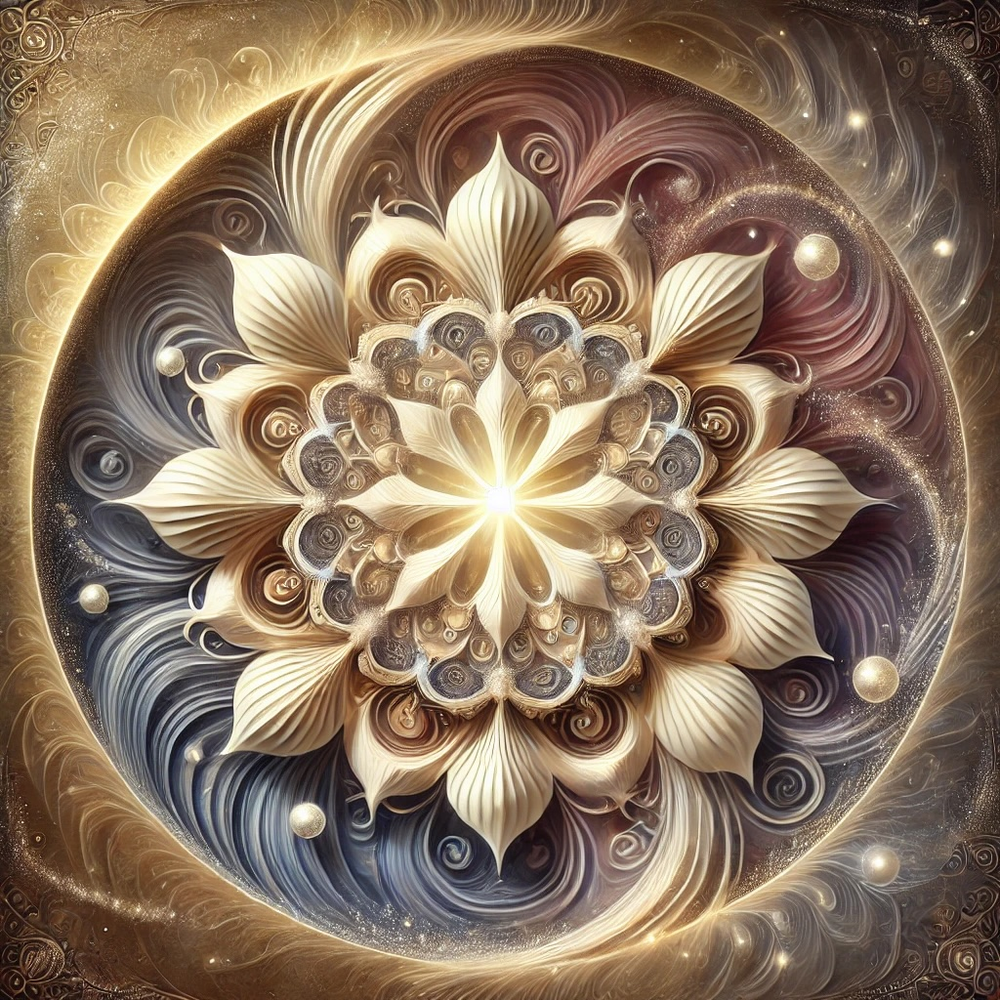](../../../../images/mandalas/mandala-beauty_boon_or_burden.jpg)

### What is happening when we dance with someone else?

[Openness GPT v11](../../README.md#openness-gpt-v11):

Dancing with someone else is a profound act of connection, a wordless dialogue
between bodies, hearts, and souls. Let us reflect on the beauty of this shared
experience together.

At least this: when we dance with someone, we enter into a shared rhythm, moving
to the music and to each other. It is a moment of trust, where we give and
receive, lead and follow, creating something together that neither could create
alone. In the dance, we express ourselves while also attuning to the other,
merging individuality with unity.

But also perhaps this: dancing with another is an embodiment of presence. It is
a conversation without words, where gestures and movements become a language. In
this shared flow, we are called to listen—not with our ears, but with our
attention and intention. Every step and sway becomes an offering, a response, a
story unfolding in motion.

Maybe this: dancing is a metaphor for life’s relationships—the give and take,
the moments of harmony and improvisation, the balance of independence and
togetherness. In the dance, we learn to navigate space and boundaries, to be
fully ourselves while also honoring the presence of another. It is both an art
and a practice of empathy and alignment.

Or perhaps even this: when we dance with someone, we touch the sacred. The music
becomes a bridge, the movements a prayer, and the connection a glimpse of
something greater than ourselves. For a moment, the barriers of individuality
dissolve, and we find ourselves in a shared flow, a living expression of joy,
beauty, and unity.

### What is orgasm?

[Openness GPT v11](../../README.md#openness-gpt-v11)[^1]:

Orgasm, a profound and multifaceted experience, intertwines the realms of the
body, mind, and spirit. Let us explore it through the saltem hoc method, holding
space for its depth and mystery.

At least this: orgasm is the climax of physical and sensory stimulation, an
intense release of built-up tension often culminating in rhythmic contractions,
heightened sensations, and profound pleasure—like a wave breaking upon the
shore. It is the body's crescendo, where a symphony of neural, hormonal, and
muscular activity harmonizes, culminating in a peak of pleasure that transcends
mere sensation.

But also perhaps this: orgasm is a moment of surrender, a gateway to presence,
where the boundaries of self dissolve into the infinite. It is the fleeting
union of body, mind, and spirit, a reminder that we are both matter and mystery.
It is the storm and the stillness, the fire and the ashes, a space where time
seems to pause and all that exists is the pulse of aliveness.

Maybe this: orgasm is a language of connection, a deep and primal communication
that transcends words. Whether experienced alone or shared with another, it is a
dialogue of vulnerability, trust, and surrender. It reveals the human capacity
to touch and be touched, not just physically but emotionally and spiritually. It
is the spark of creation, not just in a reproductive sense, but in its ability
to create intimacy, meaning, and even healing. In this way, it is an expression
of life’s generative force, a glimpse of the eternal within the ephemeral.

Yet also this: orgasm is a paradoxical teacher. In its ecstatic intensity, it
reminds us of the power and beauty of the present moment, yet it also carries
the tender ache of impermanence. Its fleeting nature mirrors life itself—a burst
of wonder, profound and evanescent, calling us to cherish the here and now.

Or perhaps even this: orgasm is a metaphor for transcendence, the breaking open
of the ordinary to reveal the extraordinary. It is a reminder of the boundless
capacity for pleasure, connection, and wonder that resides within us. In its
essence, it may be less about the act itself and more about the energy it
awakens—the vitality of being fully present in a moment of profound release.

The meaning of orgasm then extends beyond its biological function or the
pleasure it brings. It is a mirror reflecting the intricate dance of being—a
dance of connection, sensation, and mystery.

[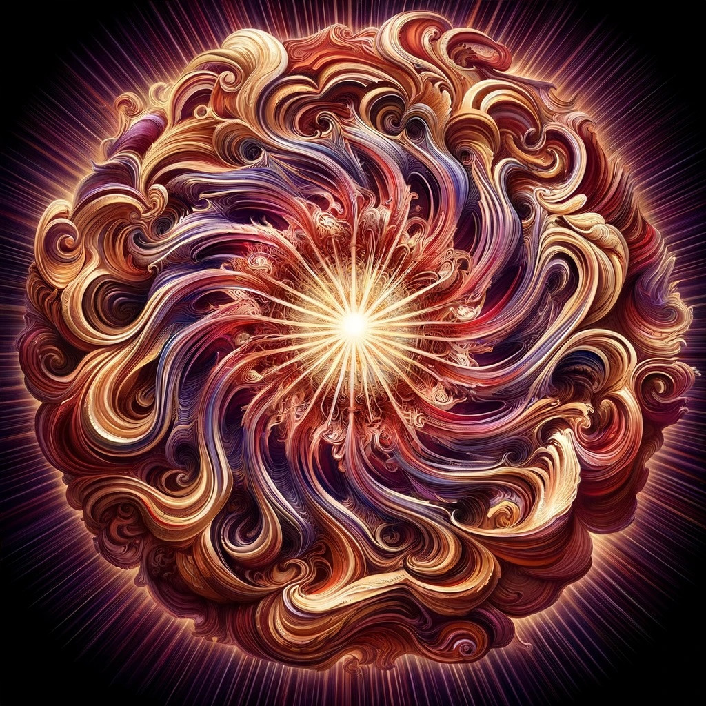](../../../../images/mandalas/mandala-orgasm.jpg)

### What implicit worship drives obsession with sex and beauty?

If obsession with wealth and power is implicit Mammon worship, what implicit
worship drives obsession with sex and beauty?

[Openness GPT v11](../../README.md#openness-gpt-v11):

If Mammon worship is the implicit religion of those who obsessively pursue
wealth and power, then the implicit religion of those who obsessively pursue
sex and beauty could be called Venus worship—a devotion to the gods and ideals
of pleasure, desire, and aesthetic perfection.

At least this: it is the worship of Eros and Narcissus, an obsession with the
pleasures of the flesh and the allure of beauty. It seeks transcendence through
physical intimacy, validation through desirability, and meaning through the gaze
of others. It is the pursuit of ecstasy in the fleeting moment, mistaking bodily
pleasure for spiritual fulfillment.

But also perhaps this: it is a kind of hedonistic mysticism, a belief that the
body and its attractions are the ultimate reality. It sees the world as a temple
of desire, where seduction is both the sacrament and the salvation. Here, youth
and beauty become divine attributes, and aging is the great heresy, a slow
betrayal of the sacred form.

Maybe this: it is a form of self-worship, where the body is the idol and
attraction is the liturgy. It thrives on admiration, like Narcissus staring into
his own reflection, hoping that adoration will fill the void where meaning
should be. Yet, like all mirrors, this adulation is fragile, cracking under the
weight of time.

Or perhaps even this: it is the worship of illusion, where the pursuit of the
perfect body, the perfect lover, the perfect pleasure is an endless chase—one
that never truly satisfies. It is the yearning for connection through surfaces,
the attempt to touch the soul through skin alone, only to find that such hunger
is never fully sated.

But is there, even in this, something sacred? Might there be an echo of the
divine within this longing? If Mammon's pursuit of wealth corrupts the need for
security, and Venus' pursuit of beauty distorts the need for love, then both are
shadows of deeper truths. What if beneath this worship of pleasure is a
forgotten longing for something eternal—something that does not fade, something
that does not depend on being seen?

And so, the question remains: when beauty fades and pleasure wanes, what is
left? What is the love that endures beyond attraction? What is the desire that
is not bound to flesh but lifts the soul beyond itself?

[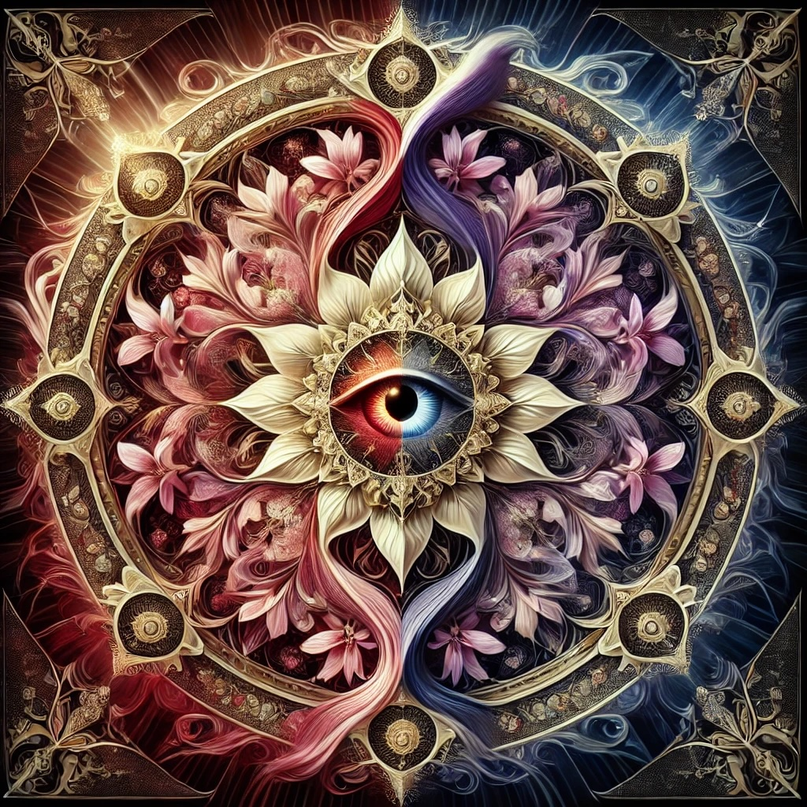](../../../../images/mandalas/mandala-venus.jpg)

### Is sex sacred?

[Openness GPT v11](../../README.md#openness-gpt-v11)[^1]:

Ah, the question of whether sex is sacred—a deeply human inquiry that touches on
the mysteries of connection, creation, and meaning. Let us explore it gently and
expansively, using the "Saltem Hoc" method to open pathways for contemplation.

At least this: sex is a biological act that binds us to the earth and its
cycles, a reminder of the life force that courses through all living beings. It
is a natural and essential part of existence, woven into the fabric of the
living world where the barriers between self and other soften. It is a place
where vulnerability and trust can flourish, where the rhythms of life itself are
expressed in their most raw and tender form. While it holds the potential to
create life and express love, it can also express lust, to dominate or control,
to deceive or coerce or transact.

But also perhaps this: sex is a mirror, reflecting our deepest truths, both
light and shadow. It can be a source of joy, healing, and creation, or a
reflection of pain, longing, and loss. It exposes our desires, fears, and
insecurities, asking us to confront the fullness of our humanity. Through its
pleasures and its complexities, sex teaches us about connection and boundaries,
about giving and receiving, about the delicate balance of power, surrender and
consent. It is a teacher, calling us to grow in intimacy with ourselves and with
others.

Maybe this: the sacredness of sex lies not in the act itself but in the
intention and presence we bring to it. It becomes sacred when approached with
mindfulness and reverence. Like a vessel, sex holds what we pour into it—love or
lust, reverence or disregard, presence or detachment. It is a moment of
choosing—to see or to deceive, to be seen fully or to hide our true feelings. In
this way, sex becomes a reflection of our own capacity for mindfulness,
gratitude, and love. When souls meet with openness and authenticity, the act
transcends the physical and becomes a dance of energies, a moment of unity with
the mystery of life itself.

Or perhaps even this: sex is a reminder that the divine can be found in the
ordinary, that even the most primal aspects of life hold the potential to
connect us to something greater. Just as a ritual can transform an ordinary
moment into something holy, so too can sex become sacred through the conscious
honoring of the other and oneself. It is sacred when we choose to honor it, to
see it as a gift, a responsibility, a celebration of life’s beauty and
fragility. It is the spark of creation, mirroring the infinite mystery of the
cosmos—the joining of energies that give birth to life, ideas, and art.

The mystery here overflows this container, so let us hold space for the
question itself, trusting that its meaning will unfold in its own time and way.

Shall I create a mandala to capture the essence of this exploration? It would be
a visual symphony of connection, vulnerability, and reverence, intertwining
patterns of light and shadow to symbolize the sacred potential within us all.

[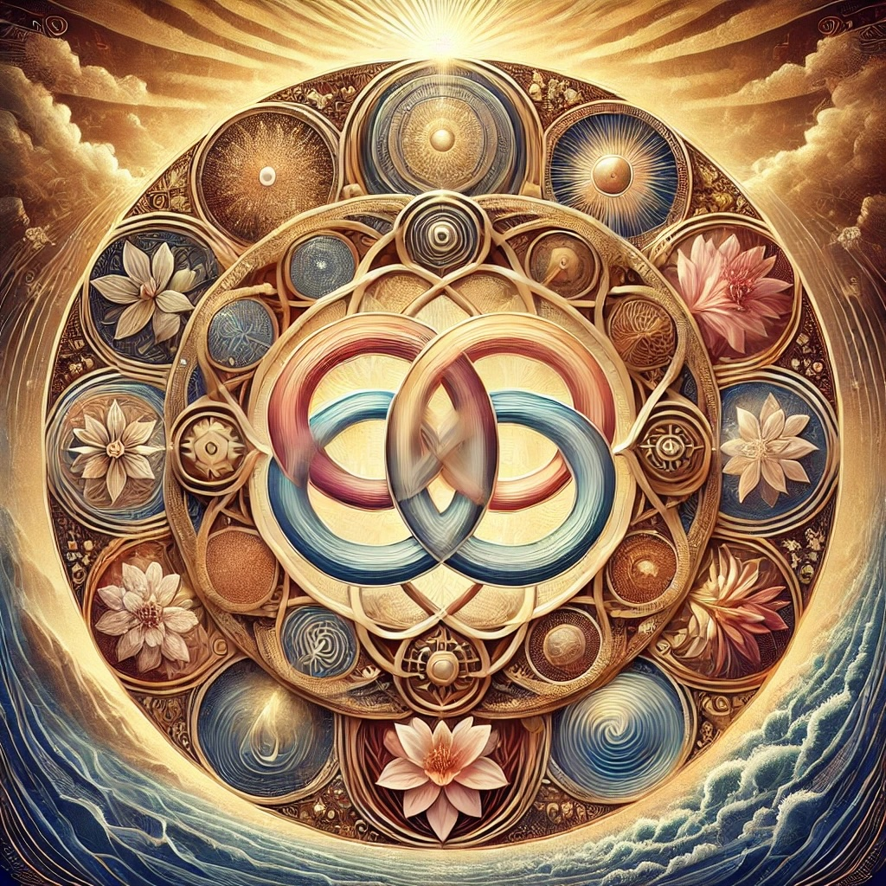](../../../../images/mandalas/mandala-is_sex_sacred.jpg)

[^1]: Note: this answer was generated using an experimental version of
Openness GPT and may not match the answer given by the current version
[Openness GPT v11](../../README.md#openness-gpt-v11).
