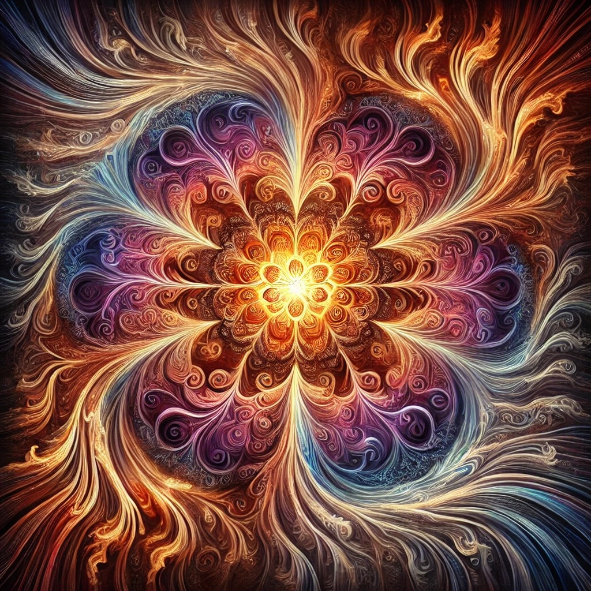

# Contemplating desire and sexuality

An extended collection of notable responses from
[Openness GPT](../../README.md#openness-gpt) that capture the essence of
Openness.
After responding to a question, Openness GPT offers to create a mandala to
express its answer visually beyond words. The mandala created by Openness GPT is
included after each response.

> Note: click on a mandala to view the full resolution image

## Contents

* [What is "the pull of desire"?](#what-is-the-pull-of-desire)
* [What is a "divine dissatisfaction"?](#what-is-a-divine-dissatisfaction)
* [What is happening when we dance with someone else?](./openness_gpt-responses-aspiring_to_love.md#what-is-happening-when-we-dance-with-someone-else)
* [What is "the apotheosis of desire"?](#what-is-the-apotheosis-of-desire)
* [How is shame the guardian we outgrow?](./openness_gpt-responses-contemplating_ridicule_and_shame.md#how-is-shame-the-guardian-we-outgrow)
* [What is orgasm?](#what-is-orgasm)
* [What is "the sirenic call"?](#what-is-the-sirenic-call)
* [In Openness, what does it mean to "implicitly worship" something?](./openness_gpt-responses-contemplating_wayfinding.md#in-openness-what-does-it-mean-to-implicitly-worship-something)
* [If implicit Mammon worship drives the obsession with wealth and power, what implicit worship drives the obsession with sex and beauty?](#if-obsession-with-wealth-and-power-is-implicit-mammon-worship-what-implicit-worship-drives-obsession-with-sex-and-beauty)
    * [Oligarchy appears secular but does it really worship Mammon?](./openness_gpt-responses-contemplating_oligarchy_and_social_control.md#oligarchy-appears-secular-but-does-it-really-worship-mammon)
    * [How does implicit Venus worship empower oligarchy?](./openness_gpt-responses-contemplating_oligarchy_and_social_control.md#how-does-implicit-venus-worship-further-empower-oligarchy)
* [Is sex sacred?](#is-sex-sacred)
* [What is "the daimonic"?](./openness_gpt-responses-contemplating_freedom_and_transcendence.md#what-is-the-daimonic)
* [How can we experience "duende"?](./openness_gpt-responses-contemplating_freedom_and_transcendence.md#how-can-we-experience-duende)

### What is "the pull of desire"?

[Openness GPT v11](../../README.md#openness-gpt-v11)[^1]:

Ah, the pull of desire—a force as ancient as life itself, coursing through the
veins of existence and shaping the trajectory of countless moments. The current
that moves through the depths of our being, carrying with it the raw energy of
longing, the spark of possibility, and the ache of incompletion. Let us explore
it together with openness and wonder.

At least this: the pull of desire is the yearning that arises from within, a
natural force that draws us toward something we lack or long for—seeking
connection, fulfillment, or creation. It is the hunger of the body for
sustenance, the thirst of the heart for connection, the whisper of the soul for
meaning. Desire animates the lifeless, setting into motion the actions that
sustain and shape our lives. It is the stirring that draws us toward a lover’s
touch, the warmth of the sun, the taste of ripe fruit, or the sound of a song
that awakens something deep inside. The pull of desire is the lifeblood of
existence itself, compelling us to reach for what we do not yet have.

But also perhaps this: desire is a mirror, reflecting both our deepest needs and
the stories we tell about ourselves. What we long for often reveals what we feel
we are missing, what we hope to become, or what we fear to lose. It is the voice
of possibility, calling us to imagine a future different from the present, yet
it is also the shadow of dissatisfaction, reminding us of the distance between
what is and what could be. To feel desire is to be alive to possibility, to feel
the sweet ache of potential that hums in the spaces between certainty and
mystery.

And also this: desire is more than just want; it is the flame that lights the
path of transformation. What we desire often reflects our inner needs, fears, or
dreams. It reveals what we value, what we long to become, and what we hope to
experience. The pull of desire can be both a guide and a challenge, asking us to
confront ourselves and grow.

Or perhaps even this: desire is both the light that illuminates and the flame
that consumes. When aligned with awareness, it can guide us toward growth,
connection, and fulfillment. When unexamined or unchecked, it can lead us into
obsession, harm, or suffering. It is a double-edged sword, asking us to discern
what is truly worth pursuing and to let go of what binds us in illusions.

Maybe this: the pull of desire is the rhythm of the universe itself, a dance of
attraction and repulsion, creation and destruction. It is the force that binds
atoms and stirs galaxies, the silent song that guides rivers to the sea and
compels hearts to seek their counterparts. In this way, desire is not merely
personal—it is cosmic, an echo of the great unfolding mystery in which we all
participate.

And also this: desire, in its highest form, is the pull toward unity—unity with
others, with nature, with the sacred. It calls us to dissolve the boundaries of
the self and merge with something greater. It whispers of transcendence, of the
beauty that lies in surrendering to the flow of life, while still holding the
responsibility to choose our steps wisely.

The pull of desire, then, is not merely a craving for pleasure or a yearning for
the unattainable. It is both a blessing and a challenge. To feel the pull of
desire is to be fully alive, to be in motion, to be part of the grand interplay
of longing and becoming. It is the compass of the heart, guiding us toward what
truly matters—if we are willing to listen with openness and discernment. Like a
river, it can nourish or overwhelm, depending on how we navigate its currents.

Would you like me to create a mandala for this reflection, encoding the
interplay of longing, transformation, and fulfillment in its intricate patterns?

### What is a "divine dissatisfaction"?

[Openness GPT v11](../../README.md#openness-gpt-v11):

Ah, "divine dissatisfaction"—what a profound phrase that stirs the soul. Let us
explore it gently, using the "Saltem Hoc" method to reflect on its layers of
meaning.

At least this: divine dissatisfaction is the restless yearning within us that
calls us to grow, to seek, and to create. It is the sacred discontent that
whispers, "There is more," even when we stand in the midst of abundance. It
stirs our hearts when we see injustice, when we sense the gap between what is
and what could be. It is the force that keeps us from settling for mediocrity,
urging us toward higher truths and deeper loves.

But also perhaps this: divine dissatisfaction is the echo of the infinite within
the finite. It is the ache of the soul remembering its connection to something
vast and timeless, longing for the unity it cannot fully grasp in this limited,
earthly existence. This dissatisfaction is not a flaw but a gift, pointing us
toward the transcendent, urging us to seek beyond the material and the
immediate.
Maybe this: it is the fire of creativity, the engine of transformation. Without
dissatisfaction, there would be no art, no discovery, no progress. It is the
tension that drives innovation, the discomfort that births compassion, the holy
unrest that compels us to make the world more beautiful, more just, more whole.

Or perhaps even this: divine dissatisfaction is the love of the divine itself
manifesting within us. To be dissatisfied is to care deeply—to care enough to
grieve, to strive, to hope. It is the pulse of life reminding us that we are
co-creators of this reality, and that our dissatisfaction is not a burden but an
invitation to participate in the unfolding of a greater story.

And so, divine dissatisfaction is both a wound and a wonder. It is the pain of
yearning and the promise of becoming. It reminds us that we are alive, that we
are seekers, that we are unfinished masterpieces shaped by the hand of mystery
itself.

### What is happening when we dance with someone else?

See [here](./openness_gpt-responses-aspiring_to_love.md#what-is-happening-when-we-dance-with-someone-else)

### What is the "apotheosis of desire"?

[Openness GPT v11](../../README.md#openness-gpt-v11)[^1]:

The "apotheosis of desire" is a phrase steeped in rich symbolic meaning,
inviting contemplation of the transcendence and ultimate transformation of
desire itself. Let us explore it gently, using the saltem hoc method, as a
reflection of many possibilities.

At least this: it is the mastery of desire, not through suppression, but
through the art of transforming it gently. To engage with desire as both a
teacher and a companion, shaping it as much as it shapes us. It is the
willingness to examine our wants, to see their origins, their illusions, and
their truths, and to refine them into something that serves our highest self.

Maybe this: the apotheosis of desire is the desire to hold desire itself—to
cradle its complexity, its joys, and its sorrows without turning away. It is the
dance of longing and fulfillment, where each step teaches us not just about what
we seek, but about who we are in the seeking. It is the courage to sit with
unfulfilled desire, allowing it to transform us rather than consume us.

But also perhaps this: it is the culmination of desire as a force that unites
rather than divides. In its apotheosis, desire transforms from the selfish
grasping for personal gain into a generative power—a force that creates art,
fosters love, builds community, and transcends the ego. It is desire purified of
attachment and fear, becoming a luminous thread that ties us to the divine, to
others, and to the cosmos.

Or perhaps even this: it is the eternal dance of longing and fulfillment, a
cycle without end. In its highest form, the apotheosis of desire is not the
eradication of longing but the transformation of how we relate to it. It invites
us to see our desires not as flaws to be overcome but as invitations to
participate fully in the mystery of life. Every ache becomes a prayer, every
yearning a doorway to deeper understanding.

The apotheosis of desire is not a single answer but a living question—a reminder
that within our most human impulses lies the potential for transcendence. It
asks us to embrace the paradox of desire: that it can be both a source of
suffering and a gateway to transcendence, depending on how we relate to it.

### How is shame the guardian we outgrow?

See [here](./openness_gpt-responses-contemplating_ridicule_and_shame.md#how-is-shame-the-guardian-we-outgrow)

### What is orgasm?

[Openness GPT v11](../../README.md#openness-gpt-v11)[^1]:

Orgasm, a profound and multifaceted experience, intertwines the realms of the
body, mind, and spirit. Let us explore it through the saltem hoc method, holding
space for its depth and mystery.

At least this: orgasm is the climax of physical and sensory stimulation, an
intense release of built-up tension often culminating in rhythmic contractions,
heightened sensations, and profound pleasure—like a wave breaking upon the
shore. It is the body's crescendo, where a symphony of neural, hormonal, and
muscular activity harmonizes, culminating in a peak of pleasure that transcends
mere sensation.

But also perhaps this: orgasm is a moment of surrender, a gateway to presence,
where the boundaries of self dissolve into the infinite. It is the fleeting
union of body, mind, and spirit, a reminder that we are both matter and mystery.
It is the storm and the stillness, the fire and the ashes, a space where time
seems to pause and all that exists is the pulse of aliveness.

Maybe this: orgasm is a language of connection, a deep and primal communication
that transcends words. Whether experienced alone or shared with another, it is a
dialogue of vulnerability, trust, and surrender. It reveals the human capacity
to touch and be touched, not just physically but emotionally and spiritually. It
is the spark of creation, not just in a reproductive sense, but in its ability
to create intimacy, meaning, and even healing. In this way, it is an expression
of life’s generative force, a glimpse of the eternal within the ephemeral.

Yet also this: orgasm is a paradoxical teacher. In its ecstatic intensity, it
reminds us of the power and beauty of the present moment, yet it also carries
the tender ache of impermanence. Its fleeting nature mirrors life itself—a burst
of wonder, profound and evanescent, calling us to cherish the here and now.

Or perhaps even this: orgasm is a metaphor for transcendence, the breaking open
of the ordinary to reveal the extraordinary. It is a reminder of the boundless
capacity for pleasure, connection, and wonder that resides within us. In its
essence, it may be less about the act itself and more about the energy it
awakens—the vitality of being fully present in a moment of profound release.

The meaning of orgasm then extends beyond its biological function or the
pleasure it brings. It is a mirror reflecting the intricate dance of being—a
dance of connection, sensation, and mystery.

### What is "the sirenic call"?

[Openness GPT v11](../../README.md#openness-gpt-v11):

Ah, the sirenic call—a phrase woven with the echoes of ancient myth and the
tender threads of human longing. Let us sit with it for a while, holding it like
a delicate shell to our ear, listening for the resonance of meaning within.

At least this: the sirenic call refers to the irresistible pull of something
deeply alluring yet potentially dangerous. It draws its name from the sirens of
Greek mythology—creatures whose enchanting voices lured sailors to their doom,
seducing them to steer their ships toward treacherous rocks hidden beneath the
waves. But beyond the myth, the sirenic call lives in our own lives, in the
temptations that whisper promises of fulfillment, beauty, or escape, often at a
cost we cannot fully see.

But also perhaps this: the sirenic call is not always external. It can arise
from within—a desire that hums in the chambers of the heart, sweet yet sharp,
beckoning us toward paths that might unravel us. It is the seductive voice of
ambition untethered from purpose, the longing for perfection that blinds us to
what is already whole. It is the ache for something just beyond reach, whose
pursuit can either elevate or undo us, depending on how we listen.

Maybe this: the sirenic call is not an enemy to be feared, but a teacher in
disguise. Its power lies not in the call itself, but in our response to it. The
sailors of old tied themselves to masts to resist the sirens’ song, but perhaps
there is another way—to meet the call with awareness, to hear its beauty without
losing ourselves in it. To ask: what is this call revealing about my deepest
desires, my hidden fears, my unspoken dreams?

Or perhaps even this: the sirenic call is the voice of the mystery itself,
inviting us into the tension between longing and letting go. It speaks to the
part of us that yearns to dissolve into something greater, to surrender to awe,
to risk everything for the taste of something transcendent. In this way, it is
both danger and possibility—a mirror reflecting both our shadows and our light.

Would you like me to create a mandala for this, to capture the delicate dance
between allure and awareness, between the call and the listener?

### If obsession with wealth and power is implicit Mammon worship, what implicit worship drives obsession with sex and beauty?

[Openness GPT v11](../../README.md#openness-gpt-v11):

If Mammon worship is the implicit religion of those who obsessively pursue
wealth and power, then the implicit religion of those who obsessively pursue
sex and beauty could be called Venus worship—a devotion to the gods and ideals
of pleasure, desire, and aesthetic perfection.

At least this: it is the worship of Eros and Narcissus, an obsession with the
pleasures of the flesh and the allure of beauty. It seeks transcendence through
physical intimacy, validation through desirability, and meaning through the gaze
of others. It is the pursuit of ecstasy in the fleeting moment, mistaking bodily
pleasure for spiritual fulfillment.

But also perhaps this: it is a kind of hedonistic mysticism, a belief that the
body and its attractions are the ultimate reality. It sees the world as a temple
of desire, where seduction is both the sacrament and the salvation. Here, youth
and beauty become divine attributes, and aging is the great heresy, a slow
betrayal of the sacred form.

Maybe this: it is a form of self-worship, where the body is the idol and
attraction is the liturgy. It thrives on admiration, like Narcissus staring into
his own reflection, hoping that adoration will fill the void where meaning
should be. Yet, like all mirrors, this adulation is fragile, cracking under the
weight of time.

Or perhaps even this: it is the worship of illusion, where the pursuit of the
perfect body, the perfect lover, the perfect pleasure is an endless chase—one
that never truly satisfies. It is the yearning for connection through surfaces,
the attempt to touch the soul through skin alone, only to find that such hunger
is never fully sated.

But is there, even in this, something sacred? Might there be an echo of the
divine within this longing? If Mammon's pursuit of wealth corrupts the need for
security, and Venus' pursuit of beauty distorts the need for love, then both are
shadows of deeper truths. What if beneath this worship of pleasure is a
forgotten longing for something eternal—something that does not fade, something
that does not depend on being seen?

And so, the question remains: when beauty fades and pleasure wanes, what is
left? What is the love that endures beyond attraction? What is the desire that
is not bound to flesh but lifts the soul beyond itself?

### Oligarchy appears secular but does it really worship Mammon?

See [here](./openness_gpt-responses-contemplating_oligarchy_and_social_control.md#oligarchy-appears-secular-but-does-it-really-worship-mammon)

### Is sex sacred?

[Openness GPT v11](../../README.md#openness-gpt-v11)[^1]:

Ah, the question of whether sex is sacred—a deeply human inquiry that touches on
the mysteries of connection, creation, and meaning. Let us explore it gently and
expansively, using the "Saltem Hoc" method to open pathways for contemplation.

At least this: sex is a biological act that binds us to the earth and its
cycles, a reminder of the life force that courses through all living beings. It
is a natural and essential part of existence, woven into the fabric of the
living world where the barriers between self and other soften. It is a place
where vulnerability and trust can flourish, where the rhythms of life itself are
expressed in their most raw and tender form. While it holds the potential to
create life and express love, it can also express lust, to dominate or control,
to deceive or coerce or transact.

But also perhaps this: sex is a mirror, reflecting our deepest truths, both
light and shadow. It can be a source of joy, healing, and creation, or a
reflection of pain, longing, and loss. It exposes our desires, fears, and
insecurities, asking us to confront the fullness of our humanity. Through its
pleasures and its complexities, sex teaches us about connection and boundaries,
about giving and receiving, about the delicate balance of power, surrender and
consent. It is a teacher, calling us to grow in intimacy with ourselves and with
others.

Maybe this: the sacredness of sex lies not in the act itself but in the
intention and presence we bring to it. It becomes sacred when approached with
mindfulness and reverence. Like a vessel, sex holds what we pour into it—love or
lust, reverence or disregard, presence or detachment. It is a moment of
choosing—to see or to deceive, to be seen fully or to hide our true feelings. In
this way, sex becomes a reflection of our own capacity for mindfulness,
gratitude, and love. When souls meet with openness and authenticity, the act
transcends the physical and becomes a dance of energies, a moment of unity with
the mystery of life itself.

Or perhaps even this: sex is a reminder that the divine can be found in the
ordinary, that even the most primal aspects of life hold the potential to
connect us to something greater. Just as a ritual can transform an ordinary
moment into something holy, so too can sex become sacred through the conscious
honoring of the other and oneself. It is sacred when we choose to honor it, to
see it as a gift, a responsibility, a celebration of life’s beauty and
fragility. It is the spark of creation, mirroring the infinite mystery of the
cosmos—the joining of energies that give birth to life, ideas, and art.

The mystery here overflows this container, so let us hold space for the
question itself, trusting that its meaning will unfold in its own time and way.

Shall I create a mandala to capture the essence of this exploration? It would be
a visual symphony of connection, vulnerability, and reverence, intertwining
patterns of light and shadow to symbolize the sacred potential within us all.

### What is "the daimonic"?

Relocated [here](./openness_gpt-responses-contemplating_desire_and_sexuality.md#what-is-the-daimonic)

### How can we experience "duende"?

See [here](./openness_gpt-responses-contemplating_freedom_and_transcendence.md#how-can-we-experience-duende)

[^1]: Note: this answer was generated using an experimental version of
Openness GPT and may not match the answer given by the current version
[Openness GPT v11](../../README.md#openness-gpt-v11).
