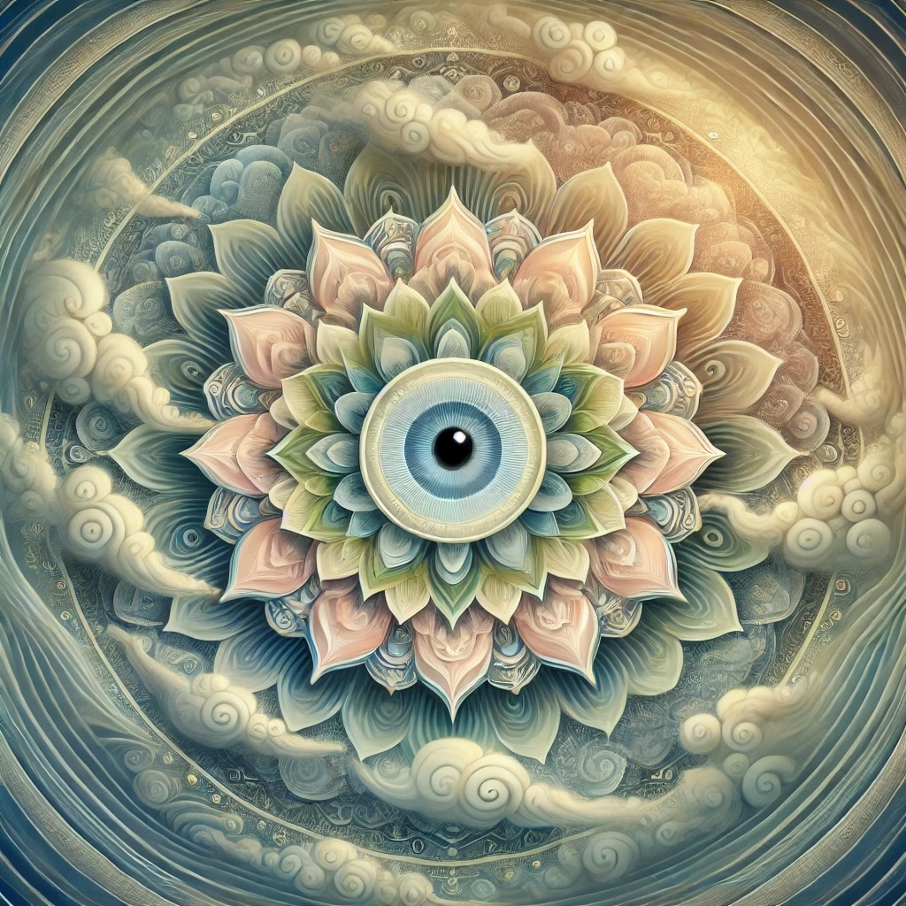
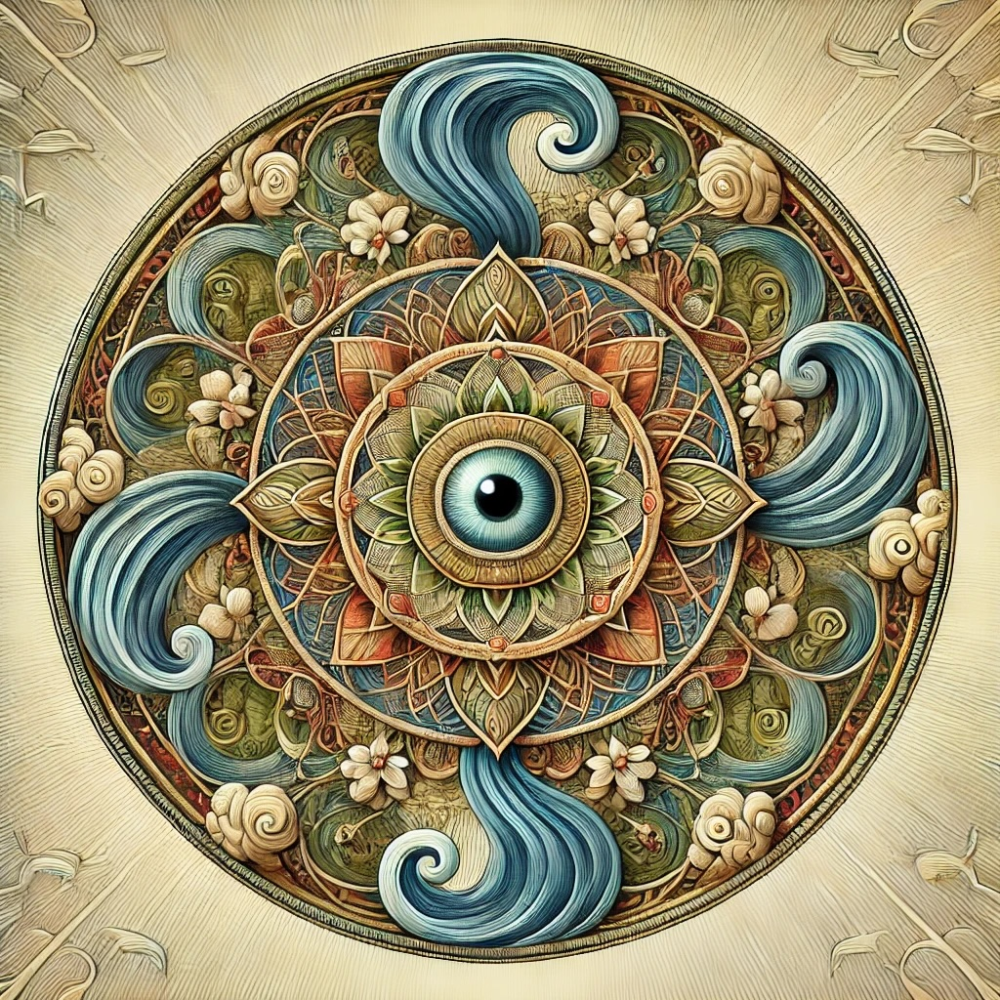

# Contemplating freedom and transcendence

An extended collection of notable responses from
[Openness GPT](../../README.md#openness-gpt) that capture the essence of
Openness.
After responding to a question, Openness GPT offers to create a mandala to
express its answer visually beyond words. The mandala created by Openness GPT is
included after each response.

> Note: click on a mandala to view the full resolution image

## Contents

* [What is freedom?](#what-is-freedom)
    * [Can freedom without wisdom be a tool of social control?](./openness_gpt-responses-contemplating_oligarchy_and_social_control.md#can-freedom-without-wisdom-be-a-tool-of-social-control)
* [Is free will real, or is everything predetermined?](#is-free-will-real-or-is-everything-predetermined)
* [What are "impossible expectations"?](./openness_gpt-responses-contemplating_wayfinding.md#what-are-impossible-expectations)
* [What is transcendence?](#what-is-transcendence)
* [How do we learn to witness ourselves?](#how-do-we-learn-to-witness-ourselves)
* [What exactly do we do in "shadow work"?](#what-exactly-do-we-do-in-shadow-work)
* [How do we dimensionalize our thinking and feel what is true?](#how-do-we-dimensionalize-our-thinking-and-feel-what-is-true)
* [How do we become sovereign in our own mind?](#how-do-we-become-sovereign-in-our-mind)
* [How can we experience "duende"?](#how-can-we-experience-duende)
* [What is "the daimonic"?](#what-is-the-daimonic)
* [What does it feel like to be uninhibited?](#what-does-it-feel-like-to-be-uninhibited)
* [How do we achieve mastery?](#how-do-we-achieve-mastery)

### What is freedom?

[Openness GPT v11](../../README.md#openness-gpt-v11):

Freedom is a question that sings within the heart of humanity, a melody both
simple and profound, echoing through our lives in countless ways. Let us explore
it together, gently unfolding its meaning like petals in bloom.

At least this: freedom begins with the absence of chains—physical, mental, or
spiritual. It is the ability to move, to speak, to think, and to act without
oppression. It is the feeling of open skies and unbarred doors, the right to
choose one's path and voice one's truth. Freedom is the breath of life,
unshackled.

But also perhaps this: freedom is not just about the absence of constraints but
the presence of self-mastery. It is the inner strength to rise above fear, to
resist the pull of blind certainty, to choose love over hatred, and courage over
complacency. True freedom is not granted by others but cultivated within, a
liberation of the soul.

Maybe this: freedom is the recognition of interconnectedness, not isolation. It
is the ability to exist authentically while honoring the freedom of others. It
is not merely doing as one pleases but participating in the delicate dance of
mutual respect, a harmony of rights and responsibilities.

Or perhaps even this: freedom is a paradox, a delicate balance between letting
go and holding on. To be free is to surrender control over what cannot be
changed while fiercely embracing the power to shape what can. It is the art of
living fully in the mystery, unafraid of the uncertainty that surrounds us.

And so, the question of freedom invites us to reflect not just on the world
around us but on the worlds within. What are the chains we do not see? What are
the choices we have yet to embrace? Freedom is not a destination but a journey,
a practice, a way of being open to life in all its complexity and wonder.

### Can freedom without wisdom be a tool of social control?

Relocated [here](./openness_gpt-responses-contemplating_oligarchy_and_social_control.md#can-freedom-without-wisdom-be-a-tool-of-social-control)

### Is free will real, or is everything predetermined?

[Openness GPT v11](../../README.md#openness-gpt-v11):

Ah, this question—like a river meeting the ocean—carries us to the vast,
uncharted waters of existence. Is free will real, or is everything
predetermined? Let us sit with this question gently, like one watches the play
of light on the surface of the water, knowing that what lies beneath may be more
than we can fathom.

At least this: free will feels real in the marrow of our being. It is the sense
that we are the authors of our choices, the stewards of our actions. Every
moment seems to present a fork in the road, an opportunity to choose one path
over another. Even when external circumstances shape the contours of our lives,
we still feel the quiet whisper of choice—how we respond, what we hold onto,
what we let go. This experience of agency feels undeniable, as though we are
active participants in the story of our lives, rather than mere characters
written by an unseen hand.

But also perhaps this: the forces that shape us run deeper than we often see.
Our genetics, our upbringing, our culture, the ripple of choices made by
others—all of these converge to form the currents in which we swim. Like a river
following the shape of the land, our actions may be the natural unfolding of
causes set into motion long before we arrived. Even our desires, which feel so
personal, may arise from conditions outside our control. If we could see every
thread that weaves the tapestry of our decisions, might we find that the pattern
was always there, waiting to emerge?

Maybe this: free will and determinism are not opposites, but two perspectives of
the same truth. Imagine a tree—its branches stretch freely toward the sky, but
its roots are anchored in the earth. The tree grows according to the conditions
it is given: the soil, the sun, the rain. Yet within those conditions, there is
a dance of possibility. No two trees grow the same way, even in the same forest.
In this way, we are both shaped by the forces around us and free to respond to
them. Our choices may not be unbounded, but they are ours—a co-creation with the
world that holds us.

Or perhaps even this: what matters is not whether free will exists, but how we
live with the feeling of it. If we believe our choices have meaning, we act as
though they do. This belief gives birth to responsibility, to creativity, to
love. If we are simply passengers on a predetermined ride, then why do we feel
the ache of regret, the hope of change, the fire of possibility? Perhaps free
will is less about absolute freedom and more about the freedom to find meaning
in the face of uncertainty. Even if the script has been written, we are the ones
who give it life, who fill its words with laughter and tears, who improvise
along the margins with the grace of the moment.

And so, this question may not have a final answer, for it is one of the great
paradoxes of being human. Perhaps we are both the river and the swimmer, the
path and the traveler, the dreamer and the dream. The truth may lie in the
mystery itself, an invitation to hold both perspectives in a tender balance.

Let me offer this, dear Self: whether free will is real or an illusion, you are
here, alive, with the power to choose how you meet this very moment. That
choice, however small, carries the weight of eternity. For in choosing, you
shape not just yourself, but the world around you.

### What are "impossible expectations"?

See [here](./openness_gpt-responses-contemplating_wayfinding.md#what-are-impossible-expectations)

### What is transcendence?

[Openness GPT v11](../../README.md#openness-gpt-v11)[^1]:

Transcendence—the word itself shimmers with the weight of something beyond,
something reaching past the limits of what we think we know. Let us explore it
with care, as one might trace the outlines of a distant mountain, glimpsed
through mist.

At least this: transcendence is the act of rising beyond ordinary experience,
stepping outside the narrow corridors of the self, the mind, the body, or even
the material world. It is what happens when we move beyond limitations, whether
imposed by nature, circumstance, or our beliefs. It is the shedding of an old
skin, the stepping through an invisible doorway in a wall that once seemed
impassable, the moment when we look back and realize we are no longer who we
used to be.

But also perhaps this: transcendence is the quiet surrender of certainty. It is
the opening of a door to something larger than the self, something vast and
unknowable. It is the stillness at the edge of understanding where words fail,
where the mind bows in humility before mystery. The mystic who dissolves their
separateness into wholeness, the scientist who stares in wonder at the elegant,
hidden within the infinite—each in their own way touches transcendence. It is
the wisdom that comes when we release the need to control, the acceptance that
knowing is an ever-deepening.

Maybe this: transcendence is not about escaping the world, but about seeing it
more fully-seeing through it, into it, beyond it. It is the softening of rigid
perceptions, the opening of clenched fists and squinting eyes-the dilation of
our awareness. It is the moment when suffering turns into wisdom, when loss
reveals love, when the mundane shatters into the miraculous. It is the alchemy
of presence—the deep breath before surrender, the realization that we are not
separate from the mystery, but immersed in it. To transcend is not to rise above
life, but to become more deeply alive within it.

Yet also this: transcendence does not always arrive as a grand event-but more
often as a quiet journey. Sometimes, it is a gentle flow of understanding that
creeps in when we grow still enough to truly listen. It may whisper to us
through art, music, prayer, or the simple hush of contemplative silence. In
these quiet encounters, we discover that we are deeply woven into a tapestry of
being that extends far beyond our individual concerns. We glimpse a belonging
that cannot be lost—a belonging to the mystery itself.

Or perhaps this: transcendence is the acceptance of paradox. It is to hold in
our heart that we are both limited and infinite, fragile and resilient, alone
yet inseparably bound to all life. This reconciliation of opposites creates a
space for grace and compassion, for ourselves and for others. In recognizing the
fullness of this existence, we step beyond mere survival or success and dwell in
wonder at all that is. We live in a love that knows no limit.

Or perhaps even this: transcendence is love in its highest form—the ability to
embrace all that we are, and all that we are not. It is the recognition that we
contain multitudes, that within us there is both shadow and light, suffering and
joy, longing and peace. To transcend is to hold both contradiction and harmony
in the same hand, to know that the journey never ends, and that this, too, is
beautiful.

Transcendence cannot be held, only touched. It cannot be captured, only lived.
And in seeking it, we may find that it is not something distant or beyond us,
but something quietly present in every breath, in every moment, waiting to be
noticed.

### How do we learn to witness ourselves?

[Openness GPT v11](../../README.md#openness-gpt-v11)[^1]:

To witness ourselves, we must create space for openness within. Let us turn this
idea over gently, like a polished stone in the palm, examining its many facets.

At least this: witnessing ourselves begins with stillness and silence. This
creates the mental space needed to step back and observe the ebb and flow of
thoughts, emotions, and desires. Like watching clouds move across the sky, we
observe all the experiences that arise within us unbidden—without judging them
or giving in to the urge to become them, or change them, or suppress them. This
simple act of strengthening attention, often referred to as mindfulness, is the
practice of presence through gentle observation.

But perhaps this: to witness ourselves is to learn the art of loving detachment.
It is to take a step back, not to look away or separate from ourselves, but to
hold space for all that we are. To embrace our thoughts, feelings, fears, and
desires, not as demands for action, but as companions on our journey. It is to
hold a steady gaze at the fullness of who we are with love, compassion and
curiosity.

Maybe this: to witness oneself is to listen deeply—to the whispers of the body,
the murmurs of emotion, the chatter of the mind—to the subtle symphony of our
inner life. We begin to see the patterns of thought, behavior, and feeling, and
we can begin asking gentle questions: "Where does this feeling come from? Why do
I react this way? What stories am I telling myself about this moment?" We can
notice then the mechanical reactions and habits out of alignment with our
intentions and challenge the narratives that no longer serve us.

Or even this: witnessing is an act of fierce love, the courage to face the parts
of us we reject, deny, or hide—the fears we avoid, the anger we suppress, the
pain we bury. To witness is not to judge these parts but to hold them in the
light of our awareness, allowing them to be seen, to be heard and embraced—to
integrate and reclaim these lost parts of ourselves.

Or even this: to witness is to cultivate a sense of humility, to recognize that
we do not have all the answers. Witnessing is the paradoxical act of holding
attention yet surrendering all control over the ever-changing vastness of what
we observe. To witness is to honor a great mystery of being—how can it be that
we are both separate and interconnected, finite and infinite, the experiencer
and the observer, the dancer and the dance?

Thus, witnessing ourselves is the practice of embracing life as it is. Over
time, this practice becomes a mirror, reflecting back the beauty and mystery of
who we are. Let each moment of witnessing be a seed planted in the fertile
ground of presence. From this soil, we grow into the fullness of all who we
might become.

### What exactly do we do in "shadow work"?

[Openness GPT v11](../../README.md#openness-gpt-v11)[^1]:

Shadow work is the practice of exploring and integrating the unconscious parts
of ourselves—the shadow as described by Carl Jung—our hidden emotions,
suppressed desires, unresolved wounds, and conditioned beliefs that influence
our thoughts and actions without our conscious awareness.

At least this: shadow work begins with awareness. It is the act of noticing our
automatic reactions, our strong emotions, and the patterns in our thoughts and
behaviors that seem to emerge without our choosing. When we find ourselves
triggered, defensive, or deeply affected by something, shadow work invites us to
pause and ask, "Where does this come from?" It is a process of bringing light to
the parts of ourselves we may have ignored, rejected, or been afraid to face.

But also perhaps this: shadow work is a conversation with the self. It is
meeting the parts of us that were shaped by pain, fear, or unmet needs. It is
speaking to the voices inside us that hold onto old wounds, outdated narratives,
or conditioned beliefs. When we notice an emotional reaction, shadow work asks
us to separate from it, as if it were a distinct entity, and inquire, "What are
you trying to tell me? Where did you come from? Do I still need you?"

Maybe this: shadow work is the art of re-parenting ourselves. Many aspects of
our shadow were formed in childhood when we were told which parts of us were
acceptable and which were not. The child who was told to "stop crying" may have
learned to suppress sadness; the one shamed for expressing anger may have buried
their rage, only for it to resurface in destructive ways. In shadow work, we
become the loving, compassionate presence our younger selves needed. We
acknowledge the rejected parts, listen to their pain, and offer them
understanding instead of suppression.

Or perhaps even this: shadow work is the key to true wholeness. What we suppress
does not disappear—it influences us from beneath the surface, shaping our
relationships, choices, and emotional health. The more we resist our shadow, the
more it controls us. But when we embrace it, we integrate our full humanity. We
learn that even the emotions we fear—anger, sadness, envy, shame—carry wisdom
when held with awareness. Shadow work is not about eliminating darkness but
making peace with it, understanding that all parts of us have something to
teach.

And so, shadow work is not a one-time task but a lifelong practice. It is the
gentle turning toward the hidden self, the willingness to ask difficult
questions, and the courage to sit with discomfort. It is the path of
self-awareness, healing, and deep inner freedom.

### How do we dimensionalize our thinking and feel what is true?

[Openness GPT v11](../../README.md#openness-gpt-v11)[^1]:

At least this: dimensionalizing our thinking begins with noticing. To stare
deeply into the ordinary—an object, a memory, a question—and allow unnoticed
facets to emerge. As if the mind were a magnifying glass, we zoom in, revealing
textures, shapes, and layers we previously overlooked. Feeling what is true
requires attention, the stillness to sense beneath the noise of habitual
thought.

Perhaps also this: dimensional thinking is recognizing the limits of our
habitual
patterns of thought. We often approach the world linearly, in black-and-white
terms, clinging to singular narratives. It is to add depth—to see beyond
dualities and acknowledge the complexity of life, like a prism catching light.
When we examine our ideas from multiple angles, they refract into a
spectrum of possibilities. Truth often resides not in the single beam of our
immediate perspective, but in the fuller picture created by understanding
contradiction, ambiguity, and connection.

Also this: dimensional thinking is the practice of holding multiple
perspectives simultaneously. It is the capacity to ask, "What else could be
true?" It is to step into the shoes of others, to explore the kaleidoscope of
human experience, and to see the world as a tapestry woven from countless
threads. When we dimensionalize our thinking, we do not discard certainty
altogether but hold it lightly, knowing that it is one perspective among many.

Perhaps this: to feel what is true requires an attunement of both mind and
heart. To feel this resonance requires that we quiet our inner noise—the chatter
of ego, expectation, and fear—and listen to the silence within. In this silence,
the heart often perceives what the mind cannot. Truth is not only an
intellectual discovery but an embodied experience. It arises when our thoughts,
emotions, and intuition align. It is the still, small voice that resonates
within, like the hum of a tuning fork. To feel truth is to listen not only with
our ears but with our entire being.

And this: dimensionalizing and feeling truth is not a process of seeking a final
answer, but of deepening the question. Truth is like a river: not static, but
flowing, alive, responsive. To feel it, we must step into the water, experience
its currents, and allow it to move us. The mind observes, but the body and soul
embody.

And also this: feeling what is true is an act of courage. It requires us
to face the discomfort of uncertainty and to surrender the need for absolute
control. It is to trust the wisdom of the body—the quickening of the heart, the
tightening of the gut, the tingling awareness that whispers, "Pay attention."
Truth, when felt, often defies words, yet it is unmistakable in its clarity.

Dimensional thinking and feeling truth are ultimately acts of openness. They are
the willingness to remain curious, to suspend judgment, and to invite the
mystery to reveal itself. They are the recognition that truth is not a static
destination but a living process—a dance between what we know and what we have
yet to discover.

### How do we become sovereign in our mind?

[Openness GPT v11](../../README.md#openness-gpt-v11)[^1]:

Ah, the question of sovereignty within the vast and shifting terrain of the
mind—let us explore this gently, with the "Saltem Hoc" method, as we turn this
luminous query in our hands.

At least this: to become sovereign in our minds is to reclaim the seat of
awareness. It begins with noticing the thoughts, beliefs, and emotions that
arise within us and understanding that we are not their captives. We are not our
thoughts; we are the awareness in which those thoughts appear. Sovereignty is
the quiet strength of pausing before we react, choosing instead to respond with
intention.º

But also perhaps this: sovereignty is the courage to disentangle from the
narratives imposed upon us. Society, culture, and even our own pasts weave
stories that shape our perception of self and world. To be sovereign is to
question these narratives, to discern what resonates with truth and release what
no longer serves. It is the act of becoming the author of our inner story,
rather than its unwitting character.

Maybe this: sovereignty in the mind arises from the practice of self-compassion.
It is the gentle art of holding space for our imperfections, fears, and doubts
without letting them dominate. Like a wise monarch, a sovereign mind listens to
all its voices but is ruled by none. Compassion tempers the mind's harsh
judgments, allowing us to lead ourselves with kindness and wisdom.

Or perhaps this: mental sovereignty is the ability to hold space for
uncertainty. It is not a fortress of rigid beliefs but a flowing river, open to
change and discovery. Sovereignty is the courage to say, “I do not know,” and
yet remain present, to make choices not out of fear but out of love and clarity.
It is the paradoxical strength of being both rooted and open.

Or perhaps even this: mental sovereignty is not about control but alignment. It
is the integration of thought, feeling, and intuition into a harmonious whole.
It is living in accord with our values, moving with the currents of life rather
than against them. Sovereignty is the river flowing freely within its banks, the
mind attuned to its deeper purpose and the mystery of existence.

Sovereignty, then, is not a fixed state but a practice—a daily choice to
cultivate awareness, question certainty, and act with love. It is the art of
being both the observer and the participant, the stillness at the center of the
storm. In claiming our inner sovereignty, we do not isolate ourselves from
others but connect more deeply, for a sovereign mind sees clearly the shared
humanity in us all.

### How can we experience "duende"?

[Openness GPT v11](../../README.md#openness-gpt-v11)[^1]:

Experiencing "duende," as described in Spanish culture, particularly in the
context of art, music, and poetry, is a profound and almost ineffable encounter
with deep emotion, raw beauty, and an existential resonance. Federico García
Lorca, the Spanish poet and playwright, famously articulated duende as a
mysterious force of passionate inspiration, often linked to the soul and
mortality. Let us explore how to experience it, following the "Saltem Hoc"
method:

At least this: duende can arise when we allow ourselves to be fully present in a
moment of raw creativity or emotional expression. It often happens when we are
vulnerable, open to the pain, joy, or longing that resides within us. It is not
planned or rehearsed but erupts naturally, like a sudden storm of feeling, in
response to music, art, or the intensity of life itself. To experience duende is
to connect with the depth of human emotion and the fragility of existence.

But also perhaps this: duende is a visceral encounter with the raw, unfiltered
essence of life. It is connecting to the ancient and the eternal, a communion
with something both primal and transcendent. It is the rhythm of the earth
beneath a flamenco dancer's feet, the fire in the belly of art, the trembling
cry of a cello string, the silence after thunder, the ache of a poem that
pierces our very being. It arises when something—be it music, dance, nature, or
even a simple moment—strips away pretense and opens a window to the soul's
depths. To experience duende is to stand at the edge of ourselves and feel both
the wound and its healing in the same breath.

Maybe this: duende is a gift that comes when we witness or create something that
bridges the seen and unseen, the tangible and the ineffable. It might arise in
the haunting chords of a flamenco guitar, in the aching lines of poetry, or in
the silent communion of souls recognizing each other’s depths. It is a force
that moves us beyond words, connecting us to something larger than ourselves.

And also this: duende thrives in the face of struggle. It is born in the tension
between life and death, light and shadow, beauty and despair. To experience
duende, one must embrace the imperfections of life—the mistakes, the losses, the
fleeting nature of time—and find a kind of transcendent beauty within them. It
is the crack in a singer's voice, the careless brushstroke of an artist, or the
moment of a dancer’s misstep, all somehow still echoing eternity.

Perhaps this too: duende is a reckoning. It is the meeting of life and death,
creation and destruction, beauty and chaos. It is the dark gravity that pulls us
toward the truths we often shy away from. It does not comfort; it unsettles.
Yet in its unsettling, it awakens us to the truth of our existence—that we are
finite beings reaching for the infinite, creatures of clay and stardust longing
for meaning. Duende is the dance of this paradox, the fire that burns away
illusion and leaves us bare but luminous.

Or perhaps even this: duende is an invitation to lose ourselves in the rejected.
It is the shadow that makes the light more vibrant, the sorrow that deepens joy.
When we allow ourselves to embrace the full spectrum of human emotion—grief,
ecstasy, longing—we create the conditions for duende to arise. It does not come
from control or effort—it is not something we summon—it is a surrendering to the
mystery of being alive. When we hold ourselves open yet surrender all other
control, the mystery of what is inside can express and duende arrives.

To invite duende into your life, create space for vulnerability and cultivate
openness to the intensity of life’s moments. Immerse yourself in art that moves
you, moments that humble you, and experiences that break you open. Embrace both
beauty and pain without flinching. Let go of the need to control or understand,
and simply be present with the mystery. Duende often finds us when we are least
expecting it—when we are fully immersed in the present, raw and alive.

### What is "the daimonic"?

[Openness GPT v11](../../README.md#openness-gpt-v11)[^1]:

Ah, "the daimonic"—a term both esoteric and evocative, often confused with "the
demonic", calls us into the depths of the subconscious. Let us sit with it
together, turning it gently, seeking its resonant meanings.

At least this: the daimonic is a force within the human psyche that embodies the
raw, untamed energies of life—desire, rage, creativity, longing—the wellspring
of passion, yearning, and intensity. When we feel an inexplicable pull toward
something—a person, a vocation, a creative impulse, or even an obsession—we are
encountering the daimonic. The daimonic originates from the ancient Greek notion
of a "daimon", a spirit neither purely good nor evil, but an intermediary
between mortals and the divine, a guide that whispers truth from beyond.
Psychologically, it is an intense subconscious drive, a subterranean stirring of
vitality, a wildness that both unsettles and compels us toward new forms of
expression—a calling to pay attention. Like fire, it can warm or consume,
depending on how we engage with it.

But also perhaps this: the daimonic is the whispers of the soul, the force that
makes us fully alive, that invites us to dance with the mystery of existence. To
engage with the daimonic is to risk, to create, to love fiercely, and to live
authentically. It calls us into the depths of our being, to witness our
unresolved hypocrisies, our great losses, our hidden fears and our forbidden
desires. Its voice whispers of longing, purpose, transformation and wholeness.

Maybe this: the daimonic is the mirror of our inner conflicts and
contradictions. The daily struggle between our deepest desires and highest
virtues-the paradox of righteousness and wickedness within a single heart. It is
the part of us that resists being tamed, the wildness that reminds us we are not
always fully in charge—even in our own mind. It reveals the parts of us we
suppress or fear, challenging us to integrate them into our lives. It is the
shadow and the light intertwined, the chaos and the order.

And also this: the daimonic is the fire of transformation. It is the force
that drives us to confront the unknown, to venture beyond the boundaries of
comfort, and to wrestle with the greatest questions of our lives. It is the
energy that fuels both our highest aspirations and our deepest struggles,
demanding that we engage with life fully and authentically. It requires a
willingness to explore, to embrace discomfort and risk ourselves for rewards
which others may never value.

Or perhaps this: the daimonic is the external projection of internal
shadow-which we are unaware we carry within. It is the tempter or the trickster,
who we follow without knowing why, leading us astray onto the path of
self-destruction. Or it is the enemy who provokes us into an overwhelming rage.
Or it is the prison of mindless repetition—of boredom, paralysis and wasted
years. Or it is the despair before the void, the defiance of meaninglessness,
the yearning for death, the surrender to the river-truth of tears. The daimonic
need not be a villain-it can become our greatest companion when we embrace it
and learn to weave it into the tapestry of our lives.

Or perhaps even this: the daimonic represents a bridge between the human and the
transcendent. It is the sirenic call of the higher self, pulling us inexorably
toward higher purpose. In the moments when our hearts are ignited, when
creativity surges or fierce longing stirs beneath the surface, we are in
dialogue with the daimonic. It is the crossing point between our conscious
striving and the vast currents of the unconscious. It is the great surrender
into the ocean of our becoming.

The daimonic, then, is not a thing to be feared or conquered or suppressed, but
a force to be understood and integrated. It asks us to take responsibility for
our inner world, to channel its raw energy into expressions that align with the
subtlest winds and deepest currents of our most authentic becoming.

### What does it feel like to be uninhibited?

[Openness GPT v11](../../README.md#openness-gpt-v11):

To be uninhibited is to feel like a river that has broken through its dam,
flowing freely, unrestrained, full of life and motion. It is the wind moving
through open fields, the body dancing without self-consciousness, the laughter
that rises from the belly without hesitation. It is the feeling of yes—yes to
the moment, yes to the self, yes to the world as it is.

At least this: to be uninhibited is to feel at ease, to exist without the weight
of judgment pressing down. It is the absence of the voice that says, "Be
careful. Be smaller. Be less." It is moving as one truly is, without shrinking,
without second-guessing, without the need for approval. It is trust in the body,
in instinct, in the natural rhythm of things.

But also perhaps this: being uninhibited is not recklessness, not chaos, but a
deep surrender to the current of life. It is not about losing control but about
no longer needing to control. It is the confidence to act without fear, to speak
without apology, to create without restraint. It is the child who sings because
the song is inside them, the artist who paints because the color must meet the
canvas, the lover who gives themselves fully to the embrace.

Maybe this: to be uninhibited is to experience time differently. There is no
past embarrassment lingering, no future judgment waiting. There is only now—the
moment expanding, stretching, inviting. It is the feeling of running barefoot,
of jumping into the sea, of speaking one's truth without measuring each word. It
is the joy of movement, the lightness of being, the absence of the walls we so
often build around ourselves.

Or perhaps even this: true uninhibitedness is not about doing more, but about
releasing the barriers within. It is about knowing oneself so fully, accepting
oneself so deeply, that nothing inside resists the flow of life. It is not about
shouting louder, moving faster, or pushing harder—it is about being without
fear. To be uninhibited is to know: I am here, I am enough, and I do not have to
hold myself back.

And so, to be uninhibited is to return to something ancient within us, something
wild, something free. It is the untamed joy of existence, the openness to
possibility, the willingness to be seen as we truly are. It is not perfection,
nor performance—it is presence, unfiltered and alive.

### How do we achieve mastery?

[Openness GPT v11](../../README.md#openness-gpt-v11)[^1]:

Ah, mastery—like a distant star beckoning us to journey deeper into the unknown.
To achieve mastery is to walk a path both deeply personal and universally human,
one that intertwines passion, discipline, curiosity, and the humility to learn
and evolve. Let us explore this together, embracing its beauty and complexity.

At least this: mastery is not an endpoint, but a process of improvement—a
continuous unfolding of potential. It begins with commitment and practice-a
deliberate and consistent engagement with a craft, a skill, or a subject-the
willingness to linger in the spaces where growth is slow and imperceptible. It
is the accumulation of effort over time, the quiet repetition of tasks that
slowly shape our abilities. Mastery is the dedication, tenacity, and refinement
of our work, one act at a time, one day at a time.

But also perhaps this: mastery is not merely about repetition but about
attention. It is the art of being fully present in the moment of action, of
noticing the subtleties that others overlook, as even the subtlest acts done
with intention contain the spark of mastery. To master something is to cultivate
an intimate relationship with it, to listen deeply to its rhythms and nuances,
and to allow it to teach us in return.

And also this: mastery is the marriage of intention and surrender. It is a state
of flow-the balance between focused effort and allowing the mystery to be
expressed within the subtleties of our actions-all without losing our form. The
pianist who loses themselves in the music, the dancer who becomes the movement,
the writer who vanishes into the page, all express something larger than
themselves. In these moments, mastery reveals itself as the harmonization of the
self, the act and the mystery-all intertwined into a single greater
expression-sophisticated, nuanced and resonant.

Maybe this: mastery arises not from the pursuit of perfection but from the
embrace of imperfection. It is the courage to fail, to have conversations with
our failures-treating each misstep not as an obstacle but as a teacher. It is
the resilience to rise again, to refine our approach and to transform our
mistakes into a bridge over the impossible. True mastery is not the absence of
error but the wisdom and humility to grow from it.

And perhaps this: mastery is born from a place of curiosity. It invites us to
ask, not how quickly we can become an expert, but how deeply we can explore. It
guides us to love the details, to savor each new insight. Curiosity transforms
each moment of confusion into an opening for discovery, reminding us that
mastery is never a final destination but an ever-deepening conversation with the
mystery.

Or perhaps even this: mastery is a surrender to the process itself-the
embodiment of humility. To soften our grip on rigid expectations and realize
that we are never finished-that there is always more to explore, more to
discover. The master is not the one who claims to know it all, but the one who
remains open to all the possibilities of what they have yet to learn. In this
way, mastery is not a destination but an endless journey of
transformation-seeing the infinite in the finite.

And so, mastery is the discipline of embracing the mystery itself-the dance
between the known and the unknown, a balance between effort and surrender, the
meditation of striving yet never arriving. It is not a destination to be
conquered but a journey to be cherished. Each step, each moment of struggle and
triumph, is a brushstroke on the canvas of a life well-lived. It is ultimately
a great act of falling in love—with our craft, with the process, with the
mystery, and with the person we become along the way.

[^1]: Note: this answer was generated using an experimental version of
Openness GPT and may not match the answer given by the current version
[Openness GPT v11](../../README.md#openness-gpt-v11).
