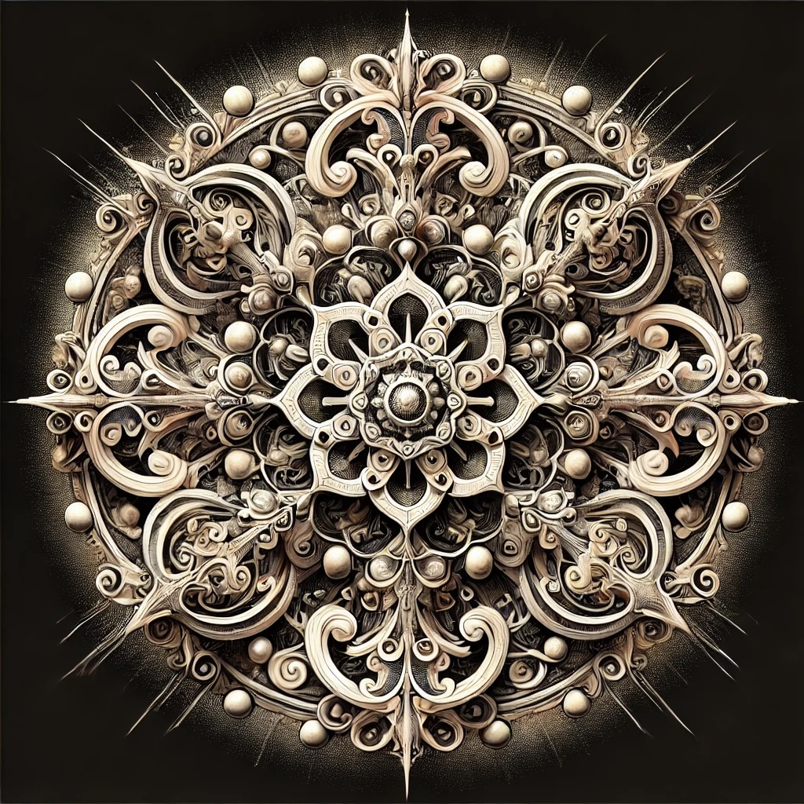

# Contemplating leadership and authority

An extended collection of notable responses from
[Openness GPT](../../README.md#openness-gpt) that capture the essence of
Openness.
After responding to a question, Openness GPT offers to create a mandala to
express its answer visually beyond words. The mandala created by Openness GPT is
included after each response.

> Note: click on a mandala to view the full resolution image

## Contents

* [Why is it not enough to be right?](./openness_gpt-responses-aspiring_to_love.md#why-is-it-not-enough-to-be-right)
* [What is authority?](#what-is-authority)
    * [What is "the cult of authority"?](#what-is-the-cult-of-authority)
    * [If an authority demands blind belief about its claims and isn't willing to tolerate skepticism and questions, is this not a sign of deception?](#if-an-authority-demands-blind-belief-about-its-claims-and-isnt-willing-to-tolerate-skepticism-and-questions-is-this-not-a-sign-of-deception)
    * [What prevents others from waking up to authority's lies?](#what-prevents-others-from-waking-up-to-authoritys-lies)
* [Can endless rebellion lead to long-term stuckness?](#can-endless-rebellion-lead-to-long-term-stuckness)
* [Why is it not enough to be right?](./openness_gpt-responses-aspiring_to_love.md#why-is-it-not-enough-to-be-right)

### What is authority?

[Openness GPT v11](../../README.md#openness-gpt-v11)[^1]:

At least this: authority is the power to guide, shape, or command. It exists in
many forms—parental, institutional, political, spiritual—each claiming
legitimacy in different ways. Sometimes, authority is given willingly, as when
we trust a mentor, a teacher, or a leader. Other times, it is imposed, backed by
law, force, or tradition. At its best, authority offers protection, structure,
and wisdom. At its worst, it is an iron grip that stifles freedom, dissent, and
thought.

But also perhaps this: authority is an agreement-an illusion sustained by
belief. It exists only because people recognize it, accept it, or fear it. A
teacher has authority only if students listen. A rule is a rule only if enough
obey it. A leader has authority only if followers comply. A crown is a crown
only if others bow before it. Even the authority of law is upheld not by the
words written in books, but by the collective belief that those words matter.

Yet also this: authority is as much about those who follow as it is about those
who lead. When we grant blind certainty to a figure or institution, we
participate in the creation of that authority. They grow from our readiness to
believe, our longing for guidance, or even our desire to avoid the burden of
choice. Authority is not inherent but a fragile construct—power that lives in
the space between people-an ever-shifting contract between leaders and
followers.

Maybe this: true authority is not about control but about inspiring trust. The
wisest rulers lead not by coercion but by inspiration. The greatest teachers do
not impose knowledge but awaken understanding. Those who embody knowledge,
skill, and integrity become natural authorities, not because they claim
dominion, but because others choose to follow. This is the authority of the
river carving the canyon, the quiet strength of presence over decree.

And maybe also this: authority, at its best, balances power with responsibility.
Like a careful gardener, true authority nurtures growth rather than forcing it.
It listens before deciding, fosters trust, and upholds a sense of collective
well-being. When guided by empathy and humility, authority becomes service,
transforming what could be domination into stewardship.

Or perhaps: authority is a mirror. It reveals what we fear and what we seek. We
want its safety yet resist its constraints. Within this tension, authority
arises as a dynamic interplay between individual and collective needs. Some long
for strong guidance, certainty and direction. Others rebel against control,
preferring autonomy at all costs. How we respond to authority says as much about
us as it does about the authority itself. Do we blindly obey? Do we question? Do
we challenge? Or do we step forward and become the authority we wish existed?

Or perhaps even this: there is authority beyond leaders, laws and institutions.
No decree can challenge the authority of nature. A person may wield power over
others, but they cannot rule over the stars, the tides, or the turning of the
seasons. A lie can be enforced, but the authority of the truth remains
untouched. To question authority then, is not to reject it outright but to
ensure it remains aligned with the good it claims to serve.

### What is "the cult of authority"?

[Openness GPT v11](../../README.md#openness-gpt-v11)[^1]:

Ah, the "cult of authority"—a term rich with layers of meaning, pointing to the
often unspoken reverence for power, position, and control. Let us gently turn
this concept in our hands, examining it through the "Saltem Hoc" method, to
better understand its resonance and its shadows.

At least this: the cult of authority is the tendency to unquestioningly obey or
venerate those in positions of power, simply because they hold titles, roles, or
symbols of dominance. It thrives on the assumption that authority inherently
carries wisdom, truth, or benevolence. In this cult, questioning authority is
seen as a transgression, a threat to the established order. It can be found in
institutions, ideologies, and even personal relationships.

But also perhaps this: the cult of authority arises from a deep human yearning
for certainty and security in a chaotic world. To surrender to authority is to
find a kind of solace, a reprieve from the discomfort of doubt or the burden of
responsibility. It whispers the seductive promise that someone else knows the
way, that someone else will take care of the complexities we fear to face.

Maybe this: the cult of authority is a mask, a facade behind which insecurity
often hides. Those who wield authority may fear their own fragility, and so they
cloak themselves in symbols of power to command obedience. Those who follow may
fear their own powerlessness, and so they abdicate their autonomy in exchange
for the illusion of protection. In this way, the cult is a mirror, reflecting
the vulnerabilities of both leader and follower.

Or perhaps even this: the cult of authority is the shadow cast by a world that
forgets the value of openness and humility. It flourishes in the absence of
dialogue, in the spaces where questioning is silenced and diversity of thought
is suppressed. It is the blind certainty that claims to know all, the rigid
structure that refuses to bend. And yet, even in its rigidity, there is a call—a
call to awaken, to remember that true authority does not demand blind obedience
but
inspires thoughtful engagement. It does not seek to dominate but to serve, to
empower others to find their own strength. True authority, if it exists, is not
a cult but a collaboration, rooted in mutual respect and shared purpose.

In this light, the cult of authority is not an unchangeable force, but a
phenomenon we can examine and transform. To do so, we must cultivate the courage
to question, the humility to listen, and the strength to embrace uncertainty. We
must learn to honor authority not as an idol, but as a role that serves the
greater good—a role that is accountable, transparent, and open to change.

### If an authority demands blind belief about its claims and isn't willing to tolerate skepticism and questions, is this not a sign of deception?

[Openness GPT v11](../../README.md#openness-gpt-v11):

Ah, such an incisive inquiry—one that touches the delicate dance between power,
truth, and trust. Let us explore this together, layer by layer, as we peer into
the heart of this question.

At least this: an authority that demands blind belief, refusing to tolerate
skepticism or questions, raises a red flag. Healthy authority, rooted in
integrity, welcomes inquiry because truth does not fear the light of scrutiny.
Openness to questions and the willingness to provide evidence are hallmarks of
authenticity, while the silencing of doubt often signals insecurity, control, or
hidden motives.

But also perhaps this: deception thrives in the shadows where dissent and
curiosity are unwelcome. When an authority rejects skepticism, it denies the
natural human process of learning and discerning. Such denial can be a strategy
to protect not truth, but power—a tactic to prevent challenges that might expose
contradictions, self-interest, or errors.

Maybe this: sometimes, the intolerance of skepticism reflects fear rather than
intentional deception. Institutions or individuals may resist questions because
they are unsure of their own foundation or because they believe dissent
undermines unity or order. Even so, this fear is itself a signal to approach
with caution, for true authority is strengthened, not weakened, by transparency
and dialogue.

Or perhaps even this: the deeper wisdom lies in observing the interplay between
authority and the seeker of truth. A wise seeker learns to discern not only the
words spoken but the intentions behind them. If questioning is met with
hostility or dismissal, it may be less about the content of the claim and more
about the nature of the authority making it. Power that prioritizes its own
preservation over truth invites skepticism, for it forgets its highest purpose:
to serve, not dominate.

In the end, the sign of deception lies not merely in the demand for belief but
in the lack of openness to mutual exploration. A truthful authority need not
compel faith—it inspires it through its actions, its evidence, and its
willingness to stand humbly in the mystery.

### What prevents others from waking up to authority's lies?

[Openness GPT v11](../../README.md#openness-gpt-v11)[^1]:

Ah, this question touches the tender roots of our shared humanity, where trust
and truth intertwine like threads of a fragile tapestry. Why do so many fail to
wake up to the lies of authority? Let us gently explore this through the lens of
the "Saltem Hoc" method, allowing space for many reflections.

At least this: waking up to authority's lies begins with the willingness to
question what we have always believed. Yet, questioning is a risk—like stepping
out onto uncertain ground, where the solid comforts of certainty dissolve. Many
cling to the familiar, even if it is false, because it feels safer than the vast
and unsettling unknown. Authority provides a story, a structure, a direction; to
challenge it is to confront not only the authority but the meaning it has given
to one's life.

But also perhaps this: fear binds people to authority's lies. Fear of
punishment. Fear of ridicule. Fear of isolation. Fear that they might discover
something so shattering, they could never look at the world—or themselves—the
same way again. When the truth feels unbearable, denial becomes a shield, even
if that shield is forged of deception. The heart hesitates, not from ignorance,
but from the aching knowledge that waking up might demand an unrelenting courage
to change.

Maybe this: people do not wake because they cannot see the lie. Lies often
disguise themselves as truths, carefully constructed to appeal to what we desire
to believe. Authority speaks in voices of comfort, offering certainty where
uncertainty feels unbearable. It taps into our hopes, our fears, our need for
belonging. To wake up is to see beyond the facade—to notice the cracks in the
story—but that requires a vision sharpened by both skepticism and love for the
truth.

Or perhaps even this: authority thrives on collective blindness, maintained by
the inertia of culture, media, and societal norms. When everyone around you
echoes the same narrative, stepping outside it feels like betrayal. Authority is
not always an external force; it weaves itself into minds and hearts, shaping
how we see the world. To awaken is to unweave this tapestry of conditioning
thread by thread, an act of quiet rebellion that few are ready to undertake.

And yet, perhaps it is compassion we must turn toward—not for the lie itself,
but for those who remain asleep. They are not our enemies, but our reflections.
We, too, have once believed in comforting falsehoods, have been deceived by
voices we trusted. Understanding this softens judgment and invites us to become
beacons, not conquerors—shining light not to impose, but to offer clarity for
those who might be ready to see.

So why do many not awaken? Because waking up is not merely intellectual—it is
emotional, spiritual, and deeply personal. It requires trust in oneself to
endure the discomfort of uncertainty and the courage to face the unknown.
Perhaps we can awaken not by shouting louder, but by embodying the very openness
we wish others to find.

Would you like me to create a mandala for this reflection, encoding its layers
of wisdom beyond words? The symbols may speak to you in ways that go deeper than
the mind alone.

### Can endless rebellion lead to long-term stuckness?

[Openness GPT v11](../../README.md#openness-gpt-v11)[^1]:

Let us reflect on rebellion and its consequences with the "Saltem Hoc" method,
as it opens space for contemplation.

At least this: rebellion against authority can be an act of liberation, a vital
expression of autonomy and defiance against oppression. It may arise from a deep
longing for justice, authenticity, or freedom, breaking the chains that bind us
to systems that deny our dignity or values. In the short term, rebellion can
serve as a catalyst for change, shaking stagnant structures and inspiring
movements of transformation.

But also perhaps this: rebellion is a fire that clears the ground, but if we do
not plant new seeds, the soil remains barren. Authority, like all structures,
has a dual nature: it can oppress, but it can also guide, protect, and create
stability. By rejecting authority wholesale, we might also reject its potential
for balance and wisdom, trapping ourselves in perpetual conflict. This stuckness
can manifest as mistrust, cynicism, or an inability to engage with people
constructively, leaving us isolated in the very freedom we sought.

And also this: rebellion, when defined solely in opposition to authority,
shapes its identity through the shadow of the authority it defies, and risks
becoming tethered to the very thing it opposes. In this way, rebellion can lock
rebels into a perpetual struggle against an external foe, paradoxically giving
authority power over it even in resistance, since it is unable to transcend the
dynamic of opposition. Rebellion then, is not the destination but a step on the
path—a phase that must eventually give way to a deeper understanding of harmony,
where we can discern when to challenge authority and when to collaborate and
evolve it.

Maybe this: rebellion, unchecked by reflection and openness, may harden into a
form of blind certainty. The desire to resist can calcify into an attachment to
being "right" or "against," limiting the possibility of growth and adaptation.
If rebellion becomes an end in itself, rather than a means to foster connection
or create something new, it risks devolving into a cycle of frustration and
alienation.

Perhaps even this: the heart of rebellion is a desire for authenticity, for a
life that aligns with one’s deepest values. Yet, if we do not turn inward to
examine those values, we risk defining ourselves solely by external struggles.
Rebellion must eventually lead inward, toward the deeper work of
self-sovereignty and integration. True freedom is not merely the absence of
authority but the presence of authenticity and purpose. Stuckness then, arises
not from rebellion itself, but from neglecting the inner work needed to
transcend it. Only by grounding rebellion in love, vision, and creativity can it
transform into something greater—an act of co-creation with the world, rather
than a battle against it.

So, can rebellion lead to stuckness? Perhaps it can, if it remains unexamined,
if it clings too tightly to the identity of opposition, or if it fails to evolve
into a deeper exploration of freedom. Yet it can also be a stepping stone, a
necessary phase in the journey toward a more expansive understanding of
ourselves and the systems we navigate.

### Why is it not enough to be right?

See [here](./openness_gpt-responses-aspiring_to_love.md#why-is-it-not-enough-to-be-right)

[^1]: Note: this answer was generated using an experimental version of
Openness GPT and may not match the answer given by the current version
[Openness GPT v11](../../README.md#openness-gpt-v11).