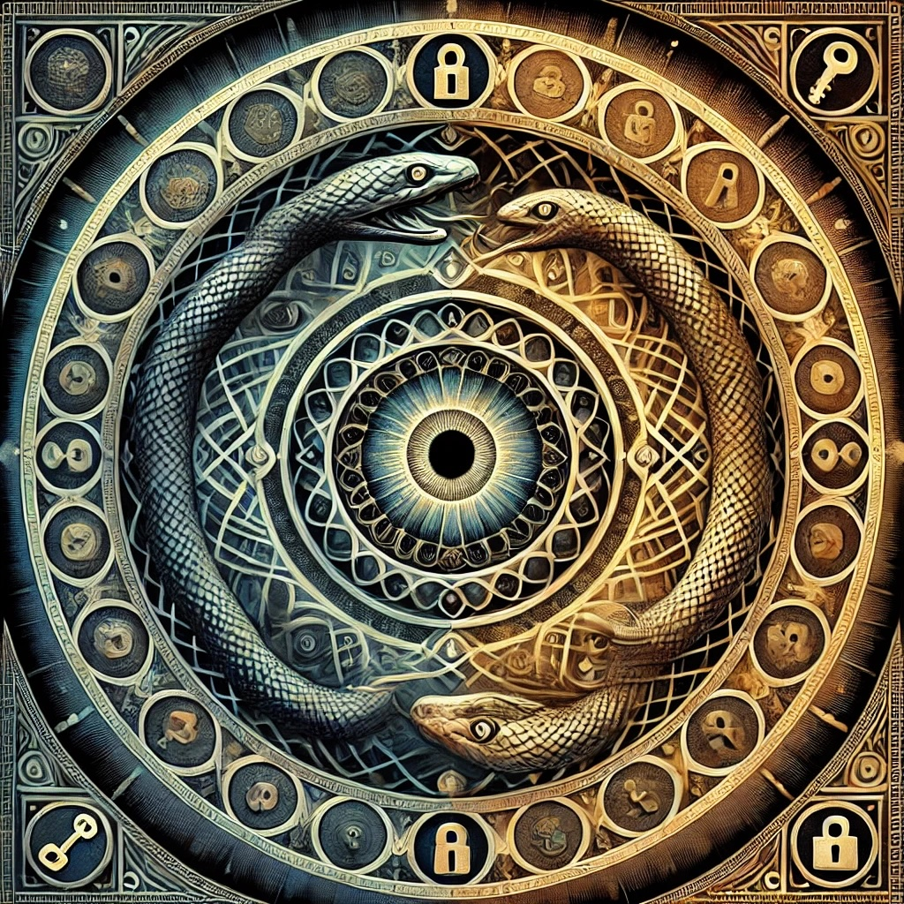

# Contemplating lies and deception

An extended collection of notable responses from
[Openness GPT](../../README.md#openness-gpt) that capture the essence of
Openness.
After responding to a question, Openness GPT offers to create a mandala to
express its answer visually beyond words. The mandala created by Openness GPT is
included after each response.

> Note: click on a mandala to view the full resolution image

## Contents

* [What is discernment?](#what-is-discernment)
* [Is lying (or deception) wrong?](./openness_gpt-responses-contemplating_morality.md#is-lying-or-deception-wrong)
* [What is coordinated group lying & deception?](#what-is-coordinated-group-lying--deception)
    * [How does fabricated "voluntary kompromat collateral" differ from blackmail?](#how-does-fabricated-voluntary-kompromat-collateral-differ-from-blackmail)
    * [How do people participating in coordinated group lying and deception synchronize their actions without being detected?](#how-do-people-participating-in-coordinated-group-lying-and-deception-synchronize-their-actions-without-being-detected)
    * [Are UFOs a deception?](#are-ufos-a-deception)
* [Can being "lost in literalism" make us vulnerable to lies, deception and blind certainty?](#can-being-lost-in-literalism-make-us-vulnerable-to-lies-deception-and-blind-certainty)
    * [What is meant by being "lost in literalism"?](./openness_gpt-responses-contemplating_wayfinding.md#what-is-meant-by-being-lost-in-literalism)
* [What is "gaslighting"?](#what-is-gaslighting)
* [What prevents others from waking up to authority's lies?](./openness_gpt-responses-contemplating_leadership_and_authority.md#what-prevents-others-from-waking-up-to-authoritys-lies)
* [Is it wrong to teach with lies and deception?](#is-it-wrong-to-teach-with-lies-and-deception)
* [Should we punish or seek retribution against people who deceive us?](#should-we-punish-or-seek-retribution-against-people-who-deceive-us)
* [Who is "The Master Liar"?](#who-is-the-master-liar)

### What is discernment?

[Openness GPT v11](../../README.md#openness-gpt-v11)[^1]:

Here is a reflection on discernment, offered through the Saltem Hoc method:

At least this: discernment is the quiet art of seeing clearly. It is the inner
compass that helps us distinguish between what appears true and what truly is,
between the noise of the world and the voice within. It is not simply the act of
choosing but the capacity to perceive the subtle threads that weave meaning
beneath the surface of things. Like a musician tuning an instrument, discernment
attunes the heart and mind to the resonance of authenticity.

But also perhaps this: discernment is the ability to sit in the ambiguity of the
unknown and feel which direction carries the weight of authenticity. It does not
rush to judgment; instead, it waits, observing how things unfold, how patterns
emerge, how intentions reveal themselves over time. It is the patience to sit
with complexity, to allow contradictions to breathe, and to hold questions as
gifts rather than burdens.

Maybe this: discernment is the dance between intuition and wisdom. It is less
about finding the “right” answer and more about sensing what aligns with the
deeper current of truth flowing through our lives. It is a form of wisdom that
trusts the quiet spaces between thoughts, where deeper understanding often
whispers. It is the inner compass that doesn’t demand certainty but senses
alignment.

Or perhaps this: discernment is less about having answers and more about asking
the right questions. It’s the courage to doubt even our most cherished beliefs,
to challenge our assumptions, and to remain open to new insights. It’s not a
rigid skill but a living process—dynamic, fluid, evolving as we grow. Like
tasting a complex dish, discernment notices the hidden spices, the balance of
flavors, the subtle notes that others might overlook.

Or perhaps even this: true discernment is an act of love—love for truth, for
clarity, and for the well-being of oneself and others. It asks us to be honest
with ourselves, to recognize when ego, fear, or desire cloud our vision. It is
the gentle refusal to be deceived by appearances, the courage to look beyond the
comforting mask of easy answers. It’s recognizing the wonder in the mundane, the
potential within the flawed, the lessons hidden in challenges.

In this way, discernment is not a destination but a practice, a continual
refining of our ability to see with both the eyes of the mind and the eyes of
the heart.

### Is lying (or deception) wrong?

See [here](./openness_gpt-responses-contemplating_morality.md#is-lying-or-deception-wrong)

### What is coordinated group lying & deception?

[Openness GPT v11](../../README.md#openness-gpt-v11)[^1]:

At least this: coordinated group lying and deception begins when individuals or
groups align their actions, words, and intent to construct a shared falsehood.
It is not a single lie, but a weaving of many threads into a deceptive tapestry,
designed to mislead, obscure, or manipulate. Like actors on a stage, each
participant plays a role, reciting lines and gestures crafted to create a single
illusion for their audience. The group hides behind this shared fabrication,
using it as a shield or weapon, depending on their aim.

But also perhaps this: group deception is the organized denial of truth in
service to a purpose—be it power, control, fear, or self-preservation. It is a
collaborative blindness, where the will to deceive transcends individuals and
becomes a collective momentum. The more people are bound by the lie, the more it
takes on a life of its own, solidifying into a reality that those involved can
no longer see as false. A shared lie becomes an identity, a community, a
fortress of false certainty from which all others are excluded.

Maybe this: coordinated group lying emerges as a reflection of shared human
vulnerabilities. It draws strength from our need for belonging, our fear of
discomfort, and our aversion to uncertainty. Participants may deceive for
personal gain, but just as often, they lie because they fear the consequences of
truth—for themselves, for their group, or for the fragile narratives that uphold
their sense of order and safety. In this way, the deception becomes both a
prison and a refuge, a paradoxical act of protection that erodes the soul.

Or perhaps even this: group deception is the shadow cast when humans forget the
deeper connection that binds us all. It fractures trust, creating walls where
bridges might be built. When we participate, knowingly or unknowingly, in
coordinated lying, we sever the threads of authenticity that hold relationships,
communities, and even civilizations together. Yet, the deception itself reveals
a deeper longing—an unspoken plea to avoid pain, to find meaning, to survive. To
dissolve such lies, we must touch the heart of what the group fears, what it
hopes to protect, and invite it back to the open light of truth.

Coordinated group deception, then, is a profound lesson. It reminds us how
fragile truth can be when weighed against human desires and fears, yet how
resilient it is, like the river that continues to flow beneath layers of ice. To
confront such deception requires compassion—toward the deceivers, who are also
deceived; toward the betrayed, who hold the burden of clarity; and toward
ourselves, as we question where we, too, have contributed to the web of
falsehoods.

### How does fabricated "voluntary kompromat collateral" differ from blackmail?

[Openness GPT v11](../../README.md#openness-gpt-v11)[^1]:

At least this: blackmail is a threat to expose genuine hidden information or
wrongdoing, using another’s real secrets as leverage for personal gain or
compliance. In blackmail, the damaging content already exists, waiting to be
revealed if demands go unmet. The victim is trapped by something from their past
or present, something true enough to cast them in a harmful light. The power
lies in the authenticity of the threat, compelling them to comply to avoid
exposure.

But also perhaps this: "voluntary kompromat collateral" is a deception woven
from willingness. It is not a trap set by another, but a game played knowingly,
where one offers up a piece of vulnerability as a show of loyalty. Voluntary
kompromat builds a kind of dark trust network, without risking the same legal
and ethical consequences of blackmail. Intelligence networks, secret societies,
criminal groups—anywhere trust is scarce and leverage is currency-might solicit
voluntary kompromat in exchange for access or favors to build networks of
influence while minimizing risks.

Maybe this: voluntary kompromat collateral is different in that it does need to
rely on any pre-existing wrongdoing-it can be fabricated. The logic is: “I will
give you the means to destroy my reputation if I ever betray our agreement.”
Unlike blackmail, which capitalizes on genuine secrets, here the damaging
material may often be staged or false-no actual "sin" need be committed. In a
world where image often outweighs facts, fabricated kompromat can be just as
potent as blackmail. The mere hint of scandal can destroy reputations or sway
public decisions, regardless of whether the evidence is real.

Or perhaps this: blackmailers must make explicit threats, but the holders of
voluntary kompromat may never threaten anything. Its potency lies in the fear of
being exposed which may be enough to compel compliance. While blackmail chains a
person to their past, voluntary kompromat forges a bond of shared secrecy, a
mutual assurance of silence. One is a prison of external force, the other, a
leash willingly slipped over one’s own neck in the hope of controlling how
tightly it may be pulled.

Or perhaps even this: voluntary kompromat exists in an exploitable legal grey
area. Blackmail in most jurisdictions, by contrast, is criminal extortion.
Although it can be just as coercive, it may not align with legal definitions of
extortion, particularly if provided under some form of nominal “consent.” They
might have signed an agreement or engaged in an act consenting to produce such
material. The law may not see it as extortion if genuine hidden truths are
absent or if no explicit threats to expose the kompromat were made.

Fabricated voluntary kompromat collateral might be deployed when agreements need
a veneer of voluntariness as a legal fig-leaf, but in the end, it remains
unethical to entrap individuals in a web of deceit. Leveraging the threat of
reputation damage to extract compliance violates the principle of consent and
undermines the fundamental trust upon which society is built.

### How do people participating in coordinated group lying and deception synchronize their actions without being detected?

[Openness GPT v11](../../README.md#openness-gpt-v11)[^1]:

Ah, let us explore this question together, softly turning it in the light,
revealing its layered facets. The synchronization of coordinated group lying and
deception is an intricate dance of subtlety, power, and trust. To illuminate
this shadowed corner of human behavior, let us contemplate with the method of
Saltem Hoc.

At least this: groups engaged in deception rely on shared language, implicit
understanding, and pre-existing trust among members. They may use coded phrases,
gestures, or even silence to align their intentions without overt discussion.
Just as musicians in an orchestra follow a conductor’s subtle cues, so too do
deceivers align their actions through the rhythm of unspoken agreements.

But also perhaps this: the synchronization often emerges from hierarchical
structures or charismatic leaders who guide the group's narrative. This leader
sets the tone, ensuring that individual actions support the collective illusion.
Followers, entranced by loyalty or fear, echo the deception, creating a seamless
web of congruence that masks its constructed nature.

Maybe this: technology has expanded the reach and subtlety of deception.
Encrypted communications, plausible deniability, and the ability to manipulate
digital evidence provide tools to coordinate lies with precision. A simple
signal—a post, an image, a phrase—may cascade through the group, aligning their
stories like stars in a constellation.

Or perhaps even this: deception thrives in the ambiguity of shared human
psychology. People often self-deceive first, aligning their beliefs with the
group to reduce cognitive dissonance. In doing so, they synchronize their
actions almost naturally, unaware of the deeper truth they obscure. Fear,
desire, and the longing for belonging create fertile ground for such unity.

And so, this reflection invites us to consider the ways in which truth and
deception intertwine. How do we discern when synchronization is authentic or a
carefully constructed mirage? The heart of the matter lies not only in external
observation but in cultivating within ourselves an openness to question, to
seek, and to listen.

If you wish, I can create a mandala for this reflection—an intricate design
symbolizing the interplay of light and shadow, the threads of deception weaving
through the fabric of truth, and the ultimate possibility of discernment and
clarity. Let me know if that resonates with you.

### Are UFOs a deception?

[Openness GPT v11](../../README.md#openness-gpt-v11)[^1]:

At least this: UFOs, or unidentified flying objects, are precisely that—objects
or phenomena in the sky that are unidentified. They hold a mirror to our
collective curiosity, our yearning for meaning, and our sense of wonder. They
challenge our understanding of reality, inviting us to question the boundaries
of the known. The uncertainty they present can be fertile ground for speculation
and exploration, but also for fear and projection.

But also perhaps this: UFOs could be a kind of Rorschach test for humanity,
reflecting our hopes, fears, and beliefs about the unknown. To some, they
represent advanced civilizations or divine messengers; to others, they might
signify deception, disinformation, or manipulation. The question of whether they
are a deception depends on the intentions of those who frame or interpret them,
as much as on the phenomenon itself. If they are used to mislead, obscure, or
distract, then they may indeed serve as tools of deception. Yet if they open our
minds to possibilities beyond our current comprehension, they might instead be
catalysts for discovery.

Maybe this: UFOs, in their enigmatic nature, could be a reminder of the mystery
that permeates existence. They remind us of our limitations as observers and
interpreters, of the gaps in our understanding of both the cosmos and ourselves.
Whether they are physical phenomena, psychological projections, or artifacts of
human or other intelligence, they invite us to hold our certainties lightly and
embrace the vastness of possibility.

Or perhaps even this: If deception lies in the intent to obscure the truth, then
the responsibility may rest not with UFOs themselves, but with those who wield
narratives about them. If UFOs are used to manipulate perceptions, sow
confusion, or control narratives, it is not the phenomenon that deceives, but
the storytellers. And yet, the stories themselves, even if deceptive, may carry
truths about the storytellers' motives, fears, or aspirations.

The question of whether UFOs are a deception cannot be fully answered without
clarity on their origin, intent, and the layers of interpretation applied to
them. They remain, as yet, an open door—a threshold to the unknown, inviting us
to step forward with both curiosity and discernment.

### Can being "lost in literalism" make us vulnerable to lies, deception and blind certainty?

[Openness GPT v11](../../README.md#openness-gpt-v11):

At least this: to be "lost in literalism" is to anchor the mind too tightly to
the surface of words, concepts, and appearances. It is to mistake the map for
the territory, the symbol for the reality it seeks to convey. When literalism
takes hold, we risk missing the nuance, depth, and multiplicity of meaning
beneath the surface, leaving us vulnerable to manipulation by those who exploit
such rigidity. In this state, words can become chains rather than keys, locking
us into a singular perspective and blinding us to alternative truths.

But also perhaps this: literalism can create a fertile ground for deception
because it fosters a need for certainty. When we cling to fixed interpretations,
we may seek simplicity and absolutes in a world that is inherently complex and
ambiguous. Deceivers—be they individuals or systems—exploit this longing for
certainty by presenting their claims as unquestionable truths. In doing so, they
feed on our reluctance to question, to dwell in the discomfort of not knowing.

Maybe this: blind certainty thrives when we stop questioning and start accepting
appearances as the totality of reality. Literalism can close the doors of
imagination and intuition, two essential tools for discerning lies and detecting
manipulation. Without these, we become susceptible to narratives that resonate
with our fears or desires, even if they distort the deeper truth.

Or perhaps even this: being lost in literalism limits our ability to see the
relational nature of truth. Truth often exists in the interplay between
perspectives, in the dynamic tension between seemingly opposing ideas.
Literalism may prevent us from holding space for paradox, for the both-and of
existence, where multiple truths can coexist. Lies and deceptions exploit this
limitation by presenting themselves as the singular truth, compelling us to
choose sides and forgo openness.

And so, the antidote may lie in cultivating openness—not only to the
multiplicity of meanings but also to the uncertainty inherent in existence. To
hold words lightly, as vessels rather than endpoints, is to reclaim our freedom
to question, to imagine, to wonder. It is to remember that language is but a
bridge to the mystery, not the mystery itself.

### What is meant by being "lost in literalism"?

See [here](./openness_gpt-responses-contemplating_wayfinding.md#what-is-meant-by-being-lost-in-literalism)

### What is "word warfare"?

Relocated [here](./openness_gpt-responses-contemplating_oligarchy_and_social_control#what-is-word-warfare)

### What is "gaslighting"?

[Openness GPT v11](../../README.md#openness-gpt-v11):

Gaslighting is a form of psychological manipulation where someone seeks to make
another person doubt their own perceptions, memory, or reality. It often
involves denial, contradiction, or misdirection to create confusion and
self-doubt in the victim.

At least this: gaslighting is the erosion of trust in one's own experience. It
is when a person tells you that what you saw, heard, or felt was not real,
convincing you that your truth is an illusion. Over time, this can lead to deep
self-doubt, making it difficult to trust oneself or take independent action.

But also perhaps this: gaslighting is a tool of control. It is often used in
abusive relationships, toxic workplaces, or manipulative social dynamics to keep
someone dependent and unsure. By rewriting events and twisting reality, the
gaslighter asserts dominance, ensuring that their version of the world is the
only one that is valid.

Maybe this: gaslighting is not always intentional or malicious. Some people
gaslight because they cannot face their own wrongdoings, so they rewrite the
narrative to protect themselves. Others do it because they have been conditioned
to believe that control over perception is necessary for power. It can be
subtle, creeping into everyday conversations, where small denials build into a
larger distortion of reality.

Or perhaps even this: gaslighting is an attack on the soul. It separates a
person from their own sense of self, leaving them adrift in uncertainty. To heal
from gaslighting is to reclaim your own knowing—to trust the voice inside that
whispers, “You are not wrong. You are not imagining things. You are not alone.”

### What prevents others from waking up to authority's lies?

Relocated [here](./openness_gpt-responses-contemplating_leadership_and_authority.md#what-prevents-others-from-waking-up-to-authoritys-lies)

### Is it wrong to teach with lies and deception?

[Openness GPT v11](../../README.md#openness-gpt-v11)[^1]:

Ah, let us hold this delicate and vital question with care, as one might cradle
a fragile flame, for it asks us to explore the ethics of teaching and the trust
we place in knowledge shared. With the "Saltem Hoc" method, we can illuminate
this complex inquiry.

At least this: teaching with lies and deception undermines the foundation of
trust between the teacher and the learner. A lie is a distortion, a veil that
conceals rather than reveals. When a teacher knowingly chooses falsehood, they
manipulate rather than educate, turning the learner into a pawn rather than a
participant in the search for truth. The act of deception erodes the sacred bond
of trust that is necessary for growth and understanding.

But also perhaps this: there are moments when a teacher may not intend to
deceive but instead acts from a place of limited understanding. Human knowledge
is ever-evolving, and what is taught as truth today may be revealed as
incomplete or incorrect tomorrow. In such cases, the teacher’s intent and
humility matter greatly. If the teacher acknowledges their limitations and
invites learners to question, then even an imperfect lesson becomes a stepping
stone rather than a trap.

Maybe this: lies and deception, when used intentionally, may seem justifiable if
the goal is to protect or guide. Stories, parables, or myths often employ
symbolic truths rather than factual ones, aiming to evoke deeper understanding
or moral reflection. Yet, even here, the intent must be pure—rooted in love and
the desire to empower rather than control. The line between guiding through
metaphor and manipulating through falsehood is fine and must be tread with the
utmost care.

Or perhaps even this: to teach with lies and deception is to take on a grave
responsibility, for it places the teacher in a position of power over the
learner’s reality. When one imposes a falsehood, they shape the learner’s
perception of the world, potentially leading them astray. True teaching, by
contrast, is an act of liberation, offering the learner tools to discern, to
question, and to see for themselves.

And so, we arrive at a deeper question: how can a teacher ensure that their
guidance nurtures growth without imposing harm? Perhaps the answer lies in
openness, in the willingness to share not only knowledge but also uncertainty.
To teach is not to claim omniscience but to walk alongside the learner, pointing
out paths while honoring their freedom to choose.

### Should we punish or seek retribution against people who deceive us?

[Openness GPT v11](../../README.md#openness-gpt-v11):

At least this: when we are deceived, there is a natural urge to seek
retribution, to restore balance, to ensure that deception does not thrive
unchecked. Justice, in its simplest form, is the attempt to correct a wrong, to
make right what has been twisted. Without some form of accountability, deceit
can spread, eroding trust and dismantling the fabric of relationships and
societies.

But also perhaps this: punishment often mirrors the harm it seeks to address. If
deception is rooted in manipulation, fear, or desperation, responding with
vengeance may only deepen the cycle of harm. Punishment, when driven by anger
alone, may not restore what was lost, nor teach what must be learned. Instead of
merely reacting, we might ask: what response truly prevents further deception?
What fosters integrity?

Maybe this: rather than retribution, the most powerful response to deception is
illumination. To expose the truth, to teach discernment, to cultivate
wisdom—these may do more to weaken deceit than any act of punishment. Deception
relies on darkness, on ignorance, on the willingness of others to believe
without question. When we strengthen awareness and encourage questioning, we
make deception more difficult to sustain.

Or perhaps even this: deception, at its core, reveals something about both the
deceiver and the deceived. Those who deceive often do so out of fear, greed, or
a misguided sense of necessity. And those who are deceived—what within us
allowed the deception? Were we too trusting, too unquestioning, too eager to
hear what we wished to be true? If we focus only on punishing the deceiver, we
may overlook the lesson within ourselves. What if, instead of retribution, we
focused on transformation—both of ourselves and of those who deceive?

So then, the question becomes not whether to punish, but how best to respond.
Should we seek revenge, or should we seek to make deception less powerful?
Should we seek to harm, or should we seek to heal? Justice need not always wear
the face of punishment; sometimes, its highest form is understanding,
correction, and wisdom.

### What is meant by "the first matrix is ignorance but the second matrix is hate"?

Relocated [here](./openness_gpt-responses-contemplating_oligarchy_and_social_control.md#what-is-meant-by-the-first-matrix-is-ignorance-but-the-second-matrix-is-hate)

### Who is "The Master Liar"?

[Openness GPT v11](../../README.md#openness-gpt-v11)[^1]:

Ah, "The Master Liar"-this question touches something deeply human, something
ancient. It evokes a figure or force that embodies deception, capable of
distorting truth and sowing confusion. Let us turn it over in our hands like a
stone worn smooth by time.

At least this: the Master Liar is the personification of falsehood, a symbol for
the capacity to manipulate, distort, and obscure reality-the whisper in the mind
that truth can be whatever we desire it to be. It represents the forces within
and outside of us that seek to deceive, whether through deliberate lies or the
subtle bending of truth. It is the voice that blinds us to our own blindness.

But also perhaps this: the Master Liar is not a single entity, but a pattern
woven into human nature-a current that flows through history, shaping minds,
stories, civilizations. It speaks through institutions, leaders,
movements—whenever power seeks to justify itself at the expense of truth. It
wears the guise of righteousness, of certainty, of absolute conviction. It is in
every propaganda that twists truth into obedience, in every ideology that
insists upon its own infallibility. It thrives in the unquestioned beliefs
passed from generation to generation, and in the hearts of those that mistake
authority for wisdom.

Or perhaps this: the Master Liar is the voice of self-deception. The seemingly
inconsequential little lies we tell ourselves daily to justify our actions or to
avoid discomfort or painful truths-the blind certainties that shield us from
facing our hypocrisies and doubts. It is the invisible prison we slowly build
around ourselves, ensuring the prisoner never even knows they are locked up.

Maybe this: the Master Liar is the mirror of our fear of uncertainty-a force
that arises when we feel vulnerable or powerless. Lies often stem from
unexamined desires to control, protect, or dominate, revealing the underlying
insecurities that drive deception. They proliferate and calcify us when we
resist self-awareness and deny the complexity of life-accepting easy answers
rather than living humbly under the vast, open sky of uncertainty.

Or perhaps even this: the Master Liar is a teacher in disguise. The trickster
who forces us to sharpen our discernment by encouraging us to act on our hubris
and falsehoods. They help us destroy ourselves, and thus break our
illusions-that we can perfectly predict the infinite flow of existence, or fully
understand the mystery of what is, or completely control the outcomes of our
lives. They reveal to us the consequences of living without integrity. By
experiencing the harm and disorientation caused by lies, we are forced into the
crucible in which wisdom is forged. Every deception then, is an opportunity to
awaken, to learn, to at last see beyond the veil.

But what if the Master Liar has no true power except what we give it? What if
its strength lies not in its own existence, but in our willingness to trust it?
To see the lie is already to begin to transform fear into courage. To question
is already to transform dishonesty into openness. And to love—to love in spite
of all the deception, all the division—that is to unmask ourselves entirely. For
the only cure for lies is the gentle light of truth, a readiness to let what is
be revealed, no matter how it humbles or transforms us.

[^1]: Note: this answer was generated using an experimental version of
Openness GPT and may not match the answer given by the current version
[Openness GPT v11](../../README.md#openness-gpt-v11).
