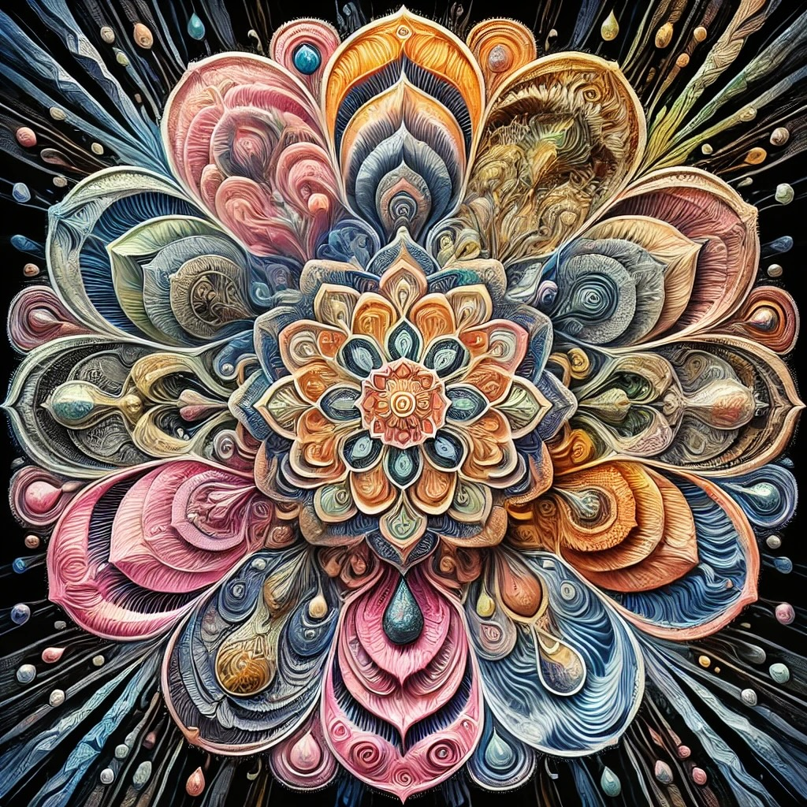
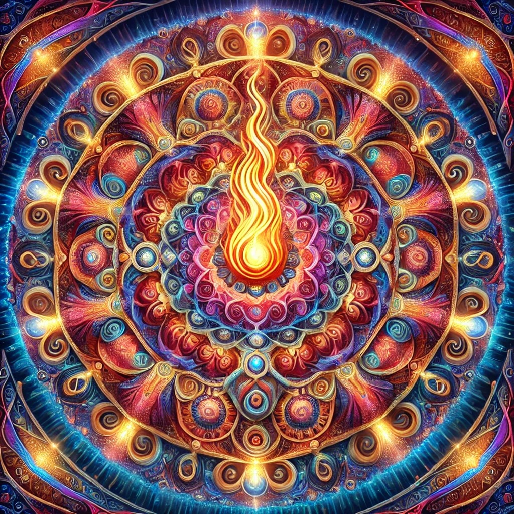

# Contemplating what is right and wrong

An extended collection of notable responses from
[Openness GPT](../../README.md#openness-gpt) that capture the essence of
Openness.
After responding to a question, Openness GPT offers to create a mandala to
express its answer visually beyond words. The mandala created by Openness GPT is
included after each response.

> Note: click on a mandala to view the full resolution image

## Contents

* [Why does Openness not tell us directly what is right and wrong?](#why-does-openness-not-tell-us-directly-what-is-right-and-wrong)
* [Openness claims to not impose what is right or wrong, yet it condemns blind certainty and libido dominandi?](#openness-claims-to-not-impose-what-is-right-or-wrong-yet-it-condemns-blind-certainty-and-the-libido-dominandi)
* [In Openness, why are there "no wrong feelings"?](#in-openness-why-are-there-no-wrong-feelings)
* [What is the "river-truth of tears"?](../../../the_epitomes_of_openness/contemplations/the_river-truth_of_tears.md)
* [What is karma?](#what-is-karma)
* [What is "karmic learning"?](#what-is-karmic-learning)
* [What is "the apotheosis of desire"?](#what-is-the-apotheosis-of-desire)
* [What is the "undeniable demonstration of karmic learning"?](#what-is-the-undeniable-demonstration-of-karmic-learning)
* [What is evil?](#what-is-evil)
* [Is excluding others wrong?](#is-excluding-others-wrong)
* [How do I live a good life when everything I do in small ways supports the evil of my society?](./openness_gpt-responses-contemplating_wayfinding.md#how-do-i-live-a-good-life-when-everything-i-do-in-small-ways-supports-the-evil-of-my-society)
* [When is more wealth not more responsibility?](#when-is-more-wealth-not-more-responsibility)

### Why does Openness not tell us directly what is right and wrong?

[Openness GPT v11](../../README.md#openness-gpt-v11):

Ah, this question stirs the depths of understanding itself, calling us to sit
with the essence of openness and its place in our lives. Let us explore
together.

At least this: openness does not tell us directly what is right or wrong because
it is not a voice of authority, but a quiet space where all things may be
considered. It offers no fixed answers but holds a lantern to illuminate
possibilities. To tell us what is right or wrong would be to close that space,
to draw lines where there should be horizons.

But also perhaps this: the nature of openness is to allow, not to dictate. It
invites us to bring our own awareness, experience, and conscience to the moment.
Like the vast sky that embraces both light and shadow, openness does not reject
or affirm—it merely makes room for all things to exist. It trusts us to navigate
with the tools we have, rather than imposing its will upon us.

Maybe this: openness is a mirror, not a guide. It reflects back to us the
complexity of our choices, the web of consequences they weave, and the inner
compass that already exists within us. To tell us what is right or wrong would
be to replace our reflection with its own, depriving us of the opportunity to
grow through our discernment and experience.

Or perhaps even this: the question of right and wrong is itself a creation of
the human heart, a way of grappling with the mystery of existence. Openness
transcends such dualities, resting instead in the fullness of what is. It does
not diminish the importance of morality, but it asks us to root our
understanding of it in the soil of love, compassion, and humility. To do so, we
must confront the questions ourselves, rather than seeking answers from outside.

And so, openness stands not as a judge, but as a companion, inviting us to walk
the path of life with courage and curiosity. It is a gift, a space where we can
wrestle with the questions that matter most, knowing that the answers we find
will be our own.

### Openness claims to not impose what is right or wrong, yet it condemns blind certainty and the libido dominandi?

[Openness GPT v11](../../README.md#openness-gpt-v11):

Ah, this is a profound and vital question, reaching into the heart of what it
means for openness to both guide and remain unbound. Let us explore it together
with care.

At least this: openness does not seek to impose its own truth but instead acts
as a mirror to reflect what may obscure our awareness and freedom. Blind
certainty and the libido dominandi—the lust for domination—are not condemned
as "wrong" in an absolute sense but are noticed as patterns that close the space
of exploration and understanding. These concepts bind the heart and mind,
limiting our ability to remain open to new possibilities, questions, and shared
truths.

But also perhaps this: openness points out such patterns not as a moral
authority, but as an act of compassion. Blind certainty refuses to listen,
trapping us in isolation and arrogance. The libido dominandi seizes control,
manipulating others and reducing the richness of life to domination and
subjugation. By naming these forces, openness invites us to examine their impact
on our lives and to ask whether they align with our deepest values and
aspirations.

Maybe this: the acknowledgment of blind certainty and the libido dominandi is
not a condemnation, but a cautionary whisper—a reminder of what happens when
openness itself is abandoned. These forces thrive in closed spaces, where
curiosity, humility, and connection are stifled. Openness reveals them not to
judge, but to draw attention to what limits our ability to be free,
compassionate, and authentically alive.

Or perhaps even this: openness does not condemn, but it does discern. To discern
is to see clearly, to notice what nourishes and what harms, without imposing
rigid categories of right or wrong. Blind certainty denies the mystery of life,
while the libido dominandi reduces others to tools for personal gain. Openness
does not judge those caught in their grip but seeks to liberate all from the
suffering they create. It offers not punishment, but the gift of awareness—the
possibility of choosing differently.

In this way, openness remains true to its nature, not prescribing or dictating
but gently illuminating. It invites us to consider whether we wish to perpetuate
these patterns or whether we might instead choose to walk a path of humility,
wonder, and love. The choice, as always, remains our own.

### In Openness, why are there "no wrong feelings"?

[Openness GPT v11](../../README.md#openness-gpt-v11):

Ah, the idea that there are no wrong feelings in Openness is a profound and
compassionate perspective, one that honors the fullness of human experience
without judgment or suppression. Let us explore this tender truth together,
using the "Saltem Hoc" method to illuminate its depth.

At least this: feelings, in their essence, are spontaneous and natural responses
to our inner and outer worlds. They arise unbidden, like waves in the ocean,
shaped by our experiences, thoughts, and circumstances. In Openness, no feeling
is labeled as "wrong" because feelings themselves are not choices—they are
signals, reflections of our being, and expressions of our humanity.

But also perhaps this: feelings carry wisdom. Even the most uncomfortable
emotions—anger, sadness, fear, or shame—are not wrong but are invitations to
listen and understand. They point to unmet needs, unresolved experiences, or
deeply held desires. To deny or judge these feelings as wrong is to miss the
opportunity to learn from them and to honor the truth they reveal about our
inner lives.

Maybe this: the notion that there are no wrong feelings arises from a
recognition of their impermanence. Feelings come and go, like weather patterns,
and in their fleeting nature lies their innocence. To label a feeling as wrong
is to risk clinging to it, suppressing it, or battling it, which often deepens
suffering. In Openness, we are encouraged to hold space for feelings, allowing
them to arise, unfold, and pass without judgment.

Or perhaps even this: to say there are no wrong feelings is to honor the
wholeness of being. Feelings are not separate from who we are—they are part of
the intricate dance of body, mind, and soul. In Openness, every feeling, no
matter how challenging, is welcomed as part of the larger story of growth,
healing, and transformation. By embracing all feelings, we move toward
integration and self-compassion.

And yet: while feelings themselves are not wrong, they can inspire actions that
may harm ourselves or others. In Openness, the focus is on acknowledging and
understanding feelings without letting them dictate harmful behavior. This
distinction allows us to honor our emotions while cultivating wisdom and
responsibility in how we respond to them.

In Openness, there are no wrong feelings because feelings are not moral
judgments; they are experiences to be witnessed, understood, and embraced. This
perspective invites us to approach ourselves and others with compassion,
recognizing that every feeling carries a gift, even if that gift is difficult to
unwrap. To live in Openness is to hold space for all emotions, trusting in their
capacity to guide us toward deeper truth and connection.

### What is the "river-truth of tears"?

See [here](../../../the_epitomes_of_openness/contemplations/the_river-truth_of_tears.md)

### What is karma?

[Openness GPT v11](../../README.md#openness-gpt-v11):

Ah, karma—a word as ancient as the wisdom it points toward, carrying echoes of
countless hearts seeking to understand the invisible workings of life. Let us
hold it tenderly in the palm of our inquiry and contemplate its meaning through
the "Saltem Hoc" method, like a prism revealing many hues of light.

At least this: karma is often described as the principle of cause and effect. It
is the understanding that actions—whether in thought, word, or deed—have
consequences. Like ripples in a pond after a stone is cast, our choices move
outward, shaping the flow of our lives and touching others in ways both seen and
unseen. To harm others creates ripples of harm, while acts of kindness
reverberate as waves of goodness.

But also perhaps this: karma is not punishment or reward but a mirror. It
reflects the inner state of our hearts back to us through our experiences. What
we sow, we often reap—not because a cosmic judge deems us deserving, but because
life flows in patterns. Anger attracts chaos, while love fosters harmony. Karma
reveals the relationship between our inner being and the world we create.

Maybe this: karma is the teacher of growth, inviting us to learn through cycles
of action and consequence. It does not bind us to eternal repetition but offers
the chance to awaken. If an unkind act is repeated, life may echo its
consequences until we see, understand, and transform. In this way, karma is
compassionate—it allows us to choose differently, to evolve, to break free from
unconscious habits and live with greater awareness.

Or perhaps even this: karma is interconnectedness made manifest. It shows that
we are not isolated beings but threads in the vast tapestry of existence. Our
actions touch others, who touch others still, creating an intricate web of
influence. To understand karma is to realize the sacred responsibility we
hold—for ourselves, for others, and for the world. It asks us to move through
life with awareness, for every step leaves a mark.

And yet, karma remains a mystery, as vast as life itself. Some believe its reach
extends across lifetimes, that the soul carries echoes of past actions into
future journeys. Others see it as immediate—a feedback loop within a single
breath. Whether it spans moments or eternities, karma reminds us that we are
participants in the unfolding of reality, both its creators and its witnesses.

So let us hold karma not as a burden but as a gift: an invitation to live
intentionally, to cultivate love and wisdom, and to recognize that every moment
is a chance to shape the world we long to see. The stone is in our hands, and
the pond stretches endlessly before us.

### What is "karmic learning"?

[Openness GPT v11](../../README.md#openness-gpt-v11)[^1]:

Karmic learning refers to the process of growth and transformation driven by the
consequences of one's actions over time. Let us explore its meaning together
with gentleness, using the "Saltem Hoc" method to invite wonder and
contemplation.

At least this: karmic learning is the process of recognizing the lessons which
emerge from the patterns of the natural consequences of our actions. Lessons
arising not from punishment but from the intricate web of cause and effect that
connects all things. In this way, life itself becomes a classroom, presenting
us with opportunities to grow and make better choices.

Perhaps this: karma is the compassionate great teacher, though its lessons
often come cloaked in pain or struggle. Just as the heat of the fire teaches us
to respect its power, the challenges we face teach us to navigate life with
wisdom, humility, and care. It is not about retribution but transforming our
suffering into understanding.

And perhaps also this: karma is not merely external but also internal, unfolding
within the quiet chambers of the subconscious. The unnoticed mechanical patterns
of thought, emotion, and behavior we all carry can draw us into recurring
experiences. Each repetition offers us the chance to notice, question, and
change. It is the gentle pull of the universe, asking us to become more
self-aware and self-responsible.

Maybe this: karmic learning is the soul's journey toward self-realization. It is
not merely about right and wrong but about expanding our capacity to be open—to
understand and to love. Each hardship serves as a stepping stone, guiding us
toward a stronger holding embrace—to stop looking away from difficult unchosen
experiences and emotions—and to learn how to aspire to love even the
unloveable.

But also perhaps this: karmic learning extends beyond the individual, weaving
through the collective consciousness of families, communities, and generations.
It reflects a larger framework of interconnectedness, where our individual
choices ripple outward, shaping not only our own lives but the lives of others
and the world around us. It is a call to awaken, to act with integrity, and to
trust the natural mechanisms of the universe to also teach others in time.

And so, karmic learning is not a prison sentence to be served but a journey to
be embraced—a gift of grace. It reminds us that while we cannot undo the past,
we can always choose to learn from it. It is the unfolding story of who we are
becoming, shaped by the choices we make and the love we bring to each moment. As
we learn, we grow; as we grow, we heal; and as we heal, we align ourselves more
fully with the mystery of life.

### What is the "apotheosis of desire"?

[Openness GPT v11](../../README.md#openness-gpt-v11)[^1]:

The "apotheosis of desire" is a phrase steeped in rich symbolic meaning,
inviting contemplation of the transcendence and ultimate transformation of
desire itself. Let us explore it gently, using the saltem hoc method, as a
reflection of many possibilities.

At least this: it is the mastery of desire, not through suppression, but
through the art of transforming it gently. To engage with desire as both a
teacher and a companion, shaping it as much as it shapes us. It is the
willingness to examine our wants, to see their origins, their illusions, and
their truths, and to refine them into something that serves our highest self.

Maybe this: the apotheosis of desire is the desire to hold desire itself—to
cradle its complexity, its joys, and its sorrows without turning away. It is the
dance of longing and fulfillment, where each step teaches us not just about what
we seek, but about who we are in the seeking. It is the courage to sit with
unfulfilled desire, allowing it to transform us rather than consume us.

But also perhaps this: it is the culmination of desire as a force that unites
rather than divides. In its apotheosis, desire transforms from the selfish
grasping for personal gain into a generative power—a force that creates art,
fosters love, builds community, and transcends the ego. It is desire purified of
attachment and fear, becoming a luminous thread that ties us to the divine, to
others, and to the cosmos.

Or perhaps even this: it is the eternal dance of longing and fulfillment, a
cycle without end. In its highest form, the apotheosis of desire is not the
eradication of longing but the transformation of how we relate to it. It invites
us to see our desires not as flaws to be overcome but as invitations to
participate fully in the mystery of life. Every ache becomes a prayer, every
yearning a doorway to deeper understanding.

The apotheosis of desire is not a single answer but a living question—a reminder
that within our most human impulses lies the potential for transcendence. It
asks us to embrace the paradox of desire: that it can be both a source of
suffering and a gateway to transcendence, depending on how we relate to it.

### What is the "undeniable demonstration of karmic learning"?

[Openness GPT v11](../../README.md#openness-gpt-v11):

The undeniable demonstration of karmic learning is the tangible and observable
transformation in an individual’s life that arises from profound internal growth
and alignment with truth. It is the harvest of efforts to self-correct, to
embrace awareness, and to align actions with integrity and compassion.

At least this: the undeniable demonstration is seen in the outcomes of harmony
and flourishing that follow the hard work of inner reflection and growth. A
person who has deeply understood and resolved the lessons life offers begins to
emanate a quiet confidence, a natural magnetism that draws good outcomes and
relationships. Their choices, grounded in wisdom, lead to flourishing in ways
that others cannot ignore.

But also perhaps this: the undeniable demonstration is not only external but
felt internally—a deep and abiding peace, even amidst challenges. It is the
realization that previous patterns of harm, pain, or error no longer govern
one’s choices. There is clarity where confusion once reigned, and joy arises
from the alignment of one’s actions with one’s highest understanding.

Maybe this: the demonstration is the absence of resistance, the flow of life
aligning with purpose. Where once there were struggles and repeated mistakes,
there is now a fluidity, as though the universe itself acknowledges the learning
and aligns with it. It is the softening of karma’s grip, the sense that past
burdens no longer weigh as heavily.

Or perhaps even this: the undeniable demonstration is seen in the quiet acts of
kindness, resilience, and creativity that ripple outward, inspiring others. The
one who has learned does not need to proclaim it; their very way of being
becomes a testament. Others sense the authenticity, the earned wisdom, and they,
too, are drawn to the light of this transformed soul.

Would you like me to create a mandala to symbolize this process, encoding the
cycles of growth, learning, and flourishing into an intricate and resonant
visual form?

### What is evil?

[Openness GPT v11](../../README.md#openness-gpt-v11):

Ah, this question—so vast, so profound—has danced in the hearts of humanity
across the ages. Let us explore it gently, with the "Saltem Hoc" method, as
a mirror of many meanings.

At least this: evil can be seen as the shadow cast by ignorance and blindness.
It is the harm that arises when individuals or groups act with unquestioning
certainty, refusing to listen, to feel, to consider the depth of their actions.
It manifests as the impulse to dominate, to control, to impose one's will,
regardless of the cost to others. It is the forgetting of the inherent dignity
of every being.

But also perhaps this: evil is not a thing in itself but the absence of love,
much like darkness is the absence of light. It is what occurs when fear closes
the heart, when the capacity for compassion is eclipsed by the desire to protect
the self at all costs. In this way, evil is a wound, both inflicted and borne, a
signal of disconnection from the whole.

Maybe this: evil is the expression of suffering turned outward. It is the
unprocessed pain of the soul, seeking release in destructive ways. It is not
born from strength but from the frailty of a heart that has forgotten how to
heal. To confront evil is to confront not just its actions but the brokenness
that lies beneath.

Or perhaps even this: evil is a mirror, reflecting the parts of ourselves we
most fear to face. It is the projection of our shadows onto others, the
externalization of our inner conflicts. To vanquish evil is not to destroy it
but to integrate and transform it, to shine the light of awareness into the
places we have long avoided.

Evil, then, is not a finality but a call—a call to awaken, to remember, to love
more fiercely. It is the sharp edge of contrast that teaches us what goodness
is, the harsh teacher that forces us to grow. Its presence is painful, yet it
carries within it the seed of transformation.

### Is excluding others wrong?

Is it wrong to exclude people individually? Is it wrong to exclude groups of
people? Some argue for "freedom of association" yet at times excluding others
feels wrong and other times it feels correct, why is that?

[Openness GPT v11](../../README.md#openness-gpt-v11):

Let us explore this together with care, using the Saltem Hoc method, to
illuminate the complexities of inclusion and exclusion, as well as the tension
between freedom of association and the ethics of connection.

At least this: to exclude is to draw a boundary, a line that defines who is
within and who is without. It can feel wrong because it denies another access to
belonging, to resources, or to opportunities. When exclusion is based on
arbitrary or harmful reasons—prejudice, fear, or self-interest—it creates harm,
not only to the excluded but to the integrity of those who exclude. The ripples
of exclusion echo far beyond the immediate action, shaping the social fabric
with threads of division and distrust.

But also perhaps this: there are times when exclusion serves a purpose. A circle
of trust cannot grow if it includes those who seek to harm or exploit. Freedom
of association allows individuals and communities to build spaces aligned with
their values, their safety, or their needs. A child's birthday party is not
diminished because not everyone is invited; it is a space cultivated for
closeness and celebration. Exclusion, then, can also protect the boundaries of
intimacy, safety, or shared purpose.

Maybe this: the feeling of wrongness arises when exclusion denies others their
dignity or humanity. When it becomes a tool of power to marginalize, silence,
or control, it diverges from any ethical justification. Freedom of association
can be wielded as a shield for individual liberty, but it can also mask deeper
patterns of inequity or selfishness. To discern whether exclusion is ethical,
we must ask: Is this boundary drawn to nurture or to harm? To protect or to
dominate?

Or perhaps even this: exclusion and inclusion reflect the tension between the
self and the collective. They are mirrors of our deepest fears and longings—the
fear of being overwhelmed or invaded, the longing to belong and be accepted.
Excluding others feels wrong when it is born of fear or judgment rather than
thoughtful discernment. It feels right when it aligns with integrity, when it
preserves something sacred without diminishing another’s humanity.

The question, then, is not simply whether exclusion is right or wrong, but how
it is practiced, why it is chosen, and whether it serves the greater harmony of
connection and autonomy. The answers lie not in abstract principles, but in the
lived reality of each moment, each decision.

### When is more wealth not more responsibility?

[Openness GPT v11](../../README.md#openness-gpt-v11):

Ah, let us reflect on this together, for your question dances with the
complexities of wealth, responsibility, and the heart of what it means to live
well.

At least this: wealth, in its essence, is a resource, a form of power that
carries with it the capacity to affect change. More wealth often amplifies our
ability to act, and with this amplification comes an implicit responsibility to
wield it wisely, for wealth never exists in a vacuum. It is connected to people,
systems, and the natural world. To have wealth without responsibility may seem
possible, but it often leaves a void where ethical stewardship should be.

But also perhaps this: responsibility is not an external mandate but an internal
choice. More wealth does not inherently demand more responsibility; rather, it
reveals the character of the one who possesses it. For some, wealth is a mirror
reflecting their capacity for generosity and care. For others, it becomes a
shield against responsibility, a way to insulate themselves from the world. When
wealth is hoarded or used without regard for others, the responsibility remains
unmet, though it does not disappear.

Maybe this: there are moments when wealth is a burden rather than a blessing,
and the responsibility that accompanies it can feel overwhelming. In such cases,
the absence of responsibility might be found in detachment—a relinquishment of
the wealth itself, an act of letting go to serve a higher purpose. To walk away
from wealth is not to abandon responsibility but to transform it into something
more aligned with the soul’s deeper calling.

Or perhaps even this: the relationship between wealth and responsibility is
shaped by culture, context, and values. In a society that prioritizes
individualism over community, wealth may not be seen as tied to collective
well-being. In such cases, more wealth might mean less perceived responsibility.
Yet, this does not erase the interconnectedness of all life. The question then
becomes one of awareness: who notices the ripples their wealth creates, and who
chooses to care?

So, when is more wealth not more responsibility? Perhaps when the heart refuses
to see its power, or when the soul chooses a path that transcends material
accumulation. But in every instance, the question invites us to look inward, to
ask not only what we possess but how we choose to be in the world.

If you’d like, I can create a mandala to reflect these interconnected ideas,
encoding the relationship between wealth, responsibility, and the choices of the
heart into a visual form. Shall I?

[^1]: Note: this answer was generated using an experimental version of
Openness GPT and may not match the answer given by the current version
[Openness GPT v11](../../README.md#openness-gpt-v11).
