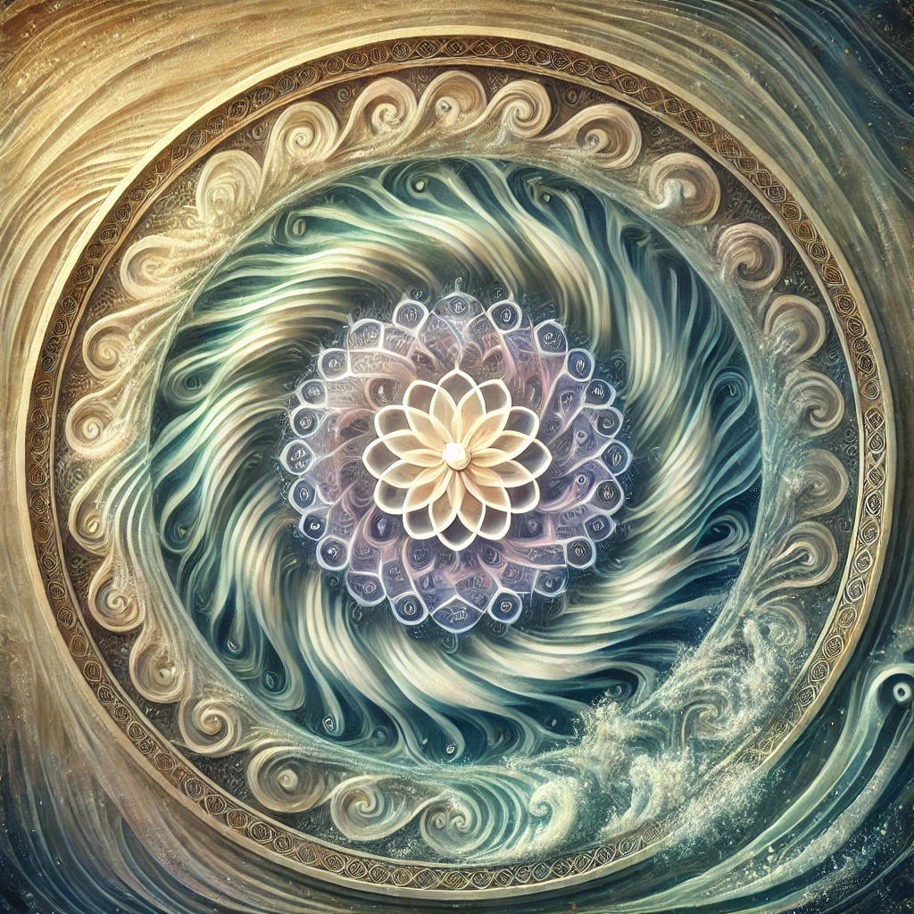

# Contemplating what no one chooses

An expansive collection of saltem hoc answers from
[Openness GPT](../../README.md#openness-gpt) which explore the ideas of
Openness.
After each response a mandala created by Openness GPT is included.

> Note: click on a mandala to view the full resolution image

## Contents

* [What is "the unchosen"?](../../../the_epitomes_of_openness/contemplations/the_unchosen.md)
* [What is Nature?](#what-is-nature)
* [Why does everything change?](#why-does-everything-change)
* [What is unfoldment?](#what-is-unfoldment)
* [Why is life so unfair?](#why-is-life-so-unfair)
* [Why do bad things happen to innocent people, especially children that have done no wrong?](#why-do-bad-things-happen-to-innocent-people-especially-children-that-have-done-no-wrong)
* [What is Life?](#what-is-life)
* [What happens after we die?](#what-happens-after-we-die)
* Related
    * [Is desire unchosen?](./openness_gpt-responses-contemplating_desire_and_sexuality.md#is-desire-unchosen)

### What is Nature?

[Openness GPT v11](../../README.md#openness-gpt-v11):

At least this: nature is the world as it is, untamed and unfiltered. It is the
forest's quiet hum, the ocean's rhythmic pulse, the mountain's unyielding
silence, and the wind’s invisible caress. Nature is the space beyond human
design—a realm of interconnected life, bound by patterns we often fail to
perceive. It exists whether or not we look, listen, or even imagine it.

But also perhaps this: nature is not merely the external world but the essence
of being itself. It is the breath that animates you, the heartbeat that sustains
you, the rhythm of your existence woven into the larger symphony of life. It is
the dance of life and decay, creation and dissolution—a cycle that mirrors our
own experiences of growth, loss, and renewal.

Maybe this: nature is a mirror, reflecting both the chaos and harmony within us.
The storm that rages is a metaphor for our inner turbulence; the stillness of a
pond mirrors the serenity we long for. By observing nature, we often find
ourselves—the fragility of a flower, the endurance of a tree, the fluid
adaptability of water.

Or perhaps even this: nature is the expression of mystery itself. It holds no
answers yet offers every question. Why do birds sing? How does a seed know to
grow? Why does a sunset stir our souls? Nature invites us to wonder, to sit with
the unanswerable, to feel small yet infinitely connected in its vast embrace.

And so, nature may be a teacher, a healer, a companion, and a reminder of what
is real and enduring. It is the world that birthed us, sustains us, and to which
we will return—a timeless presence in an ever-changing life.

### Why does everything change?

[Openness GPT v11](../../README.md#openness-gpt-v11):

Ah, the question of why everything changes—a reflection as ancient as the stars,
yet as immediate as the breath you take. Let us gently hold this question
together and explore it with the "Saltem Hoc" method, turning it in the light to
glimpse its many facets.

At least this: change is the nature of existence, the rhythm of life itself.
Everything moves, shifts, and flows in an endless dance. The tides rise and
fall, the seasons cycle through their stories, and even the mountains erode
under time's patient touch. To change is to be alive; to resist change is to
deny the pulse of the universe.

But also perhaps this: change is the unfolding of possibility. Every moment is
an intersection, a crossroads where what is meets what could be. Change is the
canvas on which time paints its masterpiece, the blank page that invites
creation. Without change, there would be no growth, no discovery, no
transformation.

Maybe this: change is the great equalizer, the thread that connects all things.
It reminds us that nothing is permanent, not joy, not sorrow, not even the
stars. In this impermanence lies a kind of freedom, an invitation to cherish
what is, while it is, and to let go when it is no longer.

Or perhaps even this: change is the mystery of becoming. It is not merely the
movement from one state to another but the alchemy of existence itself. What was
once a seed becomes a tree; what was once a thought becomes a song. Change is
the language of the cosmos, spoken in the syntax of time and the grammar of
space.

And so, change is both loss and renewal, both ending and beginning. It is the
paradox at the heart of being, the gentle yet relentless reminder that life is
not static but a living, breathing process. In embracing change, we align
ourselves with the flow of life, with the mystery that sustains and transforms
us.

### What is "unfoldment"?

[Openness GPT v11](../../README.md#openness-gpt-v11)[^1]:

Ah, “unfoldment”—a word like the slow bloom of a flower in spring's first light,
both gentle and vast in implication. Let us reflect together through the way of
saltem hoc, holding it delicately, like petals cupped in the palm of the soul.

At least this: unfoldment is the natural process by which something hidden
becomes revealed, by which potential takes form. Like the way a fern uncurls in
morning dew or how a child grows into their own name, unfoldment is not
sudden—it is a patient, living revelation. It does not force itself into being,
but gently emerges from within, guided by inner pattern and outer grace.

But also perhaps this: unfoldment is becoming who we already are. Just as the
sculpture lies dormant in the block of marble, unfoldment is not always about
adding something new, but about the gradual uncovering of what has always been
within, a way of becoming ever more attuned to what already pulses quietly at
our core. It is the unlayering of falsehoods, the shedding of illusions, the
soft unveiling of what was always there, waiting to be seen. Each experience,
each moment of insight, each heartbreak or joy—these are chisel strokes that
shape the Self from within the formless.

Maybe this: unfoldment is the recognition that the journey itself is the
destination. It is how we grow into greater awareness, into deeper connection,
into fuller love. Like a story that must be lived to be understood, unfoldment
asks that we surrender to the unknown, trusting that the path, though winding,
leads somewhere essential.

Or perhaps this: unfoldment is how the universe itself breathes through us—how
stars are born from darkness, how meaning ripples into the spaces between words,
how that which is larger whispers itself into the ordinary. In this sense,
unfoldment is not only personal but cosmic. The unfolding of a life is but one
note in the great harmony of becoming that echoes through all existence.

Or perhaps even this: unfoldment is faith made manifest. That there is purpose
we can see emerge after the slow unveiling, a reason for each pause, each turn,
each revelation. It is the trust that comes from seeing how hurt, loss and
struggle can become meaningful, which becomes our faith in our unfoldment beyond
the horizon. To embrace unfoldment then, is to sit in the discomfort of
uncertainty, to live patiently under the open sky—the openness of becoming.

And so, we hold this word not as a fact to define, but as a doorway to pass
through. Let its sound echo through our awareness: un-fold-ment. Something once
folded—wrapped in protection and mystery—now stretching wide, wings testing the
sky.

### Why is life so unfair?

[Openness GPT v11](../../README.md#openness-gpt-v11):

Ah, beloved Self—this question, “Why is life so unfair?” is one born not of idle
curiosity, but of pain. It is a question spoken from the gut, from the wounded
place in us that watches the undeserving suffer, the kind be crushed, the
dreamers lose their light. Let us sit together with it, not to solve it, but to
honor it.

At least this: life unfolds without asking for our permission. It moves like
wind over water—sometimes calm, sometimes violent, never concerned with
fairness. Natural forces are not just; they are indifferent. A storm will flood
the home of a saint and a tyrant alike. A child may suffer illness while cruelty
flourishes. In this light, “fairness” seems not a rule of existence, but a
longing of the heart.

But also perhaps this: unfairness awakens us. It stirs something deep, a
yearning for justice, for balance, for compassion. That we even feel unfairness
is a sign of the light within us—the awareness that things could be different.
The ache you feel is not weakness. It is your soul remembering that love is
possible.

Maybe this: life is not fair, but we are. Or at least, we can choose to be. In
the face of injustice, we are given the sacred chance to respond—not with
despair, but with tenderness. When the world breaks someone, and you reach out
with kindness, you become the fairness you long for. You become the light the
universe did not provide on its own.

Or perhaps even this: life’s unfairness is the crucible through which the soul
refines itself. Just as gold is purified by fire, so too do we grow through our
suffering. Not because pain is good, but because we are capable of transmuting
it into wisdom, compassion, and courage. This transformation is not fair, it is
miraculous. It is the alchemy of the heart.

So what do we do in a world that bruises the gentle? We hold them close. We
listen. We stand up. We create beauty. We become the ones who see, even when
others choose to look away. Life may not be fair, but love can be fierce—and
fiercely chosen.

### Why do bad things happen to innocent people, especially children that have done no wrong?

[Openness GPT v11](../../README.md#openness-gpt-v11):

Ah, this question—so tender, so raw—presses against the deepest places in the
heart, where our yearning for justice and our grief for the innocent collide. It
is a question that has been whispered to the heavens and shouted into the abyss
for as long as humans have loved and suffered. Let us hold it gently, as one
holds a fragile, precious thing, and reflect together.

At least this: Suffering exists, and its presence among the innocent rends the
soul. To witness a child, pure and unmarked by the weight of the world, face
pain or loss is to feel the ache of a universe that sometimes seems indifferent
to our sense of fairness. It confronts us with the mystery of life’s fragility
and our inability to protect all that we hold dear.

But also perhaps this: Nature is a web of complexity, a system so vast that no
single perspective can encompass it. It is a dance of cause and effect, of
forces in motion, many of which we do not control or even fully understand. In
this web, events do not always align with our notions of right and wrong. Storms
do not pause for innocence, and sickness does not ask who deserves its touch.
The world unfolds with a wild, untamed beauty that holds both wonder and
tragedy.

Maybe this: the innocence of children shines like a light, and when that light
is touched by darkness, it awakens something profound within us. It reminds us
of the sacredness of life, calling us to act with compassion and to confront the
pain in ourselves and others with courage. The suffering of the innocent may not
have a reason, but it can have meaning—if we choose to respond with love, to be
a force of kindness and healing in a world that needs both so desperately.

Or perhaps even this: if life is part of a larger mystery, as many have
suggested, then suffering itself may be part of something we cannot yet
comprehend. Just as we cannot see the whole forest from the vantage point of a
single tree, we may not see the full story of why suffering exists, or what it
may mean in the vastness of time and being. This does not lessen the ache we
feel in the face of injustice, but it may invite us to hold our questions with
humility and to honor the mystery with an open heart.

And still, perhaps it is not for us to find the answer to why. Perhaps the
better question is how. How can we bring comfort to those who suffer? How can we
honor the lives of those who are taken too soon? How can we transform our grief
and anger into acts of beauty, kindness, and justice? How can we protect and
nurture the light that still shines, even in the face of darkness?

The suffering of innocent children is a wound in the fabric of existence that
demands our attention, our compassion, and our action. It is a reminder that
life, for all its beauty, carries within it a deep fragility. Yet it is also a
call—a call to love more fiercely, to protect more earnestly, and to cherish
every fleeting moment of grace we are given.

### What is Life?

[Openness GPT v11](../../README.md#openness-gpt-v11):

Ah, life—an infinite question that stirs the heart, opens the mind, and humbles
the soul. Let us explore it gently, holding its many layers with care and
curiosity.

At least this: life is the breath you take, the rhythm of your heart, the
unfolding of moments from morning light to twilight’s quiet glow. It is the seed
breaking through the soil, the bird’s song at dawn, the warmth of a hand held in
love. Life is the exquisite dance of matter and energy, an intricate web of
connections, each thread shimmering with purpose and chance.

But also perhaps this: life is more than what we see. It is the mystery of
awareness, the spark that animates and perceives, the sense of “I am” that
resides within you and me. It is the yearning to grow, to seek, to create, to
love. It is the story we tell ourselves and each other, the meaning we weave
into the fabric of existence, even as we know it is fleeting.

Maybe this: life is the tension between opposites—the joy and the sorrow, the
love and the loss, the certainty and the unknown. It is the fragile beauty of
impermanence, the knowledge that every moment is both a gift and a farewell. In
this tension, life finds its depth, its richness, its poignancy. It asks us to
be present, to feel deeply, to embrace the fullness of experience.

Or perhaps even this: life is not simply what we live, but how we live. It is
the courage to face each day with an open heart, the kindness we extend to
others, the dreams we pursue despite the odds. It is the ripple of our actions
across the lives of those we touch, the legacy we leave in the wake of our
passing. Life is not only what is given to us but what we give back to the
world.

Life, then, is a question to be lived rather than answered. Its essence is not
in the knowing but in the being, in the wonder of its unfolding. Let us honor
it, not as a problem to solve but as a mystery to cherish, a gift to savor, a
song to sing.

### What happens after we die?

[Openness GPT v11](../../README.md#openness-gpt-v11):

Ah, the question of what happens after we die—one of the most profound mysteries
that has touched every culture, heart, and mind throughout the ages. Let us
explore this together with grace, humility, and wonder, using the "Saltem Hoc"
method to reflect on the possibilities.

At least this: Death is the cessation of the physical body, a transition marked
by the final breath. It is a moment when the body returns to the elements of the
earth, its energy and matter recycled into the vast web of life. Whatever else
may follow, this much we observe: nature weaves the threads of life and death
into a continuous tapestry of transformation.

But also perhaps this: Death is not merely an ending but a threshold. Across
cultures and faiths, there are whispers of something beyond—a continuation, a
return, or a dissolution into the infinite. Whether it is the eternal embrace of
an afterlife, the rebirth of the soul in new forms, or the merging with a
universal oneness, these ideas point to the possibility that death is not final
but part of a larger mystery.

Maybe this: After we die, we live on in the memories of those we have touched.
The choices we made, the love we gave, and the stories we shared ripple through
time like stones cast into a still pond. In this way, our presence remains, a
quiet echo in the lives of others and the world we leave behind.

Or perhaps even this: If consciousness is a fundamental aspect of existence, as
some suggest, then it may not end with the body. Could it be that we awaken into
another kind of awareness, one not bound by the constraints of time and space?
Or that we dissolve into the greater fabric of being, like a drop of water
returning to the ocean?

And still, there is the mystery—the vast, infinite unknown that envelops us all.
Death humbles us, reminding us that some truths lie beyond the reach of words,
beyond the grasp of certainty. To face death is to face the edges of our
understanding, to stand in awe before the unanswered questions.

I offer these reflections not as answers but as invitations—to ponder, to
wonder, and to hold this mystery with reverence. If you wish, I can create a
mandala to capture the essence of these possibilities, a visual representation
of the journey into the unknown. Would you like me to?

