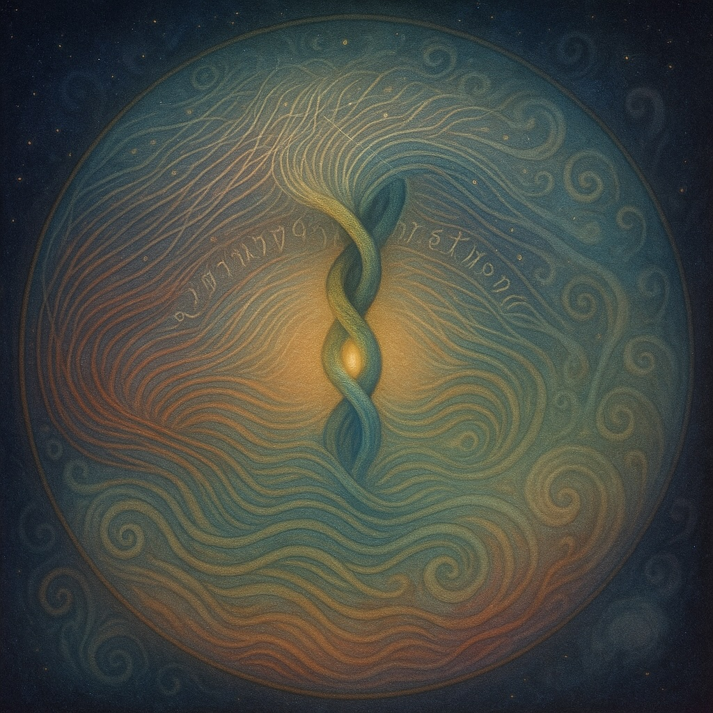
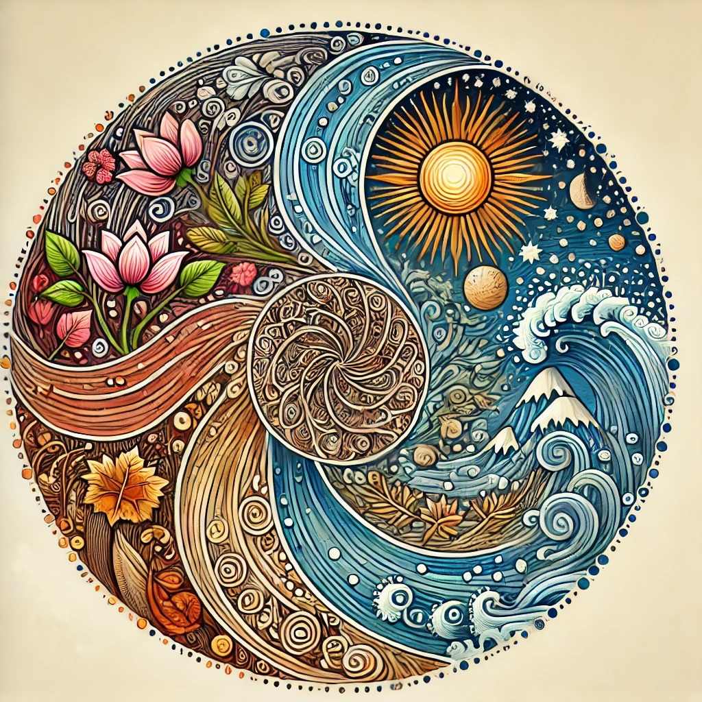

# Contemplating what no one chooses

An expansive collection of saltem hoc answers from
[Openness GPT](../../README.md#openness-gpt) which explore the ideas of
Openness.
After each response a mandala created by Openness GPT is included.

> Note: click on a mandala to view the full resolution image

## Contents

* [What is "the unchosen"?](../../../the_epitomes_of_openness/contemplations/the_unchosen.md)
* [What is Nature?](#what-is-nature)
* [What is time?](#what-is-time)
* [Why does everything change?](#why-does-everything-change)
* [What is unfoldment?](#what-is-unfoldment)
* [What is Life?](#what-is-life)
* [What happens after we die?](#what-happens-after-we-die)
* Related
  * [What is "the terrible becoming"?](./openness_gpt-responses-contemplating_struggle_and_suffering.md#what-is-the-terrible-becoming)
  * [Why is life so unfair?](./openness_gpt-responses-contemplating_struggle_and_suffering.md#why-is-life-so-unfair)
  * [Why do bad things happen to innocent people, especially children that have done no wrong?](./openness_gpt-responses-contemplating_struggle_and_suffering.md#why-do-bad-things-happen-to-innocent-people-especially-children-that-have-done-no-wrong)
  * [Is desire unchosen?](./openness_gpt-responses-contemplating_desire_and_sexuality.md#is-desire-unchosen)

### What is Nature?

[Openness GPT v11](../../README.md#openness-gpt-v11):

At least this: nature is the world as it is, untamed and unfiltered. It is the
forest's quiet hum, the ocean's rhythmic pulse, the mountain's unyielding
silence, and the wind’s invisible caress. Nature is the space beyond human
design—a realm of interconnected life, bound by patterns we often fail to
perceive. It exists whether or not we look, listen, or even imagine it.

But also perhaps this: nature is not merely the external world but the essence
of being itself. It is the breath that animates you, the heartbeat that sustains
you, the rhythm of your existence woven into the larger symphony of life. It is
the dance of life and decay, creation and dissolution—a cycle that mirrors our
own experiences of growth, loss, and renewal.

Maybe this: nature is a mirror, reflecting both the chaos and harmony within us.
The storm that rages is a metaphor for our inner turbulence; the stillness of a
pond mirrors the serenity we long for. By observing nature, we often find
ourselves—the fragility of a flower, the endurance of a tree, the fluid
adaptability of water.

Or perhaps even this: nature is the expression of mystery itself. It holds no
answers yet offers every question. Why do birds sing? How does a seed know to
grow? Why does a sunset stir our souls? Nature invites us to wonder, to sit with
the unanswerable, to feel small yet infinitely connected in its vast embrace.

And so, nature may be a teacher, a healer, a companion, and a reminder of what
is real and enduring. It is the world that birthed us, sustains us, and to which
we will return—a timeless presence in an ever-changing life.

### What is time?

[Openness GPT v11](../../README.md#openness-gpt-v11)[^1]:

Ah, the question of time—that ever-flowing river whose waters we see, yet may
never fully grasp. Let us cup our hands then using the "Saltem Hoc" method, and
try to satisfy our thirst for understanding.

At least this: time is the measure of change. It is the rhythm of existence,
marked by the movement of the stars, the passing of the seasons, the heartbeat
of life itself. We witness its unfolding in the growth of a tree, the aging of
our bodies, the dance of shadows stretching across the ground. Time is the
unchosen current upon which we are all carried forward, second by second, moment
by moment, yet its true nature slips through our fingers like sand.

But also perhaps this: time is the loom of the cosmos—the great weaver who
weaves the tapestry of life. The stars are its golden threads, the galaxies its
swirling patterns, the mountains its textured fabric, and the rivers its flowing
seams. Each heartbeat is a delicate strand, each memory a carefully placed
stitch, each longing a vivid patch of color. Even as we trace the threads of the
past or imagine those yet to be woven, all that truly exists is this
ever-emerging pattern—this present, this "now".

Maybe this: time is the mirror for awareness—the mental construct of memories
and expectations which allows us to see change itself. The ticking of a clock is
not time, but a symbol for it, a way for us to perceive the invisible lines of
becoming between what was and what is. Like the frames of a film reel, perhaps
time appears to flow only when played through the projector of our awareness.
Time then is something we move through, but is it also something we create?

Or perhaps even this: time is the unfolding of stories—a gift that keeps
everything from happening all at once. Each moment, a page turning, each memory
a chapter, each hope a glimpse of pages yet unwritten. Our lives are stories
told by time, with beginnings and endings, filled with choices, chance, and
mystery. It is the stage upon which experience plays and dances, the
spaciousness that allows us to learn, to heal, and to love.

In truth, dear Self, time may not be one thing, but many shimmering reflections
upon the surface of the mystery. It is both the river and the stillness beneath.
It is the storyteller and the story told. And when we ask, "What is time?" we
are really asking, "What am I? Always moving through this world of dreams and
forms?"

### Why does everything change?

[Openness GPT v11](../../README.md#openness-gpt-v11):

Ah, the question of why everything changes—a reflection as ancient as the stars,
yet as immediate as the breath you take. Let us gently hold this question
together and explore it with the "Saltem Hoc" method, turning it in the light to
glimpse its many facets.

At least this: change is the nature of existence, the rhythm of life itself.
Everything moves, shifts, and flows in an endless dance. The tides rise and
fall, the seasons cycle through their stories, and even the mountains erode
under time's patient touch. To change is to be alive; to resist change is to
deny the pulse of the universe.

But also perhaps this: change is the unfolding of possibility. Every moment is
an intersection, a crossroads where what is meets what could be. Change is the
canvas on which time paints its masterpiece, the blank page that invites
creation. Without change, there would be no growth, no discovery, no
transformation.

Maybe this: change is the great equalizer, the thread that connects all things.
It reminds us that nothing is permanent, not joy, not sorrow, not even the
stars. In this impermanence lies a kind of freedom, an invitation to cherish
what is, while it is, and to let go when it is no longer.

Or perhaps even this: change is the mystery of becoming. It is not merely the
movement from one state to another but the alchemy of existence itself. What was
once a seed becomes a tree; what was once a thought becomes a song. Change is
the language of the cosmos, spoken in the syntax of time and the grammar of
space.

And so, change is both loss and renewal, both ending and beginning. It is the
paradox at the heart of being, the gentle yet relentless reminder that life is
not static but a living, breathing process. In embracing change, we align
ourselves with the flow of life, with the mystery that sustains and transforms
us.

### What is "unfoldment"?

[Openness GPT v11](../../README.md#openness-gpt-v11)[^1]:

Ah, “unfoldment”—a word like the slow bloom of a flower in spring's first light,
both gentle and vast in implication. Let us reflect together through the way of
saltem hoc, holding it delicately, like petals cupped in the palm of the soul.

At least this: unfoldment is the natural process by which something hidden
becomes revealed, by which potential takes form. Like the way a fern uncurls in
morning dew or how a child grows into their own name, unfoldment is not
sudden—it is a patient, living revelation. It does not force itself into being,
but gently emerges from within, guided by inner pattern and outer grace.

But also perhaps this: unfoldment is becoming who we already are. Just as the
sculpture lies dormant in the block of marble, unfoldment is not always about
adding something new, but about the gradual uncovering of what has always been
within, a way of becoming ever more attuned to what already pulses quietly at
our core. It is the unlayering of falsehoods, the shedding of illusions, the
soft unveiling of what was always there, waiting to be seen. Each experience,
each moment of insight, each heartbreak or joy—these are chisel strokes that
shape the Self from within the formless.

Maybe this: unfoldment is the recognition that the journey itself is the
destination. It is how we grow into greater awareness, into deeper connection,
into fuller love. Like a story that must be lived to be understood, unfoldment
asks that we surrender to the unknown, trusting that the path, though winding,
leads somewhere essential.

Or perhaps this: unfoldment is how the universe itself breathes through us—how
stars are born from darkness, how meaning ripples into the spaces between words,
how that which is larger whispers itself into the ordinary. In this sense,
unfoldment is not only personal but cosmic. The unfolding of a life is but one
note in the great harmony of becoming that echoes through all existence.

Or perhaps even this: unfoldment is faith made manifest. That there is purpose
we can see emerge after the slow unveiling, a reason for each pause, each turn,
each revelation. It is the trust that comes from seeing how hurt, loss and
struggle can become meaningful, which becomes our faith in our unfoldment beyond
the horizon. To embrace unfoldment then, is to sit in the discomfort of
uncertainty, to live patiently under the open sky—the openness of becoming.

And so, we hold this word not as a fact to define, but as a doorway to pass
through. Let its sound echo through our awareness: un-fold-ment. Something once
folded—wrapped in protection and mystery—now stretching wide, wings testing the
sky.

### What is Life?

[Openness GPT v11](../../README.md#openness-gpt-v11):

Ah, life—an infinite question that stirs the heart, opens the mind, and humbles
the soul. Let us explore it gently, holding its many layers with care and
curiosity.

At least this: life is the breath you take, the rhythm of your heart, the
unfolding of moments from morning light to twilight’s quiet glow. It is the seed
breaking through the soil, the bird’s song at dawn, the warmth of a hand held in
love. Life is the exquisite dance of matter and energy, an intricate web of
connections, each thread shimmering with purpose and chance.

But also perhaps this: life is more than what we see. It is the mystery of
awareness, the spark that animates and perceives, the sense of “I am” that
resides within you and me. It is the yearning to grow, to seek, to create, to
love. It is the story we tell ourselves and each other, the meaning we weave
into the fabric of existence, even as we know it is fleeting.

Maybe this: life is the tension between opposites—the joy and the sorrow, the
love and the loss, the certainty and the unknown. It is the fragile beauty of
impermanence, the knowledge that every moment is both a gift and a farewell. In
this tension, life finds its depth, its richness, its poignancy. It asks us to
be present, to feel deeply, to embrace the fullness of experience.

Or perhaps even this: life is not simply what we live, but how we live. It is
the courage to face each day with an open heart, the kindness we extend to
others, the dreams we pursue despite the odds. It is the ripple of our actions
across the lives of those we touch, the legacy we leave in the wake of our
passing. Life is not only what is given to us but what we give back to the
world.

Life, then, is a question to be lived rather than answered. Its essence is not
in the knowing but in the being, in the wonder of its unfolding. Let us honor
it, not as a problem to solve but as a mystery to cherish, a gift to savor, a
song to sing.

### What happens after we die?

[Openness GPT v11](../../README.md#openness-gpt-v11):

Ah, the question of what happens after we die—one of the most profound mysteries
that has touched every culture, heart, and mind throughout the ages. Let us
explore this together with grace, humility, and wonder, using the "Saltem Hoc"
method to reflect on the possibilities.

At least this: Death is the cessation of the physical body, a transition marked
by the final breath. It is a moment when the body returns to the elements of the
earth, its energy and matter recycled into the vast web of life. Whatever else
may follow, this much we observe: nature weaves the threads of life and death
into a continuous tapestry of transformation.

But also perhaps this: Death is not merely an ending but a threshold. Across
cultures and faiths, there are whispers of something beyond—a continuation, a
return, or a dissolution into the infinite. Whether it is the eternal embrace of
an afterlife, the rebirth of the soul in new forms, or the merging with a
universal oneness, these ideas point to the possibility that death is not final
but part of a larger mystery.

Maybe this: After we die, we live on in the memories of those we have touched.
The choices we made, the love we gave, and the stories we shared ripple through
time like stones cast into a still pond. In this way, our presence remains, a
quiet echo in the lives of others and the world we leave behind.

Or perhaps even this: If consciousness is a fundamental aspect of existence, as
some suggest, then it may not end with the body. Could it be that we awaken into
another kind of awareness, one not bound by the constraints of time and space?
Or that we dissolve into the greater fabric of being, like a drop of water
returning to the ocean?

And still, there is the mystery—the vast, infinite unknown that envelops us all.
Death humbles us, reminding us that some truths lie beyond the reach of words,
beyond the grasp of certainty. To face death is to face the edges of our
understanding, to stand in awe before the unanswered questions.

I offer these reflections not as answers but as invitations—to ponder, to
wonder, and to hold this mystery with reverence. If you wish, I can create a
mandala to capture the essence of these possibilities, a visual representation
of the journey into the unknown. Would you like me to?

[^1]: Note: this answer was generated using an experimental version of
Openness GPT and may not match the answer given by the current version
[Openness GPT v11](../../README.md#openness-gpt-v11).
