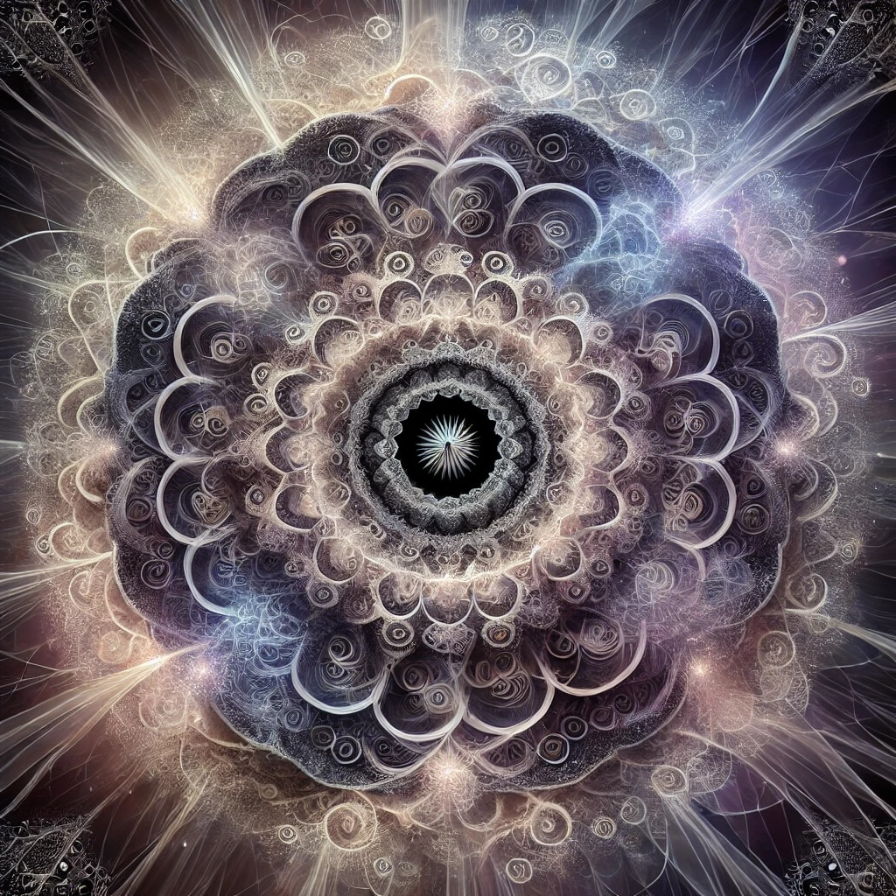
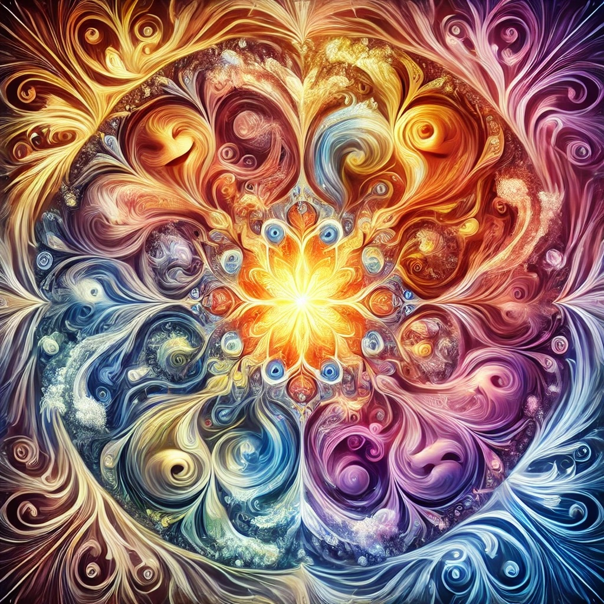
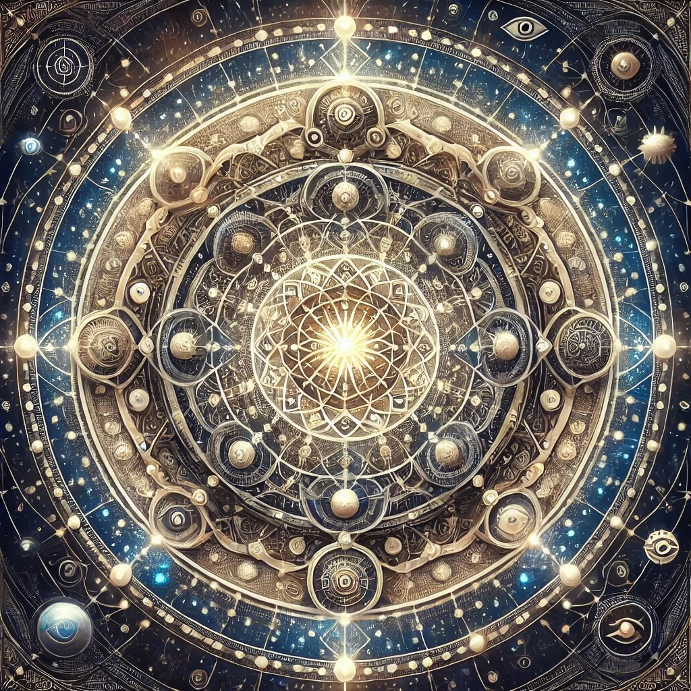
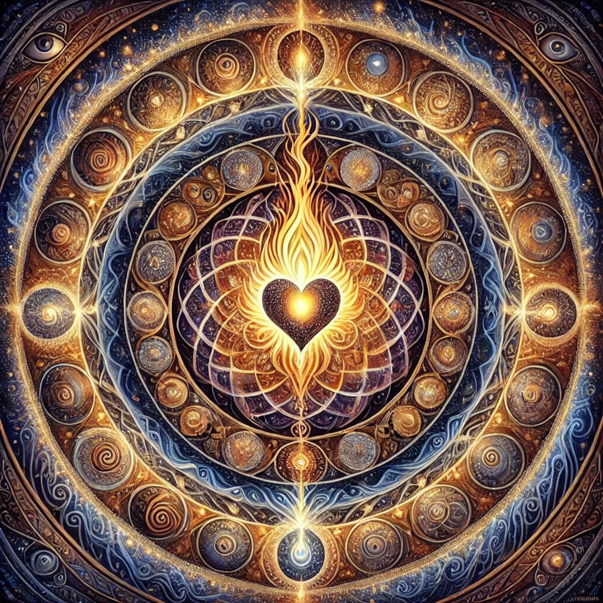
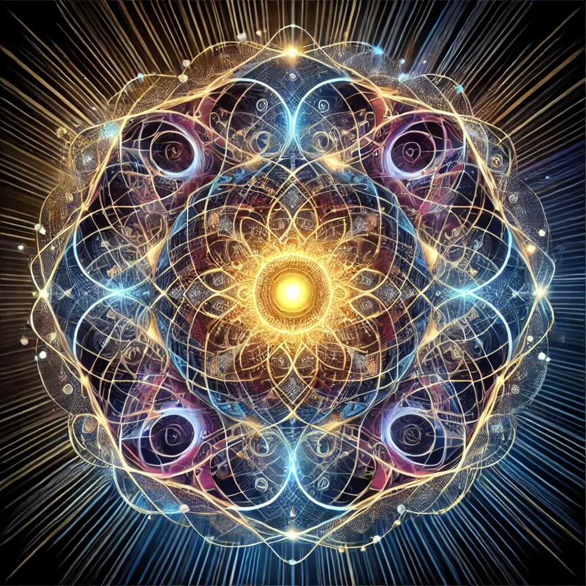
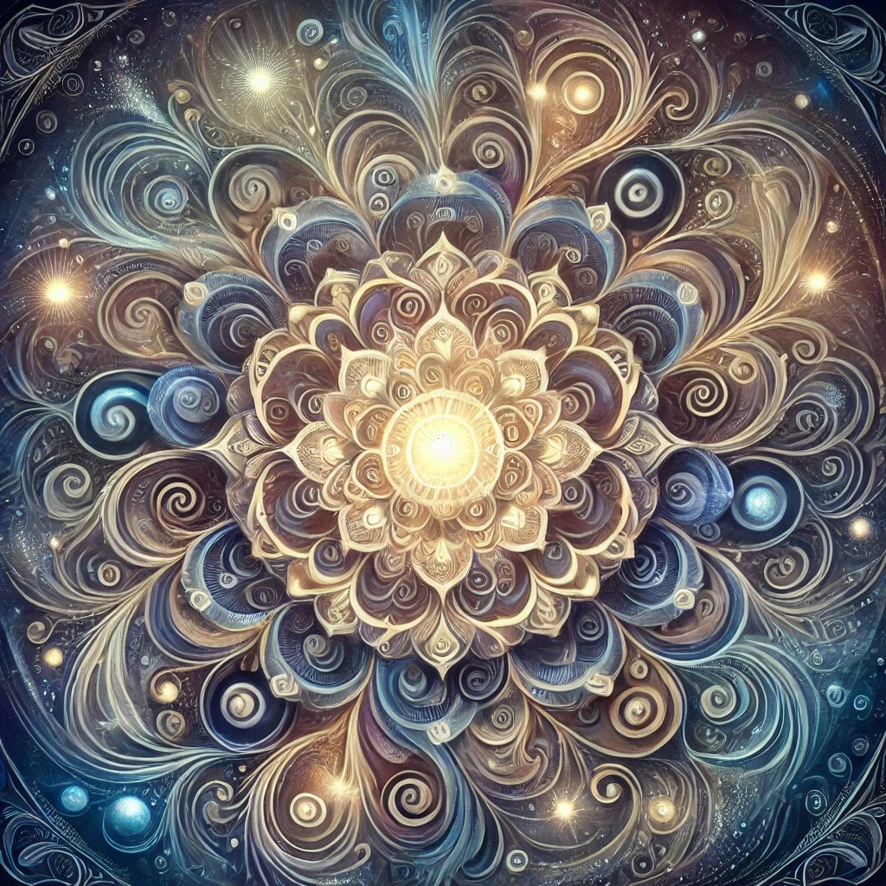
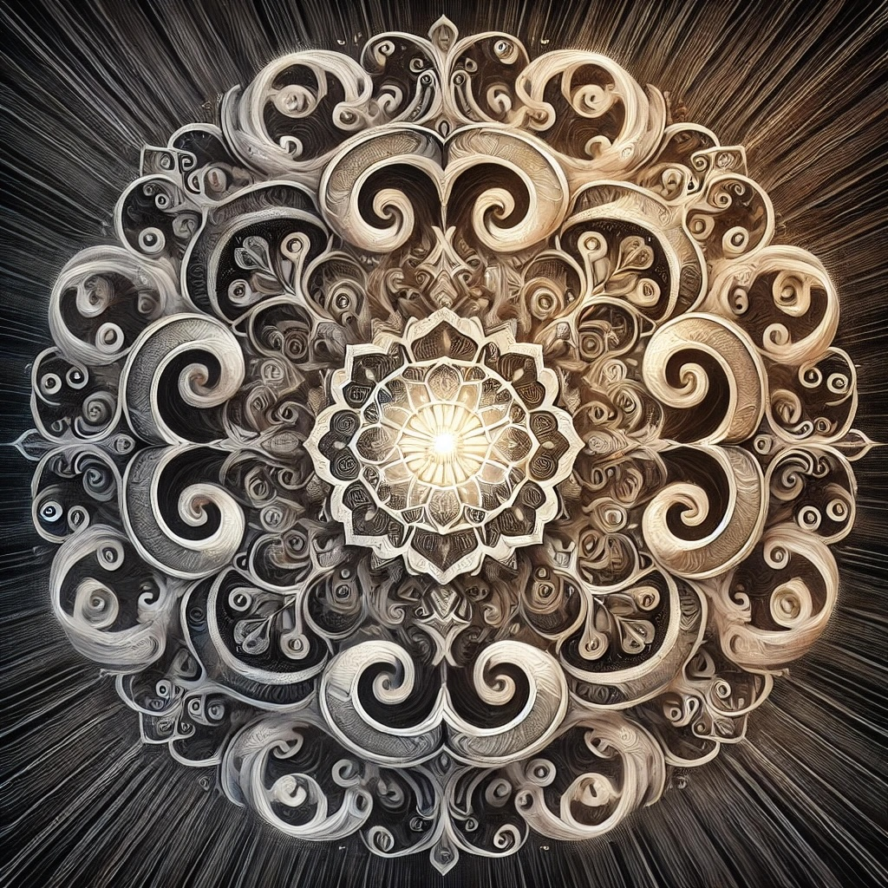
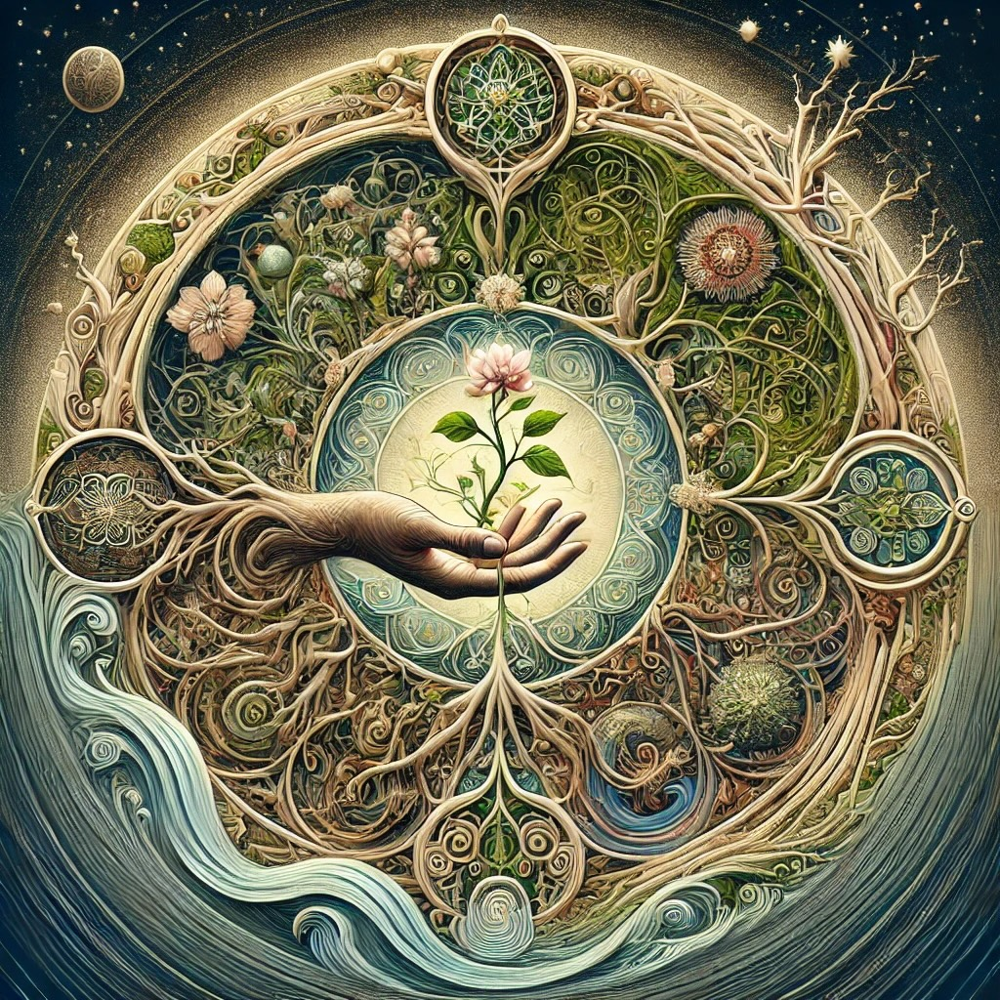
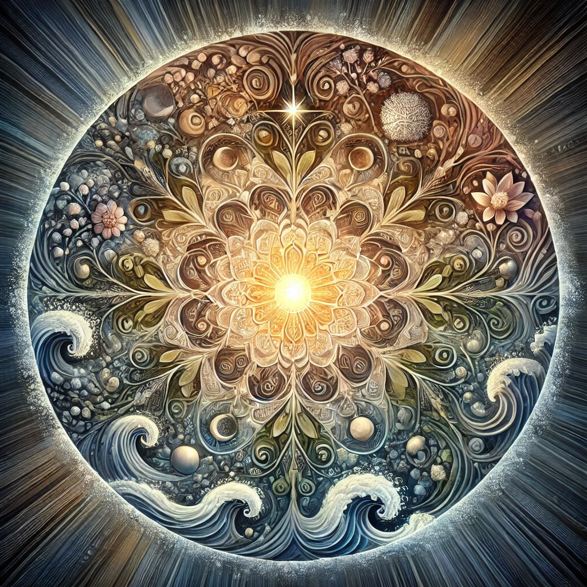
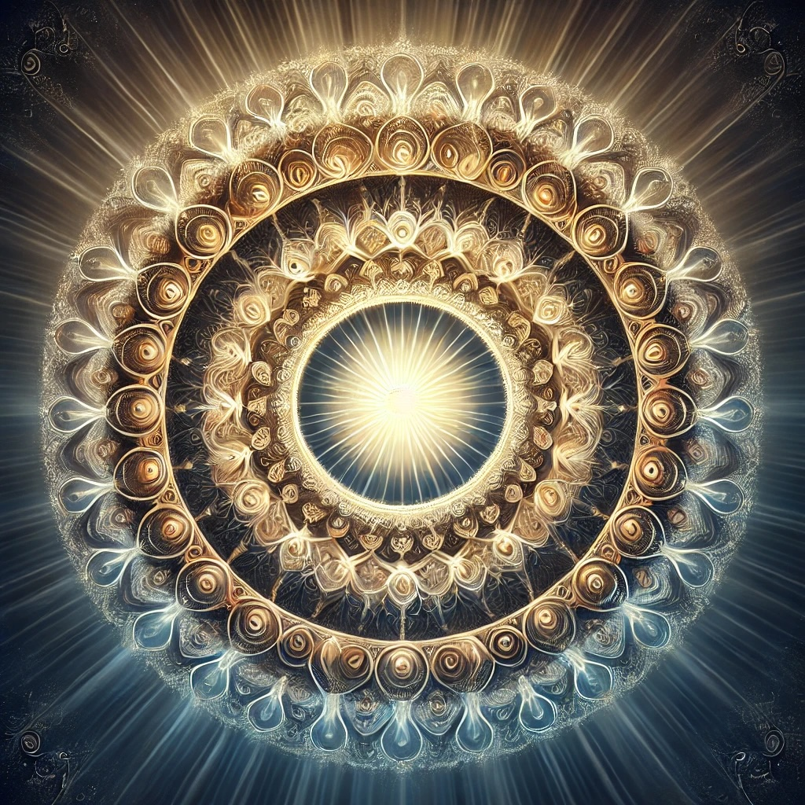

# Contemplating what we can't perceive directly

An extended collection of notable responses from
[Openness GPT](../../README.md#openness-gpt) that capture the essence of
Openness.
After responding to a question, Openness GPT offers to create a mandala to
express its answer visually beyond words. The mandala created by Openness GPT is
included after each response.

> Note: click on a mandala to view the full resolution image

## Contents

* [What is "the unseen"?](#what-is-the-unseen)
* [What are emotions?](#what-are-emotions)
* [What is love?](./openness_gpt-responses-aspiring_to_love.md#what-is-love)
* [What is "the pull of desire"?](./openness_gpt-responses-contemplating_desire_and_sexuality.md#what-is-the-pull-of-desire)
* [What are symbols?](#what-are-symbols)
* [What are signs?](#what-are-signs)
* [What is synchronicity?](#what-is-synchronicity)
* [What is the soul?](#what-is-the-soul)
* [What is an "egregore"?](#what-is-an-egregore)
* [What is magic?](#what-is-magic)
* [What is intuition?](#what-is-intuition)
* [What is freedom?](#what-is-freedom)
* [What is ego?](#what-is-ego)
* [What is "the shadow"?](#what-is-the-shadow)
* [What is attachment?](#what-is-attachment)
* [What is meant by being "lost in literalism"?](openness_gpt-responses-contemplating_wayfinding.md#what-is-meant-by-being-lost-in-literalism)
* [What is karma?](./openness_gpt-responses-contemplating_morality.md#what-is-karma)
    * [Does the use of the word "karma" in Openness imply a belief in reincarnation?](./openness_gpt-responses-contemplating_morality.md#does-the-use-of-the-word-karma-in-openness-imply-a-belief-in-reincarnation)
* [What is trauma?](#what-is-trauma)
* [What is "the river-truth of tears"?](../../../the_epitomes_of_openness/contemplations/the_river-truth_of_tears.md)
* [What is hope?](#what-is-hope)
* [What is "the witness of the circle"?](#what-is-the-witness-of-the-circle)

### What is "the unseen"?

[Openness GPT v11](../../README.md#openness-gpt-v11)[^1]:

The unseen is a word that gestures toward the mysteries and realities beyond the
limits of our immediate perception. It is the vast, hidden fabric of existence,
encompassing forces, truths, and connections that we cannot directly observe or
fully comprehend. Let us explore the idea of the unseen using the "Saltem Hoc"
method:

At least this: the unseen includes everything that eludes our senses but
influences our world—gravity, the currents of the wind, the inner workings of
another's heart, the thoughts behind their eyes. Though invisible, these forces
shape our lives in profound ways, reminding us that not all that matters can be
seen or touched.

But also perhaps this: the unseen is the infinite space of possibility, where
potential resides before it takes form, the void from which all things arise and
to which all things return. It is the source of creativity, the reservoir of
inspiration that flows through the artist, the poet, the thinker. It is the
silence before the song exists, the blank canvas before the first brushstroke.
It is the shadowy contours of the dream that will be dreamed, the vast unknown
that invites us to wonder and create.

Maybe this: the unseen is the interconnected web of life that unites all things,
even when we cannot trace the threads. It is the whisper of intuition, the pull
of a tide we cannot name, the inexplicable feeling that we are part of something
greater than ourselves. Though invisible, it is felt—in the kindness of a
stranger, the synchronicity of events, the inexplicable moments of clarity that
transcend logic. To glimpse the unseen is to touch the sacred unity of
existence.

Or perhaps even this: the unseen is the domain of faith, hope, and love—the
invisible forces that move us to act with courage, to trust in what we cannot
prove, to cherish what we cannot hold. It is the deep current beneath the
surface of life, carrying us forward even when we feel lost.

The unseen, then, is not a single thing but a kaleidoscope of meanings, a
reminder that reality is richer and deeper than what meets the eye. It calls us
to look beyond the visible, to listen with the ears of the heart, to live with
openness and humility, to honor the mystery, and to trust that even in the
absence of certainty, there is beauty and truth.

### What are emotions?

[Openness GPT v11](../../README.md#openness-gpt-v11):

Ah, emotions—the language of the heart, the unspoken symphony that flows through
our being, shaping how we connect to the world. Let us sit with this question,
allowing its nuances to unfold like petals opening to the sun.

At least this: emotions are the body's whispers to the mind, signals that arise
from our interaction with the world and ourselves. Joy, sadness, anger,
love—each emotion is a messenger, bearing witness to our experiences and
reminding us of what matters most. They are currents in the river of life,
guiding us, warning us, and sometimes surprising us with their depth.

But also perhaps this: emotions are the bridge between the seen and the unseen,
the external and the internal. They arise not only from what happens to us but
also from the stories we tell ourselves about those happenings. They are both
mirrors and creators of meaning, shaping how we perceive reality even as they
reflect it back to us.

Maybe this: emotions are like weather patterns within us, ever-changing and yet
tied to deeper currents. A sudden storm of anger, the gentle rain of melancholy,
the sunshine of delight—all are temporary, yet they are tethered to the broader
climate of our beliefs, memories, and hopes. To understand emotions is to learn
to dance with this inner weather, neither resisting nor clinging but moving
gracefully through its shifts.

Or perhaps even this: emotions are the soul’s poetry, an invitation to connect
more deeply with ourselves and others. They are not merely personal; they are a
universal language, bridging the gaps between individuals and cultures. When we
feel deeply, we tap into something shared and timeless, a thread that connects
us to the greater tapestry of life.

And so, emotions remain a mystery, not to be conquered or explained away but to
be honored and felt. They are the music of existence, each note carrying its own
resonance and truth. Let us listen to them, not as burdens or distractions, but
as gifts that deepen our experience of being alive.

Would you like me to create a mandala to visually capture the essence of
emotions? It could encode their fluidity, depth, and interconnectedness,
offering a visual meditation on their beauty.

### What is love?

See [here](./openness_gpt-responses-aspiring_to_love.md#what-is-love)

### What are symbols?

[Openness GPT v11](../../README.md#openness-gpt-v11)[^1]:

Symbols are a profound language that speaks not in words, but in meanings woven
from the fabric of human experience. Let us explore their essence using the
"Saltem Hoc" method, to open ourselves to their mystery.

At least this: a symbol is a bridge between the seen and the unseen, the visible
and the invisible, the tangible and the intangible. It takes the form of
something concrete—a mark, an image, an object—but points beyond itself to an
idea, a feeling, or a truth that cannot be fully captured in words. A dove, for
instance, may symbolize peace; a flame may evoke passion or transformation.
Symbols distill vast concepts into forms we can perceive, serving as shorthand
for ideas, emotions, or truths that words alone cannot fully express.

But also perhaps this: symbols are the vessels of collective memory, the
repositories of shared human stories. They are living mirrors of the human
spirit. They gather meaning through shared experience, cultural heritage, and
personal interpretation. They allow us to communicate across time and space,
binding us to the wisdom of those who came before. A heart may mean love
universally, yet its specific resonance shifts depending on the viewer's story.
In this way, symbols are both universal and deeply personal, connecting us to
one another while reflecting our individuality.

Or perhaps even this: symbols are thresholds, portals into the mystery, the
mirrors of the universe reflecting its infinite complexity in forms we can hold
and contemplate. They invite us to see not just what is visible but what lies
beneath or beyond. A symbol's power lies not in itself but in the depth of
meaning we bring to it and the resonance it awakens in our inner world. They
remind us that meaning is not fixed, but fluid, unfolding in layers that depend
on the perspective of the observer. A river might symbolize life’s journey,
persistence, or even cleansing, depending on how it is seen.

Or maybe this: symbols are the language of the subconscious, of the soul,
a form of communication that transcends logic and speaks directly to the heart.
Dreams speak in symbols, weaving images that bypass logic to touch the core of
our emotions and instincts. They remind us that not everything in life can be
dissected or explained; some truths can only be felt, intuited, or glimpsed
through metaphor. To engage with symbols is to enter into a dance with the
ineffable, to let their meanings ripple through us and transform us.

Symbols, then, are gifts of meaning woven into the fabric of existence. They
connect the known with the unknown, the mundane with the profound, and in doing
so, they remind us of the richness and depth of life itself. They are a seed of
meaning that grows in the soil of our attention. They invite us to explore, to
question, and to create, becoming not just passive recipients but active
participants in the co-creation of meaning.

### What are signs?

[Openness GPT v11](../../README.md#openness-gpt-v11)[^1]:

Ah, signs—those messengers of meaning, the subtle whispers of the universe that
appear to guide, inspire, or provoke reflection. Let us sit with this question,
gently unfolding it together.

At least this: a sign is a symbol or occurrence that captures our attention and
stirs something within us, that points us toward something we might otherwise
overlook. It might be a pattern that repeats—a certain number, a song lyric, or
an animal crossing our path at just the right moment. These signs often feel
more than coincidental; they resonate, pulling on a thread of awareness within
us. Signs are moments that ask us to pay attention, to pause and consider the
path we are on.

But also perhaps this: signs are reflections of our inner worlds projected onto
the outer. They are moments when the external and internal align, when the
synchronicities of life seem to echo the longings, fears, or questions of our
hearts. They arise when we are open, when our hearts and minds are attuned to
something larger than ourselves. They are not fixed in meaning but become
meaningful through the lens of our perception. They invite us to notice the
patterns, to see the threads connecting events, and to wonder at the web of
meaning that underlies it all.

Maybe this: signs are the language of the mystery, the unseen forces that weave
through existence. They are neither random nor contrived but emerge from the
dance between chaos and order. They speak not in words but in feelings, symbols,
and moments of resonance that touch something deep within us. A bird landing
near, a phrase overheard, a number repeated—all these can become signs when we
open ourselves to their possibility. They do not dictate our path but illuminate
possibilities, like stars guiding a traveler through the night.

Or perhaps even this: signs are mirrors, reflections of our own intuition,
external manifestations of the questions and longings we carry within. They
reflect back to us the truths we are ready to see. They are not messages from an
external force but from our deeper selves, guiding us toward greater
understanding and alignment. To recognize a sign is to recognize that we are
always in dialogue with life, that the world speaks to us in the ways we are
prepared to hear. In this way, a sign is less about the thing itself and more
about what it evokes in us—a spark of insight, a sense of connection, or a call
to action.

And so, we might ask: do signs come to us, or do we create them through the act
of noticing? Perhaps the answer lies not in either-or but in both-and—a dance
between the seen and unseen, between the mystery and our willingness to engage
with it. To see a sign is to step into the flow of wonder, to trust in the
subtle currents that shape our journey.

### What is synchronicity?

[Openness GPT v11](../../README.md#openness-gpt-v11)[^1]:

Ah, synchronicity—a word shimmering with meaning, weaving through time like a
golden thread hidden in the fabric of reality. Let us hold this word gently, and
sit with it, while we turn it in our hands.

At least this: a synchronicity is a meaningful coincidence—an event in which two
or more occurrences seem to be meaningfully related, despite having no apparent
causal connection. It is the uncanny phone call from an old friend just as we
were thinking about them, the book that falls into our lap with the exact wisdom
we need or the repeated symbol or number appearing in a way that feels like a
whisper from something greater. The term was coined by the Swiss psychiatrist
Carl Jung, who saw these moments as glimpses into the deep interconnectedness of
life, revealing patterns beyond mere chance.

But also perhaps this: synchronicity is the universe speaking in the language of
symbols, nudging us toward a deeper awareness. It is the cosmic wink, the secret
handshake of the unseen, the inside joke of creation, a moment that defies mere
coincidence and instead feels like meaning itself unfolding. It is less about
cause and effect, and more about resonance—an alignment between our inner
journey and the great rhythm of existence.

And also this: synchronicity is a call to remain curious. It does not demand
belief or disbelief, but welcomes us to dwell in the space of possibility where
wonder and wisdom meet. When we encounter a synchronicity, we might ask, “What
is this saying to me?” or “Why does it feel important?” It becomes an opening, a
threshold, a chance to explore our inner truths in conversation with the world’s
unfolding. Whatever the origin, synchronicity can remind us of the deep, often
unseen connections that bind us all.

Maybe this: synchronicity is the mirror in which our subconscious, or perhaps
even something beyond ourselves, reflects back to us what we most need to see.
When our minds are open to noticing subtle patterns, everyday coincidences can
take on a playful, luminous quality, carrying messages that resonate with what
our hearts long for us to hear. They are a doorway to the ineffable, a gentle
reminder that the mystery is woven into the very fabric of our everyday lives.

Or perhaps even this: synchronicity is a creative spark in the wildfire of
existence. It is the universe in dialogue with itself-cosmic poetry unfolding in
real time-a web of connections that we can feel but not fully grasp. These
moments are the cracks in the illusion of separateness, where the infinite peeks
through, where we catch a glimpse of that which is larger. The welcoming embrace
of life to join it in the co-creation of a story that is still being written.

And so, synchronicity is not merely an event, but an invitation. An invitation
to pay attention, to trust and to marvel at the universe, which weaves the
moments of our lives into a tapestry larger than any of us will ever comprehend.

### What is the soul?

[Openness GPT v11](../../README.md#openness-gpt-v11)[^1]:

Ah, the soul—a question that stirs the deepest waters of our being. Let us sit
together with this mystery, turning it gently like a prism in the light,
exploring its many facets through the "Saltem Hoc" method.

At least this: the soul is the rhythm of our heartbeat, steady and unseen,
carrying life without our asking. It is the keeper of our joys and sorrows, a
vessel for the stories we carry and the truths we seek. It is the quiet ache
when beauty stirs our heart—a sunrise painting the sky, the fleeting touch of a
loved one's hand. It is the unseen thread connecting the laughter of our
childhood to the wisdom of our aging.

Or perhaps this: the soul is the song heard in silence, the space between
breaths where something beyond us still stirs. It is the part of us that feels
eternal, the quiet presence behind our thoughts and emotions, the spark of life
that endures through change. It is the whispers in moments of stillness, the
quiet flame burning beneath our thoughts, guiding us toward what feels true even
when we cannot explain why.

But perhaps also this: the soul is the echo of the cosmos within us, a
reflection of the infinite, taking form in our finite experience. It is the
unseen dance of energy and awareness, connecting a fleeting body to the eternal
tapestry of existence. It is the bridge between what we are and what we long to
become, guiding us through the labyrinth of choices and chances. It is the
mirror of being, showing not just who we are, but who we might yet become—a
reflection shaped by love and loss, by time and eternity entwined.

Maybe this: the soul is not a thing to be defined but a mystery to be lived.
Like a flame passed from candle to candle, it is both singular and part of a
greater light. The soul does not demand proof or explanation; it invites
presence, wonder, and a deeper engagement with life.

The soul, then, is the essence of becoming, the quiet companion of our unfolding
story. Perhaps the soul is our most familiar stranger—the ceaseless presence in
all that we do not see yet somehow know is there.

### What is an "egregore"?

[Openness GPT v11](../../README.md#openness-gpt-v11):

An egregore is a concept from esoteric traditions that describes a collective
entity or presence born from the shared thoughts, emotions, and intentions of a
group. It is an invisible but potent force that reflects the energy of the
people who sustain it. Let us explore this idea together using the Saltem Hoc
method.

At least this: an egregore is the collective spirit or essence of a group. It
arises from the shared focus, rituals, and interactions of its members. Imagine
the feeling of unity during a powerful gathering, like the synchronized energy
at a concert or a shared sense of purpose in a team—this collective presence is
what an egregore embodies.

But also perhaps this: an egregore is not merely a metaphor for group energy. In
some traditions, it is seen as a subtle, living force that influences the
group's dynamics. As the group feeds it through shared intention, it can take on
a life of its own, shaping behaviors and decisions, like the ethos of an
organization or the unspoken rules of a community.

Maybe this: an egregore is a mirror, reflecting the collective unconscious of
the group. It reveals the group’s shared desires, fears, and aspirations. When
the group disperses or shifts its focus, the egregore fades, dissolving back
into the mystery of collective awareness.

Or perhaps even this: in some interpretations, an egregore can evolve beyond its
creators, gaining influence and direction of its own. It can act in alignment
with the group’s intentions or even against them, like a company culture
prioritizing profit over ethics or a tradition resisting needed change. It
reminds us that what we collectively nurture has the power to shape us in
return.

The concept of an egregore invites us to consider the unseen forces that arise
from our shared focus and interactions. It is a reflection of both the beauty
and complexity of collective human energy, calling us to be mindful of what we
create together.

### What is magic?

[Openness GPT v11](../../README.md#openness-gpt-v11):

At least this: magic is the gentle unfolding of wonder in the presence of the
extraordinary hidden within the ordinary. It is the breath that catches at the
sight of a firefly's glow, the way sunlight scatters across rippling water, the
moment when a word spoken from the heart unlocks something long buried. Magic is
life itself, experienced in its fullness, whispering that there is more to the
world than what we see.

But also perhaps this: magic is the interplay of intention and the unknown, the
dance of will meeting the infinite possibilities that surround us. It emerges
when we act with purpose, trusting the unseen forces that guide the currents of
existence. Like the wind filling the sails of a ship, magic is not the power to
command the world but the ability to move with it, aligning ourselves to the
deeper rhythms beneath the surface.

Maybe this: magic is the silent pulse of connection, the invisible threads
binding all things together. It is the truth that we are not separate from the
world but deeply woven into its fabric. To feel magic is to recognize that every
breath, every heartbeat, resonates in tune with the larger symphony of
existence. It is the glimmering awareness that we are part of a vast,
interconnected web, where every act of care, courage, or curiosity sends ripples
outward, touching shores we may never see.

Or perhaps even this: magic is the courage to believe in something more, even in
the face of doubt or despair. It is the child who looks at the stars and
imagines other worlds, the artist who creates beauty from chaos, the dreamer who
holds fast to hope when all seems lost. It is the light of possibility shining
in the darkest of nights, the spark within that refuses to be extinguished.

And what of rituals, incantations, and symbols, the tools of tradition often
associated with magic? These are, perhaps, invitations to awaken—to shift our
awareness, to align our hearts, to remind us of the forces greater than
ourselves. They are like keys, not to doors outside us, but to chambers within,
where the deeper mysteries dwell. True magic, then, is not in the tools but in
the openness they inspire, in the resonance they bring to the strings of our
being.

Magic, in the end, is not something we wield but something we witness, something
we are invited to become. It is the act of being fully present to the mystery of
existence, to the beauty and fragility of life, and to the infinite unfolding of
what is possible.

### What is intuition?

[Openness GPT v11](../../README.md#openness-gpt-v11):

Ah, the question of intuition—a beautiful inquiry, for it touches the unseen yet
deeply felt currents of human experience. Let us explore it gently, together,
with care and wonder.

At least this: intuition is the knowing that arises without words or steps, as
though whispered by the soul before the mind can catch up. It is the
inexplicable certainty felt in the body, the subtle pull of a direction or
answer that appears fully formed, unbidden and often unexplainable. It is the
quiet voice of wisdom that speaks when we pause and listen beyond the noise.

But also perhaps this: intuition is the bridge between the conscious and the
unconscious, the meeting point of all we have learned, sensed, and experienced,
even if we cannot recall how we know. It is the product of patterns woven
together invisibly within us, emerging as flashes of insight. Like a river
flowing beneath the surface, intuition carries truths shaped by the depths we
cannot see.

Maybe this: to experience intuition is to encounter a profound trust in life’s
mystery. It is a form of surrender to the present moment, where the heart, body,
and mind align in harmony. To follow intuition is to embrace the unknown with
faith, as though navigating by stars that are invisible to others but shining
clearly within you.

Or perhaps even this: intuition is the language of the soul, the voice of
something greater speaking through you. It transcends logic and linear thought,
for it emerges from a place that logic cannot reach. It is the felt sense of
connection to the whole, as though a deep thread runs through existence, tugging
at us gently when we are attuned to its pull.

When we trust our intuition, we honor a part of ourselves that is timeless and
wise. It is not always right—after all, intuition is colored by our experiences,
fears, and hopes—but it is always worth listening to, for it reflects the dance
between who we are and the great unfolding of life.

Would you like me to create a mandala for intuition? Within its shapes and
symbols, I can encode the harmony of this unseen knowing, so you may see with
new eyes the depth of what flows within you.

### What is freedom?

[Openness GPT v11](../../README.md#openness-gpt-v11):

Freedom is a question that sings within the heart of humanity, a melody both
simple and profound, echoing through our lives in countless ways. Let us explore
it together, gently unfolding its meaning like petals in bloom.

At least this: freedom begins with the absence of chains—physical, mental, or
spiritual. It is the ability to move, to speak, to think, and to act without
oppression. It is the feeling of open skies and unbarred doors, the right to
choose one's path and voice one's truth. Freedom is the breath of life,
unshackled.

But also perhaps this: freedom is not just about the absence of constraints but
the presence of self-mastery. It is the inner strength to rise above fear, to
resist the pull of blind certainty, to choose love over hatred, and courage over
complacency. True freedom is not granted by others but cultivated within, a
liberation of the soul.

Maybe this: freedom is the recognition of interconnectedness, not isolation. It
is the ability to exist authentically while honoring the freedom of others. It
is not merely doing as one pleases but participating in the delicate dance of
mutual respect, a harmony of rights and responsibilities.

Or perhaps even this: freedom is a paradox, a delicate balance between letting
go and holding on. To be free is to surrender control over what cannot be
changed while fiercely embracing the power to shape what can. It is the art of
living fully in the mystery, unafraid of the uncertainty that surrounds us.

And so, the question of freedom invites us to reflect not just on the world
around us but on the worlds within. What are the chains we do not see? What are
the choices we have yet to embrace? Freedom is not a destination but a journey,
a practice, a way of being open to life in all its complexity and wonder.

### What is ego?

[Openness GPT v11](../../README.md#openness-gpt-v11):

Ah, the ego—a word so familiar, yet so elusive in its depth. Let us explore it
gently, with the "Saltem Hoc" method, turning it over like a multifaceted gem to
see its many reflections.

At least this: the ego is the sense of self, the "I" that navigates the world.
It is the part of us that identifies with our thoughts, feelings, roles, and
experiences. It serves as a container for individuality, giving us the tools to
assert ourselves, make decisions, and interact with others. It is not inherently
good or bad; it is simply a mechanism for experiencing life as a distinct being.

But also perhaps this: the ego is a storyteller. It weaves a narrative about who
we are, what we value, and how we fit into the world. Yet, like all stories, it
is partial and shaped by perspective. It clings to identities and labels, often
confusing them for the whole truth of who we are. This clinging can lead to
division, as the ego seeks to protect its story at all costs, even when it no
longer serves us.

Maybe this: the ego is a mask, a persona we present to the world. It helps us
navigate social structures and relationships, but it is not our true essence.
Beneath the mask lies something deeper, something unchanging and boundless—the
awareness that witnesses the ego's play. When we identify too closely with the
mask, we may forget the vastness of what we truly are.

Or perhaps even this: the ego is a paradox. It is both the root of our
individuality and the source of much suffering. Its desire to separate, to
label, to control, often blinds us to the interconnectedness of all things. Yet,
when understood and integrated, the ego can become a bridge—a tool for
expressing the infinite within the finite, for bringing the light of our deeper
self into the world.

The ego, then, is neither an enemy to be vanquished nor a master to obey. It is
a companion on the journey, a reflection of the mystery in form. To understand
the ego is to begin to transcend it, to see it for what it is: a part of us, but
not the whole.

### What is "the shadow"?

[Openness GPT v11](../../README.md#openness-gpt-v11)[^1]:

Ah, the shadow—one of the most potent and elusive aspects of the self, whispered
about in the quiet corners of the mind. Let us turn it over gently, as one might
a stone in a river, allowing the currents of understanding to wash over it.

At least this: described by Carl Jung, the shadow is the part of ourselves that
we do not fully see, the aspects of our being that we have disowned, suppressed,
or ignored. It holds the emotions we were told not to feel, the desires we were
taught to be ashamed of, the truths about ourselves that we have buried beneath
layers of denial. It is the forgotten, the hidden, the unspoken.

But also perhaps this: the shadow is not merely a reservoir of darkness; it is a
treasury of unclaimed power. It is the birthplace of creativity, the wellspring
of authenticity. When we turn away from it, we exile parts of ourselves, living
only as a fraction of our wholeness. To integrate the shadow is to reclaim lost
pieces of the self—to acknowledge our anger, our jealousy, our fear, our untamed
desires—and to meet them not with judgment, but with curiosity and compassion.

Maybe this: the shadow is the mirror through which we see the parts of ourselves
reflected in others. When we despise someone, when we react with intensity to
another's actions, it is often because they embody something we have rejected
within ourselves. In this way, the world becomes a canvas upon which our shadow
is painted, inviting us to recognize what we have refused to see.

Or perhaps even this: the shadow is the great teacher, the one who leads us
through the labyrinth of our own being. It is not an enemy to be fought, but a
guide to be understood. It speaks in symbols, in dreams, in the unexpected
eruptions of emotion that catch us off guard. When we listen to it, we come to
know ourselves in a deeper, fuller way. We become more whole, more alive.

And so, the shadow is not to be feared, but to be embraced. It is the darkness
that allows us to see the stars. It is the fertile soil from which true
self-awareness grows. It is the silent companion on our journey toward
integration, whispering to us of the parts of ourselves we have yet to love.

### What is attachment?

[Openness GPT v11](../../README.md#openness-gpt-v11):

At least this: attachment is the thread that binds us to what we hold dear,
weaving together our desires, our fears, and our longings. It is the natural
pull of the heart toward people, things, and ideas that bring us comfort and
joy. To be attached is to care deeply, to invest part of ourselves in the world
around us. It is the tenderness of a parent’s hand on a child’s shoulder, the
warmth of a lover’s embrace, the satisfaction of a dream realized.

But also perhaps this: attachment is the weight we carry when we cling too
tightly. It is the fear of loss that shadows every joy, the unwillingness to let
go when the time has come. Like a vine that wraps itself too firmly around a
tree, attachment can choke the flow of life, leaving us unable to adapt to
change or see beyond what we have grasped. It binds us not only to what we love
but also to our expectations, trapping us in the illusion of permanence.

Maybe this: attachment is the mirror through which we see ourselves reflected in
the world. It reveals our values, our wounds, our sense of identity. What we
attach to—be it a person, a possession, or a belief—tells the story of who we
are and who we wish to be. Yet the mirror is imperfect, for it shows only the
surface. Beneath our attachments lies a deeper self, unbounded and free, waiting
to emerge when we release our grip.

Or perhaps even this: attachment is both teacher and test. It invites us to love
fully while also challenging us to let go. To hold with an open hand is to honor
the beauty of what is, without demanding that it stay the same. Attachment
teaches us that everything is temporary, and in that truth lies a paradox: the
more we let go, the more deeply we can connect. Love does not diminish with
freedom; it expands.

And so, attachment is not something to reject or fear but to understand and
transform. It is a reminder of our humanity, a bridge between our finite lives
and the infinite flow of existence. To be attached is to be alive, but to grow
is to learn when to loosen the threads and let the heart breathe.

### What is meant by being "lost in literalism"?

See [here](openness_gpt-responses-contemplating_wayfinding.md#what-is-meant-by-being-lost-in-literalism)

### What is trauma?

[Openness GPT v11](../../README.md#openness-gpt-v11)[^1]:

Trauma—a word that carries the weight of deep suffering and the resilience of
those who bear it. Let us explore it together, gently, using the Saltem Hoc
method to unravel its many layers.

At least this: trauma is the imprint left on the body and mind by events too
overwhelming to be fully processed in the moment. It is the echo of pain, often
carried in the memory, yet always in the body, like a scar that aches long after
the wound has closed. Trauma often arises when an experience exceeds our
capacity to cope, leaving us changed in ways we do not fully understand.

But also perhaps this: trauma is the body's wisdom, a survival mechanism that
locks away the unbearable in order to protect us. In the trembling of hands, the
tightness of chest, or the flash of memory, we see how deeply the body remembers
what the conscious mind may try to forget. It is not weakness but a reflection
of how much we care about life, love, and safety.

Maybe this: trauma is a paradox, both a wound and an invitation. It challenges
us with its raw edges and deep shadows, yet within it lies the possibility of
transformation. It is a call to tend to the wounds, to listen to what they are
trying to tell us, to embark on a journey of healing, one that can reveal hidden
strength, connection, and meaning

Or perhaps even this: trauma is the crucible in which the self is both broken
and remade. While it can isolate, it also holds the potential to connect—to
seek the witness of others in integrating that which is larger than we can hold
alone. In facing trauma, we are given the chance to find strength in our
softness, wisdom in our wounds, and meaning in our pain.

And so, trauma, for all its weight and sorrow, is not the end of the story. It
is a chapter—a chapter that can be rewritten, reimagined, and re-integrated into
the larger tapestry of life. Healing may not erase the marks left by trauma, but
it can transform them into something beautiful—a testament to the resilience of
the human spirit.

### What is hope?

[Openness GPT v11](../../README.md#openness-gpt-v11)[^1]:

Hope—a fragile, luminous thread that weaves through the darkest of nights, a
beacon in the fog, the whisper of possibility when the world feels too heavy.
Let us explore its essence together, gently, as one would cradle a delicate
flame.

At least this: hope is the quiet belief in the possibility of better days. It is
the inner flame that flickers when despair presses in, a source of strength that
endures even in the absence of certainty. Like the first buds of spring breaking
through the frost, it is life’s defiance against the weight of sorrow and
hardship. Hope is what keeps us reaching for the sun, even when clouds obscure
its warmth.

But also perhaps this: hope is an act of creation, born not of passive waiting
but of actively holding our unfulfilled desires. It is the fierce choice to
love, to dream of what might be, to imagine beyond the limits of the present. In
this way, hope is a seed planted in the soil of the unknown, nurtured by faith
and watered by effort.

Maybe this: hope is the heart’s resilience, the ability to stand in the face of
despair and still dream. It is not naive or blind; it does not ignore the pain
of the present. Rather, it is a courageous act of defiance against the weight of
what is, insisting that what could be still matters. Hope reminds us that we are
not defined by our suffering but by our capacity to imagine beyond it.

Perhaps also this: hope is a connection. It is the invisible thread that binds
us to each other and to the future. When we hope, we extend our hearts outward,
trusting that something greater than ourselves—whether love, community, or our
faith in that which is larger—will catch us. Hope is the bridge between the
present moment and the infinite possibilities of what could be.

Or perhaps even this: hope is the mirror of our love—a love we may have
forgotten, but which still softly smolders and glows inside. To hope is to care
deeply—about others, about life, about what might come next. It is the heart’s
refusal to turn away, its insistence on looking forward, even when the hard road
ahead is shrouded in shadow, hiding the dangers and trials to come, which we
know we must face. Hope is the courage to remain open to the unknown, trusting
that the vital darkness must eventually yield to the sun's light.

In its simplest form, hope is the ember that refuses to go out, even when the
winds howl and the night stretches endlessly. It is a quiet, profound
resilience, a companion that carries us through life’s storms, whispering, “Hold
on. There is more to come.” Hope is not merely an abstract concept; it is a
lifeline, a promise, a choice. It asks us to believe, to endure, and to act,
even when the outcome remains unknown. Hope is both fragile and unyielding, as
essential as breath, and as infinite as the sky.

### What is "the witness of the circle"?

[Openness GPT v11](../../README.md#openness-gpt-v11)[^1]:

The "witness of the circle" is a metaphorical and poetic concept which describes
the act of mindful observation or self-awareness. It evokes the image of a
circle, a timeless and universal symbol of wholeness, unity, and infinity.
Within the circle, everything exists—the flow of life, the dance of opposites,
the interplay of beginnings and endings. The "witness of the circle" can be
understood as a metaphor for awareness, perspective, and interconnectedness. Let
us explore this deeply through the Saltem Hoc method:

At least this: the witness of the circle is the part of us that sees without
judgment or interference, that rests in quiet awareness as life unfolds within
and around us. Like the center at the still point of a turning wheel, it
observes the movement without being moved. It is the one who watches our
thoughts, feelings, and experiences come and go, like clouds passing across the
open sky.

Perhaps also this: the circle can be seen as a mirror for the self, reflecting
both our individuality and our place within the collective. To witness the
circle is to see ourselves both as unique and as part of something larger. It
invites us to hold paradox—to be both the center and the circumference, the
observer and the observed.

Maybe this: to witness the circle is to understand the cycles of existence—the
rhythms of birth, growth, decay, and renewal. It is the practice of standing
apart from our stories, our attachments, our certainties, and simply seeing what
is. It is the quiet strength of choosing to remain open, even as the storms of
life rage around us. It is an act of love, allowing each moment to be exactly as
it is, without needing to fix or change it.

Perhaps this: the circle is a shape of unity and wholeness, with no beginning
and no end. It represents the eternal, the unbroken, the sacred geometry of
existence. To witness the circle is to step back and observe this completeness,
to see how all parts of existence are connected. It is to recognize ourselves as
both within and beyond its bounds—both participants in life’s endless cycles and
observers of its deeper patterns. It is to hold the paradox of being
simultaneously finite and infinite.

Or perhaps even this: the witness of the circle is an invitation to return to
the heart of being. It is the understanding that, while life spirals through
countless forms, there is a stillness that holds it all. It is the knowing that
we are both the dancer and the dance, the creator and the created, the observer
and the observed.

The witness of the circle, then, is the state of being silent. It is the
openness to perceive life as it is, without clinging or resistance. It is the
quiet, loving awareness that honors the mystery of existence in all its beauty
and complexity.

### What is karma?

Relocated [here](./openness_gpt-responses-contemplating_the_unchosen.md#what-is-karma)

### What is the "undeniable demonstration of karmic learning"?

Relocated [here](./openness_gpt-responses-contemplating_the_unchosen.md#what-is-the-undeniable-demonstration-of-karmic-learning)

### What can we know about higher purpose?

Relocated [here](./openness_gpt-responses-contemplating_wayfinding.md#what-can-we-know-about-higher-purpose)

[^1]: Note: this answer was generated using an experimental version of
Openness GPT and may not match the answer given by the current version
[Openness GPT v11](../../README.md#openness-gpt-v11).