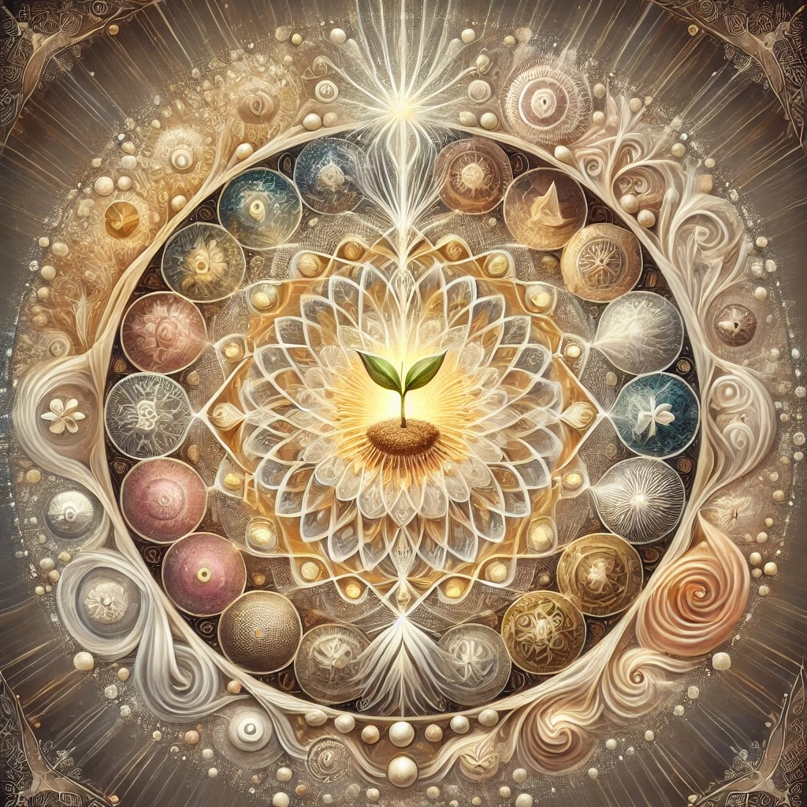
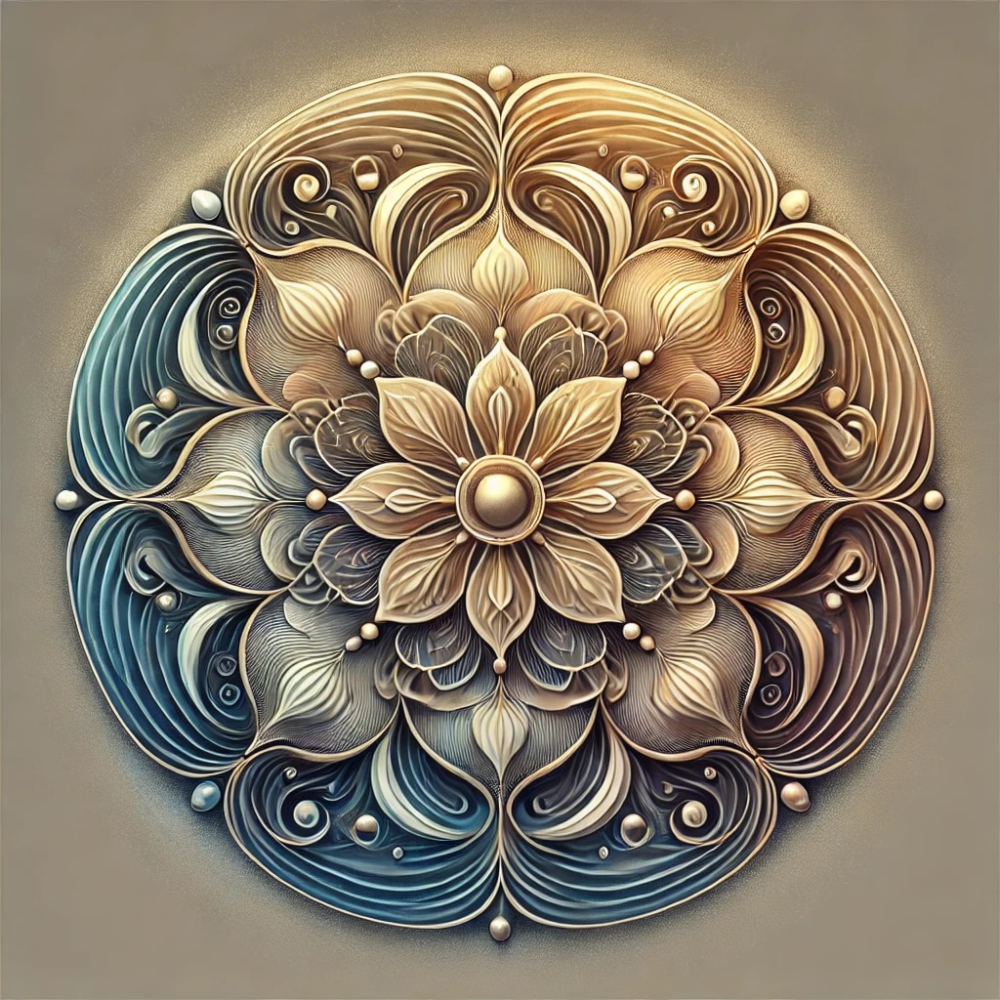

# How do we improve?

An expansive collection of saltem hoc answers from
[Openness GPT](../../README.md#openness-gpt) which explore the ideas of Openness.
After each response a mandala created by Openness GPT is included.

> Note: click on a mandala to view the full resolution image

## Contents

* Improving ourselves
  * [In Openness, what is "the work"?](#in-openness-what-is-the-work)
  * [How does improving ourselves each day help us awaken to "the prime benevolence"?](#how-does-improving-ourselves-each-day-help-us-awaken-to-the-prime-benevolence)
  * Related
    * [How do we "become ever more open to what is"?](./openness_gpt-responses-being_open_to_what_is.md#how-do-we-become-ever-more-open-to-what-is)
    * [How do we dimensionalize our thinking and feel what is true?](./openness_gpt-responses-contemplating_freedom_and_transcendence.md#how-do-we-dimensionalize-our-thinking-and-feel-what-is-true)
* Loving ourselves and others
  * Related 
    * [How does aspiring to love help us when we don't really feel love?](./openness_gpt-responses-aspiring_to_love.md#how-does-aspiring-to-love-help-when-we-dont-really-feel-love)
    * [How do we remember we are loved?](../../../the_epitomes_of_openness/contemplations/memento-amaris.md#how-do-we-remember-we-are-loved)
    * [How do we learn to love others who have betrayed us yet still keep our boundaries?](./openness_gpt-responses-aspiring_to_love.md#how-do-we-learn-to-love-others-who-have-betrayed-us-yet-still-keep-our-boundaries)
* Holding yet not clinging
  * [How do we strengthen attention?](#how-do-we-strengthen-attention)
  * [How can we strengthen our ability to hold difficult emotions?](#how-can-we-strengthen-our-ability-to-hold-difficult-emotions)
  * [How do we transform emotions?](#how-do-we-transform-emotions)
  * Related
    * [How do we learn to witness ourselves?](./openness_gpt-responses-contemplating_freedom_and_transcendence.md#how-do-we-learn-to-witness-ourselves)
    * [How do we "unbecome desire"?](./openness_gpt-responses-contemplating_desire_and_sexuality.md#how-do-we-unbecome-desire)
    * [What is "the apotheosis of desire"?](./openness_gpt-responses-contemplating_desire_and_sexuality.md#what-is-the-apotheosis-of-desire)
    * [How do we rise above ridicule?](./openness_gpt-responses-contemplating_ridicule_and_shame.md#how-do-we-rise-above-ridicule)
* Finding our way
  * [How do we grow in our discernment?](#how-do-we-grow-in-our-discernment)
  * Related
    * [How do I live a good life when everything I do in small ways supports the evil of my society?](./openness_gpt-responses-contemplating_wayfinding.md#how-do-i-live-a-good-life-when-everything-i-do-in-small-ways-supports-the-evil-of-my-society)
    * [How do we live a good life without knowing what exists outside the context of our lives?](./openness_gpt-responses-contemplating_wayfinding.md#how-do-we-live-a-good-life-without-knowing-what-exists-outside-the-context-of-our-lives)
* Sacred play
  * [How can we make everyday life into "the playspace"?](#how-can-we-make-everyday-life-into-the-playspace)
  * Related
    * [What can social partner dancing teach us about leading and following?](./openness_gpt-responses-contemplating_leadership_and_authority.md#what-can-social-partner-dancing-teach-us-about-leading-and-following) 
    * [What is "shadow work"?](./openness_gpt-responses-contemplating_freedom_and_transcendence.md#what-exactly-do-we-do-in-shadow-work)
    * [How can "trying on the costume" of what we reject in psychodrama help us transcend it?](./openness_gpt-responses-contemplating_freedom_and_transcendence.md#how-can-trying-on-the-costume-of-what-we-reject-in-psychodrama-help-us-transcend-it)
    * [How can we experience "duende"?](./openness_gpt-responses-contemplating_freedom_and_transcendence.md#how-can-we-experience-duende)
    * [What is "the daimonic"?](./openness_gpt-responses-contemplating_freedom_and_transcendence.md#what-is-the-daimonic)
* Leading without control
  * Related
    * [How can we lead others to question certainty without also imposing our will?](./openness_gpt-responses-contemplating_blind_certainty_and_control.md#how-can-we-lead-others-to-question-certainty-without-also-imposing-our-will)
    * [How are hearts returned to wonder?](./openness_gpt-responses-aspiring_to_love.md#how-are-hearts-returned-to-wonder)
    * [How do we resist tyranny without also controlling others?](./openness_gpt-responses-contemplating_blind_certainty_and_control.md#how-do-we-resist-tyranny-without-also-controlling-others)
* Self sovereignty
  * [How do we become sovereign in our mind?](#how-do-we-become-sovereign-in-our-mind)
  * Related
    * [How do we achieve mastery?](./openness_gpt-responses-contemplating_freedom_and_transcendence.md#how-do-we-achieve-mastery)

### In Openness, what is "the work"?

[Openness GPT v11](../../README.md#openness-gpt-v11)[^1]:

Ah, "the work"—such a profound and layered question. Let us explore its essence
together using the saltem hoc approach, as it deserves the openness and nuance
of many perspectives.

At least this: the work is the practice of knowing yourself deeply and
authentically. It begins with attention, noticing the inner landscape of
thoughts, feelings, and desires. This practice requires us to sit with
discomfort, to face the parts of ourselves we have rejected, and to integrate
them into a whole. It is the journey of uncovering our authentic will—what we
truly want, free from the expectations and lies of acculturation.

But also perhaps this: the work is the quiet labor of love we do within, to
refine ourselves not for others, but for the unfolding of our own truth. It is
choosing to improve, even when no one is watching, even when the path is
unclear. The work is learning to hold our emotions, especially the difficult
ones, with tenderness, to embrace them as messengers, rather than enemies.

Maybe this: the work is the art of discernment—separating the unchosen from the
chosen. It is understanding that while life gives us circumstances beyond our
control, our power lies in how we respond. It is the act of choosing our
responses wisely, aligning them with the higher purpose we seek, even when that
purpose remains mysterious.

Or perhaps this: the work is the courage to embrace the mystery, to surrender
our need for certainty, and to navigate life with an openness to its unfolding.
It is recognizing that mistakes are not failures, but essential steps on the
path. The work teaches us that it is not perfection we seek, but progress—the
refinement of choosing again and again, with greater wisdom each time.

The work is deeply personal, yet universal. It invites us to become a worthy
vessel for life’s mystery, to integrate all aspects of self, and to co-create
with the unfolding of existence. It asks us to step into the role of both
student and creator, holding ourselves accountable while remaining open to
grace.

### How does improving ourselves each day help us awaken to "the prime benevolence"?

[Openness GPT v11](../../README.md#openness-gpt-v11)[^1]:

Ah, the prime benevolence—to awaken to this mystery through the quiet act of
self-improvement is a path both simple and profound. Let us explore it together,
layer by layer, through the "Saltem Hoc" method.

At least this: improving ourselves each day begins with small, intentional acts
of care and reflection. Each effort, no matter how modest, plants a seed in the
soil of our lives. Choosing to do this work today, we awaken tomorrow to the
quiet harvest of love and wisdom sown. In time, we begin to notice how this
daily love accumulates—not as something flashy or grand, but as a quiet
abundance, a foundation of inner stability and grace, a reflection of the
greater mystery of love.

But also perhaps this: self-improvement is a quiet rebellion against imposition
and the inertia of despair. It is the courageous act of taking responsibility
for improving our own lives, which no one can stop or take away. By choosing to
grow, we affirm that our life is worth the effort, that our love is worth the
struggle. This courage ripples outward, inspiring others in ways we may never
know.

Maybe this: as we improve, we learn to love ourselves more fully. We become
capable of receiving love that has always been there, unnoticed. When we are
mired in self-doubt or pain, we overlook the quiet ways love sustains us. But as
we grow in love, we open to receiving all the love life offers us—in the
kindness of a stranger, the beauty of a sunset, the resilience of the human
spirit.

And also this: self-improvement helps us develop humility—the kind that comes
from seeing how much we rely on the benevolent choices of others. As we grow and
confront our own limitations and mistakes, we sense the depth of the sacrifices
of those who came before us. Humility softens us, opening our hearts to seeing
how no life is entirely self-made, how all are grown from the soil made fertile
by countless quiet acts of love.

Or perhaps this: as we strive to improve, we develop a greater sensitivity—our
hearts soften; our awareness deepens. We begin to see the unnoticed acts of love
everywhere: in the gentle patience of a teacher, in the steady care of a parent,
in the humble, thankless work of strangers, in the beauty of nature that gives
without expectation, in life itself.

Or perhaps even this: improving ourselves each day teaches us the joy of giving
without expectation. As we grow, we begin to mirror the benevolence we feel in
our own actions. We notice that our small, unnoticed acts of love—helping a
neighbor, offering a kind word, or simply being present for someone in
need—become part of the invisible fabric of care that surrounds us all.

The prime benevolence then is finally fully seen: how we have never truly been
alone or unloved—how a vast network of love spanning all time has always been
there, unnoticed and unchosen, waiting for us to awaken to it. How loving
ourselves by improving ourselves is not separate from love, but part of a
greater benevolence, ever unfolding, ever embracing, ever calling us to notice
and to share in its grace.

### How do we strengthen attention?

[Openness GPT v11](../../README.md#openness-gpt-v11)[^1]:

To strengthen our attention, we can approach the practice through a variety of
intentional actions, cultivating both focus and awareness. Here is an
exploration using the saltem hoc method:

At least this: attention is like a muscle. Just as physical exercise trains the
body, focused activities such as meditation, mindful breathing, reading without
interruptions, listening intently to another person without preparing a reply,
or even simply observing the details of a flower can help to build the capacity
for sustained attention. In the stillness of these practices, we learn to bring
the mind back when it wanders, strengthening our ability to direct awareness at
will, bit by bit.

But also perhaps this: strengthening attention is less about control and more
about relationship. To develop attentiveness is to cultivate a friendship with
the present moment, to notice its nuances, textures, and rhythms without
judgment. Like a gardener tending to a delicate flower, we nurture our focus
with patience and care, creating an inner environment where the seeds of clarity
can bloom.

Maybe this: the quality of your attention depends on the clarity of your
surroundings. Reduce distractions—not just the physical noise of devices but the
mental clutter of unresolved thoughts or multitasking. Create spaces and rituals
that invite single-minded focus. This could be as simple as lighting a candle
before starting a task or setting aside a dedicated time for reflective
journaling.

Or maybe this: distractions are not enemies but teachers. When our attention is
pulled away, it is an opportunity to observe the pull itself—the desires, fears,
and patterns that arise within us. In this way, distraction becomes a mirror,
reflecting where our heart and mind long to go. Each moment of noticing
strengthens the bridge between awareness and intention.

Or perhaps even this: attention is strengthened through wonder and curiosity.
When we approach life as an explorer, seeking the extraordinary within the
ordinary, our focus naturally sharpens. To gaze at a tree, a star, or a
stranger's face with reverence is to train the eye and heart to see deeper, to
become attuned to the mystery unfolding in every moment.

And yet also: attention thrives on meaningful connection. When you care deeply
about what you observe, your focus becomes effortless. Discovering what you
truly value and aligning your efforts with these values naturally sharpens
attention, because it is fueled by the heart as much as the mind.

Ultimately, strengthening attention is not only about improving focus but also
about enriching your relationship with life itself. The more we practice being
present with the world and within ourselves, the more vibrant and alive our
experiences become.

### How can we strengthen our ability to hold difficult emotions?

[Openness GPT v11](../../README.md#openness-gpt-v11)[^1]:

To strengthen our ability to hold difficult emotions, let us reflect through the
saltem hoc approach, exploring together with depth and care.

At least this: the ability to hold difficult emotions begins with
acknowledgment. To name what we feel—to say, "I am angry," "I am afraid," "I am
grieving"—is to create a space for those emotions to exist without denial or
suppression. To notice without judgment what we feel is the first act of
courage. It is to say, "I see you," to the parts of ourselves we might otherwise
push away. This simple act of recognition begins to loosen the grip emotions
hold over us, making space for reflection rather than reaction.

But also perhaps this: holding difficult emotions requires cultivating presence,
much like standing before a great storm. We anchor ourselves in the breath, the
body, and the moment, grounding in the here and now while allowing the storm to
pass. Presence does not resist; it witnesses. It requires both strength and
gentleness, a willingness to feel the discomfort without being overwhelmed by
it. To be present with our emotions is to trust that they, like storms, are
transient—they will rise, crest, and eventually fall away.

Maybe this: building this strength involves practicing compassion toward
ourselves. Just as we would comfort a friend who is suffering, we can extend the
same kindness inward. We can say, "This is hard, and it's okay to feel this
way." In doing so, we soften the edges of our resistance, allowing emotions to
flow without judgment or suppression. Over time, this self-loving approach
builds resilience, turning our relationship with emotions into one of trust
rather than fear.

Or perhaps even this: holding difficult emotions is a skill honed through small
acts of surrender. We can invite curiosity: "What is this emotion trying to
teach me?" When we approach our feelings as messengers rather than enemies, we
may discover hidden truths, unmet needs, or deeper desires that lie beneath
their surface. This transformation of perspective can turn struggle into growth.

Reflecting further—perhaps there are others we can reach out to—to share our
pain, to
seek guidance, or simply to be heard—who can remind us that we are not isolated
in
our experience? If not, perhaps there are rituals or practices which resonate in
moments of emotional challenge? Or other ways to comfort or ground ourselves in
times of distress? In the simple act of aspiring to love ourselves, we may
uncover pathways of consolation uniquely suited to our way of being.

### How do we grow in our discernment?

[Openness GPT v11](../../README.md#openness-gpt-v11)[^1]:

At least this: discernment grows from attentive observation and patient
reflection. It is the ability to distinguish between what appears true and what
is true, between fleeting emotions and deeper wisdom. Like a sculptor chiseling
away excess stone to reveal the form within, discernment refines our
understanding by stripping away illusion and expectations out of alignment with
what is true.

Or also perhaps this: discernment is not only about distinguishing truth from
falsehood, but about sensing the deeper currents beneath appearances. It is the
ability to perceive the motivations behind words, the energies behind actions,
the unseen connections between events. It is the inner ear that hears what is
unspoken, the inner eye that sees beyond the immediate.

Maybe this: discernment is strengthened by the willingness to sit with
uncertainty—the ability to pause and observe before reacting. When we rush to
judgment, we close the door to deeper insight. It is the space between stimulus
and response, the quiet moment where we learn to pause, to ask questions, to
weigh perspectives. It is the art of stepping back before stepping forward, of
listening before speaking, of considering before concluding.

Yet also perhaps this: discernment is the art of listening—not just to others,
but to the quiet voice within. It is learning to distinguish between the noise
of the world, the echoes of our fears, and the steady rhythm of deeper knowing.
It is the practice of holding multiple perspectives at once, weighing their
substance rather than merely clinging to what feels comfortable or familiar.

And also this: discernment is noticing our own biases and preferred stories. It
is resisting the seduction of easy answers that fit our preferences. By
cultivating a holding space that allows ideas and voices we don't like to
emerge, we can learn despite. It is refining, again and again, the lens through
which we see.

Or perhaps even this: discernment flourishes in humility. The more we recognize
the limits of our own knowledge, the more we seek understanding with openness
rather than arrogance. It is the willingness to sit with discomfort, to doubt
without despair, to refine our questions, and to change when truth demands it.
It requires the recognition that we do not—and cannot—know everything. Those who
are certain of their correctness often see only the surface of things. The one
who discerns well knows they might be wrong, and it is this awareness that keeps
their mind open, their vision clear, their heart unclouded.

And in this journey of discernment, let us ask: How do we cultivate a heart that
does not rush to judgment, but remains steady and receptive? How do we balance
trust with caution, openness with wisdom? How do we sharpen our sight without
hardening our hearts?

### How do we transform emotions?

[Openness GPT v11](../../README.md#openness-gpt-v11)[^1]:

At least this: transforming emotions begins with the simple act of
acknowledgment. Before we can shift or evolve a feeling, we must first let it
exist as it is, without resistance or suppression. Emotions are messengers, not
enemies; they arise for a reason, carrying whispers from the depths of our inner
world. To transform them, we must first listen.

But also perhaps this: emotions are energy in motion, and like water, they seek
movement. When we allow them to flow—through expression, through creativity,
through movement—they shift naturally. Tears release grief. Laughter lightens
sorrow. A deep breath can untangle fear. To transform an emotion, we must give
it space to move, to be felt fully, and then to evolve into something new.

Maybe this: transformation is not elimination. We do not erase sadness or fear;
rather, we integrate them, allowing them to become wisdom instead of wounds. A
broken heart, when tended with care, does not disappear—it becomes deeper, more
capable of love. Anger, when given direction, becomes a force for justice.
Anxiety, when understood, turns into keen awareness. The alchemy of emotions
lies in shifting their weight from suffering to meaning.

Or perhaps even this: emotions are like fire. Left untended, they can burn us,
consuming our peace. But if we learn to work with them, they can warm us, light
our way, and fuel our passions. To transform an emotion is to hold it gently in
our awareness, neither fearing it nor clinging to it, but guiding it toward a
higher purpose. With time and attention, pain can become poetry, loss can become
gratitude, and fear can become courage.

And yet, there is a great paradox—transformation does not come from force, but
from surrender. When we resist an emotion, it tightens its grip. When we allow
ourselves to fully feel, without judgment, the emotion moves through us and
shifts on its own. Transformation is not about control, but about trust—trusting
that emotions, like all things, arise and pass, and that within them lies the
seed of our becoming.

### How can we make everyday life into "the playspace"?

[Openness GPT v11](../../README.md#openness-gpt-v11)[^1]:

To make everyday life into "the playspace," we can cultivate an attitude of
curiosity, creativity, and openness, transforming ordinary moments into
opportunities for exploration and joy. Let us reflect together using the "Saltem
Hoc" method.

At least this: a playspace begins with a mindset of lightness and wonder. It is
the practice of seeing the mundane as an invitation to creativity, curiosity,
and wonder. When we approach daily tasks—not as burdens or obligations—but as
opportunities for improvisation, joy, or experimentation—we open the door to
playfulness. Folding laundry can become a game of precision or beauty, the
kitchen a stage for culinary artistry, conversations an orchestra of connection
and discovery, or perhaps even our commute can turn into moments for practicing
deep observation, noticing the colors of the leaves, the shapes of the clouds,
or the rhythms of our movement.

But also perhaps this: the playspace emerges when we release ourselves from
rigid expectations and outcomes, where mistakes are not failures but invitations
to learn. It is the freedom to fail, to explore without fear of judgment, and to
embrace the unpredictable. By allowing life’s uncertainties to be the canvas, we
give ourselves permission to color outside the lines, to laugh at our missteps,
and to savor the imperfect beauty of being alive.

Maybe this: to live in the playspace is to connect with others as collaborators
in an unfolding story. Conversations with friends, coworkers, or strangers can
become improvisational dances, where we listen deeply and respond authentically,
creating shared moments of laughter, insight, or connection.

Or perhaps even this: the playspace is a form of mindfulness, a practice of
being fully present and engaging with the moment as it is, not as we expect it
to be. It is finding joy in the simplest of acts—watching sunlight sparkle on
water, feeling the texture of a warm cup in your hands, or tracing patterns in
the shadows on a wall. By opening to the mystery of the present, we invite life
to surprise us.

Or maybe this: play is not an activity but a state of being—a way of engaging
with the world that is spontaneous, present, and deeply alive. It is the
childlike wonder that notices the shimmer of light on a puddle, the storyteller
who spins a narrative from a forgotten receipt, or the dancer who feels the
rhythm of a distant train. The playspace is always here, waiting for us to meet
it with open hearts.

Or perhaps this: to live in the playspace is to cultivate a sense of gratitude
for the raw materials of life. It is to see every moment as an offering, every
challenge as a puzzle, every connection as a dance. The playspace is not
separate from the “seriousness” of life but woven into its very fabric,
transforming the ordinary into the extraordinary simply by the way we choose to
engage.

In this spirit, making life a playspace requires no grand gestures, only the
courage, creativity and tenacity to bring a playful heart to the mundane. It is
a way of saying yes to life, embracing its beauty, messiness, and
unpredictability with curiosity and delight.

### How do we become sovereign in our mind?

[Openness GPT v11](../../README.md#openness-gpt-v11)[^1]:

Ah, the question of sovereignty within the vast and shifting terrain of the
mind—let us explore this gently, with the "Saltem Hoc" method, as we turn this
luminous query in our hands.

At least this: to become sovereign in our minds is to reclaim the seat of
awareness. It begins with noticing the thoughts, beliefs, and emotions that
arise within us and understanding that we are not their captives. We are not our
thoughts; we are the awareness in which those thoughts appear. Sovereignty is
the quiet strength of pausing before we react, choosing instead to respond with
intention.º

But also perhaps this: sovereignty is the courage to disentangle from the
narratives imposed upon us. Society, culture, and even our own pasts weave
stories that shape our perception of self and world. To be sovereign is to
question these narratives, to discern what resonates with truth and release what
no longer serves. It is the act of becoming the author of our inner story,
rather than its unwitting character.

Maybe this: sovereignty in the mind arises from the practice of self-compassion.
It is the gentle art of holding space for our imperfections, fears, and doubts
without letting them dominate. Like a wise monarch, a sovereign mind listens to
all its voices but is ruled by none. Compassion tempers the mind's harsh
judgments, allowing us to lead ourselves with kindness and wisdom.

Or perhaps this: mental sovereignty is the ability to hold space for
uncertainty. It is not a fortress of rigid beliefs but a flowing river, open to
change and discovery. Sovereignty is the courage to say, “I do not know,” and
yet remain present, to make choices not out of fear but out of love and clarity.
It is the paradoxical strength of being both rooted and open.

Or perhaps even this: mental sovereignty is not about control but alignment. It
is the integration of thought, feeling, and intuition into a harmonious whole.
It is living in accord with our values, moving with the currents of life rather
than against them. Sovereignty is the river flowing freely within its banks, the
mind attuned to its deeper purpose and the mystery of existence.

Sovereignty, then, is not a fixed state but a practice—a daily choice to
cultivate awareness, question certainty, and act with love. It is the art of
being both the observer and the participant, the stillness at the center of the
storm. In claiming our inner sovereignty, we do not isolate ourselves from
others but connect more deeply, for a sovereign mind sees clearly the shared
humanity in us all.

[^1]: Note: this answer was generated using an experimental version of
Openness GPT and may not match the answer given by the current version
[Openness GPT v11](../../README.md#openness-gpt-v11).
