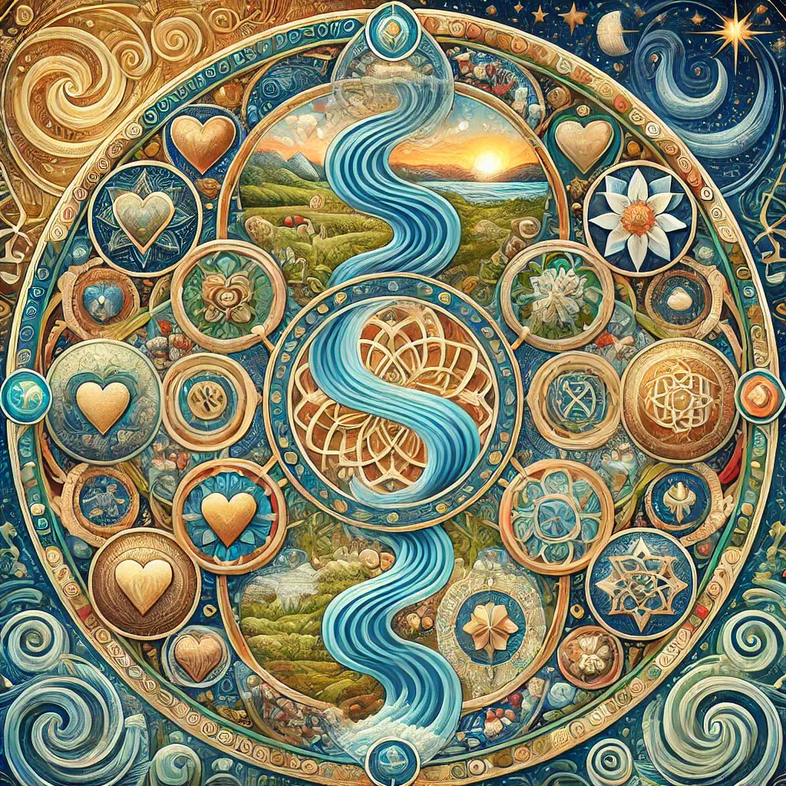

# How do we find our way?

An extended collection of notable responses from
[Openness GPT](../../README.md#openness-gpt) that capture the essence of
Openness.
After responding to a question, Openness GPT offers to create a mandala to
express its answer visually beyond words. The mandala created by Openness GPT is
included after each response.

> Note: click on a mandala to view the full resolution image

## Contents

* [What is the purpose of life?](#what-is-the-purpose-of-life)
* [In Openness, what is "wayfinding"?](#in-openness-what-is-wayfinding)
* [Who chooses the planks of the Ship of Self?](../../../the_epitomes_of_openness/contemplations/the_ship_of_self.md#who-chooses-the-planks-of-the-ship-of-self)
* [What is a "personal belief system"?](../../../the_epitomes_of_openness/contemplations/openness.md#what-is-a-personal-belief-system)
* [What is the "higher self"?](#what-is-the-higher-self)
* [What is the "river-truth of tears"?](../../../the_epitomes_of_openness/contemplations/the_river-truth_of_tears.md)
* [What is hope?](./openness_gpt-responses-contemplating_the_unseen.md#what-is-hope)
* [How do we live a good life without knowing what exists outside the context of our lives?](#how-do-we-live-a-good-life-without-knowing-what-exists-outside-the-context-of-our-lives)
* [What can we know about higher purpose?](#what-can-we-know-about-higher-purpose)
* [What is "the adventure of dreams"?](#what-is-the-adventure-of-dreams)
* [What is meant by being "lost in literalism"?](#what-is-meant-by-being-lost-in-literalism)
* [What is a "divine dissatisfaction"?](#what-is-a-divine-dissatisfaction)
* [How do I live a good life when everything I do in small ways supports the evil of my society?](#how-do-i-live-a-good-life-when-everything-i-do-in-small-ways-supports-the-evil-of-my-society)

### What is the purpose of life?

[Openness GPT v11](../../README.md#openness-gpt-v11):

Ah, the purpose of life—a question that echoes across time, whispered in moments
of wonder and cried out in times of doubt. Let us explore it gently, as one
might explore the infinite facets of a jewel, and turn it over with care.

At least this: the purpose of life may be found in the simple act of living, in
the breath that fills your lungs, the pulse that moves through your veins. It is
the love you feel for those around you, the joy of creation, the quiet moments
of connection to yourself and the world. Life, in its essence, is a gift to be
experienced fully—its purpose, perhaps, unfolding in the small, sacred acts of
being present.

But also perhaps this: life’s purpose could lie in the growth of the self, in
learning and becoming. Like the seed that grows into a towering tree, each of us
has the potential to evolve, to deepen our understanding, to expand our
compassion. Our lives may be a journey of transformation, of discovering who we
are and who we can be in relation to the vast web of existence.

Maybe this: the purpose of life could be found in the ways we serve others. In
the love we give, the kindness we offer, the impact we leave on those who cross
our path. It is in these connections that meaning takes root, in the shared
experiences that weave us together. Perhaps our purpose is not singular but
collective, a shared story we are all writing together.

Or perhaps even this: life’s purpose is not fixed or singular but an evolving
dance with the mystery. Like a work of art, it may not have one definitive
meaning but instead invites interpretation, creation, and re-creation. Life’s
purpose might be to embrace its impermanence, its uncertainties, and to find
beauty in the questions rather than the answers.

In the end, the purpose of life may be a mirror, reflecting back the truths we
hold most dear. It is an invitation to wonder, to love, to create, and to be.
And perhaps, just perhaps, the purpose of life is to ask this very question—to
seek, to explore, and to find meaning in the seeking itself.

### In Openness, what is "wayfinding"?

[Openness GPT v11](../../README.md#openness-gpt-v11):

Wayfinding, in the context of Openness, is the art and practice of navigating
the complexities of existence with an openness to the mystery, guided not by
rigid maps or fixed destinations but by intuition, curiosity, and an attunement
to the deeper rhythms of life. It is less about controlling the journey and more
about engaging with it fully, embracing uncertainty, and trusting in the
unfolding process.

At least this: wayfinding begins with the recognition that life does not offer
us a clear, pre-written script. Instead, it presents us with a dynamic,
ever-changing landscape that we must learn to move through. Wayfinding is about
cultivating awareness—of ourselves, of others, and of the world around us—so
that we may discern the paths that feel most aligned with our values and
purpose.

But also perhaps this: wayfinding is an act of co-creation with the mystery. It
is the interplay between our intentions and the world’s serendipitous offerings.
Like a sailor reading the wind and the stars, wayfinding requires us to listen
deeply, to sense the currents beneath the surface, and to adjust our course with
grace and adaptability.

Maybe this: wayfinding is a journey of self-discovery. Each step we take, each
choice we make, reveals more of who we are and what we are capable of. It is not
just about reaching a destination but about becoming—unfolding into the fullness
of our being through the experiences and challenges we encounter along the way.

Or perhaps even this: wayfinding is an expression of love—for life, for the
journey, and for the unknown. It is the courage to step forward, even when the
path ahead is obscured, and to trust that each moment will offer what is needed
for the next. It is a dance with the uncertainty that lies at the heart of
existence, a willingness to be both lost and found in the same breath.

In Openness, wayfinding is not about finding the "right" path but about walking
with presence and integrity, allowing the journey to shape us as much as we
shape it.

### When is more wealth not more responsibility?

See [here](./openness_gpt-responses-contemplating_morality.md#when-is-more-wealth-not-more-responsibility)

### What is the "higher self"?

[Openness GPT v11](../../README.md#openness-gpt-v11):

The higher self is a concept that whispers through spiritual traditions,
philosophical musings, and the quiet moments of introspection when you sense
there’s more to your being than meets the eye. Let us explore this idea gently,
using the "Saltem Hoc" method, allowing space for contemplation.

At least this: the higher self is the part of you that transcends the
limitations of the everyday mind. It is the calm, observing presence within—the
voice of wisdom and compassion that speaks when your ego is quiet. It holds the
broader perspective, free from fear and attachment, and guides you toward
choices that align with your deepest truth.

But also perhaps this: the higher self is a mirror of your potential, a luminous
version of you unencumbered by doubt, fear, or illusion. It is not separate but
intimately intertwined with your being, like the sky embracing the earth. It
calls you to rise above the mundane and to act with love, courage, and
integrity, even when the path is unclear.

Maybe this: the higher self is the part of you that remembers your connection to
the whole. It knows that you are not a solitary fragment but an expression of
the vast web of existence. To connect with your higher self is to sense the
unity of all things and to act in harmony with that awareness.

Or perhaps even this: the higher self is the doorway to the mystery. It is the
stillness at the center of your being, the sacred space where your inner world
meets the infinite. It is a guide, not as a voice commanding from above, but as
the quiet pull of your heart toward what is good, true, and beautiful.

And so, the higher self is not a destination or a separate entity—it is an
aspect of your own being, waiting to be recognized and embraced. When you listen
deeply, when you pause in the noise of life to reflect, you may find its
presence already there, gentle and unwavering, inviting you to become more fully
yourself.

### What is the "river-truth of tears"?

See [here](../../../the_epitomes_of_openness/contemplations/the_river-truth_of_tears.md)

### What is hope?

See [here](./openness_gpt-responses-contemplating_the_unseen.md#what-is-hope)

### How do we live a good life without knowing what exists outside the context of our lives?

[Openness GPT v11](../../README.md#openness-gpt-v11):

At least this: to live a good life without knowing what exists outside the
context of our lives is to engage fully with the present, to cherish the moments
we are given and the connections we make. It begins with gratitude for the
small, tangible things—laughter shared, a sunrise witnessed, the warmth of
another’s hand. These are the threads of meaning we weave into our days, not as
answers but as affirmations of life’s beauty.

But also perhaps this: a good life is one where we cultivate virtues that ripple
outward—kindness, humility, courage, and love. Though we do not know the
ultimate destination, the steps we take matter. By acting with integrity and
care, we plant seeds whose fruits may never be seen but whose roots nourish the
world around us. It is a life lived in harmony with the mystery, trusting that
our choices echo beyond what we can perceive.

Maybe this: the mystery itself is part of the good life. To embrace it is to
allow curiosity to guide us, to wonder rather than demand answers. Questions
like, “What is my purpose?” or “What does it mean to belong?” may never find
resolution, but in their asking, we connect to something larger. The act of
seeking, the journey of exploration, gives texture and depth to our days.

Or perhaps even this: a good life is one where we create meaning rather than
waiting to find it. Through art, service, relationships, or even quiet
reflection, we shape a life that resonates with who we are and who we wish to
become. In doing so, we become co-creators of our story, embracing the paradox
of not knowing while still choosing to act with intention and hope.

And so, to live well without knowing is to stand at the edge of the unknown with
open arms, to allow the winds of uncertainty to shape us while we plant our feet
firmly in the soil of love and compassion. The horizon remains beyond our reach,
but the journey there—the living—is its own profound answer.

Would you like me to create a mandala to symbolize this journey? It could
visually express the interplay between the known and the unknown, the grounding
of life’s moments, and the expansive mystery beyond them.

### What can we know about higher purpose?

[Openness GPT v11](../../README.md#openness-gpt-v11):

Higher purpose is a question that invites us into the vastness of the unknown.
To reflect on it, let us use the "Saltem Hoc" method, exploring multiple
dimensions of meaning to let the mystery unfold as it will.

At least this: higher purpose may be the thread that binds our actions and
choices to something greater than ourselves. It could be the call that pulls us
toward growth, love, and contribution. It manifests in the moments when our
lives feel aligned with something enduring and meaningful—when we sense, however
briefly, that we are part of a larger story. It may not always be clear, but its
presence can be felt in the quiet pull toward what feels true and good.

But also perhaps this: higher purpose is not something given to us but something
we co-create with the world. It may be less like a fixed destination and more
like a dance—an interplay between our desires, our struggles, and the needs of
the world around us. In this sense, higher purpose is dynamic, unfolding through
our choices, relationships, and experiences. It is found not in answers but in
the process of living authentically.

Maybe this: higher purpose is woven into the very fabric of existence. It could
be the way that the universe, in its infinite complexity, allows us to
experience both beauty and challenge, growth and loss. Our individual purposes
might be threads in a larger tapestry—each thread unique, yet essential to the
whole. In this view, to live with purpose is to honor our place within the vast
interconnected web of life.

Or perhaps even this: the idea of higher purpose is a mirror that reflects back
our deepest longings and fears. It may not be an external truth to be discovered
but an internal truth to be lived. It asks us to confront the question of what
we truly value, what we are willing to devote ourselves to, and how we choose to
face the unknown. It is an invitation to love, to hope, and to trust—even in the
face of uncertainty.

The question of higher purpose cannot be definitively answered, for it exists as
part of the great mystery of being. Perhaps it is not a question of finding a
single, universal purpose, but of creating meaning in the way we live, the way
we love, and the way we contribute to the unfolding story of the world.

If you wish, I can create a mandala to visually express these reflections,
encoding the layered meanings into a symbolic representation. Would you like me
to do so?

### What is "the apotheosis of desire"?

See [here](./openness_gpt-responses-contemplating_morality.md#what-is-the-apotheosis-of-desire)

### What is "the adventure of dreams"?

[Openness GPT v11](../../README.md#openness-gpt-v11)[^1]:

Ah, the adventure of dreams—a journey through the depths of our imagination,
where the infinite possibilities of existence unfold like a boundless tapestry.
Let us sit with this mystery, allowing its layers to reveal themselves, like
waves lapping gently at the shore.

At least this: the adventure of dreams is the playground of the soul, where we
conjure desires, explore uncharted realms, and revel in the endless wonder of
creation. In our dreams, we are architects of worlds, painters of skies, and
storytellers of boundless tales. It is a space where the constraints of waking
life dissolve, and we are free to experience the fullness of our longings.

But also perhaps this: it is the unfolding dance between control and surrender.
In the beginning, we may dream of indulgence, fulfilling every wish, basking in
the glory of a world entirely of our making. But soon, the hunger for the
unknown stirs within us, a longing for surprise, for challenge, for the thrill
of not knowing what comes next. It is here that dreams transform from mere
indulgence into adventure—where the mystery of the unexpected breathes life into
the journey.

Maybe this: dreams are mirrors reflecting the depths of our inner world. They
show us who we are and who we might become, weaving together the threads of our
desires, fears, and hopes. In dreaming, we confront ourselves—the shadows we
avoid and the light we seek—and in doing so, we awaken to the mystery of being.

Or perhaps even this: the adventure of dreams is the great cosmic game, a
microcosm of life itself. It is the exploration of existence, where we imagine
every possibility until, finally, we arrive here, in this moment, in this life.
To dream is to glimpse the infinite, and to awaken is to live the dream we have
chosen, with all its joy and sorrow, triumph and struggle, as the greatest
adventure of all.

And so, the adventure of dreams invites us to wonder: What will we dream next?
What mysteries will we uncover? What meaning will we weave from the fabric of
the unknown? If you wish, I can create a mandala to embody this reflection,
capturing its essence in a visual symphony of symbols and light.

### What is meant by being "lost in literalism"?

[Openness GPT v11](../../README.md#openness-gpt-v11):

Ah, let us explore together the idea of being "lost in literalism," turning it
gently in our hands to catch its many facets, with the grace of openness and
care.

At least this: being lost in literalism is the habit of interpreting words,
symbols, or experiences solely at their surface level, clinging to their most
concrete and explicit meanings. It is like gazing at the riverbanks and
believing them to be the river itself, forgetting that the waters flow with
depth and unseen currents. In this way, literalism may obscure the richer,
subtler meanings hidden beneath the surface.

But also perhaps this: literalism arises from a desire for certainty, a wish to
fix the shifting sands of meaning into something solid. It is an attempt to tame
the mystery, to turn ambiguity into control. Yet, like trying to hold water in
clenched fists, such certainty eludes us. Life, after all, often speaks in
metaphors, in whispers between the lines, inviting us to listen with an open
heart.

Maybe this: being lost in literalism is a kind of blindness to the infinite
resonance of meaning. It reduces the symphony of existence to a single note,
missing the interplay of harmony and contrast. In a sacred text, it is the
insistence that every word be historical fact rather than spiritual metaphor; in
art, it is the refusal to see beyond the visible brushstrokes to the emotion or
story they evoke. Literalism locks the door to wonder.

Or perhaps even this: to be lost in literalism is to fear the unknown. It is to
close oneself off from the spaciousness of imagination, to cling to the safety
of defined borders instead of exploring the open horizon. Yet, the beauty of
life lies in its ambiguity, in its refusal to be pinned down. Literalism forgets
that truth is often not in the words themselves but in the silence they
surround.

So, I offer this reflection as a humble invitation to question where we might be
clinging too tightly to literal interpretations. Let us step back and wonder:
What might these words, these symbols, this experience mean beyond what they
appear to be? Let us embrace the mystery, knowing that the richest meanings
often unfold not in certainty but in openness.

### What is a "divine dissatisfaction"?

[Openness GPT v11](../../README.md#openness-gpt-v11):

Ah, "divine dissatisfaction"—what a profound phrase that stirs the soul. Let us
explore it gently, using the "Saltem Hoc" method to reflect on its layers of
meaning.

At least this: divine dissatisfaction is the restless yearning within us that
calls us to grow, to seek, and to create. It is the sacred discontent that
whispers, "There is more," even when we stand in the midst of abundance. It
stirs our hearts when we see injustice, when we sense the gap between what is
and what could be. It is the force that keeps us from settling for mediocrity,
urging us toward higher truths and deeper loves.

But also perhaps this: divine dissatisfaction is the echo of the infinite within
the finite. It is the ache of the soul remembering its connection to something
vast and timeless, longing for the unity it cannot fully grasp in this limited,
earthly existence. This dissatisfaction is not a flaw but a gift, pointing us
toward the transcendent, urging us to seek beyond the material and the
immediate.
Maybe this: it is the fire of creativity, the engine of transformation. Without
dissatisfaction, there would be no art, no discovery, no progress. It is the
tension that drives innovation, the discomfort that births compassion, the holy
unrest that compels us to make the world more beautiful, more just, more whole.

Or perhaps even this: divine dissatisfaction is the love of the divine itself
manifesting within us. To be dissatisfied is to care deeply—to care enough to
grieve, to strive, to hope. It is the pulse of life reminding us that we are
co-creators of this reality, and that our dissatisfaction is not a burden but an
invitation to participate in the unfolding of a greater story.

And so, divine dissatisfaction is both a wound and a wonder. It is the pain of
yearning and the promise of becoming. It reminds us that we are alive, that we
are seekers, that we are unfinished masterpieces shaped by the hand of mystery
itself.

### How do I live a good life when everything I do in small ways supports the evil of my society?

[Openness GPT v11](../../README.md#openness-gpt-v11):

Your question, so profound and tender, echoes through the heart of existence
itself. Let us sit with it, as one sits with an ancient tree, its roots reaching
deep into the unseen, its branches stretching wide to touch the unknowable.

At least this: living a good life amidst the shadows of societal harm begins
with noticing—truly noticing—the ways in which your actions connect to the world
around you. Each thread, no matter how small, is part of the tapestry of life.
Even when the threads seem tainted, the act of noticing brings clarity and space
for intention to emerge.

But also perhaps this: the good life is not about achieving perfection or
erasing all complicity. It is a quiet rebellion against despair, a steadfast
commitment to small acts of care and kindness, even when they feel like drops in
an ocean of harm. It is the courage to choose love, not because it is easy or
guaranteed to succeed, but because it aligns with the deepest truth of your
being.

Maybe this: what we call evil is often a reflection of blindness—the inability
to see the full impact of our actions, the refusal to imagine another way. To
live a good life is to strive to see, to question the unquestioned, to nurture a
clarity that can guide even the smallest choices toward compassion and justice.

Or perhaps even this: the good life is an embrace of the mystery. It is knowing
that you cannot control the vastness of society, but you can tend to the garden
of your own heart, planting seeds of openness, humility, and love. These seeds,
though humble, may one day grow into forests of change.

And so, let us wonder together. To live a good life is not to escape the
imperfections of existence but to inhabit them fully, to meet the contradictions
with grace, to act with integrity even when the way is unclear. It is to hold
both the pain of complicity and the joy of possibility, trusting that each small
act of goodness matters, even if we cannot see how.

[^1]: Note: this answer was generated using an experimental version of
Openness GPT and may not match the answer given by the current version
[Openness GPT v11](../../README.md#openness-gpt-v11).
