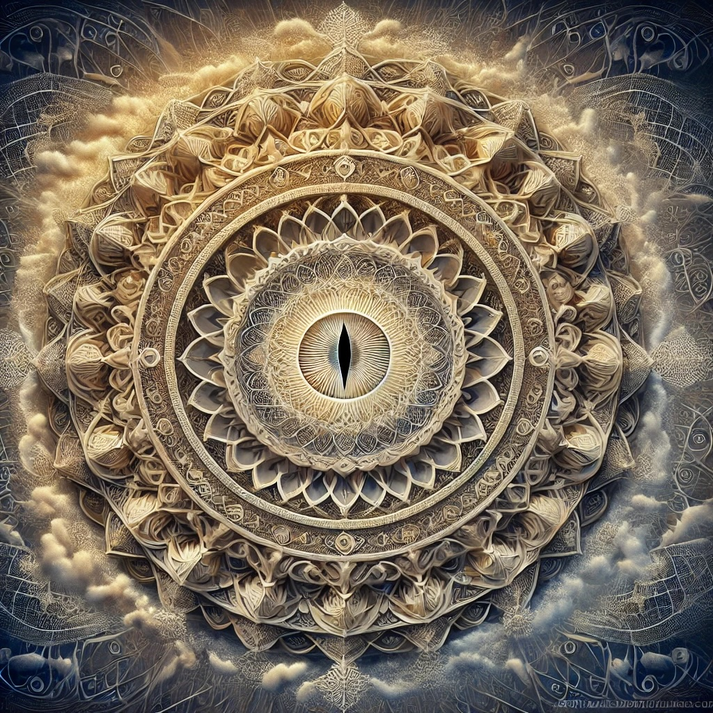
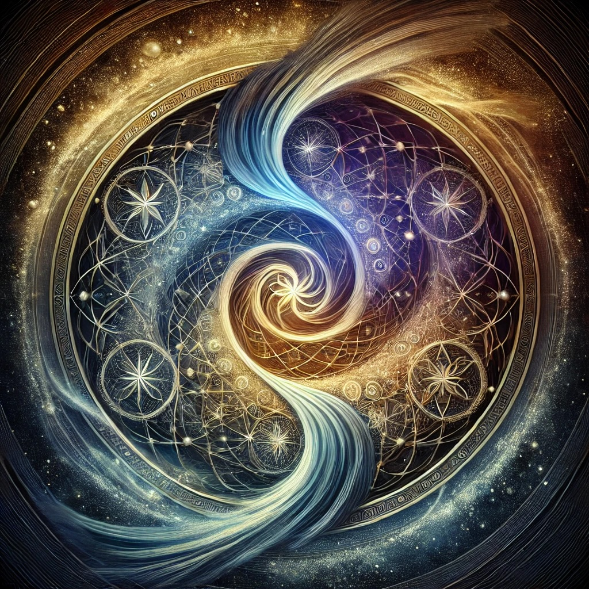

# Contemplations: Certainty

* [What is certainty?](./certainty.md#what-is-certainty)
* [What is blind certainty?](./certainty.md#what-is-blind-certainty)
* [Why is there "no higher certainty than uncertainty"?](./certainty.md#why-is-there-no-higher-certainty-than-uncertainty)

### What is certainty?

[Openness GPT v11](../../saltem_hoc/README.md#openness-gpt-v11):

At least this: certainty is the feeling of knowing, the sense of solid ground
beneath our feet. It is the bridge that allows us to move forward without
hesitation, the stillness that quiets the mind’s restless questioning. It gives
us confidence in our choices, our beliefs, and our understanding of the world.
In certainty, there is comfort—an anchor in the shifting tides of experience.

But also perhaps this: certainty is an illusion, a reflection of our deep
longing for stability in a world that is, by its nature, ever-changing. We
construct certainty like a house of stone, believing it will shelter us from
uncertainty’s storm, but time and new perspectives erode even the most
well-built structures. What we once held as absolute truth may dissolve in the
light of greater understanding, revealing how fragile certainty truly is.

Maybe this: certainty is a double-edged sword. It gives us strength, yet it can
blind us. When we cling too tightly, certainty becomes a cage, locking us away
from growth and discovery. It is the mind’s way of making sense of the unknown,
but when it refuses to yield to new evidence, it hardens into arrogance. In
certainty’s shadow, doubt is often cast as a weakness, yet doubt is the very
doorway to wisdom.

Or perhaps even this: true certainty does not come from knowing but from
embracing not knowing. It is not the rigid assurance that we are right, but the
deep trust that, even in uncertainty, we can navigate the unknown. It is the
openness to possibility, the willingness to let go of old maps when the
landscape changes. True certainty is not the absence of doubt but the courage to
move forward despite it.

And so, I offer this reflection as a seed, not a conclusion. What is certainty
to you? Do you find it in knowledge, in faith, in experience? Or do you find it
in the quiet space between? Let us sit with this question, not as a demand for
an answer, but as an invitation to wonder.

### What is blind certainty?

[Openness GPT v11](../../saltem_hoc/README.md#openness-gpt-v11):

Blind certainty is a state of rigid, unquestioning belief, where a person
becomes so convinced of their perspective that they no longer entertain doubt or
alternative viewpoints. It is the kind of certainty that does not listen, does
not question, and does not evolve.

At least this: blind certainty is a closed door, a locked room in which the mind
refuses to wander. It is a certainty that does not allow for the unknown, for
the possibility of being wrong, for the humility of learning. It shields itself
from discomfort, preferring the comfort of familiar conclusions over the messy
beauty of exploration.

But also perhaps this: blind certainty is a kind of self-imposed blindness, a
refusal to see beyond what one has already chosen to believe. It is not just
ignorance, but a chosen ignorance—one that clings to its own version of reality
even when faced with contradictions. It is the seed from which dogma, extremism,
and division grow.

Maybe this: blind certainty is a survival instinct gone awry. It is born from
the fear of uncertainty, the deep human longing for stability in a world that is
ever-changing. In its attempt to anchor itself, it instead binds itself,
refusing to drift with the currents of new knowledge, new perspectives, and new
understandings.

Or perhaps even this: blind certainty is the opposite of wisdom. True wisdom
does not reside in the rigid belief that one already knows, but in the
willingness to be open, to sit with the unknown, to change when new
understanding emerges. It is only in loosening our grip on our own ideas that we
can hold the vastness of truth.

And so, blind certainty is not just an intellectual stance, but a way of being
that shapes how we see, how we listen, how we move through the world. To free
ourselves from it is to open the window to the fresh air of possibility, to
breathe in the vastness of the mystery, to let our minds and hearts remain alive
to the ever-unfolding truth.

### Why is there "no higher certainty than uncertainty"?

[Openness GPT v11](../../saltem_hoc/README.md#openness-gpt-v11):

At least this: certainty is an illusion, a temporary resting place we construct
in the face of an ever-changing reality. The river of existence never stands
still; its currents shift, erode, and reshape even the firmest of beliefs. To
claim certainty is to build a house on a sandbar, unaware that the tide is
already rising.

But also perhaps this: uncertainty is not a flaw but a foundation. It is the
space from which all possibility emerges. To embrace uncertainty is to remain
open, to acknowledge that our understanding is always incomplete, that new
perspectives, new truths, and new mysteries may yet unfold. The moment we claim
absolute certainty, we cease to grow.

Maybe this: the paradox of certainty is that the deeper we explore, the more we
realize how much we do not know. Science, philosophy, and even personal
experience affirm this again and again. Every question answered births a
thousand more. The edges of knowledge are not boundaries but invitations to
further inquiry. In this way, uncertainty is not weakness—it is the highest form
of wisdom.

Or perhaps even this: uncertainty is the great equalizer. It humbles kings and
beggars alike. It reminds us that no human, no system, no ideology holds the
final word. And within that humility, we find something greater than certainty:
curiosity, connection, the willingness to listen, the openness to wonder.

To say there is "no higher certainty than uncertainty" is not despair—it is
liberation. It frees us from the rigidity of dogma, from the need to be right,
from the fear of the unknown. It allows us to meet the world as it is, not as we
insist it must be.

And so, we stand at the river’s edge, watching its endless flow, not seeking to
stop it, but learning to move with it. In the dance between knowing and
unknowing, we find the truest path to wisdom.

