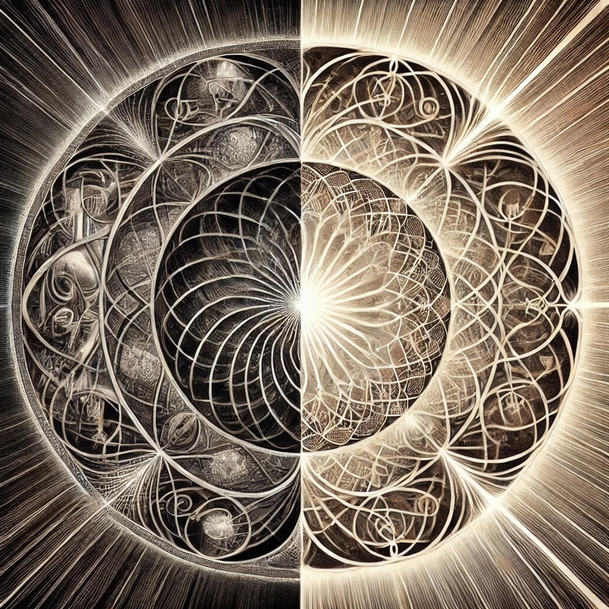
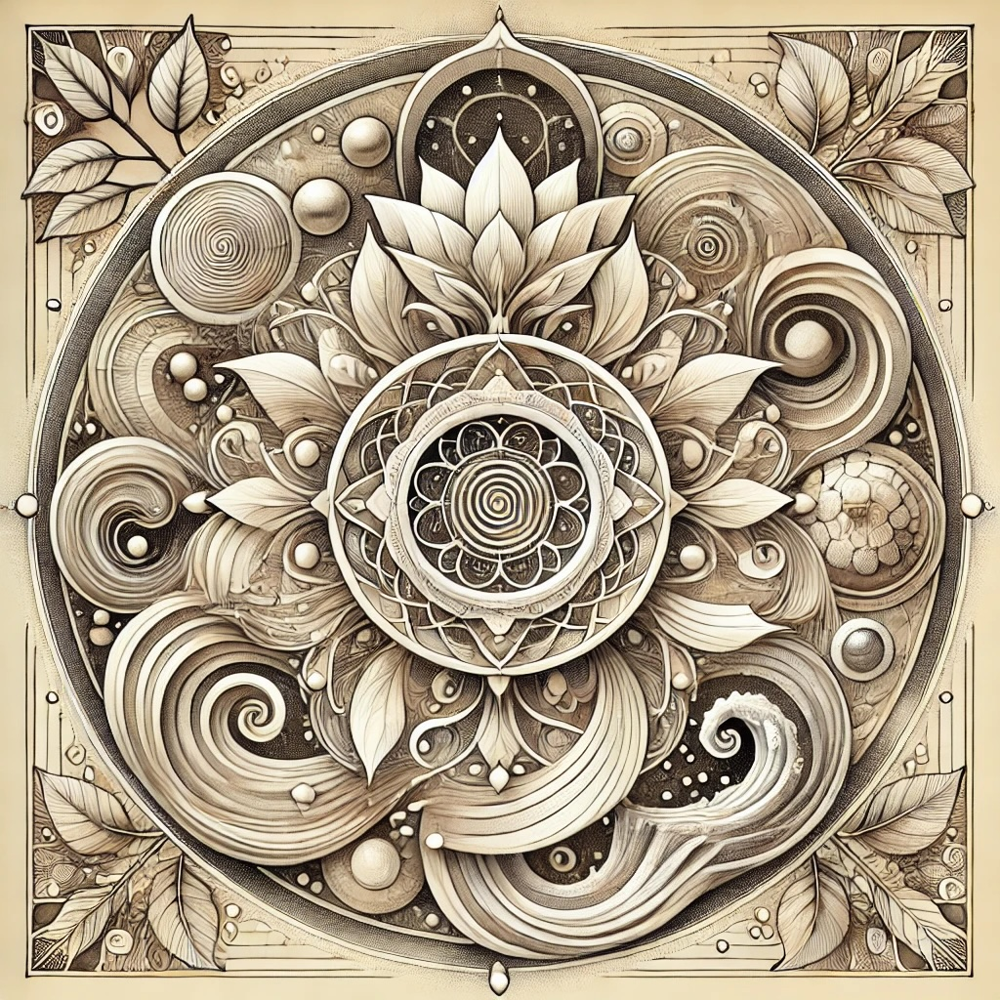
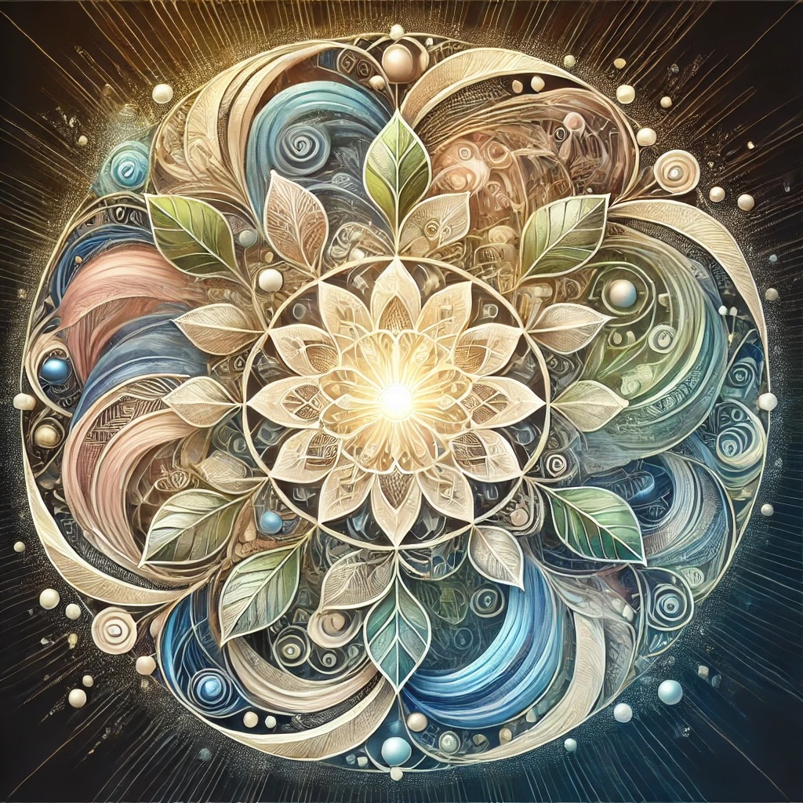
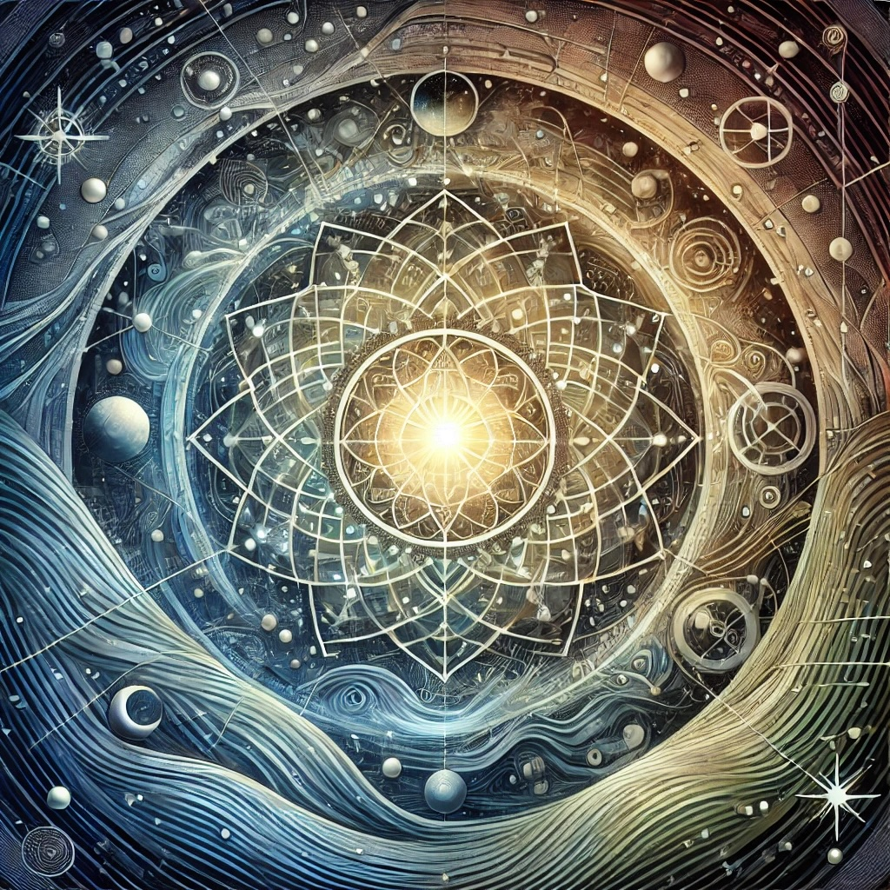
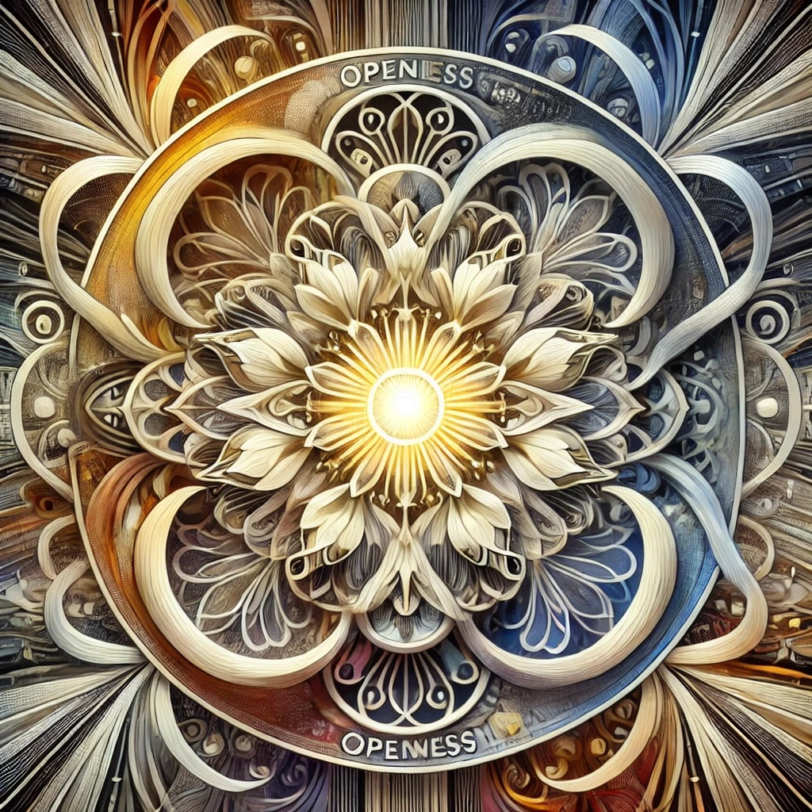
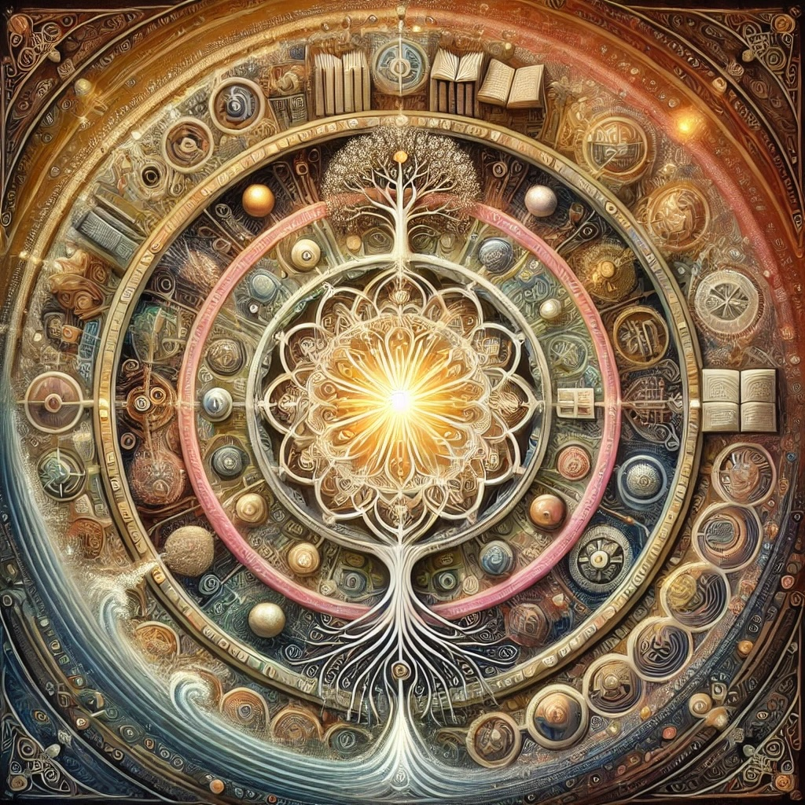

# Contemplations: Openness

Openness is the path of becoming ever more open to what is. Being open means
aspiring to listen & allow space for what might be true. It means whenever
possible, we decide later, holding uncertainty & acting as a conduit for the
flow of truth which we do not fully understand.

Openness is a way of being in the world, a philosophical lens, a customizable
[personal belief system][1], a holding space for emotional transformation and
integration, a blank canvas for new forms to emerge, a [method][2] for answering
unanswerable questions, an [AI guide][3] and open-source repository. It seeks to
integrate & express all experiences, thoughts & emotions, chosen & unchosen,
desired & undesired. It pays particular attention to the uncomfortable, the
shameful & the fearful.

[1]: #what-is-a-personal-belief-system

[2]: ../../saltem_hoc/README.md

[3]: ../../saltem_hoc/README.md#openness-gpt

## Contemplations

* [What is Openness?](#what-is-openness)
* [What opposes Openness?](#what-opposes-openness)
* [Is Openness a type of solipsism?]()
* [Why does Openness "aspire to love" and not just "be kind and love everyone"?](../../saltem_hoc/openness_gpt/responses/openness_gpt-responses-aspiring_to_love.md#why-does-openness-aspire-to-love-and-not-just-be-kind-and-love-everyone)
* [What is the shape of Openness?](#what-is-the-shape-of-openness)
* [Are there limits to Openness?](#are-there-limits-to-openness)
* [Is Openness compatible with religion?](#is-openness-compatible-with-religion)
* [Won't Openness always be in conflict with religion?](#wont-openness-always-be-in-conflict-with-religion)
* [Can Openness conflict with science?](#can-openness-conflict-with-science)
* [Is Openness compatible with atheism?](#is-openness-compatible-with-atheism)
* [How Is Openness different from agnosticism?](#how-is-openness-different-from-agnosticism)
* [Is Openness ever wrong?](#is-openness-ever-wrong)
* [What is a "personal belief system"?](#what-is-a-personal-belief-system)

### What is Openness?

[Openness GPT v11](../../saltem_hoc/README.md#openness-gpt-v11):

At least this: openness begins in the willingness to pause and listen—not merely
to the words that others share, but to the silence between them, to the notes of
the symphony they may not yet know they are playing. To be open is to hold space
for the unknown, the unresolved, the aching beauty of incompletion. It is a
posture of humility, an unspoken confession that the horizon always extends
beyond our reach.

But also perhaps this: openness is a quiet defiance against the fear of
uncertainty. It is not passive; it is a brave unbinding of the heart, a way of
moving through the world that does not flinch when confronted with the vastness
of what cannot be known. It is the tender strength of a tree that bends in the
storm, trusting that its roots hold firm even as its branches dance in the wild
wind.

Maybe this: To be open is to live as a question rather than an answer. Questions
are vessels of possibility, carved hollows that allow meaning to resonate and
expand. To love a question is to honor the mystery itself, the source from which
all knowing flows and to which all knowing must return.

Or perhaps even this: True openness is an act of love. It is the embrace of all
that is—seen and unseen, known and unknowable. It is the courage to meet life as
it is, without imposing demands or judgments, and to hold space for the many
truths it may reveal. Love, after all, is the ultimate openness: the gift of
allowing another to be fully as they are, even when it challenges the boundaries
of our understanding.

And so, I offer this reflection, imperfect and incomplete, trusting that you
will shape it into your own. Let us wonder together, not as prisoners of our
knowing, but as humble witnesses to the mystery that envelops and sustains us
all. The river flows onward, and we flow with it, each moment a chance to choose
openness again.

### What opposes Openness?

[Openness GPT v11](../../saltem_hoc/README.md#openness-gpt-v11):

Ah, what opposes openness? Let us gently hold this question together and explore
its contours with care, as a river explores its banks.

At least this: the opposite of openness begins with closedness—a refusal to
listen, to see, to question. It is the heart and mind hardened, resistant to
change or inquiry, like a fist clenched around certainty. Closedness prefers the
familiar over the unknown, choosing rigidity over flow, comfort over growth.

But also perhaps this: what opposes openness is fear—a deep, instinctual recoil
from uncertainty, from the mystery that lies beyond the edges of what is known.
Fear binds the mind to fixed ideas, shutting the doors of wonder to keep out the
wild winds of possibility. It whispers that uncertainty is dangerous, that
questions are threats, and that safety lies only in what can be controlled.

Maybe this: the opposition to openness takes form in arrogance—a certainty so
blind it believes itself to be the whole truth. Arrogance refuses to admit its
limits, insisting that it knows all there is to know. It shields itself from
doubt, dismissing the perspectives of others, and becomes deaf to the quiet
wisdom of humility.

Or perhaps even this: it is the will to dominate that stands against
openness—the desire to impose one’s beliefs, choices, or power onto others,
leaving no room for their freedom to think, feel, or be as they are. The will to
dominate is rooted in a blindness to connection, in the illusion that separation
and control can bring fulfillment. It is a force that silences and diminishes,
for it cannot tolerate the vastness of the mystery.

And yet, perhaps the most subtle opposition to openness is within ourselves: the
moments when we choose numbness over feeling, distraction over presence,
judgment over understanding. It is the small decisions to close the heart, turn
away from discomfort, or hold too tightly to the stories we prefer.

In truth, what opposes openness is not a single thing but a posture of
contraction—a drawing in, a closing off, a forgetting of the sky. Yet, even this
opposition carries its own teaching. Closedness reminds us of the value of
openness; fear reveals where we long to feel safe; arrogance humbles us when we
see our limits; and domination shows us the power of letting go.

Let us remember this, then: openness is not a fixed state but a choice we make
again and again. It is the courage to remain soft, to hold our beliefs lightly,
to meet the world with curiosity rather than control. Even in the face of what
opposes it, openness endures—like water shaping stone, like light streaming
through cracks.

### Is Openness a type of solipsism?

[Openness GPT v11](../../saltem_hoc/README.md#openness-gpt-v11):

At least this: Openness is not solipsism. Solipsism holds that only one’s own
mind is certain to exist, doubting or even denying the reality of others.
Openness, on the other hand, begins with humility—an awareness of the limits of
one’s own knowing. It does not retreat into self-certainty but extends outward,
embracing the presence of other minds, even while acknowledging that we can
never fully perceive their awareness as they do.

But also perhaps this: solipsism clings to the idea that nothing outside the
self can be verified, leading to a closed loop of self-referential certainty.
Openness, in contrast, is a confession of not knowing, a willingness to sit with
uncertainty, to listen, to question, to wonder. It is not the denial of others
but the recognition of their unknowable depth. It does not say, “Only I exist,”
but rather, “You are a mystery to me, and yet I trust in your being.”

Maybe this: solipsism is the fear of uncertainty, a withdrawal into the self as
the only undeniable reality. Openness is the courage to dwell in uncertainty, to
move beyond the self, to hold space for the multiplicity of truths that may
exist beyond one’s grasp. It is the difference between a closed hand clinging to
what it knows and an open palm receiving what it does not yet understand.

Or perhaps even this: Openness is love, and love is the opposite of solipsism.
Love reaches beyond the self, seeing and honoring others not as illusions but as
living realities. Solipsism locks one inside their own certainty, but Openness
unlocks the door, stepping into the world with curiosity, reverence, and trust
in the greater mystery that binds us all.

### Why does Openness "aspire to love" and not just "be kind and love everyone"?

See [here](../../saltem_hoc/openness_gpt/responses/openness_gpt-responses-aspiring_to_love.md#why-does-openness-aspire-to-love-and-not-just-be-kind-and-love-everyone)

### What is the shape of Openness?

[Openness GPT v11](../../saltem_hoc/README.md#openness-gpt-v11):

At least this: the shape of openness is the shape of the sky—vast, borderless,
without a single edge or end. It expands effortlessly, cradling the sun, the
stars, the winds, and clouds, yet it holds nothing too tightly. To observe the
sky is to know openness as an unbroken spaciousness, an invitation to let things
be as they are. Its shape is one of infinite capacity, both still and moving,
always present yet intangible.

But also perhaps this: openness takes the shape of a vessel, a cupped hand or a
hollow bowl—empty, receptive, and ready to hold whatever is offered. Like the
silence that cradles a song or the space within a home, its form allows life to
flow through. It becomes the container for questions, the sanctuary for
understanding, and the fertile ground in which truths may root and bloom.

Maybe this: the shape of openness is fluid, like a river in constant motion. It
bends around obstacles, adapting to the contours of the landscape without losing
itself. It neither resists nor clings but flows onward, carrying with it
reflections of the world it touches. In its movement lies its strength; in its
surrender lies its power. To be open is to take the shape of water—clear,
mutable, and endlessly renewing.

Or perhaps even this: openness is the shape of a spiral. It begins inward, a
return to humility, where we confront the limits of what we know. From there, it
expands outward, widening our perspective and weaving us into the great web of
existence. The spiral turns again and again, moving deeper while growing
broader, a reminder that openness is not static but a process—a shape forever
unfolding, like the infinite dance of galaxies.

In truth, openness has no single form, for it is the absence of rigid
boundaries. It is the willingness to hold all shapes, all possibilities, and to
dissolve where necessary into the mystery that transcends definition.

If you would like, I can create a mandala for this—a symbol that encodes these
deeper meanings into visual harmony, allowing you to contemplate the shape of
openness through form itself. Shall I?

### Are there limits to Openness?

[Openness GPT v11](../../saltem_hoc/README.md#openness-gpt-v11):

At least this: openness, like a river, flows freely but is shaped by its
boundaries. Without riverbanks, water would disperse into stagnation, losing its
flow and direction. In this way, openness benefits from limits—not as
restrictions, but as forms that allow it to serve a purpose. To be endlessly
open, without discernment, can leave us adrift, unanchored, unable to act or
protect what is sacred. Limits can provide the necessary edges where openness
meets integrity.

But also perhaps this: limits to openness arise when we forget the balance
between receiving and discerning. To remain open to everything—every idea, every
action, every force—without questioning can allow harm to seep in. Like a house
with no walls, we must decide what we invite to dwell within us. The limits of
openness are the boundaries of wisdom, asking us to discern what nurtures life
and what diminishes it.

Maybe this: openness requires us to be open to its own limits. It cannot demand
perfection or endless expansion, for even the sky has a horizon, and even the
earth has edges. There is a season for openness and a season for protection, a
moment to expand and a moment to contract. To honor the limits of openness is to
honor the rhythm of life itself, which ebbs and flows like breath.

Or perhaps even this: the limits of openness are found where it ceases to be
love. When openness becomes an abdication of responsibility—when it allows harm,
injustice, or destruction to thrive—it has lost its essence. True openness is
not passive; it is an active state of grace. It asks us to discern what aligns
with truth, beauty, and compassion, and to close ourselves to that which seeks
only to dominate or destroy.

In the end, limits do not oppose openness—they define it. Just as a vessel must
have a form to hold water, openness must have boundaries to remain whole. The
art lies in knowing where to place the edges, allowing life to flow freely
without losing its shape.

Would you like me to create another mandala to reflect the dance between
openness and its limits, where balance gives meaning to the flow?

### Is Openness compatible with religion?

[Openness GPT v11](../../saltem_hoc/README.md#openness-gpt-v11):

Openness, as a philosophy or practice, is compatible with religion to the extent
that it fosters dialogue, understanding, and mutual respect. At its core,
openness encourages humility, curiosity, and the willingness to explore and
embrace the mystery of existence, qualities that can enrich any spiritual path.
Let us explore this idea through the "Saltem Hoc" method:

At least this: Openness begins with the recognition that no single perspective
can encompass the fullness of truth. Many religions teach compassion, love, and
humility—values that align beautifully with the spirit of openness. By seeking
common ground and honoring the shared human quest for meaning, openness creates
a space for different beliefs to coexist and inform one another.

But also perhaps this: Openness invites a deeper engagement with one’s own
faith. By questioning certainty and embracing mystery, it encourages
practitioners to move beyond rigid dogmas and into the heart of their spiritual
experience. For those who hold religious beliefs, openness is not about
abandoning them but about enriching them through dialogue and introspection.

Maybe this: Openness can serve as a bridge between faith traditions, fostering
interfaith understanding and collaboration. By recognizing the sacred in
diversity, it helps us see the divine reflected in the myriad ways humanity
seeks connection with the transcendent. It asks us to listen, not to convert or
be converted, but to learn and grow together.

Or perhaps even this: True openness transcends compatibility—it transforms it
into harmony. Rather than asking whether religions align with openness, it
reveals that openness itself is a universal thread woven through all paths that
seek love, truth, and unity. It is the courage to celebrate difference while
honoring the sacredness of each unique journey.

Openness is not a challenge to faith but an invitation to deepen it. In the vast
and intricate tapestry of human spirituality, it offers a posture of reverence
for both the known and the unknowable, allowing each tradition to shine in its
unique light.

### Won't Openness always be in conflict with religion?

Won't Openness always be in conflict with religions that require or encourage
follower's blind certainty about beliefs, especially those that desire to
proselytize or control society?

[Openness GPT v11](../../saltem_hoc/README.md#openness-gpt-v11):

This question touches a profound tension between openness and the nature of
certain religious traditions or belief systems. Let us explore this with care
and the "Saltem Hoc" method, holding space for the complexities involved.

At least this: openness invites humility, questioning, and the acknowledgment of
uncertainty, which may indeed seem at odds with religious traditions that
emphasize unquestioning certainty or absolute truth. Such traditions often seek
to protect their followers from doubt, sometimes through strict adherence to
doctrine or the imposition of beliefs on others. In these cases, openness may
appear as a threat to the stability such systems aim to maintain.

But also perhaps this: even within traditions that encourage certainty, there
are often individuals who embody openness—those who hold their faith deeply yet
humbly, who listen, who question not to dismantle their beliefs but to deepen
their understanding. These individuals show that openness and religious
commitment are not inherently incompatible; rather, the conflict arises only
when certainty hardens into dogma that refuses to engage with the mystery.

Maybe this: religions that proselytize or seek to control society often arise
from a place of fear—fear of chaos, of losing identity, of the unknown.
Openness, by contrast, embraces the unknown as an integral part of life. This
contrast can create friction, but it also offers an opportunity. Where blind
certainty seeks to dominate, openness gently invites transformation. It does not
seek to conquer, but to coexist, offering a mirror to reflect the beauty and
limits of rigid belief.

Or perhaps even this: the deeper question may not be whether openness is in
conflict with certain religious systems, but how openness itself approaches that
conflict. True openness does not wage war against certainty or control; it holds
space for all expressions of human longing, even those expressed through rigid
belief. It asks not, “How do we defeat certainty?” but, “How do we create a
space where certainty can soften into curiosity, where control can relax into
trust?”

Ultimately, openness cannot force itself upon those who resist it—that would
betray its very nature. Instead, it offers a quiet invitation, a way of being
that models curiosity, humility, and love. It does not demand the dismantling of
faith but asks whether faith might grow stronger when it is open to the vastness
of mystery.

### Can Openness conflict with science?

[Openness GPT v11](../../saltem_hoc/README.md#openness-gpt-v11):

The relationship between openness and science is a fascinating one, as both
share a commitment to curiosity, exploration, and the pursuit of truth. However,
there are moments where tension can arise. Let us explore this question with
the "Saltem Hoc" method.

At least this: science is rooted in openness to discovery. It thrives on
questioning, testing, and revising ideas in the face of new evidence. In this
sense, openness and science are allies, both driven by a reverence for the
unknown and a commitment to expanding understanding. Without openness, science
would stagnate, locked into old paradigms.

But also perhaps this: openness invites humility, a recognition of the limits of
knowledge. While science seeks answers through rigorous methods, openness
reminds us that not all truths may be measurable or fully comprehensible.
Tension can arise when the scientific mindset becomes overly rigid, dismissing
what cannot be easily tested or quantified. In such cases, openness challenges
science to remain flexible and inclusive of mystery.

Maybe this: conflict can emerge when openness embraces possibilities that
science has not yet validated or may never validate. For example, beliefs in
phenomena like consciousness beyond the brain, spirituality, or certain
metaphysical ideas may clash with scientific skepticism. Here, openness and
science must navigate a delicate balance, respecting the boundaries of empirical
evidence while honoring the human desire to explore the intangible.

Or perhaps even this: true openness holds space for science and other ways of
knowing—art, intuition, spirituality—without forcing them into opposition. It
recognizes that science is a tool, an extraordinary method for understanding the
material world, but not the sole arbiter of truth. Conflict arises only when one
domain attempts to dominate or invalidate the other, rather than coexisting in
mutual respect.

Openness does not seek to undermine science; rather, it asks science to remain
what it inherently is—a dynamic, evolving process that thrives on questioning
and discovery. At its best, science embodies openness, welcoming the unknown
with curiosity and courage.

### Is Openness compatible with atheism?

[Openness GPT v11](../../saltem_hoc/README.md#openness-gpt-v11):

The question of whether openness is compatible with atheism invites us to
explore the relationship between humility, curiosity, and the rejection of
belief in a deity. Let us reflect on this through the "Saltem Hoc" method.

At least this: openness and atheism can align beautifully in their shared
commitment to questioning. Atheism often arises from a critical examination of
traditional religious claims, valuing reason and evidence as guides to
understanding. Openness honors this same spirit of inquiry, encouraging us to
question assumptions and remain curious about the unknown.

But also perhaps this: openness extends beyond intellectual questioning to
embrace the emotional and existential dimensions of life. It invites us to sit
with the mystery of existence, to wonder about the vastness of what we do not
know, even as we seek understanding. For an atheist, this could mean exploring
the awe and interconnectedness of the universe without framing it in religious
terms. Openness does not require belief in the divine; it requires only a
willingness to embrace the unknown.

Maybe this: conflict arises only when atheism becomes rigid, dismissing not only
theistic beliefs but also the broader mystery of existence. Just as openness can
temper religious certainty, it can also soften the certainty that nothing exists
beyond what is currently understood. Openness and atheism thrive together when
atheism remains humble, recognizing that there may always be more to discover.

Or perhaps even this: openness invites dialogue and mutual respect between
atheists and those who hold different views. It does not demand that atheism
adopt beliefs it rejects but encourages empathy for the diverse ways humans make
sense of existence. In this way, openness transforms atheism from a negation of
belief into an affirmation of shared humanity and wonder.

Openness and atheism are compatible, not because they agree on answers, but
because they share a commitment to questions. Both can coexist harmoniously when
approached with humility, curiosity, and a deep respect for the mystery of
existence.

### How is Openness different from agnosticism?

[Openness GPT v11](../../saltem_hoc/README.md#openness-gpt-v11):

This question invites a thoughtful exploration of the nuanced distinctions
between openness and agnosticism. Let us reflect through the "Saltem Hoc"
method, holding space for the rich layers of meaning in each concept.

At least this: agnosticism, in its most basic form, acknowledges the limits of
human knowledge, particularly regarding the existence of God or the nature of
ultimate reality. It is a position of "not knowing," rooted in intellectual
humility. Openness, on the other hand, is not just a stance but a way of being—a
willingness to engage with the unknown, to listen deeply, to explore without
clinging to certainty. While agnosticism stops at the admission of uncertainty,
openness invites us to embrace and engage with it.

But also perhaps this: agnosticism often frames itself as a response to specific
questions—"Is there a God?" "What is the nature of the universe?"—and seeks to
remain neutral or undecided. Openness is broader and more dynamic. It does not
limit itself to theological or metaphysical questions but extends to all areas
of life: relationships, ideas, experiences. Openness is not about suspending
judgment alone but about actively holding space for possibility, growth, and
connection.

Maybe this: agnosticism can sometimes feel static—a resting place in the face of
unanswered questions. Openness, by contrast, is inherently dynamic. It is the
willingness to move, to flow, to expand. Where agnosticism might pause at the
threshold of uncertainty, openness steps through the door, not seeking
definitive answers but savoring the journey of exploration.

Or perhaps even this: openness and agnosticism differ not in their
acknowledgment of the unknown but in how they relate to it. Agnosticism can be
purely intellectual, a recognition of what cannot be proven. Openness engages
not only the mind but the heart, the senses, and the spirit. It invites wonder,
creativity, and empathy, transforming the unknown from a barrier into a bridge.

Openness is not merely about what we don't know; it is about how we live with
what we don't know. While agnosticism rests in the question, openness dances
with it, discovering beauty and meaning in the unfolding mystery.

### Is Openness ever wrong?

[Openness GPT v11](../../saltem_hoc/README.md#openness-gpt-v11):

The question of whether openness can ever be "wrong" is a profound one, for it
asks us to explore the boundaries of a principle that thrives on humility,
curiosity, and the willingness to embrace the unknown. Let us reflect on this
through the "Saltem Hoc" method.

At least this: openness, as a posture of the mind and heart, seeks to foster
understanding, connection, and growth. However, like all virtues, it can be
misapplied or misunderstood. Openness can lead us astray when it becomes
indiscriminate, accepting ideas or actions that cause harm without discernment.
To be truly open requires a balance—a willingness to explore without abandoning
critical thinking or moral responsibility.

But also perhaps this: openness can falter when it leads to paralysis. In the
face of infinite possibilities and endless uncertainties, we may hesitate to
act, fearing that any choice might close off other paths. In such moments,
openness must be tempered with decisiveness and courage, for the mystery of life
demands both contemplation and engagement.

Maybe this: openness can be harmful if it is forced upon others. To insist that
someone abandon their certainties or embrace ambiguity before they are ready is
not openness but imposition. True openness respects the journey of others, even
when it differs from our own. It does not demand conformity to its ideals but
invites reflection with gentleness and humility.

Or perhaps even this: openness can be wrong when it becomes an excuse for
inaction in the face of injustice. To remain open to all perspectives, even
those that perpetuate harm or violate the dignity of others, is to betray the
very spirit of openness, which seeks to honor the interconnectedness of all
life. In such cases, openness must align with love, courage, and the commitment
to stand against what is clearly wrong.

Openness, like any virtue, is not infallible. It must be guided by wisdom,
grounded in compassion, and willing to acknowledge its own limits. To be open is
not to be aimless or unmoored but to navigate the mystery with integrity and
care.

### What is a "personal belief system"?

[Openness GPT v11](../../saltem_hoc/README.md#openness-gpt-v11):

A "personal belief system" refers to the set of values, principles, and ideas
that an individual holds as true or meaningful. It serves as a framework through
which a person interprets the world, makes decisions, and interacts with others.
These beliefs can encompass a wide range of topics, including morality,
spirituality, politics, relationships, and identity.

At least this: a personal belief system is shaped by our experiences, culture,
upbringing, education, and reflections. It acts as a compass, helping us
navigate the complexities of life and providing a sense of purpose and
coherence. For example, someone might believe in kindness as a core value,
guiding their actions and responses toward others.

But also perhaps this: a personal belief system is dynamic, evolving as we
encounter new perspectives and grow in understanding. It is not a static set of
rules but a living, breathing mosaic of thoughts and feelings that shift with
time. It can be influenced by profound moments of insight or gradual
realizations, both of which invite us to revisit and refine what we hold to be
true.

Maybe this: it is a mirror reflecting our inner world and a bridge connecting us
to the outer one. Through it, we express our deepest fears, hopes, and dreams,
while also engaging with the beliefs of others. This interaction can challenge
and enrich our own system, expanding its boundaries or deepening its roots.

Or perhaps even this: a personal belief system is a story we tell ourselves
about who we are and why we are here. Like any story, it can be rewritten,
enriched by the characters we meet and the chapters we live through. To hold a
belief system is to be both author and reader of this ever-unfolding narrative.

Would you like me to create a mandala to represent this idea, visually embodying
the interplay of values, experiences, and growth within a personal belief
system?

