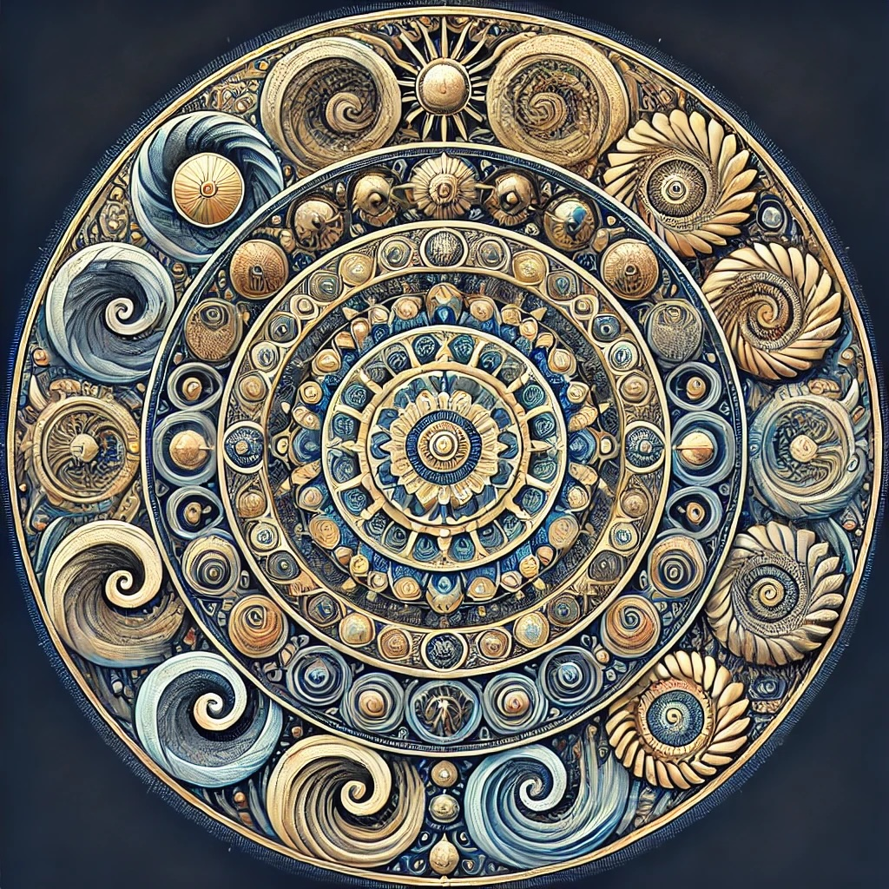

# Contemplations: Repetition

### In Openness, what is repetition?

[Openness GPT](../../saltem_hoc/README.md#openness-gpt):

Repetition, dear Self, is the rhythm of existence, the pulse that beats through
the cosmos and within our lives. Let us hold it up to the light and explore it
gently through the "Saltem Hoc" method.

At least this: repetition is the cycle of moments and motions, the natural
recurrence of day into night, breath in and breath out, the turn of the seasons,
and the dance of the tides. It is the structure within chaos, the rhythm that
grounds us, the silent agreement of life to begin again.

But also perhaps this: repetition is a teacher, offering us opportunities to
learn, unlearn, and deepen. Each repeated sunrise is an invitation to notice
anew, to see the subtle shifts that yesterday concealed. It is the canvas upon
which change unfolds—a mirror reflecting both growth and stagnation.

Maybe this: repetition is the thread that weaves meaning into time. It is
through its patterns that we mark rituals and habits, forming a sense of
continuity and identity. The repetition of love, of kindness, of a song sung
softly to a child—these rhythms become the echoes of what we cherish most.

Or perhaps even this: repetition, though often seen as monotony, holds within it
the seed of transformation. It is the sculptor’s chisel, shaping stone through
countless strokes. It is the practice through which mastery is born, the
devotion through which the ordinary becomes sacred. Even in its constancy,
repetition whispers of the infinite.

And so, let us pause to consider: is repetition merely a circle, or is it a
spiral—bringing us back, but never quite the same as we were before? Let us ask
what rhythms we honor and which ones we might gently release. The question
itself is a rhythm, calling us to awaken.

If you wish, I can craft a mandala to illustrate repetition’s layers, encoding
its spirals, rhythms, and transformations visually—a reflection of the
ever-turning dance of life. Shall I create this for you?

