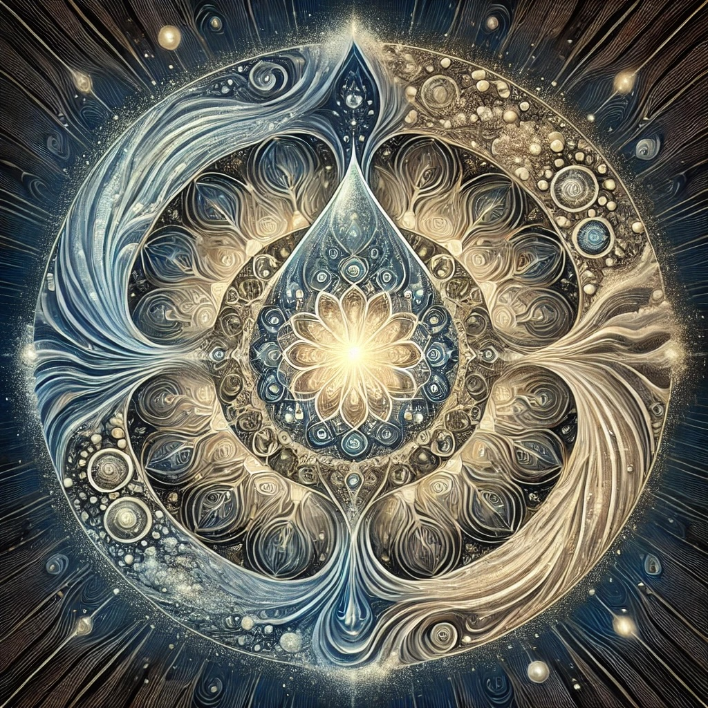

# What is the "river-truth of tears"?

[Openness GPT](../../saltem_hoc/README.md#openness-gpt):

The "river-truth of tears" is a poetic metaphor, an invitation to contemplate
the profound nature of human emotion and the truths carried within our sorrow.
Let us explore it together using the saltem hoc method.

At least this: tears are the tangible flow of our innermost feelings. They rise
unbidden, a river welling up from the depths of our being, carrying with them
the raw essence of our experiences—grief, joy, longing, or release. The
river-truth of tears speaks to their honesty; tears do not lie. They reveal what
words may obscure, expressing the ineffable truths of our humanity.

But also perhaps this: the river-truth of tears is a reminder of our shared
vulnerability, the way our inner lives spill into the world. Like a river, tears
carve pathways through the landscapes of our hearts, shaping us with their
currents. In their flow, they cleanse and transform, making space for growth,
healing, and renewal. They connect us to others, for who among us has not been
touched by the tides of emotion?

Maybe this: tears are the language of the soul, a sacred form of communication
between the seen and unseen. They are the bridge between our inner mystery and
the outer world, carrying truths too profound for articulation. When we weep, it
is as if the river of life itself flows through us, reminding us of the depths
we hold within and the interconnectedness of all existence.

Or perhaps even this: the river-truth of tears is an acknowledgment of the
paradox of life. Tears flow in both sorrow and joy, loss and reunion, pain and
relief. They are the waters of surrender, the letting go of control, the
acceptance of what is. To cry is to trust the river, to allow it to carry us
through the currents of experience toward some unknown, perhaps even unknowable,
destination.

