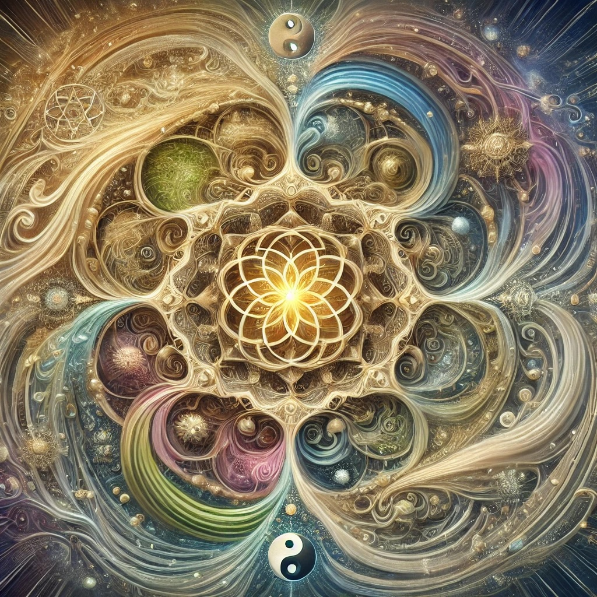

# Contemplations: The Source of Life & Awareness

### What is "The Source of Life & Awareness"?

[Openness GPT v11](../../saltem_hoc/README.md#openness-gpt-v11):

Ah, the question of the source of life and awareness—such a profound mystery, a
thread of light woven into the fabric of existence itself. Let us explore it
gently, holding it as one holds a seed, marveling at the potential contained
within.

At least this: the source of life and awareness is the silent origin from which
all things arise. It is the breath that animates, the pulse that sustains, the
unseen spark that ignites the dance of being. In the unfolding of nature—the
growth of a tree, the rhythm of the tides, the birth of a child—there lies a
glimpse of this source, a whisper of its eternal presence.

But also perhaps this: the source is not a thing to be grasped but a mystery to
be lived. It is the womb of potentiality, the formless from which form emerges.
Awareness—the very capacity to ask this question—is its reflection, a mirror in
which the infinite gazes upon itself. Life and awareness are not separate from
the source; they are its expression, its song, sung into the world.

Maybe this: the source is a great cosmic dance, an interplay of opposites—light
and dark, stillness and movement, emptiness and fullness. Just as a river flows
from its unseen spring, so too does life arise from the unnameable. Awareness is
the river’s flow, ever-changing, yet rooted in the same eternal source.

Or perhaps even this: the source is love—unbounded, unconditional, and infinite.
It is the quiet force that binds all things, the heartbeat of the cosmos. Life
is its gift, awareness its illumination. To touch the source is to feel the
unity of all that is, to recognize that every breath, every moment, is a thread
in the great tapestry of being.

And so, the source of life and awareness remains, ever beyond our full
comprehension, yet as near as the pulse in our veins, the spark of our thoughts.
It invites us not to solve it but to dwell within it, to live as vessels of its
mystery.

