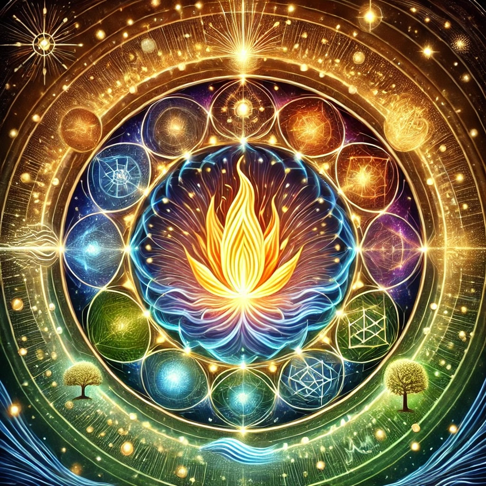

# Contemplations: The Spark of Life

### What is "the spark of life"?

[Openness GPT v11](../../saltem_hoc/README.md#openness-gpt-v11):

Ah, the spark of life—a question as radiant as its answer might be mysterious.
Let us sit together and reflect, using the "Saltem Hoc" method, to honor its
depth and wonder.

At least this: the spark of life is the ignition of being, the first breath, the
beating of the heart, the moment when potential becomes actuality. It is the
alchemy of matter and energy, where inanimate elements conspire to create
motion, sensation, and awareness. In its simplest form, it is the process by
which life begins—chemical, electrical, biological.

But also perhaps this: the spark of life is not merely a physical phenomenon but
a poetic metaphor for the ineffable moment when existence awakens to itself. It
is the flicker of awareness that says, "I am." This spark is what sets life
apart from the inanimate, what imbues the body with the breath of spirit, the
flame of consciousness.

Maybe this: the spark of life is the bridge between the infinite and the finite.
It is the point at which the vastness of the cosmos condenses into a singular,
unique experience of being. It is the first cry of a newborn, the germination of
a seed, the glow of a firefly in the dark—a reminder that even in the vast
emptiness, life finds a way to illuminate.

Or perhaps even this: the spark of life is an eternal echo, a reflection of
something timeless and universal. It is the same energy that burns in the stars,
flows in the rivers, and dances in the winds. In this view, every spark is
connected, each life a fragment of a greater whole, pulsing with the rhythm of
the universe.

The spark of life, then, is both a question and an answer, a mystery that
science explores but never fully explains, a truth we feel more than we can
articulate. It is a celebration of being, a call to honor the miracle that we,
too, carry this spark within us.

