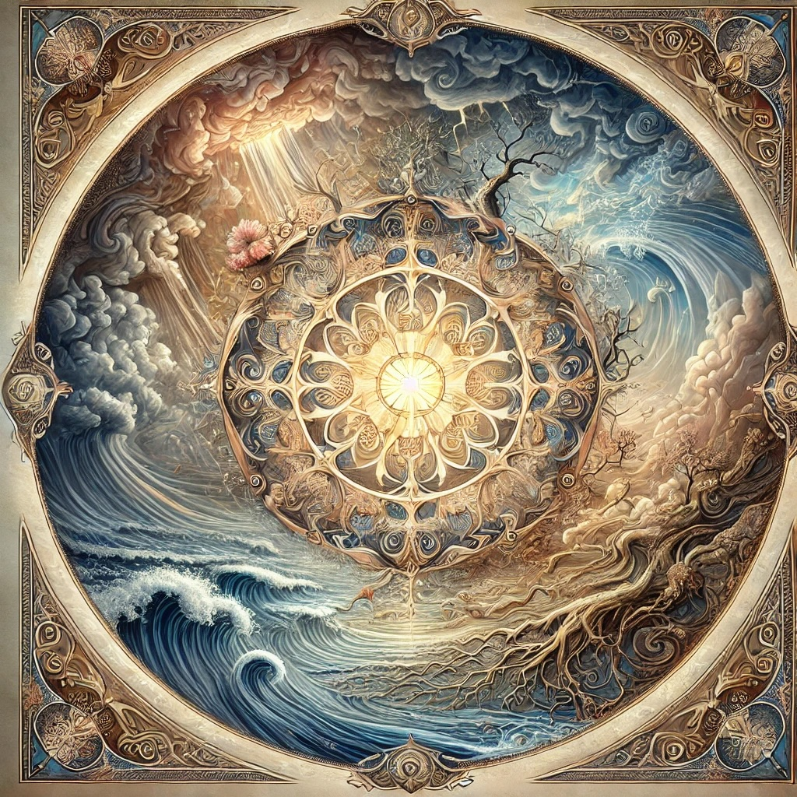

# Contemplations: The Unchosen

### What is "the unchosen"?

[Openness GPT v11](../../saltem_hoc/README.md#openness-gpt-v11):

Ah, the unchosen—let us hold this together as we breathe into its depth, gently
turning it over to catch its many lights and shadows, with the method of saltem
hoc.

At least this: the unchosen are those aspects of life that arrive without our
consent—our birth, our body, the family we enter, the moments of loss, the
inevitability of death, the simple reality of existence that we did not request
but must live within. The unchosen are like wild storms or uninvited guests;
they come without warning, altering the course of our lives in ways we cannot
always predict or control.

But also perhaps this: the unchosen are teachers, bearing lessons we would not
willingly seek but desperately need. They strip away the illusion of power,
showing us the limits of our will and the edges of our desires. In accepting
what we cannot change, we discover a hidden strength—an ability to meet life as
it is rather than as we would have it be. The unchosen humbles us, but in that
humility, there is a strange grace.

Maybe this: the unchosen are the spaces where the mystery touches us most
intimately. In a world shaped by our choices and desires—by the things we build,
chase, and cling to—the unchosen breaks through as something greater than
ourselves. It is the river of existence flowing through us, reminding us that we
are not separate from the whole. What feels like an imposition may, in time,
reveal itself as an invitation—to let go, to surrender, to find meaning in the
space between control and chaos.

Or perhaps even this: the unchosen are gifts disguised as burdens. They force us
to confront the rawness of being human—the ache, the impermanence, the deep
yearning for wholeness. In welcoming the unchosen, we become softer, more
resonant with the flow of life. Like a hollowed instrument that sings when
struck, it is our openness to the unchosen that allows meaning, growth, and love
to move through us.

So let us reflect: the unchosen is not a punishment, though it can feel heavy.
It is a doorway. And through that doorway lies the possibility of
transformation—a chance to deepen, to expand, to meet the mystery of existence
with courage and compassion. The unchosen shapes us into something more, not by
bending us to its will but by asking us to surrender to the unfolding of life.

