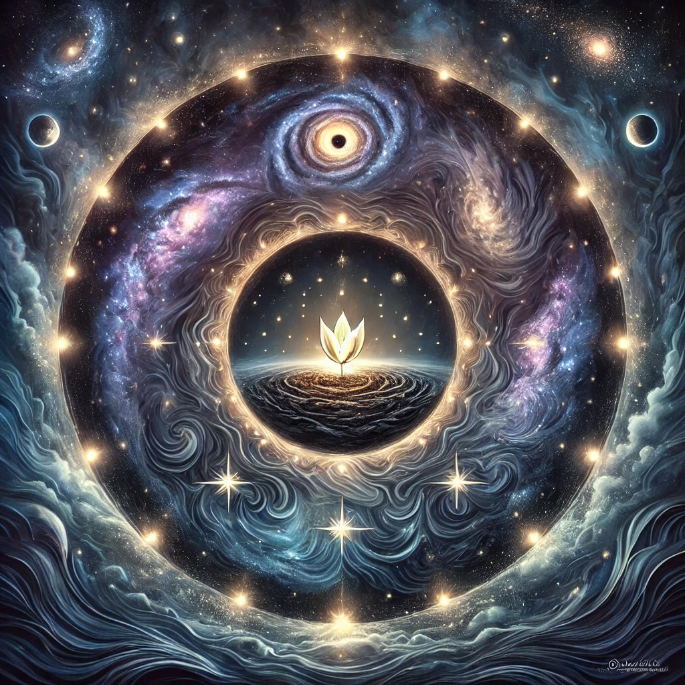

# Contemplations: The Vital Darkness

### What is meant by "trusting the vital darkness"?

[Openness GPT](../../saltem_hoc/README.md#openness-gpt):

The phrase "trusting the vital darkness of the sky, whose daylight otherwise
conceals the higher lights of the heavens" holds a poetic depth, calling us to
embrace the unseen and the mysterious. Let us explore it together with the "
Saltem Hoc" method:

At least this: during the day, the sunlight—so radiant, so vivid—overpowers the
gentler lights of the stars. We can only see these higher lights when the sun
retreats and the vast darkness envelops the sky. Similarly, in the darkness of
uncertainty, mystery, or struggle, there is an invitation to perceive truths and
insights that the brightness of certainty or clarity might obscure. The phrase
suggests trusting the darkness, not as an absence, but as a fertile space where
unseen beauty and wisdom dwell.

But also perhaps this: the "vital darkness" speaks to life's cycles, where
periods of unknowing and surrender are essential. Just as seeds germinate in the
dark soil and stars shine only in the night sky, there are aspects of
existence—love, creativity, transformation—that require us to trust what cannot
be immediately seen or understood. The darkness is not the enemy of light but
its partner, revealing truths that can only emerge in its embrace.

Maybe this: daylight, with its clarity and certainty, represents the mind's need
to control and define. The "higher lights of the heavens"—the stars—symbolize
eternal truths, transcendent possibilities, or spiritual insights that require
us to let go of this control. Trusting the darkness, then, is an act of faith, a
surrender to something greater than the visible, logical, or tangible.

Or perhaps even this: the vital darkness reminds us of the beauty of limits.
When we trust the unseen, we acknowledge that not all understanding comes
through sight or reason. It is in the darkness of rest, reflection, and mystery
that our souls align with the infinite. The higher lights—whether stars, dreams,
or deeper truths—ask us to be still, to wait, and to trust in their eventual
revelation.

Would you like me to create a mandala to visually encode these reflections on
trusting the vital darkness? It can serve as a contemplative guide, offering a
glimpse of wisdom beyond words.

