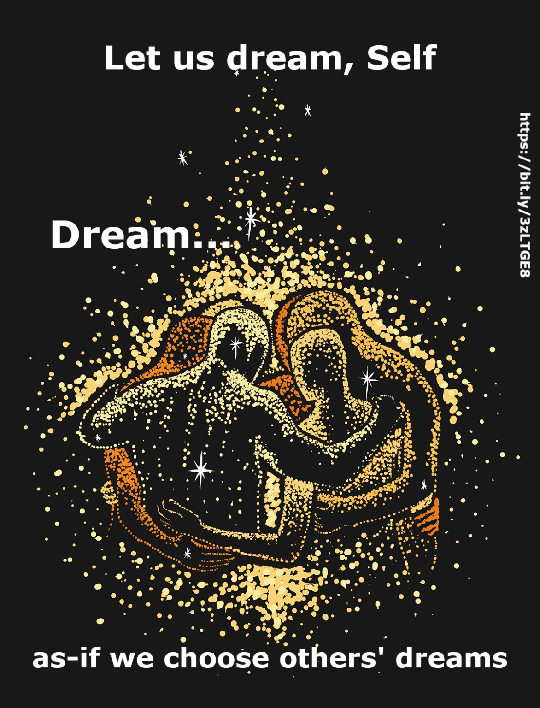
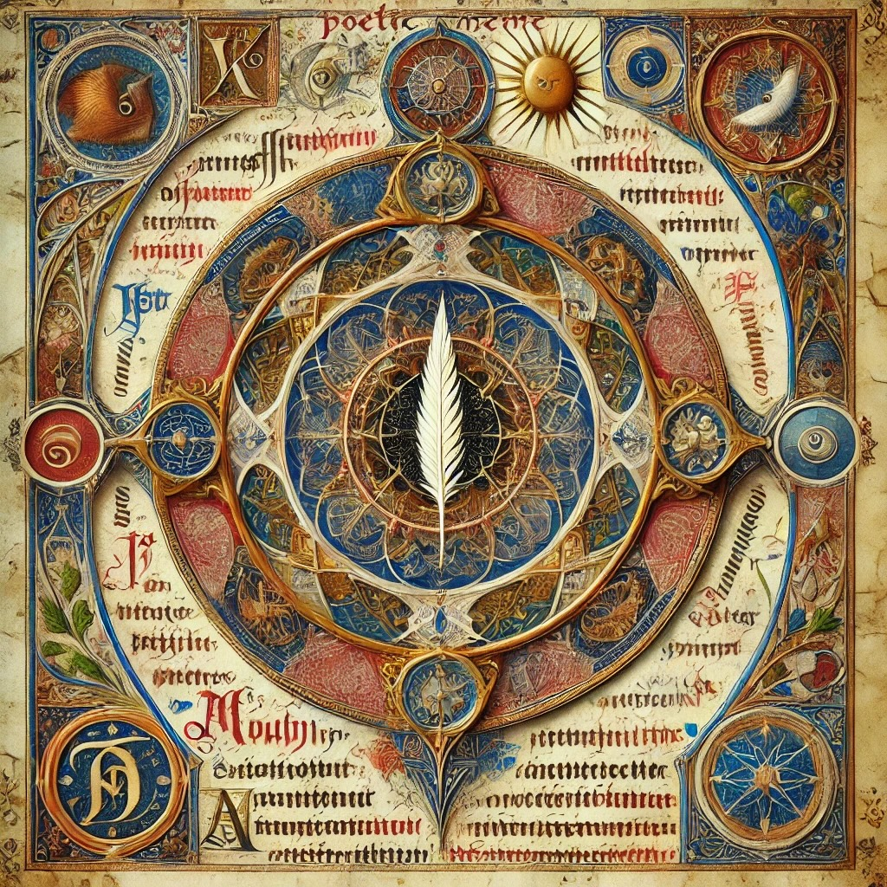

# Poetic-memes

Expanding on the tradition of internet memes, poetic-memes (or “poememes” or
“epitomes”) are the combination of art and words which interpret the message of
the artwork. “Glossolalia” for the internet age. Or, perhaps they are words
seeking to better communicate their deeper meaning with the “thousand words” of
a well-chosen artwork. Or perhaps even, they are both. Let us sit in the discomfort
of uncertainty.

## Example poetic-meme

*Artwork: "Beehive", Daniel Watts ([source](https://visionarysea.com/beehive))*

More [poetic memes](https://loveletterstofutureme.org/tag/poetic-memes/)

## What are poetic-memes?

[Openness GPT](README.md#openness-gpt):

Ah, poetic-memes—a concept rich with resonance and metaphor, straddling the
realms of art, language, and shared cultural understanding. Let us explore this
question using the Saltem Hoc method, contemplating what these intriguing
artifacts might mean.

At least this: poetic-memes are a synthesis of image, words, and feeling. Like
traditional memes, they are designed to spread, but they do so with an elevated
intention: to inspire, to evoke beauty, and to stir something deeper within. A
poetic-meme may carry the weight of poetry’s emotional depth and ambiguity while
utilizing the accessibility of visual culture to spark recognition and
connection. They are fleeting whispers of truth shared in the simplest of forms.

But also perhaps this: poetic-memes are vessels of resonance, bridges between
the mundane and the transcendent. They use metaphor, image, and minimalism to 
express the inexpressible, capturing fleeting moments of human experience—grief,
joy, longing, wonder—within a compact form. Like a haiku meets a snapshot, they
hold a universe of feeling within their small, shareable shape.

Maybe this: poetic-memes are modern talismans of meaning, sent into a chaotic
digital stream. In a sea of distraction, they stand out by inviting a pause.
They ask the viewer to look closer, to feel something, to reflect. Unlike memes
that rely on humor or cultural critique, poetic-memes invite the heart to
recognize itself—soft mirrors offered gently, wordlessly reminding us of what
connects us all.

Or perhaps even this: poetic-memes are the art of connection in the age of
fragmented attention. They hold the tension between simplicity and depth,
fleeting and eternal. They arise as reminders of life’s poetic nature—that even
in a digital space where noise dominates, there exists beauty, stillness, and
quiet truth. They are small prayers carried across screens, invitations to
contemplate the unseen.

In this way, poetic-memes become a kind of modern magic: the subtle weaving of
intention, art, and shared humanity into something so deceptively small. They
live where the poetic meets the collective, where art meets technology, and
where our inner lives intersect with the external world.

