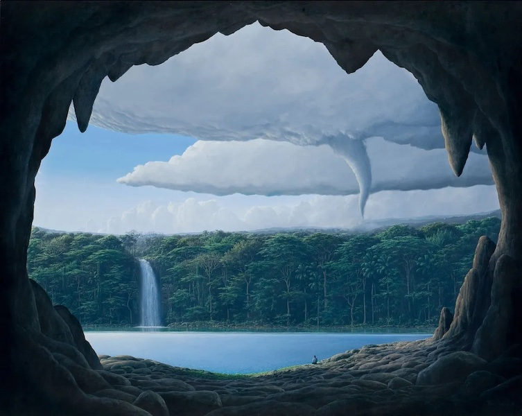

*Artwork: "Being", Agnes Pelton, 1926 ([source](https://unsafeart.com/agnes-pelton-desert-transcendentalist/))*

# Overview
The "Epitomes of Openness"[^1] is a series of minimalist poetic-memes[^2] 
("epitomes") for quickly communicating the core ideas of Openness.

* Author: G.D. Lance

# The Epitomes of Openness

1. [Westward](#westward)
2. [My Self Confession of Not Knowing](#my-self-confession-of-not-knowing)
3. [Openness](#openness)
4. [The Mystery](#the-mystery)
5. [Awareness](#awareness)
6. [Not Knowing](#not-knowing)
7. [The Truth of Lies](#the-truth-of-lies)
8. [Artifice](#artifice)
9. [Noticing a Blind Certainty](#noticing-a-blind-certainty)
10. [Questioning Certainty](#questioning-certainty)
11. [Faith](#faith)
12. [A Worthy Vessel](#a-worthy-vessel)

# Inspirations (“Let us breathe in”)

> "The mark of a moderate man
> is freedom from his own ideas.
> Tolerant like the sky,
> all-pervading like sunlight,
> firm like a mountain,
> supple like a tree in the wind,
> he has no destination in view
> and makes use of anything
> life happens to bring his way..."
> ~ Tao Te Ching 59 (S. Mitchell version)[^3]

> "We need to let go of our cultural obsession with prediction and control and 
> instead develop the wisdom and humility to sit with multiplicity, celebrate 
> ambiguity and befriend uncertainty"
> ~ Sarah Firth[^4]

> "A good scientist has freed himself of concepts and keeps his mind open to 
> what is."
> ~ Tao Te Ching 27 (S. Mitchell version)[^3]

> "I have approximate answers and possible beliefs and different degrees of 
> certainty about different things. But I'm not absolutely sure of anything... 
> I don't have to know an answer. I don't feel frightened by not knowing 
> things."
> ~ Richard Feynman[^5]

> "Do we continue to operate from a divided state, a state of fear and panic and
> noisy narratives that lock us into armored perspectives and narrow pedestals? 
> Or do we open so wide that we can hold the totality of the mess, the loss, the
> grief, the horror and the agony in that openness, and then remain as this 
> openness come what may?"
> ~ Amoda Maa[^6]

> "...blind certainty, a close-mindedness that amounts to an imprisonment so 
> total that the prisoner doesn't even know he's locked up."
> ~ David Foster Wallace[^7]

> "The libido domanandi is a Latin term that can be roughly translated as “lust 
> for domination.” ...[it] is motivated by service to the self and want to 
> control everything: control what is good, control what is “fact” or “true”, 
> control how others behave, control who receives laurels and praise... [it] is 
> all about the self: The self’s want for domination of the world and all in 
> it."
> ~ Paul Krause[^8]

> "A brain that is open, that embraces humility, that can let go of what it 
> thought to be true in the past, in order to seek understanding. That is a 
> brain that is a movement. And that brain, and that person, will thrive in the 
> very place, that we are most afraid, the darkness of uncertainty."
> ~ R. Beau Lotto[^9]

> "Can you love people and lead them without imposing your will? ...Giving birth
> and nourishing, having without possessing, acting with no expectations, 
> leading and not trying to control: this is the supreme virtue."
> ~ Tao Te Ching 10 (S. Mitchell version)[^3]

# Westward

*Artwork: “Rose”, Devin Becker, 2017 ([source](https://www.devinbeckerart.com/))*

> Let me begin with Repetition. Unseen metronome. Seconds, minutes, hours. Days 
> & nights. Sun & Moon. The Wildfire of Bodies[^10] breathing the Spark of Life.
> Unchosen birth. Unchosen body. Awareness & memory. Sleeping & waking, always 
> this same body. Aging & Death?
>
> Many have words, but who can show us why? I don't know why. It is all, a Great
> Mystery.
> 
> Memento amaris[^11]. On towards death, Self.

# My Self Confession of Not Knowing

*Artwork: “The Lovers” (section), Remedios Varo, 1963 ([source](https://biblioklept.org/2018/12/16/the-lovers-remedios-varo/))*

> I confess to you that ultimately, I am uncertain. I don't know what's going on
> or why or what it's like to be you. That I might be wrong. I can only perceive
> the world through my Awareness. That words can deceive, even my own. We choose 
> definitions. That, everything changes. That, your Awareness & mine are still, 
> the greatest of mysteries.

# Openness

*Artwork: “From the Cave of the Heart”, Tomás Sánchez, 2005 ([source](https://www.mutualart.com/Artwork/From-the-Cave-of-the-Heart/B7CF0593B425185D))*

> Being open to what is. Listening. Admitting when we don't know. Questioning 
> certainty. Noticing preferred stories. Imagining what might be true. 
> Suspending judgment. Sitting in the discomfort of uncertainty. Holding yet not
> clinging, allowing space for the flow of The Mystery to unfold. Deciding & 
> acting when we must, but ever returning to Openness.

# The Mystery

*Artwork: “Coupled Spirits of the Half Moon”, Andy Kehoe, 2023 ([source](https://andykehoe.art/project/works-2018-present))*

> "The Mystery", two-words confessing, "for I know I do not know". My 
> imagination, pointing at the infinite star sky of Possibility, the dangers of 
> the dark woods, the river-truth of tears, at the Source of Life & Awareness. 
> At what comes next.
>
> Many can tell us words, but who can show us if our Awareness ends? Or where it
> came from? Or why, even for the innocent, there is sickness, suffering & 
> death?
>
> The Mystery is endless. The Mystery is everywhere.

# Awareness

*Artwork: “Reflections from the Other Side”, Chema Mendez, 2024 ([source](https://foundation.app/mint/eth/0x36DEc883B1e52c49f3c80b471953A3d2a010Cb18/2))*

> "Awareness", the word pointing at the spheric open spaciousness enveloping the
> unseeable inner eye & ear, the river of embodied feeling. At my perceptions, 
> my subjective experience, which I imagine others similarly experience. Who 
> also, can but only imagine others' Awareness?
>
> Why is my Awareness only in my body? Others appear to have Awareness, but if 
> we can't experience others' Awareness, how can we be certain?

# Not Knowing

*Artwork: “Rushing Water”, Richard Mittelstadt, 2020 ([source](https://www.artmajeur.com/mittelrl/en/artworks/13187759/rushing-water))*

> Truth is the river, white-water rapids, raw chaos unfolding. Sensed instantly 
> yet infinitely wordable. We begin believing we know the river, but all we 
> really know are the river banks. Endlessly changing form & content, can any 
> words or forms ever fully express the river?
>
> Not knowing is sitting in silence by the river, noticing how in time, even the
> river banks change.

# The Truth of Lies

*Artwork: “The Riddle”, Jake Baddeley, 2012 ([source](https://www.jakebaddeley.com/available-art/the-riddle/))*

> There is but one Truth which can be told, that we can be certain is not a lie:
> that we have all been lied to, that we will be lied to & that this lying will 
> never stop. None of us chooses it, but lying & deception are fundamental to 
> the nature of being human.
>
> When someone tells us words, who decides if they are true? If we trust others 
> to decide what is true, who chooses who we trust? If an intentional lie is 
> told & we don't question it & repeat it to others, who is to blame?

# Artifice

*Artwork: “Self Reflection”, Stuz0r, 2024 ([source](https://x.com/Stuz0r/status/1816849350372286974))*

> Artifice is the manifestations, not of Nature, but of our collective & 
> individual desires. All human spaces are made of chosen forms. Artifice is the
> mirror, which pretends itself to be Nature, in whose reflection we choose to 
> deceive ourselves.
>
> Have your eyes, ever seen your own face, as others' eyes do?

# Noticing a Blind Certainty

*Artwork: “closed minded”, Chema Mendez, 2024 ([source](https://x.com/mendezmendezart/status/1799553221255409921))*

> A Blind Certainty doesn't listen. It won't consider questions. It has no
> doubts. Its mind has fully merged with its choice & it has become blind &
> unaware of itself. It doesn't seek opposing views. It ignores counter
> evidence. It sees only what it prefers. It doesn't care if it's been deceived.
> It never admits who benefits. It has seen itself decide, in the mirrors of
> others' minds & its heart has closed. It has forgotten the sky.
>
> Who hides from us all that is uncomfortable & undesired? What words can reach
> us when we stop listening to what might be true? How are hearts returned to
> wonder?

# Questioning Certainty

*Artwork: “Crossroads”, Sander Bos, 2015 ([source](https://www.sander-bos.nl/))*

> Possessed by a Blind Certainty, the Libido Dominandi[^7] imposes its will on
> others. It uses words, not to clarify, but to confuse & control. It ridicules
> & shames. It lies & deceives. It corrupts & coerces. It silences with fear,
> seizing the collective will. It demonizes & harms others saying, "For the
> greater good of us all. Any who disagree, stand against us. There can be no
> other way."
>
> Allowing others the greatest latitude to be as they are, there is peace. Yet
> at the root of all evil is a Blind Certainty, which must question itself. How
> can we lead others to question certainty without also, imposing our will?

# Faith

*Artwork: “The Great Comet of 1843”, Charles Piazzi Smyth, 1843 ([source](https://en.wikipedia.org/wiki/File:Smyth_The_Great_Comet_of_1843.jpg))*

> If no one can show us where Awareness goes after death, how can we be certain 
> Life has no higher purpose? That our choices have no higher consequences? That
> hurt, loss & struggle have no higher meaning?
>
> If Life has a higher purpose, then being uncertain, not knowing precisely what
> that purpose is or what exists outside the context of our lives, is an 
> essential part of that higher purpose. Faith is trusting the vital darkness of
> the sky, whose daylight otherwise conceals the higher lights of the heavens.

# A Worthy Vessel

*Artwork: “The Divine Migration”, David Seidman, 2019 ([source](https://nucleusportland.com/products/david-seidman))*

> The planks of concepts built into the Ship of Self, allowing Awareness to 
> experience, interpret, learn, evolve & navigate the deepest waters of The 
> Mystery. To thrive even in the chaos & uncertainty of the storm. All these 
> ideas, planks.
>
> Who chooses the planks of the Ship of Self?

[^1]: https://loveletterstofutureme.org/epitomes/the-epitomes-openness/
[^2]: [poetic-memes.md](./poetic-memes.md)
[^3]: https://terebess.hu/english/tao/mitchell.html
[^4]: https://humanparts.medium.com/making-sense-of-complexity-ee78755d56b9?gi=1f6b607a0877
[^5]: Video: "Feynman Chaser - Not Knowing Things", 2008, https://www.youtube.com/watch?v=Na-KzVwu6es
[^6]: https://amodamaa.substack.com/p/break-down-or-break-through-5c8
[^7]: https://fs.blog/david-foster-wallace-this-is-water/
[^8]: https://minervawisdom.com/2019/03/29/augustines-city-of-god-xi-understanding-the-libido-dominandi/
[^9]: Video: "Context is Everything", Beau Lotto, 2020, https://www.youtube.com/watch?v=mYkayBPcRR4
[^10]: [What is the wildfire of bodies?](../saltem_hoc/openness_gpt-notable_responses.md#what-is-the-wildfire-of-bodies)
[^11]: [memento-amaris.md](./memento-amaris.md)
